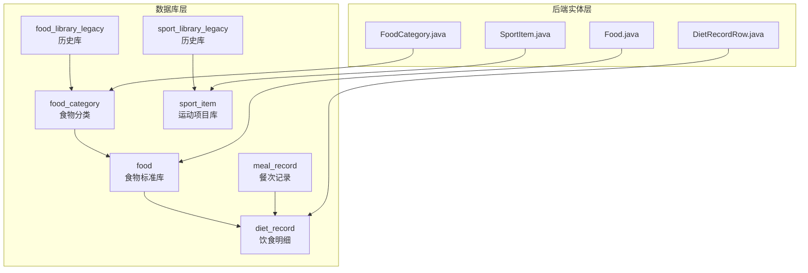
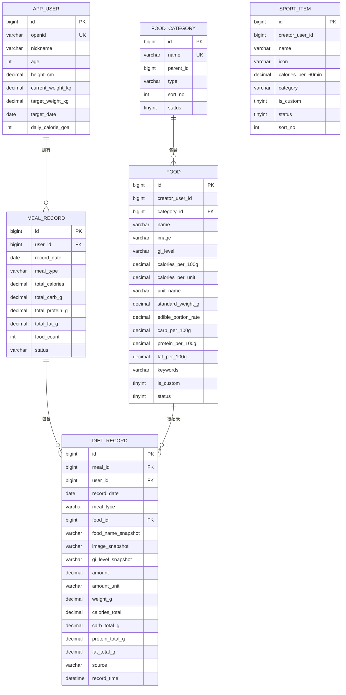
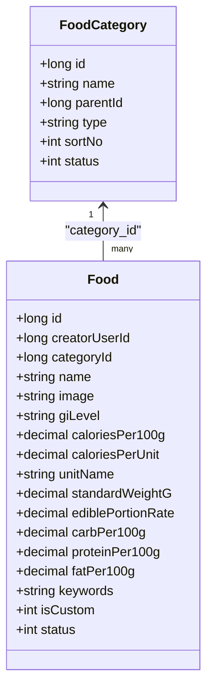
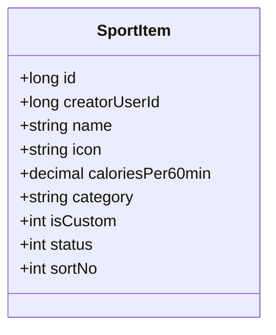
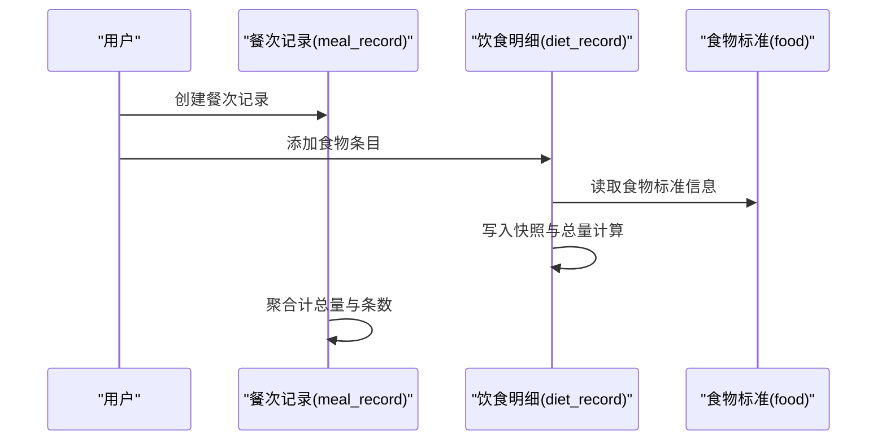
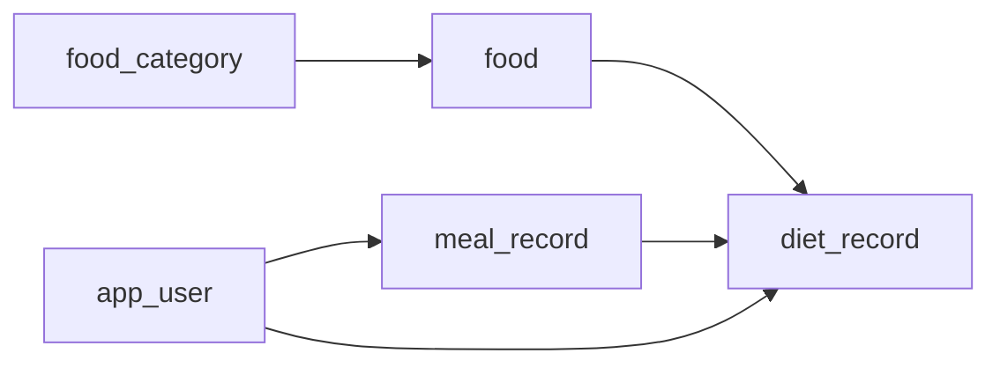

# 支撑表设计

<cite>
**本文引用的文件**
- [01_schema.sql](file://database/01_schema.sql)
- [02_seed.sql](file://database/02_seed.sql)
- [V005__food_category_food_migrate.sql](file://database/migrations/V005__food_category_food_migrate.sql)
- [V006__sport_item_migrate.sql](file://database/migrations/V006__sport_item_migrate.sql)
- [V007__create_meal_record_and_diet_record.sql](file://database/migrations/V007__create_meal_record_and_diet_record.sql)
- [V008__migrate_meal_legacy_to_meal_and_diet.sql](file://database/migrations/V008__migrate_meal_legacy_to_meal_and_diet.sql)
- [Food.java](file://backend/src/main/java/com/ypfr/loseweight/domain/Food.java)
- [FoodCategory.java](file://backend/src/main/java/com/ypfr/loseweight/domain/FoodCategory.java)
- [SportItem.java](file://backend/src/main/java/com/ypfr/loseweight/domain/SportItem.java)
- [DietRecordRow.java](file://backend/src/main/java/com/ypfr/loseweight/domain/DietRecordRow.java)
</cite>

## 目录
1. [简介](#简介)
2. [项目结构](#项目结构)
3. [核心组件](#核心组件)
4. [架构总览](#架构总览)
5. [详细组件分析](#详细组件分析)
6. [依赖分析](#依赖分析)
7. [性能考虑](#性能考虑)
8. [故障排查指南](#故障排查指南)
9. [结论](#结论)
10. [附录](#附录)

## 简介
本文聚焦于“食物库表”“运动库表”及其支撑表的结构设计与实现要点，覆盖以下主题：
- 食物库表的标准化设计思路与营养成分存储策略
- 食物分类字段 category 的设计与管理策略
- 运动项目库表的结构设计与扩展性考虑
- 食物库与饮食记录表的关联关系与数据一致性保障
- 索引设计、查询优化与搜索性能考量
- 种子数据加载策略与数据质量保证机制
- 支撑表结构图与典型数据示例

## 项目结构
本项目采用“数据库脚本 + MyBatis-Plus 实体模型”的分层设计：
- 数据库层：通过迁移脚本与种子脚本构建基础表结构与初始数据
- 后端实体层：通过领域模型映射数据库表，承载业务逻辑与序列化需求

图表来源
- [V005__food_category_food_migrate.sql:11-91](file://database/migrations/V005__food_category_food_migrate.sql#L11-L91)
- [V006__sport_item_migrate.sql:10-48](file://database/migrations/V006__sport_item_migrate.sql#L10-L48)
- [V007__create_meal_record_and_diet_record.sql:10-56](file://database/migrations/V007__create_meal_record_and_diet_record.sql#L10-L56)
- [V008__migrate_meal_legacy_to_meal_and_diet.sql:14-66](file://database/migrations/V008__migrate_meal_legacy_to_meal_and_diet.sql#L14-L66)
- [Food.java:11-213](file://backend/src/main/java/com/ypfr/loseweight/domain/Food.java#L11-L213)
- [FoodCategory.java:8-83](file://backend/src/main/java/com/ypfr/loseweight/domain/FoodCategory.java#L8-L83)
- [SportItem.java:13-131](file://backend/src/main/java/com/ypfr/loseweight/domain/SportItem.java#L13-L131)
- [DietRecordRow.java:10-196](file://backend/src/main/java/com/ypfr/loseweight/domain/DietRecordRow.java#L10-L196)

章节来源
- [01_schema.sql:83-108](file://database/01_schema.sql#L83-L108)
- [V005__food_category_food_migrate.sql:11-91](file://database/migrations/V005__food_category_food_migrate.sql#L11-L91)
- [V006__sport_item_migrate.sql:10-48](file://database/migrations/V006__sport_item_migrate.sql#L10-L48)
- [V007__create_meal_record_and_diet_record.sql:10-56](file://database/migrations/V007__create_meal_record_and_diet_record.sql#L10-L56)
- [V008__migrate_meal_legacy_to_meal_and_diet.sql:14-66](file://database/migrations/V008__migrate_meal_legacy_to_meal_and_diet.sql#L14-L66)

## 核心组件
- 食物库表（food_library_legacy → food）
  - 用于存储标准化食物信息与营养成分，支持按“每100g”单位的宏量营养素与热量
  - 迁移后保留 id 与原库一致，便于 diet_record.food_id 直接映射
- 食物分类表（food_category）
  - 支持分类层级与排序，类型字段区分系统/品牌/通用/自定义
- 食物标准表（food）
  - 新增 creator_user_id、unit_name、standard_weight_g、edible_portion_rate 等字段，增强单位换算与可食部率
- 运动库表（sport_library_legacy → sport_item）
  - 迁移后以“每60分钟消耗”存储，兼容前端每分钟消耗字段
- 饮食记录表（meal_record 与 diet_record）
  - 餐次记录（meal_record）与饮食明细（diet_record）分离，明细表外键关联食物标准库与用户

章节来源
- [V005__food_category_food_migrate.sql:32-91](file://database/migrations/V005__food_category_food_migrate.sql#L32-L91)
- [V006__sport_item_migrate.sql:10-48](file://database/migrations/V006__sport_item_migrate.sql#L10-L48)
- [V007__create_meal_record_and_diet_record.sql:10-56](file://database/migrations/V007__create_meal_record_and_diet_record.sql#L10-L56)
- [V008__migrate_meal_legacy_to_meal_and_diet.sql:14-66](file://database/migrations/V008__migrate_meal_legacy_to_meal_and_diet.sql#L14-L66)

## 架构总览
下图展示食物库、运动库与饮食记录之间的关系，以及与用户表的关联。

图表来源
- [01_schema.sql:11-159](file://database/01_schema.sql#L11-L159)
- [V005__food_category_food_migrate.sql:11-91](file://database/migrations/V005__food_category_food_migrate.sql#L11-L91)
- [V006__sport_item_migrate.sql:10-48](file://database/migrations/V006__sport_item_migrate.sql#L10-L48)
- [V007__create_meal_record_and_diet_record.sql:10-56](file://database/migrations/V007__create_meal_record_and_diet_record.sql#L10-L56)
- [V008__migrate_meal_legacy_to_meal_and_diet.sql:14-66](file://database/migrations/V008__migrate_meal_legacy_to_meal_and_diet.sql#L14-L66)

## 详细组件分析

### 食物库表（food_library_legacy → food）与标准化设计
- 设计思路
  - 以“每100g”为基准单位存储热量与三大营养素，确保跨食物比较的一致性
  - 新增单位换算字段（unit_name、standard_weight_g、edible_portion_rate），支持不同计量方式与可食部率
  - 保留原库 id，便于 diet_record.food_id 直接映射，降低迁移成本
- 字段要点
  - 营养素字段：每100g碳水、蛋白质、脂肪含量
  - 单位与换算：unit_name、standard_weight_g、edible_portion_rate
  - 分类与状态：category（来自原库）、status、is_custom
- 关系与约束
  - 与 food_category 一对多，通过 category_id 关联
  - 与 diet_record 多对一，通过 food_id 关联

图表来源
- [FoodCategory.java:8-83](file://backend/src/main/java/com/ypfr/loseweight/domain/FoodCategory.java#L8-L83)
- [Food.java:11-213](file://backend/src/main/java/com/ypfr/loseweight/domain/Food.java#L11-L213)
- [V005__food_category_food_migrate.sql:32-91](file://database/migrations/V005__food_category_food_migrate.sql#L32-L91)

章节来源
- [V005__food_category_food_migrate.sql:32-91](file://database/migrations/V005__food_category_food_migrate.sql#L32-L91)
- [Food.java:11-213](file://backend/src/main/java/com/ypfr/loseweight/domain/Food.java#L11-L213)
- [FoodCategory.java:8-83](file://backend/src/main/java/com/ypfr/loseweight/domain/FoodCategory.java#L8-L83)

### 食物分类字段 category 的设计与管理策略
- 设计要点
  - category 字段来源于原食物库，迁移时统一清洗并映射到 food_category.name
  - 支持“未分类”兜底，避免空值影响查询与统计
- 管理策略
  - 类型字段 type 区分系统/品牌/通用/自定义，便于权限与可见性控制
  - 排序字段 sort_no 支持前端侧边栏与分类列表的稳定排序
  - 状态字段 status 控制分类启用/禁用，便于灰度与治理

章节来源
- [V005__food_category_food_migrate.sql:23-30](file://database/migrations/V005__food_category_food_migrate.sql#L23-L30)
- [FoodCategory.java:8-83](file://backend/src/main/java/com/ypfr/loseweight/domain/FoodCategory.java#L8-L83)

### 运动项目库表（sport_library_legacy → sport_item）结构与扩展性
- 结构设计
  - 以“每60分钟消耗”存储热量，兼容前端每分钟消耗字段（运行时换算）
  - 新增 creator_user_id、icon、category、sort_no、status 等字段，支持扩展与个性化
- 扩展性考虑
  - 支持自定义运动项（is_custom），便于用户或管理员新增
  - 分类字段 category 支持按类型（如“有氧/力量/拉伸”）进行筛选与推荐
  - icon 字段便于前端展示与交互

图表来源
- [SportItem.java:13-131](file://backend/src/main/java/com/ypfr/loseweight/domain/SportItem.java#L13-L131)
- [V006__sport_item_migrate.sql:10-48](file://database/migrations/V006__sport_item_migrate.sql#L10-L48)

章节来源
- [V006__sport_item_migrate.sql:10-48](file://database/migrations/V006__sport_item_migrate.sql#L10-L48)
- [SportItem.java:13-131](file://backend/src/main/java/com/ypfr/loseweight/domain/SportItem.java#L13-L131)

### 饮食记录表与食物库的关联关系与一致性
- 表结构关系
  - meal_record：按用户、日期、餐次聚合的餐次记录
  - diet_record：具体食物条目明细，外键关联 meal_record、food、app_user
- 关联与一致性
  - diet_record.food_id 直接指向 food.id，确保食物信息与营养素一致性
  - 记录快照字段（food_name_snapshot、image_snapshot、gi_level_snapshot）保障历史可追溯
  - 通过 source 字段标识来源（搜索/自定义/拍照/手动），便于审计与统计

图表来源
- [V007__create_meal_record_and_diet_record.sql:10-56](file://database/migrations/V007__create_meal_record_and_diet_record.sql#L10-L56)
- [V008__migrate_meal_legacy_to_meal_and_diet.sql:14-66](file://database/migrations/V008__migrate_meal_legacy_to_meal_and_diet.sql#L14-L66)
- [DietRecordRow.java:10-196](file://backend/src/main/java/com/ypfr/loseweight/domain/DietRecordRow.java#L10-L196)

章节来源
- [V007__create_meal_record_and_diet_record.sql:10-56](file://database/migrations/V007__create_meal_record_and_diet_record.sql#L10-L56)
- [V008__migrate_meal_legacy_to_meal_and_diet.sql:14-66](file://database/migrations/V008__migrate_meal_legacy_to_meal_and_diet.sql#L14-L66)
- [DietRecordRow.java:10-196](file://backend/src/main/java/com/ypfr/loseweight/domain/DietRecordRow.java#L10-L196)

### 索引设计、查询优化与搜索性能
- 食物库与分类
  - food.name、food_category.name 建有索引，支持快速检索与去重
  - food_category.parent_id 建有索引，支持层级查询
- 饮食记录
  - meal_record：user_id + record_date + meal_type 组合索引，支持按用户/日期/餐次高效查询
  - diet_record：meal_id、user_id + record_date、food_id 建有索引，支持明细查询与聚合
- 运动库
  - sport_item.name 建有索引，支持快速搜索
- 性能建议
  - 查询时尽量使用组合索引前缀，避免全表扫描
  - 对高频过滤条件（如用户、日期、餐次类型）保持在 WHERE 子句中
  - 使用快照字段减少关联查询，提升报表与统计性能

章节来源
- [01_schema.sql:52-54](file://database/01_schema.sql#L52-L54)
- [01_schema.sql:95-96](file://database/01_schema.sql#L95-L96)
- [01_schema.sql:107-108](file://database/01_schema.sql#L107-L108)
- [V007__create_meal_record_and_diet_record.sql:24-26](file://database/migrations/V007__create_meal_record_and_diet_record.sql#L24-L26)
- [V007__create_meal_record_and_diet_record.sql:50-52](file://database/migrations/V007__create_meal_record_and_diet_record.sql#L50-L52)

### 种子数据加载策略与数据质量保证
- 加载策略
  - 通过种子脚本批量插入食物库数据，覆盖31个分类、每类≥30条，总计约992条
  - 清理用户1的示例数据后，按需插入测试用户与示例记录
- 数据质量保证
  - 迁移脚本将 category 统一清洗为空值或空白的情况为“未分类”
  - 保留原 food_library.id 到 food.id 的映射，确保 diet_record.food_id 无需二次转换
  - 通过 status 字段控制默认启用状态，便于后续治理

章节来源
- [02_seed.sql:31-29](file://database/02_seed.sql#L31-L29)
- [V005__food_category_food_migrate.sql:23-30](file://database/migrations/V005__food_category_food_migrate.sql#L23-L30)
- [V005__food_category_food_migrate.sql:64-88](file://database/migrations/V005__food_category_food_migrate.sql#L64-L88)

### 典型数据示例
- 食物库（food）示例字段
  - 名称、分类、单位名称、每100g热量、碳水/蛋白质/脂肪、可食部率、是否自定义、状态
- 饮食明细（diet_record）示例字段
  - 餐次ID、用户ID、记录日期、餐次类型、食物ID、食物快照、数量与单位、重量克、总热量与宏量、来源、记录时间

章节来源
- [02_seed.sql:33-98](file://database/02_seed.sql#L33-L98)
- [V007__create_meal_record_and_diet_record.sql:28-55](file://database/migrations/V007__create_meal_record_and_diet_record.sql#L28-L55)
- [DietRecordRow.java:10-196](file://backend/src/main/java/com/ypfr/loseweight/domain/DietRecordRow.java#L10-L196)

## 依赖分析
- 组件耦合
  - food_category 与 food：一对多，通过 category_id 强约束
  - food 与 diet_record：一对多，通过 food_id 强约束
  - meal_record 与 diet_record：一对多，通过 meal_id 强约束
  - diet_record 与 app_user：通过 user_id 强约束
- 外部依赖
  - 前端通过 API 读取 food 与 sport_item，后端提供兼容字段（如每分钟消耗）

图表来源
- [V005__food_category_food_migrate.sql:52-56](file://database/migrations/V005__food_category_food_migrate.sql#L52-L56)
- [V007__create_meal_record_and_diet_record.sql:50-55](file://database/migrations/V007__create_meal_record_and_diet_record.sql#L50-L55)

章节来源
- [V005__food_category_food_migrate.sql:52-56](file://database/migrations/V005__food_category_food_migrate.sql#L52-L56)
- [V007__create_meal_record_and_diet_record.sql:50-55](file://database/migrations/V007__create_meal_record_and_diet_record.sql#L50-L55)

## 性能考虑
- 索引命中
  - 使用组合索引前缀过滤，避免回表与全表扫描
- 查询路径
  - 饮食统计优先基于 diet_record 聚合，减少跨表连接
- 缓存与快照
  - 利用 diet_record 快照字段减少实时关联查询，提高报表与趋势图渲染速度

## 故障排查指南
- 常见问题
  - 饮食记录缺失食物信息：检查 diet_record.food_id 是否存在且状态正常
  - 餐次统计异常：核对 meal_record 聚合逻辑与 diet_record 数量一致性
  - 运动消耗显示异常：确认 calories_per_60min 与前端换算逻辑一致
- 定位手段
  - 查看迁移脚本执行结果与约束是否存在
  - 核对索引是否生效，必要时重建索引
  - 检查 seed 数据是否正确加载

章节来源
- [V008__migrate_meal_legacy_to_meal_and_diet.sql:14-66](file://database/migrations/V008__migrate_meal_legacy_to_meal_and_diet.sql#L14-L66)
- [V006__sport_item_migrate.sql:35-38](file://database/migrations/V006__sport_item_migrate.sql#L35-L38)

## 结论
本设计通过“食物标准库 + 分类 + 饮食明细 + 餐次聚合”的结构，实现了：
- 食物信息与营养素的标准化存储与单位换算
- 食物分类的层级化与可治理性
- 饮食记录的可追溯与高性能统计
- 运动项目的扩展性与兼容性
配合完善的索引与种子数据策略，满足日常运营与扩展需求。

## 附录
- 迁移与建表脚本参考
  - [V005 食物库迁移:1-91](file://database/migrations/V005__food_category_food_migrate.sql#L1-L91)
  - [V006 运动库迁移:1-48](file://database/migrations/V006__sport_item_migrate.sql#L1-L48)
  - [V007 餐次与明细建表:1-56](file://database/migrations/V007__create_meal_record_and_diet_record.sql#L1-L56)
  - [V008 历史数据迁移:1-66](file://database/migrations/V008__migrate_meal_legacy_to_meal_and_diet.sql#L1-L66)
- 实体模型参考
  - [Food.java:11-213](file://backend/src/main/java/com/ypfr/loseweight/domain/Food.java#L11-L213)
  - [FoodCategory.java:8-83](file://backend/src/main/java/com/ypfr/loseweight/domain/FoodCategory.java#L8-L83)
  - [SportItem.java:13-131](file://backend/src/main/java/com/ypfr/loseweight/domain/SportItem.java#L13-L131)
  - [DietRecordRow.java:10-196](file://backend/src/main/java/com/ypfr/loseweight/domain/DietRecordRow.java#L10-L196)