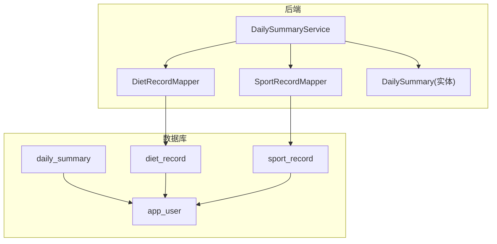
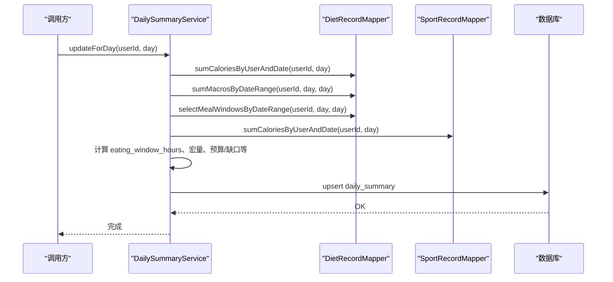
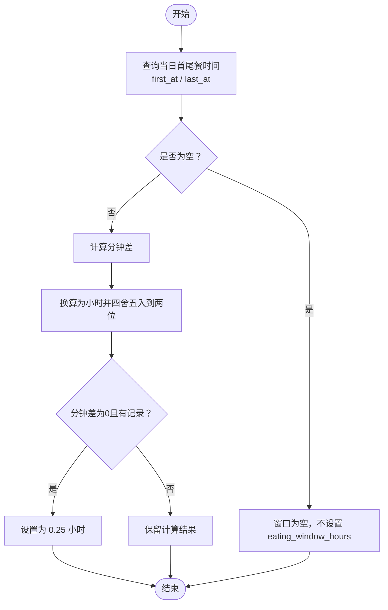
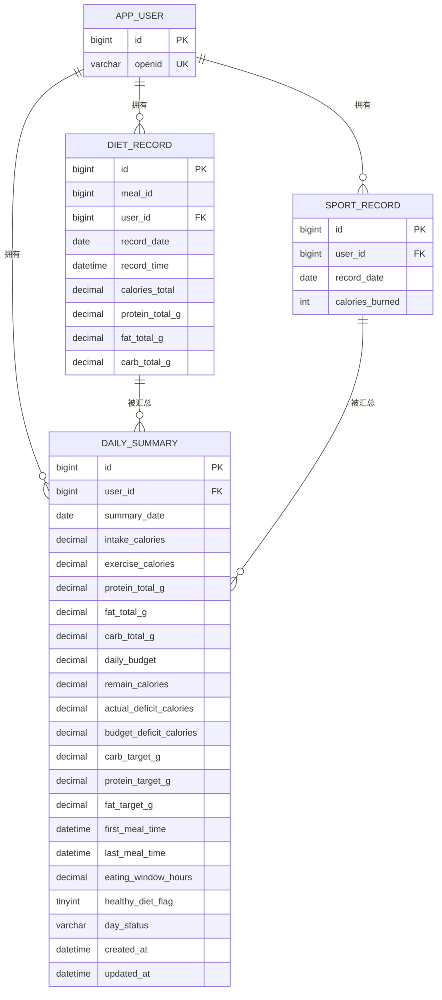
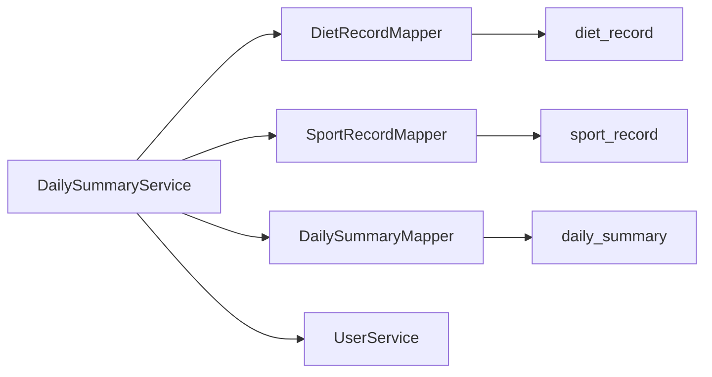

# 日汇总表设计

<cite>
**本文引用的文件**
- [DailySummary.java](file://backend/src/main/java/com/ypfr/loseweight/domain/DailySummary.java)
- [DailySummaryMapper.java](file://backend/src/main/java/com/ypfr/loseweight/mapper/DailySummaryMapper.java)
- [DailySummaryService.java](file://backend/src/main/java/com/ypfr/loseweight/service/DailySummaryService.java)
- [DietRecordMapper.java](file://backend/src/main/java/com/ypfr/loseweight/mapper/DietRecordMapper.java)
- [SportRecordMapper.java](file://backend/src/main/java/com/ypfr/loseweight/mapper/SportRecordMapper.java)
- [StatDateMacros.java](file://backend/src/main/java/com/ypfr/loseweight/mapper/row/StatDateMacros.java)
- [StatDateMealWindow.java](file://backend/src/main/java/com/ypfr/loseweight/mapper/row/StatDateMealWindow.java)
- [01_schema.sql](file://database/01_schema.sql)
- [V011__daily_summary_prd_columns.sql](file://database/migrations/V011__daily_summary_prd_columns.sql)
- [V007__create_meal_record_and_diet_record.sql](file://database/migrations/V007__create_meal_record_and_diet_record.sql)
- [DailyRecordService.java](file://backend/src/main/java/com/ypfr/loseweight/service/DailyRecordService.java)
</cite>

## 目录
1. [简介](#简介)
2. [项目结构](#项目结构)
3. [核心组件](#核心组件)
4. [架构概览](#架构概览)
5. [详细组件分析](#详细组件分析)
6. [依赖分析](#依赖分析)
7. [性能考量](#性能考量)
8. [故障排查指南](#故障排查指南)
9. [结论](#结论)
10. [附录](#附录)

## 简介
本文件围绕 daily_summary 日汇总表的表结构、聚合设计理念与更新机制展开，重点说明以下内容：
- 如何从明细记录（饮食明细与运动明细）中计算汇总数据
- total_intake_calories 与 total_sport_calories 的计算逻辑与数据来源
- 宏量营养素字段 protein_g、fat_g、carbs_g 的聚合算法与精度处理
- eating_window_hours 的窗口期计算逻辑与业务含义
- updated_at 字段的自动更新机制与并发控制考虑
- 唯一约束 uk_daily_summary_user_date 的设计目的与数据一致性保证
- 汇总计算的性能优化策略与批量更新机制
- 提供日汇总表结构图与典型汇总计算示例

## 项目结构
日汇总表涉及的核心代码与数据库对象如下：
- 表结构与索引：daily_summary（含唯一键 uk_daily_summary_user_date）
- 映射模型：DailySummary（实体类）
- 访问层：DailySummaryMapper、DietRecordMapper、SportRecordMapper
- 服务层：DailySummaryService（负责按日汇总并写入）
- 明细表：diet_record（含宏量营养素与热量字段）、sport_record（含热量字段）

图表来源
- [01_schema.sql:126-141](file://database/01_schema.sql#L126-L141)
- [DailySummary.java:10-41](file://backend/src/main/java/com/ypfr/loseweight/domain/DailySummary.java#L10-L41)
- [DailySummaryService.java:41-154](file://backend/src/main/java/com/ypfr/loseweight/service/DailySummaryService.java#L41-L154)
- [DietRecordMapper.java:18-53](file://backend/src/main/java/com/ypfr/loseweight/mapper/DietRecordMapper.java#L18-L53)
- [SportRecordMapper.java:16-29](file://backend/src/main/java/com/ypfr/loseweight/mapper/SportRecordMapper.java#L16-L29)

章节来源
- [01_schema.sql:126-141](file://database/01_schema.sql#L126-L141)
- [DailySummary.java:10-41](file://backend/src/main/java/com/ypfr/loseweight/domain/DailySummary.java#L10-L41)
- [DailySummaryService.java:41-154](file://backend/src/main/java/com/ypfr/loseweight/service/DailySummaryService.java#L41-L154)
- [DietRecordMapper.java:18-53](file://backend/src/main/java/com/ypfr/loseweight/mapper/DietRecordMapper.java#L18-L53)
- [SportRecordMapper.java:16-29](file://backend/src/main/java/com/ypfr/loseweight/mapper/SportRecordMapper.java#L16-L29)

## 核心组件
- 实体类 DailySummary：承载日汇总表的所有字段，包括热量、宏量营养素、窗口期、预算与状态等。
- Mapper 接口：
  - DailySummaryMapper：继承 MyBatis-Plus 基础能力，用于读写 daily_summary
  - DietRecordMapper：提供按日期范围聚合的 SQL 查询（热量、宏量、餐窗）
  - SportRecordMapper：提供按日期聚合的运动热量查询
- 服务类 DailySummaryService：核心汇总逻辑，负责读取明细、计算指标、插入或更新 daily_summary

章节来源
- [DailySummary.java:10-218](file://backend/src/main/java/com/ypfr/loseweight/domain/DailySummary.java#L10-L218)
- [DailySummaryMapper.java:7-8](file://backend/src/main/java/com/ypfr/loseweight/mapper/DailySummaryMapper.java#L7-L8)
- [DietRecordMapper.java:18-53](file://backend/src/main/java/com/ypfr/loseweight/mapper/DietRecordMapper.java#L18-L53)
- [SportRecordMapper.java:16-29](file://backend/src/main/java/com/ypfr/loseweight/mapper/SportRecordMapper.java#L16-L29)
- [DailySummaryService.java:25-34](file://backend/src/main/java/com/ypfr/loseweight/service/DailySummaryService.java#L25-L34)

## 架构概览
日汇总的更新流程从服务层开始，通过 Mapper 读取明细表数据，计算后写入 daily_summary。整体流程如下：

图表来源
- [DailySummaryService.java:41-154](file://backend/src/main/java/com/ypfr/loseweight/service/DailySummaryService.java#L41-L154)
- [DietRecordMapper.java:18-53](file://backend/src/main/java/com/ypfr/loseweight/mapper/DietRecordMapper.java#L18-L53)
- [SportRecordMapper.java:16-29](file://backend/src/main/java/com/ypfr/loseweight/mapper/SportRecordMapper.java#L16-L29)

## 详细组件分析

### 表结构与字段说明
- 表名：daily_summary
- 关键字段（与 PRD 对齐后的列名）：
  - intake_calories：当日摄入总热量（原 total_intake_calories）
  - exercise_calories：当日运动消耗总热量（原 total_sport_calories）
  - protein_total_g、fat_total_g、carb_total_g：当日蛋白质、脂肪、碳水化合物总量
  - daily_budget：日预算（来自用户预算配置）
  - remain_calories：剩余热量（预算-摄入+运动）
  - actual_deficit_calories：实际热量缺口（TDEE-摄入+运动）
  - budget_deficit_calories：预算缺口（与 remain_calories 同义）
  - carb_target_g、protein_target_g、fat_target_g：宏量目标
  - first_meal_time、last_meal_time：首餐与末餐时间
  - eating_window_hours：进食窗口（小时）
  - healthy_diet_flag：健康饮食标记
  - day_status：日状态（normal/overeat/invalid）
  - created_at、updated_at：创建与更新时间戳
- 约束与索引：
  - 主键：id
  - 唯一键：uk_daily_summary_user_date（user_id, summary_date）
  - 外键：user_id 引用 app_user(id)

章节来源
- [01_schema.sql:126-141](file://database/01_schema.sql#L126-L141)
- [V011__daily_summary_prd_columns.sql:11-29](file://database/migrations/V011__daily_summary_prd_columns.sql#L11-L29)

### 聚合设计理念与更新机制
- 更新入口：DailySummaryService.updateForDay(userId, day)
- 数据来源：
  - intake_calories 来自 diet_record 的 calories_total 按用户与日期求和
  - exercise_calories 来自 sport_record 的 calories_burned 按用户与日期求和
  - protein_total_g、fat_total_g、carb_total_g 来自 diet_record 的宏量字段按日期聚合
  - eating_window_hours 来自 diet_record 的 record_time 最小值与最大值的时间差
- 写入策略：
  - 若某日没有任何有效数据，则删除该日的汇总记录（保持表整洁）
  - 若记录不存在则插入，存在则更新
  - updated_at 由数据库触发器自动更新（ON UPDATE CURRENT_TIMESTAMP）

章节来源
- [DailySummaryService.java:41-154](file://backend/src/main/java/com/ypfr/loseweight/service/DailySummaryService.java#L41-L154)
- [DietRecordMapper.java:18-53](file://backend/src/main/java/com/ypfr/loseweight/mapper/DietRecordMapper.java#L18-L53)
- [SportRecordMapper.java:16-29](file://backend/src/main/java/com/ypfr/loseweight/mapper/SportRecordMapper.java#L16-L29)
- [01_schema.sql:137](file://database/01_schema.sql#L137)

### 字段计算逻辑与精度处理

#### total_intake_calories 与 total_sport_calories
- 来源与计算：
  - intake_calories：按用户与日期对 diet_record.calories_total 求和
  - exercise_calories：按用户与日期对 sport_record.calories_burned 求和
- 精度与空值：
  - 使用 COALESCE 将空值转为 0，避免空值参与计算
  - 服务层统一以 BigDecimal 处理，确保跨模块一致性

章节来源
- [DietRecordMapper.java:18-21](file://backend/src/main/java/com/ypfr/loseweight/mapper/DietRecordMapper.java#L18-L21)
- [SportRecordMapper.java:16-19](file://backend/src/main/java/com/ypfr/loseweight/mapper/SportRecordMapper.java#L16-L19)
- [DailySummaryService.java:44-45](file://backend/src/main/java/com/ypfr/loseweight/service/DailySummaryService.java#L44-L45)

#### 宏量营养素：protein_total_g、fat_total_g、carb_total_g
- 来源与计算：
  - 按日期对 diet_record 的 protein_total_g、fat_total_g、carb_total_g 分别求和
- 精度处理：
  - 采用 BigDecimal 保留高精度
  - 服务层在写入前统一四舍五入至合适精度（见下节 round2）

章节来源
- [DietRecordMapper.java:43-53](file://backend/src/main/java/com/ypfr/loseweight/mapper/DietRecordMapper.java#L43-L53)
- [StatDateMacros.java:8-43](file://backend/src/main/java/com/ypfr/loseweight/mapper/row/StatDateMacros.java#L8-L43)
- [DailySummaryService.java:66-68](file://backend/src/main/java/com/ypfr/loseweight/service/DailySummaryService.java#L66-L68)

#### eating_window_hours（进食窗口）
- 计算逻辑：
  - 取 diet_record 在当日的最小 record_time（first_at）与最大 record_time（last_at）
  - 计算分钟差，换算为小时，保留两位小数
  - 特殊处理：若仅有一条记录且分钟差为 0，返回 0.25 小时作为“非零视觉合理值”
- 业务含义：
  - 表征用户当日的连续进食时间段长度，用于评估间歇性禁食等行为模式

图表来源
- [DailySummaryService.java:54-64](file://backend/src/main/java/com/ypfr/loseweight/service/DailySummaryService.java#L54-L64)
- [DietRecordMapper.java:33-41](file://backend/src/main/java/com/ypfr/loseweight/mapper/DietRecordMapper.java#L33-L41)

章节来源
- [DailySummaryService.java:54-64](file://backend/src/main/java/com/ypfr/loseweight/service/DailySummaryService.java#L54-L64)
- [DietRecordMapper.java:33-41](file://backend/src/main/java/com/ypfr/loseweight/mapper/DietRecordMapper.java#L33-L41)

#### updated_at 自动更新机制与并发控制
- 数据库层面：
  - daily_summary.updated_at 设置为 ON UPDATE CURRENT_TIMESTAMP，每次更新行时自动刷新
- 并发控制：
  - 由于 updated_at 是数据库自动维护，天然具备原子性
  - 若需更强的一致性，可在应用层使用乐观锁（如版本号字段），但当前表未包含版本字段

章节来源
- [01_schema.sql:137](file://database/01_schema.sql#L137)
- [DailySummaryService.java:153](file://backend/src/main/java/com/ypfr/loseweight/service/DailySummaryService.java#L153)

#### 唯一约束 uk_daily_summary_user_date 的设计目的与一致性
- 设计目的：
  - 确保每个用户在同一天仅有一条日汇总记录，避免重复与覆盖问题
- 数据一致性：
  - 插入前先查重，若无有效数据则删除旧记录，再插入新记录
  - 更新时直接按主键更新，updated_at 自动刷新

章节来源
- [01_schema.sql:139](file://database/01_schema.sql#L139)
- [DailySummaryService.java:96-107](file://backend/src/main/java/com/ypfr/loseweight/service/DailySummaryService.java#L96-L107)

### 数据模型与关系图

图表来源
- [01_schema.sql:11-141](file://database/01_schema.sql#L11-L141)
- [V007__create_meal_record_and_diet_record.sql:10-55](file://database/migrations/V007__create_meal_record_and_diet_record.sql#L10-L55)

## 依赖分析
- 组件耦合：
  - DailySummaryService 依赖 DietRecordMapper、SportRecordMapper、DailySummaryMapper、UserService
  - Mapper 层通过 MyBatis 注解编写 SQL，职责清晰
- 外部依赖：
  - 数据库：MySQL 8.0+，使用 InnoDB 引擎
  - 应用：Spring Boot + MyBatis-Plus

图表来源
- [DailySummaryService.java:25-34](file://backend/src/main/java/com/ypfr/loseweight/service/DailySummaryService.java#L25-L34)
- [DietRecordMapper.java:18-53](file://backend/src/main/java/com/ypfr/loseweight/mapper/DietRecordMapper.java#L18-L53)
- [SportRecordMapper.java:16-29](file://backend/src/main/java/com/ypfr/loseweight/mapper/SportRecordMapper.java#L16-L29)
- [DailySummaryMapper.java:7-8](file://backend/src/main/java/com/ypfr/loseweight/mapper/DailySummaryMapper.java#L7-L8)

章节来源
- [DailySummaryService.java:25-34](file://backend/src/main/java/com/ypfr/loseweight/service/DailySummaryService.java#L25-L34)
- [DietRecordMapper.java:18-53](file://backend/src/main/java/com/ypfr/loseweight/mapper/DietRecordMapper.java#L18-L53)
- [SportRecordMapper.java:16-29](file://backend/src/main/java/com/ypfr/loseweight/mapper/SportRecordMapper.java#L16-L29)
- [DailySummaryMapper.java:7-8](file://backend/src/main/java/com/ypfr/loseweight/mapper/DailySummaryMapper.java#L7-L8)

## 性能考量
- 查询优化：
  - diet_record 与 sport_record 均按 user_id 与 record_date 建有索引，适合按日聚合
  - 使用 COALESCE 与 SUM 聚合，避免 NULL 影响
- 写入优化：
  - 采用 upsert 策略：无有效数据则删除，减少脏数据
  - updated_at 自动更新，避免额外写操作
- 批量更新建议：
  - 当前按日更新，若需批量回填历史数据，可在服务层循环调用 updateForDay 或新增批量任务
  - 注意幂等性与事务边界，避免重复计算与并发冲突

[本节为通用性能建议，不直接分析具体文件]

## 故障排查指南
- 常见问题与定位：
  - 汇总结果为 0：检查 diet_record/sport_record 是否存在对应日期的数据
  - eating_window_hours 为 0.25：确认是否存在仅一条记录的情况
  - 缺少宏量数据：确认 diet_record 是否正确写入 protein_total_g/fat_total_g/carb_total_g
  - 唯一键冲突：确认是否重复调用导致重复插入
- 排查步骤：
  - 核对用户 ID 与日期参数
  - 检查 Mapper 返回的聚合结果列表是否为空
  - 查看 updated_at 是否正常更新
  - 必要时开启慢查询日志定位热点 SQL

章节来源
- [DailySummaryService.java:96-107](file://backend/src/main/java/com/ypfr/loseweight/service/DailySummaryService.java#L96-L107)
- [DietRecordMapper.java:18-53](file://backend/src/main/java/com/ypfr/loseweight/mapper/DietRecordMapper.java#L18-L53)
- [SportRecordMapper.java:16-29](file://backend/src/main/java/com/ypfr/loseweight/mapper/SportRecordMapper.java#L16-L29)

## 结论
daily_summary 日汇总表通过明确的聚合逻辑与严格的唯一约束，实现了以日为粒度的热量与宏量数据汇总。服务层在计算上兼顾了精度与可读性，并通过数据库自动更新机制简化了并发控制。配合现有索引与查询方式，系统在多数场景下具备良好的性能表现。

## 附录

### 字段精度与舍入策略
- 宏量与热量：统一使用 BigDecimal，服务层在写入前进行舍入（例如 round2 保留两位小数）
- 日常展示：在明细查询服务中对宏量采用更高精度（例如 round1 保留一位小数），以满足界面显示需求

章节来源
- [DailySummaryService.java:160-162](file://backend/src/main/java/com/ypfr/loseweight/service/DailySummaryService.java#L160-L162)
- [DailyRecordService.java:153-155](file://backend/src/main/java/com/ypfr/loseweight/service/DailyRecordService.java#L153-L155)

### 典型汇总计算示例（路径指引）
- 计算当日摄入总热量：参考 diet_record 的 calories_total 求和查询
  - [DietRecordMapper.sumCaloriesByUserAndDate:18-21](file://backend/src/main/java/com/ypfr/loseweight/mapper/DietRecordMapper.java#L18-L21)
- 计算当日运动消耗总热量：参考 sport_record 的 calories_burned 求和查询
  - [SportRecordMapper.sumCaloriesByUserAndDate:16-19](file://backend/src/main/java/com/ypfr/loseweight/mapper/SportRecordMapper.java#L16-L19)
- 计算当日宏量总和：参考 diet_record 的宏量字段分组求和
  - [DietRecordMapper.sumMacrosByDateRange:43-53](file://backend/src/main/java/com/ypfr/loseweight/mapper/DietRecordMapper.java#L43-L53)
- 计算进食窗口：参考 diet_record 的 record_time 最值与时间差
  - [DietRecordMapper.selectMealWindowsByDateRange:33-41](file://backend/src/main/java/com/ypfr/loseweight/mapper/DietRecordMapper.java#L33-L41)
  - [DailySummaryService.eating_window_hours 计算:54-64](file://backend/src/main/java/com/ypfr/loseweight/service/DailySummaryService.java#L54-L64)