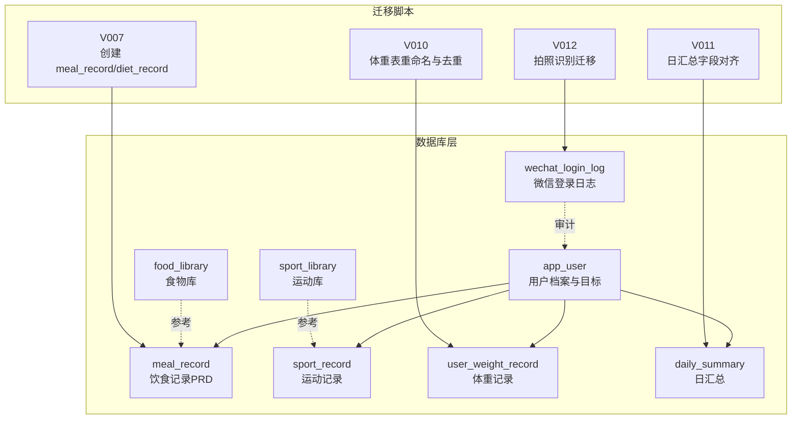
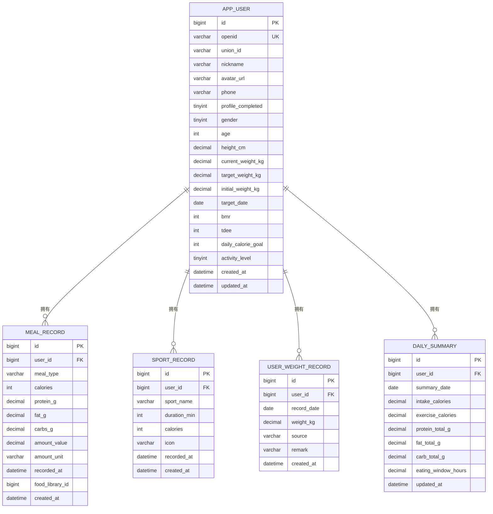
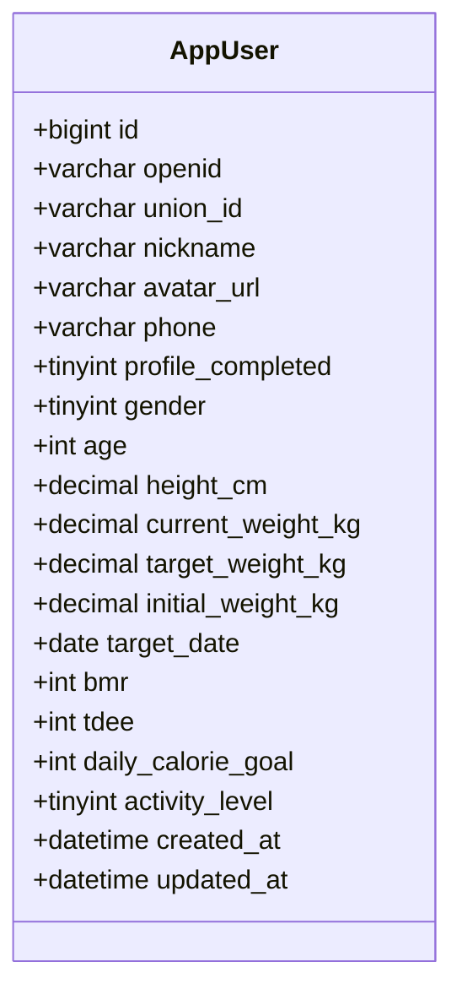
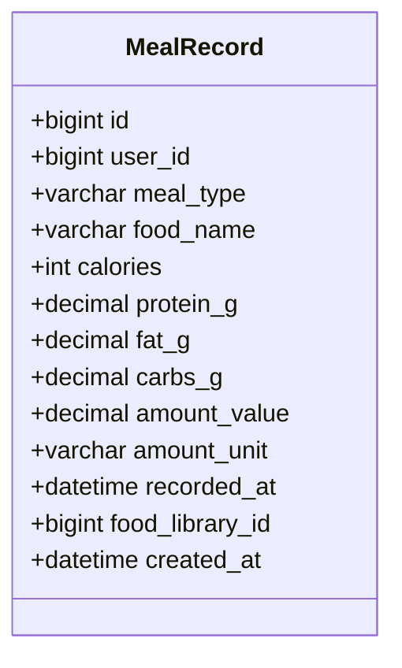
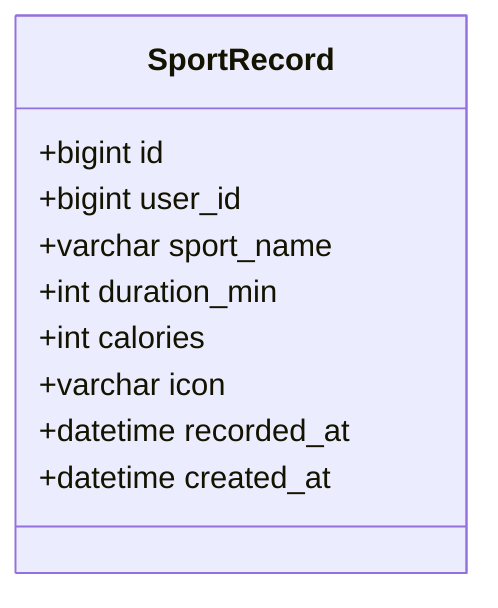
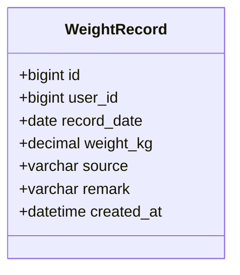
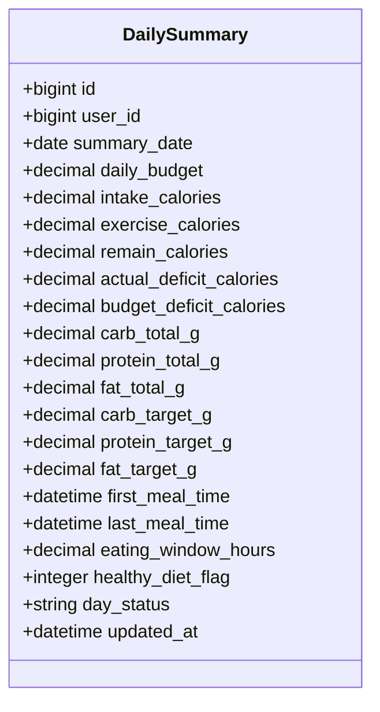
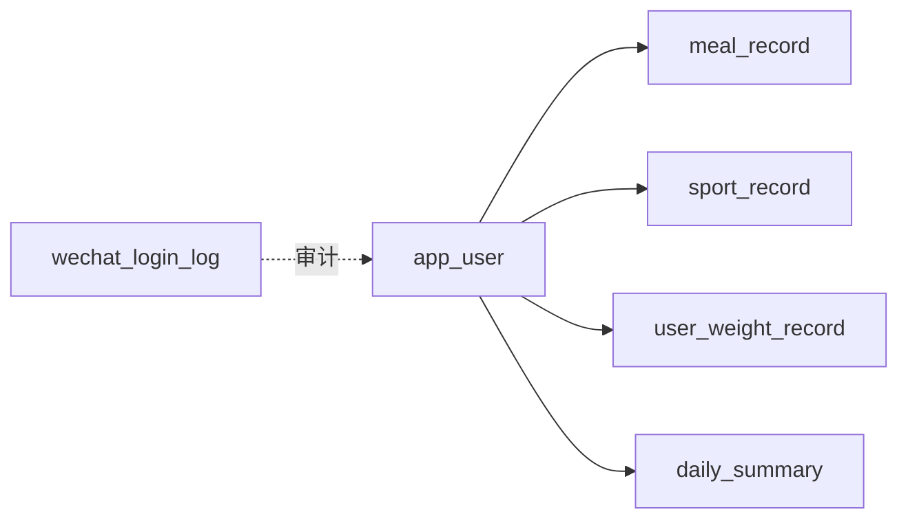

# 核心表结构详解

<cite>
**本文引用的文件**
- [01_schema.sql](file://database/01_schema.sql)
- [02_seed.sql](file://database/02_seed.sql)
- [admin-system.sql](file://database/admin-system.sql)
- [V007__create_meal_record_and_diet_record.sql](file://database/migrations/V007__create_meal_record_and_diet_record.sql)
- [V010__user_weight_record.sql](file://database/migrations/V010__user_weight_record.sql)
- [V011__daily_summary_prd_columns.sql](file://database/migrations/V011__daily_summary_prd_columns.sql)
- [V012__meal_evaluation_and_photo_recognition.sql](file://database/migrations/V012__meal_evaluation_and_photo_recognition.sql)
- [AppUser.java](file://backend/src/main/java/com/ypfr/loseweight/domain/AppUser.java)
- [MealRecord.java](file://backend/src/main/java/com/ypfr/loseweight/domain/MealRecord.java)
- [SportRecord.java](file://backend/src/main/java/com/ypfr/loseweight/domain/SportRecord.java)
- [WeightRecord.java](file://backend/src/main/java/com/ypfr/loseweight/domain/WeightRecord.java)
- [DailySummary.java](file://backend/src/main/java/com/ypfr/loseweight/domain/DailySummary.java)
- [Food.java](file://backend/src/main/java/com/ypfr/loseweight/domain/Food.java)
- [SportItem.java](file://backend/src/main/java/com/ypfr/loseweight/domain/SportItem.java)
</cite>

## 目录
1. [简介](#简介)
2. [项目结构](#项目结构)
3. [核心组件](#核心组件)
4. [架构总览](#架构总览)
5. [详细组件分析](#详细组件分析)
6. [依赖关系分析](#依赖关系分析)
7. [性能考量](#性能考量)
8. [故障排查指南](#故障排查指南)
9. [结论](#结论)
10. [附录](#附录)

## 简介
本文面向“核心表结构”进行系统化设计文档梳理，聚焦以下关键表：
- app_user 用户表：用户档案、目标与预算
- meal_record 饮食记录表：按餐次聚合的行式设计
- sport_record 运动记录表：运动行为与消耗
- user_weight_record 体重记录表：日粒度与去重策略
- daily_summary 日汇总表：聚合指标与更新机制

文档从字段定义、数据类型、约束、索引、查询优化、业务规则与扩展性等方面展开，并提供表结构图与字段对照表，帮助开发者与产品、运维人员快速理解与落地。

## 项目结构
核心表位于数据库目录，配合迁移脚本与实体类映射，形成“DDL → 实体 → 服务”的完整闭环。下图展示核心表与相关迁移脚本的关系：

图表来源
- [01_schema.sql:10-159](file://database/01_schema.sql#L10-L159)
- [V007__create_meal_record_and_diet_record.sql:10-55](file://database/migrations/V007__create_meal_record_and_diet_record.sql#L10-L55)
- [V010__user_weight_record.sql:10-16](file://database/migrations/V010__user_weight_record.sql#L10-L16)
- [V011__daily_summary_prd_columns.sql:11-29](file://database/migrations/V011__daily_summary_prd_columns.sql#L11-L29)
- [V012__meal_evaluation_and_photo_recognition.sql:10-48](file://database/migrations/V012__meal_evaluation_and_photo_recognition.sql#L10-L48)

章节来源
- [01_schema.sql:10-159](file://database/01_schema.sql#L10-L159)

## 核心组件
本节概述四大核心表的职责与设计要点：
- app_user：用户身份与画像，承载目标体重、身高、年龄、活动等级、BMI/TDEE与日摄入目标等
- meal_record：以“餐次”为单位的记录头，便于时间线与汇总计算
- sport_record：运动行为与消耗，支持来源标记与图标
- user_weight_record：日粒度体重记录，支持手动/系统来源与备注
- daily_summary：日级聚合指标，包含预算、缺口、宏量目标与健康状态

章节来源
- [01_schema.sql:10-159](file://database/01_schema.sql#L10-L159)
- [V010__user_weight_record.sql:10-16](file://database/migrations/V010__user_weight_record.sql#L10-L16)
- [V011__daily_summary_prd_columns.sql:11-29](file://database/migrations/V011__daily_summary_prd_columns.sql#L11-L29)

## 架构总览
下图展示核心表之间的关系与典型查询路径（如按用户+日期检索）：

图表来源
- [01_schema.sql:10-159](file://database/01_schema.sql#L10-L159)

## 详细组件分析

### app_user 用户表
- 字段与含义
  - 标识与认证：id、openid（唯一）、union_id、phone
  - 基础画像：nickname、avatar_url、gender、age
  - 身体测量：height_cm、current_weight_kg、target_weight_kg、initial_weight_kg、target_date
  - 能量参数：bmr、tdee、daily_calorie_goal、activity_level
  - 状态与时间：profile_completed、created_at、updated_at
- 数据类型与约束
  - 主键自增 bigint
  - openid 唯一索引，用于微信授权绑定
  - activity_level 默认值体现活动系数档位
  - profile_completed 二值状态位
- 业务逻辑与数据完整性
  - 通过 openid 唯一性保障微信用户唯一绑定
  - daily_calorie_goal 与 tdee/bmr 用于前端预算与目标计算
  - updated_at 自动更新，便于审计
- 查询优化建议
  - 常用查询：openid、phone、id
  - 建议索引：phone（若存在手机号绑定场景）、联合索引(id, openid) 提升绑定效率
- 表结构图

图表来源
- [01_schema.sql:10-34](file://database/01_schema.sql#L10-L34)

章节来源
- [01_schema.sql:10-34](file://database/01_schema.sql#L10-L34)

### meal_record 饮食记录表
- 设计原理
  - 行式设计：每条记录代表一次进食行为（含食物名称、热量、宏量、分量与单位）
  - 时间维度：recorded_at 记录实际进食时刻，支持按用户+时间排序
  - 关联关系：外键 user_id 指向 app_user
- 字段映射
  - user_id：归属用户
  - meal_type：餐型 breakfast/lunch/dinner/snack
  - food_name：食物名称快照
  - calories、protein_g、fat_g、carbs_g：营养素含量
  - amount_value、amount_unit：分量与单位
  - recorded_at：记录时间
  - food_library_id：可选引用食物库
  - created_at：记录创建时间
- 业务规则
  - 支持多条记录覆盖同一用户同一天的多次进食
  - 适合前端时间线展示与逐条编辑
- 索引与查询优化
  - idx_meal_user_time(user_id, recorded_at) 支持按用户与时间检索
  - 建议复合索引覆盖常用过滤：user_id + recorded_at + meal_type
- 表结构图

图表来源
- [01_schema.sql:36-54](file://database/01_schema.sql#L36-L54)

章节来源
- [01_schema.sql:36-54](file://database/01_schema.sql#L36-L54)

### sport_record 运动记录表
- 结构设计
  - user_id：归属用户
  - sport_name：运动名称快照
  - duration_min：时长（分钟）
  - calories：消耗热量
  - icon：图标快照
  - recorded_at：记录时间
  - created_at：记录创建时间
- 扩展性考虑
  - icon 快照与外部库解耦，便于UI与运营配置
  - duration_min + calories 组合满足常见统计需求
- 索引与查询优化
  - idx_sport_user_time(user_id, recorded_at) 支持按用户与时间检索
  - 建议复合索引覆盖常用过滤：user_id + recorded_at + sport_name
- 表结构图

图表来源
- [01_schema.sql:56-69](file://database/01_schema.sql#L56-L69)

章节来源
- [01_schema.sql:56-69](file://database/01_schema.sql#L56-L69)

### user_weight_record 体重记录表
- 日粒度设计
  - record_date：按自然日记录
  - weight_kg：当日体重
  - source：manual/system，区分来源
  - remark：备注（如特殊说明）
  - created_at：记录创建时间
- 去重策略
  - 原则：同一用户同日允许多条记录（与历史体重表不同）
  - 建议：应用层合并策略（如取最新或平均），避免重复统计
- 索引与查询优化
  - 建议：uk_weight_user_date(user_id, record_date) 在需要严格去重时启用
  - 若允许多条，按 user_id + record_date + created_at 排序取最新
- 表结构图

图表来源
- [01_schema.sql:71-81](file://database/01_schema.sql#L71-L81)
- [V010__user_weight_record.sql:10-16](file://database/migrations/V010__user_weight_record.sql#L10-L16)

章节来源
- [01_schema.sql:71-81](file://database/01_schema.sql#L71-L81)
- [V010__user_weight_record.sql:10-16](file://database/migrations/V010__user_weight_record.sql#L10-L16)

### daily_summary 日汇总表
- 聚合逻辑
  - 按 user_id + summary_date 聚合当日摄入与运动
  - 指标：intake_calories、exercise_calories、protein_total_g、fat_total_g、carb_total_g
  - 时间窗口：eating_window_hours（首尾餐时间差）
  - 状态：healthy_diet_flag、day_status（normal/overeat/invalid）
  - 预算：daily_budget、remain_calories、actual_deficit_calories、budget_deficit_calories
  - 目标：carb_target_g、protein_target_g、fat_target_g
- 更新机制
  - 支持批任务或接口回填，字段默认 NULL，按 PRD 公式计算
  - updated_at 自动更新，便于审计
- 索引与查询优化
  - uk_daily_summary_user_date(user_id, summary_date) 唯一性保障
  - 建议：按 user_id + summary_date 排序的复合索引
- 表结构图

图表来源
- [01_schema.sql:126-141](file://database/01_schema.sql#L126-L141)
- [V011__daily_summary_prd_columns.sql:11-29](file://database/migrations/V011__daily_summary_prd_columns.sql#L11-L29)

章节来源
- [01_schema.sql:126-141](file://database/01_schema.sql#L126-L141)
- [V011__daily_summary_prd_columns.sql:11-29](file://database/migrations/V011__daily_summary_prd_columns.sql#L11-L29)

## 依赖关系分析
- 外键关系
  - meal_record.user_id → app_user.id
  - sport_record.user_id → app_user.id
  - user_weight_record.user_id → app_user.id
  - daily_summary.user_id → app_user.id
- 迁移演进
  - V007 引入 meal_record 与 diet_record（当前以 meal_record 为主）
  - V010 体重表重命名为 user_weight_record 并调整去重策略
  - V011 日汇总字段对齐 PRD，新增预算/缺口/目标/状态等
  - V012 拍照识别迁移至 meal_photo_recognition，兼容历史 food_recognition_log
- 依赖图

图表来源
- [01_schema.sql:10-159](file://database/01_schema.sql#L10-L159)

章节来源
- [01_schema.sql:10-159](file://database/01_schema.sql#L10-L159)
- [V007__create_meal_record_and_diet_record.sql:10-55](file://database/migrations/V007__create_meal_record_and_diet_record.sql#L10-L55)
- [V010__user_weight_record.sql:10-16](file://database/migrations/V010__user_weight_record.sql#L10-L16)
- [V011__daily_summary_prd_columns.sql:11-29](file://database/migrations/V011__daily_summary_prd_columns.sql#L11-L29)
- [V012__meal_evaluation_and_photo_recognition.sql:10-48](file://database/migrations/V012__meal_evaluation_and_photo_recognition.sql#L10-L48)

## 性能考量
- 索引策略
  - app_user：openid 唯一索引，必要时补充 phone 索引
  - meal_record：idx_meal_user_time(user_id, recorded_at)，建议 user_id + recorded_at + meal_type
  - sport_record：idx_sport_user_time(user_id, recorded_at)，建议 user_id + recorded_at + sport_name
  - user_weight_record：按需启用 uk_weight_user_date 或按 user_id + record_date + created_at 排序取最新
  - daily_summary：uk_daily_summary_user_date(user_id, summary_date)
- 写入模式
  - 日汇总采用批任务回填，避免高频写入冲突
  - 体重记录允许多条时，应用层合并策略减少重复统计
- 查询模式
  - 常见：按用户+日期范围检索，建议复合索引覆盖过滤字段
  - 聚合：按日汇总时使用 group by + 聚合函数，注意索引命中

## 故障排查指南
- 常见问题
  - openid 重复：检查 app_user 的 openid 唯一性约束
  - 体重重复：确认是否启用 uk_weight_user_date 或应用层合并策略
  - 日汇总缺失：核对批任务是否执行，字段是否默认 NULL
  - 拍照识别迁移：确认 food_recognition_log 是否已迁移至 meal_photo_recognition
- 排查步骤
  - 核对外键约束与索引是否存在
  - 检查 created_at/updated_at 是否正确更新
  - 验证业务流程（如体重录入、日汇总计算）是否按预期执行

章节来源
- [01_schema.sql:10-159](file://database/01_schema.sql#L10-L159)
- [V010__user_weight_record.sql:10-16](file://database/migrations/V010__user_weight_record.sql#L10-L16)
- [V011__daily_summary_prd_columns.sql:11-29](file://database/migrations/V011__daily_summary_prd_columns.sql#L11-L29)
- [V012__meal_evaluation_and_photo_recognition.sql:50-82](file://database/migrations/V012__meal_evaluation_and_photo_recognition.sql#L50-L82)

## 结论
本文从表结构、字段定义、约束、索引、查询优化与业务规则六个维度，系统梳理了 app_user、meal_record、sport_record、user_weight_record、daily_summary 的设计与实现要点。通过迁移脚本与实体类映射，确保数据库与应用层的一致性。建议在生产环境中结合业务场景进一步细化索引与合并策略，保障查询性能与数据一致性。

## 附录

### 字段对照表（核心表）
- app_user
  - openid：微信唯一标识（唯一）
  - phone：手机号（可空）
  - daily_calorie_goal：日摄入目标（千卡）
  - activity_level：活动系数档位（1-5）
  - profile_completed：资料完善状态（0/1）

- meal_record
  - user_id：用户ID
  - meal_type：餐型（breakfast/lunch/dinner/snack）
  - recorded_at：记录时间
  - calories/protein_g/fat_g/carbs_g：营养素
  - amount_value/amount_unit：分量与单位

- sport_record
  - user_id：用户ID
  - sport_name：运动名称
  - duration_min：时长（分钟）
  - calories：消耗热量
  - recorded_at：记录时间

- user_weight_record
  - user_id：用户ID
  - record_date：记录日期
  - weight_kg：体重（kg）
  - source：来源（manual/system）
  - remark：备注

- daily_summary
  - user_id：用户ID
  - summary_date：汇总日期
  - intake_calories/exercise_calories：摄入/消耗（千卡）
  - protein_total_g/fat_total_g/carb_total_g：宏量总和
  - daily_budget/remain_calories/actual_deficit_calories/budget_deficit_calories：预算与缺口
  - carb_target_g/protein_target_g/fat_target_g：宏量目标
  - eating_window_hours：进食窗口（小时）
  - healthy_diet_flag/day_status：健康状态标志与日状态

章节来源
- [01_schema.sql:10-159](file://database/01_schema.sql#L10-L159)
- [V010__user_weight_record.sql:10-16](file://database/migrations/V010__user_weight_record.sql#L10-L16)
- [V011__daily_summary_prd_columns.sql:11-29](file://database/migrations/V011__daily_summary_prd_columns.sql#L11-L29)