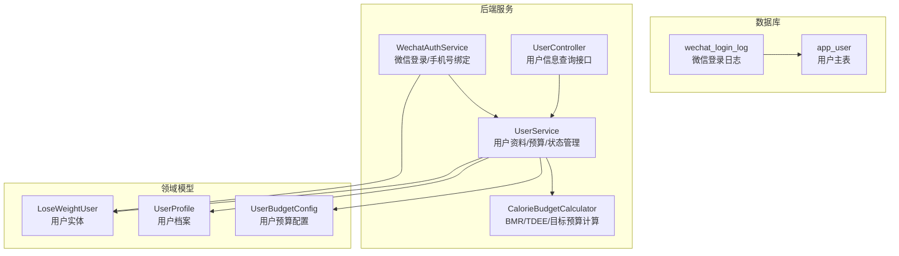
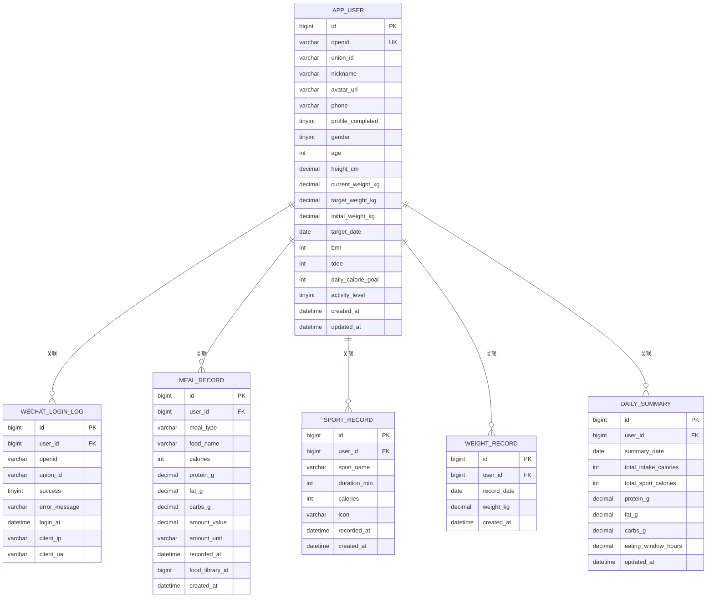
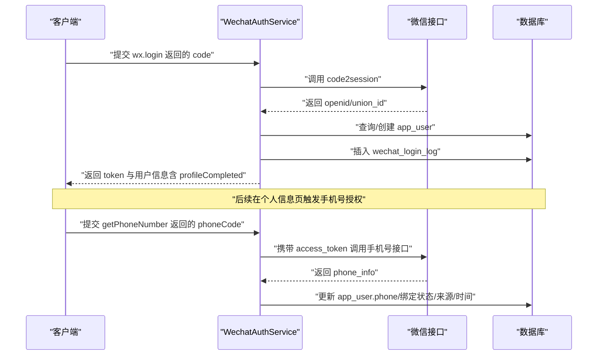
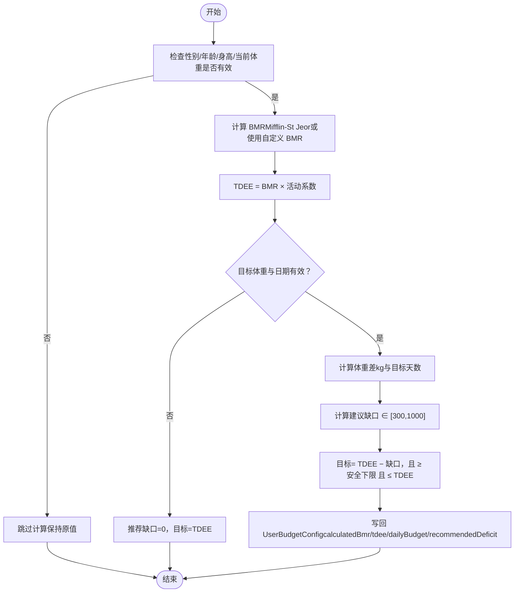
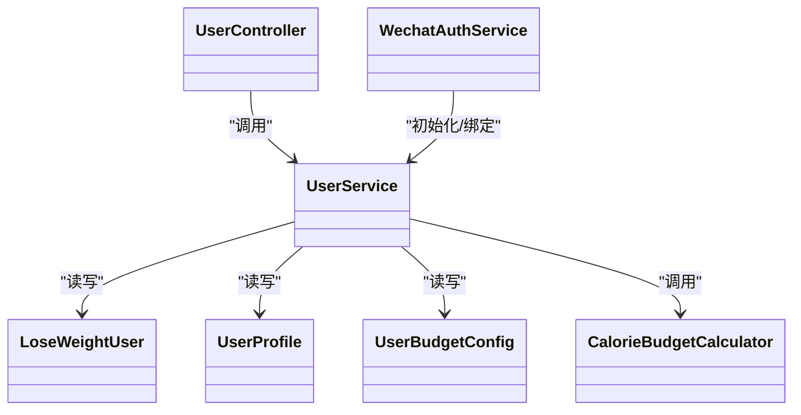

# 用户表设计

<cite>
**本文引用的文件**
- [01_schema.sql](file://database/01_schema.sql)
- [03_wechat_login_log.sql](file://database/03_wechat_login_log.sql)
- [04_app_user_phone.sql](file://database/04_app_user_phone.sql)
- [05_app_user_profile_completed.sql](file://database/05_app_user_profile_completed.sql)
- [LoseWeightUser.java](file://backend/src/main/java/com/ypfr/loseweight/domain/LoseWeightUser.java)
- [UserProfile.java](file://backend/src/main/java/com/ypfr/loseweight/domain/UserProfile.java)
- [UserBudgetConfig.java](file://backend/src/main/java/com/ypfr/loseweight/domain/UserBudgetConfig.java)
- [UserService.java](file://backend/src/main/java/com/ypfr/loseweight/service/UserService.java)
- [WechatAuthService.java](file://backend/src/main/java/com/ypfr/loseweight/service/WechatAuthService.java)
- [CalorieBudgetCalculator.java](file://backend/src/main/java/com/ypfr/loseweight/service/CalorieBudgetCalculator.java)
- [AppUserDto.java](file://backend/src/main/java/com/ypfr/loseweight/web/dto/AppUserDto.java)
- [WxLoginRequest.java](file://backend/src/main/java/com/ypfr/loseweight/web/dto/WxLoginRequest.java)
- [WxLoginResponse.java](file://backend/src/main/java/com/ypfr/loseweight/web/dto/WxLoginResponse.java)
- [UserController.java](file://backend/src/main/java/com/ypfr/loseweight/web/UserController.java)
</cite>

## 目录
1. [简介](#简介)
2. [项目结构](#项目结构)
3. [核心组件](#核心组件)
4. [架构总览](#架构总览)
5. [详细组件分析](#详细组件分析)
6. [依赖分析](#依赖分析)
7. [性能考量](#性能考量)
8. [故障排查指南](#故障排查指南)
9. [结论](#结论)
10. [附录](#附录)

## 简介
本文件围绕 app_user 用户表进行系统化、可操作的结构与业务说明，覆盖以下重点：
- 微信授权相关字段（openid、union_id）的数据来源与作用边界
- 用户基本信息字段（昵称、头像、性别、年龄）的设计取舍
- 身体指标字段（身高、当前体重、目标体重、初始体重）的业务含义与数据类型
- 目标设定字段（目标达成日期、BMR、TDEE、每日摄入目标）的计算逻辑与存储策略
- profile_completed 状态字段的业务作用与完整性校验
- phone 字段的手机号授权获取机制
- 索引、唯一约束与外键关系
- 提供用户表结构图与字段对照表

## 项目结构
本项目采用前后端分离与数据库迁移脚本并行演进的方式：
- 数据层：通过数据库迁移脚本定义表结构与约束，并在后续增量脚本中补充字段与索引
- 服务层：Java Spring Boot 后端通过 MyBatis-Plus 访问数据库，封装用户资料、预算配置与微信登录流程
- DTO 层：对外输出 AppUserDto，屏蔽敏感字段，承载前端所需展示字段

图表来源
- [01_schema.sql:11-34](file://database/01_schema.sql#L11-L34)
- [03_wechat_login_log.sql:4-18](file://database/03_wechat_login_log.sql#L4-L18)
- [WechatAuthService.java:28-59](file://backend/src/main/java/com/ypfr/loseweight/service/WechatAuthService.java#L28-L59)
- [UserService.java:25-54](file://backend/src/main/java/com/ypfr/loseweight/service/UserService.java#L25-L54)
- [CalorieBudgetCalculator.java:11-142](file://backend/src/main/java/com/ypfr/loseweight/service/CalorieBudgetCalculator.java#L11-L142)
- [UserController.java:16-26](file://backend/src/main/java/com/ypfr/loseweight/web/UserController.java#L16-L26)

章节来源
- [01_schema.sql:11-34](file://database/01_schema.sql#L11-L34)
- [03_wechat_login_log.sql:4-18](file://database/03_wechat_login_log.sql#L4-L18)
- [UserController.java:16-26](file://backend/src/main/java/com/ypfr/loseweight/web/UserController.java#L16-L26)

## 核心组件
- app_user：用户主表，承载微信授权标识、基础信息、手机号与资料完成状态，以及与体重、日汇总、运动、饮食等子表的关联
- wechat_login_log：微信登录审计日志，记录 openid/union_id、登录结果与客户端信息
- LoseWeightUser：用户实体（lw_user，与 app_user 并存于历史版本），用于微信侧用户信息与绑定状态
- UserProfile：用户档案，承载性别、年龄、身高、体重系列与目标日期、完成状态
- UserBudgetConfig：用户预算配置，承载活动系数、BMR/TDEE、推荐减重缺口与每日摄入目标
- UserService：用户资料更新、预算重算、profile_completed 计算与 DTO 转换
- WechatAuthService：微信 code2session 获取 openid/union_id、手机号授权绑定、登录日志记录
- CalorieBudgetCalculator：Mifflin-St Jeor 公式计算 BMR，结合活动系数计算 TDEE，基于目标体重与日期推导每日摄入目标

章节来源
- [01_schema.sql:11-34](file://database/01_schema.sql#L11-L34)
- [03_wechat_login_log.sql:4-18](file://database/03_wechat_login_log.sql#L4-L18)
- [LoseWeightUser.java:8-31](file://backend/src/main/java/com/ypfr/loseweight/domain/LoseWeightUser.java#L8-L31)
- [UserProfile.java:10-26](file://backend/src/main/java/com/ypfr/loseweight/domain/UserProfile.java#L10-L26)
- [UserBudgetConfig.java:10-29](file://backend/src/main/java/com/ypfr/loseweight/domain/UserBudgetConfig.java#L10-L29)
- [UserService.java:25-54](file://backend/src/main/java/com/ypfr/loseweight/service/UserService.java#L25-L54)
- [WechatAuthService.java:28-59](file://backend/src/main/java/com/ypfr/loseweight/service/WechatAuthService.java#L28-L59)
- [CalorieBudgetCalculator.java:11-142](file://backend/src/main/java/com/ypfr/loseweight/service/CalorieBudgetCalculator.java#L11-L142)

## 架构总览
下图展示 app_user 与相关表、服务与 DTO 的交互关系：

图表来源
- [01_schema.sql:11-34](file://database/01_schema.sql#L11-L34)
- [01_schema.sql:37-54](file://database/01_schema.sql#L37-L54)
- [01_schema.sql:57-69](file://database/01_schema.sql#L57-L69)
- [01_schema.sql:72-81](file://database/01_schema.sql#L72-L81)
- [01_schema.sql:127-141](file://database/01_schema.sql#L127-L141)
- [03_wechat_login_log.sql:4-18](file://database/03_wechat_login_log.sql#L4-L18)

## 详细组件分析

### app_user 表结构与字段设计
- 主键与唯一性
  - id：自增主键
  - openid：唯一索引，作为微信授权身份标识
- 微信授权字段
  - openid：必填，微信 JS-Code2Session 返回，用于登录态识别
  - union_id：可选，跨应用唯一标识，用于多应用合并用户
- 基本信息
  - nickname：昵称，长度限制与截断策略见服务端更新逻辑
  - avatar_url：头像地址
  - gender：枚举值（0 未知，1 男，2 女）
  - age：年龄
- 身体指标
  - height_cm：身高（厘米），精度到小数点后两位
  - current_weight_kg：当前体重（千克），用于计算 BMR/TDEE 与目标预算
  - target_weight_kg：目标体重（千克）
  - initial_weight_kg：初始体重（首次完善资料时自动补全）
- 目标设定
  - target_date：目标达成日期
  - activity_level：活动系数档位（1-5），用于 TDEE 计算
  - bmr/tdee/daily_calorie_goal：计算得出的数值，存储为整型
- 完成状态与手机号
  - profile_completed：资料是否按规则完善（1=已完善）
  - phone：微信授权手机号（纯数字，含国际区号）

章节来源
- [01_schema.sql:11-34](file://database/01_schema.sql#L11-L34)
- [04_app_user_phone.sql:4-5](file://database/04_app_user_phone.sql#L4-L5)
- [05_app_user_profile_completed.sql:4-7](file://database/05_app_user_profile_completed.sql#L4-L7)
- [UserService.java:75-164](file://backend/src/main/java/com/ypfr/loseweight/service/UserService.java#L75-L164)
- [UserProfile.java:10-26](file://backend/src/main/java/com/ypfr/loseweight/domain/UserProfile.java#L10-L26)
- [UserBudgetConfig.java:10-29](file://backend/src/main/java/com/ypfr/loseweight/domain/UserBudgetConfig.java#L10-L29)

### 微信授权与手机号绑定流程
- 登录流程
  - 前端传入 code，后端调用微信 code2session 接口获取 openid/union_id
  - 若 app_user 不存在则新建用户并初始化用户档案与预算配置
  - 写入 wechat_login_log 以便审计
- 手机号绑定
  - 使用 getPhoneNumber 返回的 code，携带全局 access_token 请求微信手机号接口
  - 成功后写入 phone、绑定状态与来源信息

图表来源
- [WechatAuthService.java:64-153](file://backend/src/main/java/com/ypfr/loseweight/service/WechatAuthService.java#L64-L153)
- [WechatAuthService.java:156-204](file://backend/src/main/java/com/ypfr/loseweight/service/WechatAuthService.java#L156-L204)
- [03_wechat_login_log.sql:4-18](file://database/03_wechat_login_log.sql#L4-L18)

章节来源
- [WechatAuthService.java:64-153](file://backend/src/main/java/com/ypfr/loseweight/service/WechatAuthService.java#L64-L153)
- [WechatAuthService.java:156-204](file://backend/src/main/java/com/ypfr/loseweight/service/WechatAuthService.java#L156-L204)
- [03_wechat_login_log.sql:4-18](file://database/03_wechat_login_log.sql#L4-L18)

### 身体指标与目标预算计算
- BMR 计算
  - 采用 Mifflin-St Jeor 公式，性别、年龄、身高、体重均需有效
  - 支持自定义 BMR（use_custom_bmr=1 时优先使用 custom_bmr）
- TDEE 计算
  - TDEE = BMR × 活动系数（1-5 档位映射为小数）
- 每日摄入目标
  - 基于当前体重、目标体重与目标日期推导建议减重缺口（300~1000 kcal/d），并确保不低于安全下限
  - 目标值 = TDEE − 建议缺口，且不超过 TDEE，不低于安全下限

图表来源
- [CalorieBudgetCalculator.java:67-140](file://backend/src/main/java/com/ypfr/loseweight/service/CalorieBudgetCalculator.java#L67-L140)
- [UserService.java:157-158](file://backend/src/main/java/com/ypfr/loseweight/service/UserService.java#L157-L158)

章节来源
- [CalorieBudgetCalculator.java:11-142](file://backend/src/main/java/com/ypfr/loseweight/service/CalorieBudgetCalculator.java#L11-L142)
- [UserService.java:157-158](file://backend/src/main/java/com/ypfr/loseweight/service/UserService.java#L157-L158)

### profile_completed 状态的业务作用与完整性保证
- 业务作用
  - 控制用户是否可进入首页，避免未完善资料的用户继续使用
- 完整性校验规则
  - nickname 非空且非空白
  - gender ∈ {1,2}
  - age > 0
  - height_cm > 0
  - current_weight_kg > 0
  - target_weight_kg > 0
  - target_date 非空
- 初始化策略
  - 对已有老用户，根据上述规则批量标记为已完善

章节来源
- [05_app_user_profile_completed.sql:4-19](file://database/05_app_user_profile_completed.sql#L4-L19)
- [UserService.java:195-218](file://backend/src/main/java/com/ypfr/loseweight/service/UserService.java#L195-L218)

### phone 字段的手机号授权获取机制
- 数据来源
  - 微信 getPhoneNumber 接口返回的 purePhoneNumber 或 phoneNumber
- 写入策略
  - 成功后更新 phone、绑定状态、来源与绑定时间
- 长度限制
  - 最大 20 位（含国际区号）

章节来源
- [04_app_user_phone.sql:4-5](file://database/04_app_user_phone.sql#L4-L5)
- [WechatAuthService.java:156-204](file://backend/src/main/java/com/ypfr/loseweight/service/WechatAuthService.java#L156-L204)

### 索引、唯一约束与外键关系
- app_user
  - 主键：id
  - 唯一索引：uk_app_user_openid(openid)
- 关联表
  - wechat_login_log：外键 user_id → app_user(id)，ON DELETE SET NULL
  - meal_record/sport_record/weight_record/daily_summary：外键 user_id → app_user(id)
- 索引
  - wechat_login_log：idx_wx_login_user_time、idx_wx_login_openid_time
  - meal_record/sport_record：idx_user_time（按 user_id + 时间排序）

章节来源
- [01_schema.sql:32-34](file://database/01_schema.sql#L32-L34)
- [01_schema.sql:52-53](file://database/01_schema.sql#L52-L53)
- [01_schema.sql:67-68](file://database/01_schema.sql#L67-L68)
- [01_schema.sql:78-80](file://database/01_schema.sql#L78-L80)
- [01_schema.sql:138-140](file://database/01_schema.sql#L138-L140)
- [03_wechat_login_log.sql:14-18](file://database/03_wechat_login_log.sql#L14-L18)

### 字段对照表
- 微信授权
  - openid：微信 JS-Code2Session 返回，唯一索引
  - union_id：跨应用唯一标识，可选
- 基本信息
  - nickname：昵称
  - avatar_url：头像地址
  - gender：0 未知，1 男，2 女
  - age：年龄
- 身体指标
  - height_cm：身高（厘米，保留两位小数）
  - current_weight_kg：当前体重（千克）
  - target_weight_kg：目标体重（千克）
  - initial_weight_kg：初始体重（完善资料时自动补全）
- 目标与预算
  - target_date：目标达成日期
  - activity_level：活动系数档位（1-5）
  - bmr/tdee/daily_calorie_goal：计算得出的整型值
- 完成状态与手机号
  - profile_completed：资料是否完善（1=已完善）
  - phone：微信授权手机号（最多 20 位）

章节来源
- [01_schema.sql:11-34](file://database/01_schema.sql#L11-L34)
- [04_app_user_phone.sql:4-5](file://database/04_app_user_phone.sql#L4-L5)
- [05_app_user_profile_completed.sql:4-7](file://database/05_app_user_profile_completed.sql#L4-L7)
- [UserProfile.java:10-26](file://backend/src/main/java/com/ypfr/loseweight/domain/UserProfile.java#L10-L26)
- [UserBudgetConfig.java:10-29](file://backend/src/main/java/com/ypfr/loseweight/domain/UserBudgetConfig.java#L10-L29)
- [UserService.java:75-164](file://backend/src/main/java/com/ypfr/loseweight/service/UserService.java#L75-L164)

## 依赖分析
- 服务耦合
  - UserController 依赖 UserService
  - UserService 依赖 LoseWeightUser/UserProfile/UserBudgetConfig 实体与 CalorieBudgetCalculator
  - WechatAuthService 依赖微信接口、JwtService、WechatAccessTokenService 与 UserService
- 外部依赖
  - 微信 JS-Code2Session 与手机号接口
  - MySQL InnoDB 引擎与 UTF8MB4 字符集

图表来源
- [UserController.java:23-26](file://backend/src/main/java/com/ypfr/loseweight/web/UserController.java#L23-L26)
- [UserService.java:37-54](file://backend/src/main/java/com/ypfr/loseweight/service/UserService.java#L37-L54)
- [WechatAuthService.java:42-59](file://backend/src/main/java/com/ypfr/loseweight/service/WechatAuthService.java#L42-L59)
- [CalorieBudgetCalculator.java:11-142](file://backend/src/main/java/com/ypfr/loseweight/service/CalorieBudgetCalculator.java#L11-L142)
- [LoseWeightUser.java:8-31](file://backend/src/main/java/com/ypfr/loseweight/domain/LoseWeightUser.java#L8-L31)
- [UserProfile.java:10-26](file://backend/src/main/java/com/ypfr/loseweight/domain/UserProfile.java#L10-L26)
- [UserBudgetConfig.java:10-29](file://backend/src/main/java/com/ypfr/loseweight/domain/UserBudgetConfig.java#L10-L29)

章节来源
- [UserController.java:16-26](file://backend/src/main/java/com/ypfr/loseweight/web/UserController.java#L16-L26)
- [UserService.java:25-54](file://backend/src/main/java/com/ypfr/loseweight/service/UserService.java#L25-L54)
- [WechatAuthService.java:28-59](file://backend/src/main/java/com/ypfr/loseweight/service/WechatAuthService.java#L28-L59)
- [CalorieBudgetCalculator.java:11-142](file://backend/src/main/java/com/ypfr/loseweight/service/CalorieBudgetCalculator.java#L11-L142)

## 性能考量
- 查询优化
  - openid 唯一索引支持快速登录识别
  - wechat_login_log 按 user_id+login_at 与 openid+login_at 建立复合索引，便于审计与按时间检索
- 写入优化
  - app_user 更新集中在资料完善与预算重算，避免频繁变更
- 计算开销
  - BMR/TDEE/目标预算计算在资料变更或预算生效时触发，避免每条记录重复计算

## 故障排查指南
- 登录失败
  - 检查微信接口返回的 errcode/errmsg，确认 app-secret 配置正确
  - 核对 wechat_login_log 是否写入失败记录
- openid 重复或冲突
  - 确认 openid 唯一约束是否被破坏，必要时清理异常数据
- 手机号未写入
  - 确认 getPhoneNumber 授权流程是否完成，access_token 是否有效
  - 核对微信返回的 phone_info 字段是否存在
- profile_completed 未更新
  - 检查 UserService.computeProfileComplete 规则是否满足
  - 如为老用户，确认批量更新脚本是否执行

章节来源
- [WechatAuthService.java:64-100](file://backend/src/main/java/com/ypfr/loseweight/service/WechatAuthService.java#L64-L100)
- [03_wechat_login_log.sql:4-18](file://database/03_wechat_login_log.sql#L4-L18)
- [UserService.java:195-218](file://backend/src/main/java/com/ypfr/loseweight/service/UserService.java#L195-L218)
- [05_app_user_profile_completed.sql:9-19](file://database/05_app_user_profile_completed.sql#L9-L19)

## 结论
app_user 表围绕微信授权与用户健康目标管理进行了系统化设计：
- 明确区分 openid/union_id 的作用边界，保障登录与合并用户能力
- 以 UserProfile 与 UserBudgetConfig 分离“资料”与“预算”，提升扩展性
- 通过 CalorieBudgetCalculator 将生理参数转化为可落地的每日摄入目标
- 以 profile_completed 与 wechat_login_log 构建完整的业务闭环与审计能力

## 附录
- 字段与类型参考
  - 字符串类：VARCHAR(N)，统一 UTF8MB4
  - 数值类：DECIMAL(M,D) 用于身高/体重/宏量营养素，INT 用于 BMR/TDEE/目标
  - 日期类：DATE（目标日期）、DATETIME（创建/更新时间）
- 建议
  - 在生产环境定期执行 profile_completed 批量校验脚本
  - 对高频查询字段（如 openid、user_id+recorded_at）保持索引有效性