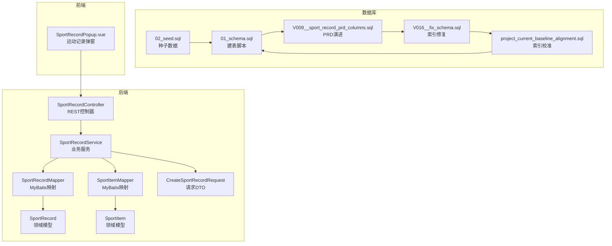
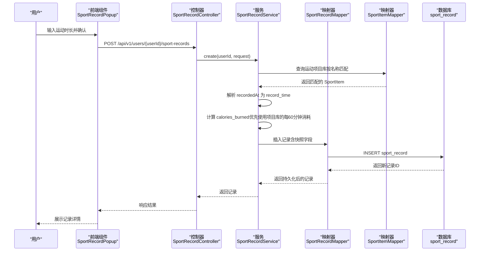
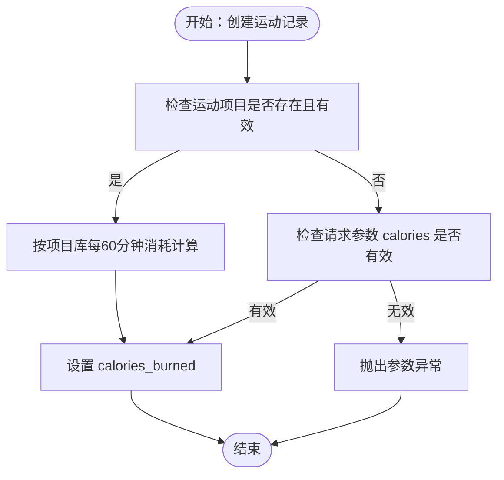
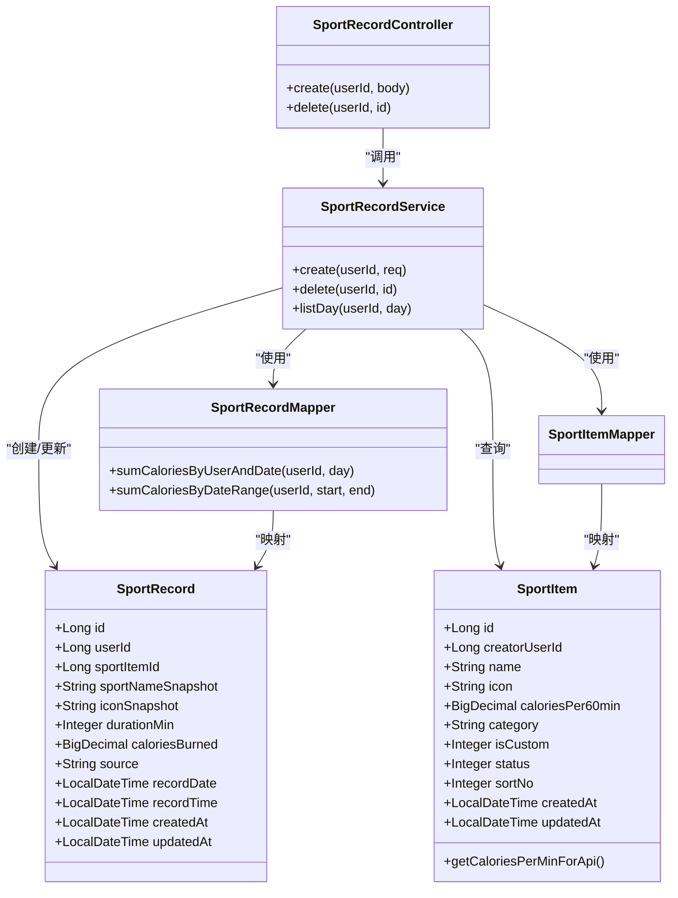
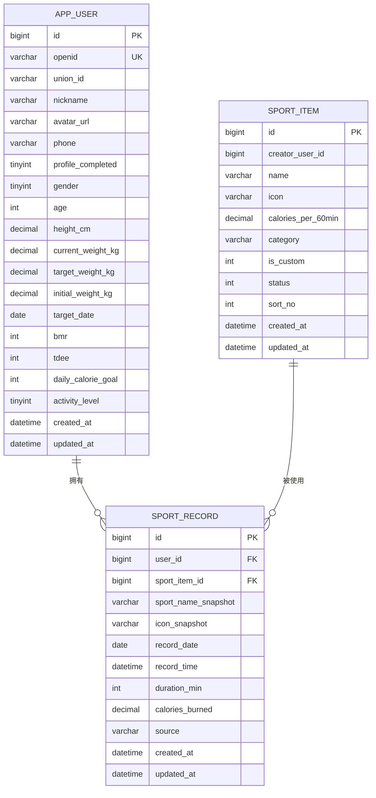

# 运动记录表设计

<cite>
**本文档引用的文件**
- [01_schema.sql](file://database/01_schema.sql)
- [V009__sport_record_prd_columns.sql](file://database/migrations/V009__sport_record_prd_columns.sql)
- [V016__fix_schema.sql](file://database/migrations/V016__fix_schema.sql)
- [project_current_baseline_alignment.sql](file://database/project_current_baseline_alignment.sql)
- [SportRecord.java](file://backend/src/main/java/com/ypfr/loseweight/domain/SportRecord.java)
- [SportItem.java](file://backend/src/main/java/com/ypfr/loseweight/domain/SportItem.java)
- [SportRecordService.java](file://backend/src/main/java/com/ypfr/loseweight/service/SportRecordService.java)
- [SportRecordController.java](file://backend/src/main/java/com/ypfr/loseweight/web/SportRecordController.java)
- [SportRecordMapper.java](file://backend/src/main/java/com/ypfr/loseweight/mapper/SportRecordMapper.java)
- [SportItemMapper.java](file://backend/src/main/java/com/ypfr/loseweight/mapper/SportItemMapper.java)
- [CreateSportRecordRequest.java](file://backend/src/main/java/com/ypfr/loseweight/web/dto/CreateSportRecordRequest.java)
- [02_seed.sql](file://database/02_seed.sql)
- [SportRecordPopup.vue](file://frontend/src/components/SportRecordPopup.vue)
</cite>

## 目录
1. [简介](#简介)
2. [项目结构](#项目结构)
3. [核心组件](#核心组件)
4. [架构概览](#架构概览)
5. [详细组件分析](#详细组件分析)
6. [依赖关系分析](#依赖关系分析)
7. [性能考量](#性能考量)
8. [故障排除指南](#故障排除指南)
9. [结论](#结论)
10. [附录](#附录)

## 简介
本文件针对运动记录表（sport_record）进行系统化设计文档梳理，重点阐述以下方面：
- 简化设计思路：以用户为中心，围绕运动名称、时长、消耗热量三大核心字段构建记录模型，确保数据最小可用集与业务可解释性。
- 字段设计深度解析：duration_min 的时长存储策略与精度控制、calories 的计算逻辑与来源、sport_name 的快照化与运动项目库关联、recorded_at 的时间记录机制与业务用途、icon 的图标存储策略与前端展示考虑。
- 外键约束与索引设计：明确外键关系、复合索引策略及其对查询性能的影响。
- 查询优化策略：基于实际业务场景（按用户+日期查询）给出索引与SQL优化建议。
- 表结构图与典型示例：提供表结构图与典型运动项目的示例数据，帮助快速理解与落地。

## 项目结构
运动记录模块涉及后端领域模型、服务层、数据访问层、数据库迁移脚本以及前端交互组件，整体结构如下：

**图表来源**
- [01_schema.sql:56-69](file://database/01_schema.sql#L56-L69)
- [V009__sport_record_prd_columns.sql:10-49](file://database/migrations/V009__sport_record_prd_columns.sql#L10-L49)
- [V016__fix_schema.sql:136-283](file://database/migrations/V016__fix_schema.sql#L136-L283)
- [project_current_baseline_alignment.sql:590-618](file://database/project_current_baseline_alignment.sql#L590-L618)
- [SportRecordService.java:33-84](file://backend/src/main/java/com/ypfr/loseweight/service/SportRecordService.java#L33-L84)
- [SportRecordController.java:24-28](file://backend/src/main/java/com/ypfr/loseweight/web/SportRecordController.java#L24-L28)
- [SportRecordPopup.vue:1-35](file://frontend/src/components/SportRecordPopup.vue#L1-L35)

**章节来源**
- [01_schema.sql:56-69](file://database/01_schema.sql#L56-L69)
- [V009__sport_record_prd_columns.sql:10-49](file://database/migrations/V009__sport_record_prd_columns.sql#L10-L49)
- [V016__fix_schema.sql:136-283](file://database/migrations/V016__fix_schema.sql#L136-L283)
- [project_current_baseline_alignment.sql:590-618](file://database/project_current_baseline_alignment.sql#L590-L618)
- [SportRecordService.java:33-84](file://backend/src/main/java/com/ypfr/loseweight/service/SportRecordService.java#L33-L84)
- [SportRecordController.java:24-28](file://backend/src/main/java/com/ypfr/loseweight/web/SportRecordController.java#L24-L28)
- [SportRecordPopup.vue:1-35](file://frontend/src/components/SportRecordPopup.vue#L1-L35)

## 核心组件
- 表结构与字段
  - 用户标识：user_id（外键关联 app_user）
  - 运动项目：sport_item_id（外键关联 sport_item），并保存快照字段 sport_name_snapshot、icon_snapshot
  - 时间维度：record_date（日期）、record_time（精确到秒）
  - 运动参数：duration_min（分钟）
  - 能量消耗：calories_burned（千卡，采用 DECIMAL(12,2) 保证精度）
  - 记录来源：source（默认 manual）
  - 创建与更新：created_at、updated_at
- 关键索引
  - 复合索引 idx_sport_record_user_date(user_id, record_date)，用于按用户+日期高效查询
  - 外键约束 fk_sport_record_item(sport_item_id) → sport_item(id)
- 业务要点
  - 快照化设计：记录创建时将运动名称与图标快照至表中，避免后续项目库变更影响历史记录的可读性
  - 精度控制：热量采用 DECIMAL(12,2)，时长采用整数分钟，兼顾精度与存储效率
  - 时间记录：record_time 支持精确到秒的时间点记录，便于排序与统计

**章节来源**
- [01_schema.sql:56-69](file://database/01_schema.sql#L56-L69)
- [V009__sport_record_prd_columns.sql:10-49](file://database/migrations/V009__sport_record_prd_columns.sql#L10-L49)
- [V016__fix_schema.sql:255-277](file://database/migrations/V016__fix_schema.sql#L255-L277)
- [project_current_baseline_alignment.sql:590-618](file://database/project_current_baseline_alignment.sql#L590-L618)
- [SportRecord.java:11-26](file://backend/src/main/java/com/ypfr/loseweight/domain/SportRecord.java#L11-L26)

## 架构概览
运动记录从用户输入到持久化的完整流程如下：

**图表来源**
- [SportRecordPopup.vue:62-65](file://frontend/src/components/SportRecordPopup.vue#L62-L65)
- [SportRecordController.java:24-28](file://backend/src/main/java/com/ypfr/loseweight/web/SportRecordController.java#L24-L28)
- [SportRecordService.java:33-84](file://backend/src/main/java/com/ypfr/loseweight/service/SportRecordService.java#L33-L84)
- [SportRecordMapper.java:14-29](file://backend/src/main/java/com/ypfr/loseweight/mapper/SportRecordMapper.java#L14-L29)
- [SportItemMapper.java:1-9](file://backend/src/main/java/com/ypfr/loseweight/mapper/SportItemMapper.java#L1-L9)

**章节来源**
- [SportRecordPopup.vue:1-35](file://frontend/src/components/SportRecordPopup.vue#L1-L35)
- [SportRecordController.java:24-28](file://backend/src/main/java/com/ypfr/loseweight/web/SportRecordController.java#L24-L28)
- [SportRecordService.java:33-84](file://backend/src/main/java/com/ypfr/loseweight/service/SportRecordService.java#L33-L84)
- [SportRecordMapper.java:14-29](file://backend/src/main/java/com/ypfr/loseweight/mapper/SportRecordMapper.java#L14-L29)
- [SportItemMapper.java:1-9](file://backend/src/main/java/com/ypfr/loseweight/mapper/SportItemMapper.java#L1-L9)

## 详细组件分析

### 表结构与字段设计
- 字段说明
  - user_id：用户标识，外键关联 app_user(id)
  - sport_item_id：运动项目标识，外键关联 sport_item(id)
  - sport_name_snapshot：运动名称快照，记录创建时的名称
  - icon_snapshot：图标快照，记录创建时的图标标识
  - record_date：记录日期（YYYY-MM-DD），用于日汇总与统计
  - record_time：记录时间（YYYY-MM-DD HH:MM:SS），支持精确排序
  - duration_min：运动时长（分钟），整数类型，满足常见运动时长范围
  - calories_burned：消耗热量（千卡），DECIMAL(12,2)，保证计算精度
  - source：记录来源，默认 manual，便于区分手动录入与外部导入
  - created_at/updated_at：标准审计字段
- 设计原则
  - 快照化：将运动项目的关键属性（名称、图标）快照到记录表，确保历史记录不受项目库变更影响
  - 精度与范围：热量采用 DECIMAL(12,2) 以覆盖较大运动量场景；时长采用整数分钟，兼顾精度与简洁
  - 时间维度：record_date 与 record_time 并存，分别服务于日级统计与明细排序

**章节来源**
- [01_schema.sql:56-69](file://database/01_schema.sql#L56-L69)
- [V009__sport_record_prd_columns.sql:10-49](file://database/migrations/V009__sport_record_prd_columns.sql#L10-L49)
- [SportRecord.java:11-26](file://backend/src/main/java/com/ypfr/loseweight/domain/SportRecord.java#L11-L26)

### 字段设计深度解析

#### duration_min：时长存储策略与精度
- 存储策略
  - 采用整数分钟（INT UNSIGNED），满足大多数运动场景（如步行、慢跑、骑行等）
  - 若需更高精度，可在应用层扩展为 DECIMAL(10,2)，但当前设计以简洁为主
- 精度考虑
  - 分钟级精度足以满足日汇总与趋势分析
  - 若存在秒级需求，可在 record_time 上做差分计算，避免额外字段

**章节来源**
- [V009__sport_record_prd_columns.sql:11-17](file://database/migrations/V009__sport_record_prd_columns.sql#L11-L17)
- [CreateSportRecordRequest.java:5-25](file://backend/src/main/java/com/ypfr/loseweight/web/dto/CreateSportRecordRequest.java#L5-L25)

#### calories_burned：热量计算逻辑与数据来源
- 计算逻辑
  - 优先使用运动项目库中的每60分钟消耗（calories_per_60min）进行计算：calories_burned = calories_per_60min × duration_min ÷ 60
  - 若项目库不可用或数值无效，则回退到请求参数中的 calories 字段
  - 若两者均无效，抛出参数异常
- 数据来源
  - 运动项目库（sport_item）提供标准化的每60分钟消耗值，确保不同用户记录的一致性
  - 请求参数 calories 作为兜底，允许用户自定义或外部导入

**图表来源**
- [SportRecordService.java:61-74](file://backend/src/main/java/com/ypfr/loseweight/service/SportRecordService.java#L61-L74)

**章节来源**
- [SportRecordService.java:61-74](file://backend/src/main/java/com/ypfr/loseweight/service/SportRecordService.java#L61-L74)
- [SportItem.java:23-40](file://backend/src/main/java/com/ypfr/loseweight/domain/SportItem.java#L23-L40)

#### sport_name 与运动项目库的关联设计与数据一致性
- 关联设计
  - 记录表通过 sport_item_id 关联运动项目库（sport_item），并在创建时将名称与图标快照到表中
  - 快照字段（sport_name_snapshot、icon_snapshot）确保历史记录不受项目库变更影响
- 数据一致性
  - 创建时若匹配到项目库，使用项目库的标准名称与图标；若未匹配，使用请求中的名称与图标（若提供）
  - 通过外键约束保证引用完整性，避免悬挂记录

**章节来源**
- [V009__sport_record_prd_columns.sql:20-31](file://database/migrations/V009__sport_record_prd_columns.sql#L20-L31)
- [SportRecordService.java:46-59](file://backend/src/main/java/com/ypfr/loseweight/service/SportRecordService.java#L46-L59)
- [01_schema.sql:98-108](file://database/01_schema.sql#L98-L108)

#### recorded_at 与 record_time：时间记录机制与业务用途
- 机制说明
  - recorded_at 作为请求参数传入，服务层解析为 record_time（DATETIME），用于精确记录时间点
  - record_date 由 record_time 抽取日期部分，用于日级统计与查询
- 业务用途
  - record_time：支持按时间顺序排序与明细展示
  - record_date：支持按日聚合统计与报表生成

**章节来源**
- [V009__sport_record_prd_columns.sql:20-31](file://database/migrations/V009__sport_record_prd_columns.sql#L20-L31)
- [SportRecordService.java:50-53](file://backend/src/main/java/com/ypfr/loseweight/service/SportRecordService.java#L50-L53)

#### icon：图标存储策略与前端展示考虑
- 存储策略
  - 图标以字符串标识（如文件名或分类标识）存储于 icon_snapshot，便于跨平台复用
- 前端展示
  - 前端组件根据图标标识渲染对应图标资源，确保视觉一致性
  - 若未提供图标，可回退到项目库中的默认图标

**章节来源**
- [V009__sport_record_prd_columns.sql:13-14](file://database/migrations/V009__sport_record_prd_columns.sql#L13-L14)
- [SportRecordService.java:56-59](file://backend/src/main/java/com/ypfr/loseweight/service/SportRecordService.java#L56-L59)
- [SportRecordPopup.vue:6-12](file://frontend/src/components/SportRecordPopup.vue#L6-L12)

### 外键约束与索引设计
- 外键约束
  - sport_item_id → sport_item(id)，保证记录与项目库的引用一致性
- 索引设计
  - idx_sport_record_user_date(user_id, record_date)：支持按用户+日期高效查询
  - idx_sr_user_id(user_id)：为外键提供左前缀索引，避免删除索引时报错
  - 外键约束 fk_sport_record_item 在修复脚本中补充，同时清理脏数据（sport_item_id 不存在时置为 NULL）

**章节来源**
- [01_schema.sql:68-69](file://database/01_schema.sql#L68-L69)
- [V009__sport_record_prd_columns.sql:48-49](file://database/migrations/V009__sport_record_prd_columns.sql#L48-L49)
- [V016__fix_schema.sql:255-283](file://database/migrations/V016__fix_schema.sql#L255-L283)
- [project_current_baseline_alignment.sql:590-618](file://database/project_current_baseline_alignment.sql#L590-L618)

### 查询优化策略
- 按用户+日期查询
  - 使用复合索引 idx_sport_record_user_date(user_id, record_date)，避免回表与全表扫描
  - 适用于日汇总、周统计等按日期分组的场景
- 热量汇总查询
  - 使用 Mapper 中的 sumCaloriesByUserAndDate 与 sumCaloriesByDateRange，减少应用层聚合成本
- 性能建议
  - 控制单日记录数量，避免过大的排序与分页压力
  - 对高频查询（如近7日汇总）可考虑物化视图或缓存策略

**章节来源**
- [SportRecordMapper.java:16-29](file://backend/src/main/java/com/ypfr/loseweight/mapper/SportRecordMapper.java#L16-L29)

## 依赖关系分析

**图表来源**
- [SportRecord.java:11-123](file://backend/src/main/java/com/ypfr/loseweight/domain/SportRecord.java#L11-L123)
- [SportItem.java:13-130](file://backend/src/main/java/com/ypfr/loseweight/domain/SportItem.java#L13-L130)
- [SportRecordMapper.java:14-29](file://backend/src/main/java/com/ypfr/loseweight/mapper/SportRecordMapper.java#L14-L29)
- [SportItemMapper.java:1-9](file://backend/src/main/java/com/ypfr/loseweight/mapper/SportItemMapper.java#L1-L9)
- [SportRecordService.java:17-110](file://backend/src/main/java/com/ypfr/loseweight/service/SportRecordService.java#L17-L110)
- [SportRecordController.java:14-35](file://backend/src/main/java/com/ypfr/loseweight/web/SportRecordController.java#L14-L35)

**章节来源**
- [SportRecord.java:11-123](file://backend/src/main/java/com/ypfr/loseweight/domain/SportRecord.java#L11-L123)
- [SportItem.java:13-130](file://backend/src/main/java/com/ypfr/loseweight/domain/SportItem.java#L13-L130)
- [SportRecordMapper.java:14-29](file://backend/src/main/java/com/ypfr/loseweight/mapper/SportRecordMapper.java#L14-L29)
- [SportItemMapper.java:1-9](file://backend/src/main/java/com/ypfr/loseweight/mapper/SportItemMapper.java#L1-L9)
- [SportRecordService.java:17-110](file://backend/src/main/java/com/ypfr/loseweight/service/SportRecordService.java#L17-L110)
- [SportRecordController.java:14-35](file://backend/src/main/java/com/ypfr/loseweight/web/SportRecordController.java#L14-L35)

## 性能考量
- 索引选择
  - 复合索引 idx_sport_record_user_date(user_id, record_date) 是按用户+日期查询的核心，避免额外排序与回表
  - idx_sr_user_id(user_id) 为外键提供左前缀索引，确保外键约束与删除操作的稳定性
- 查询模式
  - 日汇总与周统计通常按日期分组，建议直接使用 Mapper 提供的聚合方法，减少应用层处理
- 数据规模
  - 对于超大规模数据，可考虑分区表（按日期或用户ID）与归档策略，降低在线表膨胀带来的性能影响

[本节为通用指导，无需特定文件来源]

## 故障排除指南
- 参数校验异常
  - sportName 为空或 durationMin 无效时，服务层抛出参数异常，需检查前端输入与请求格式
- 外键约束失败
  - 若 sport_item_id 不存在，修复脚本会将其置为 NULL，随后添加外键约束；请先清理脏数据再重试
- 查询性能问题
  - 确认是否使用了 idx_sport_record_user_date(user_id, record_date)；避免在 record_date 上使用函数导致索引失效
- 热量计算异常
  - 若项目库中无有效 calories_per_60min，需确保请求参数 calories 有效；否则将触发异常

**章节来源**
- [SportRecordService.java:33-42](file://backend/src/main/java/com/ypfr/loseweight/service/SportRecordService.java#L33-L42)
- [V016__fix_schema.sql:279-283](file://database/migrations/V016__fix_schema.sql#L279-L283)

## 结论
运动记录表通过“用户+项目+时间+时长+热量”的核心字段组合，实现了简洁而强大的运动数据管理能力。快照化设计确保历史记录的稳定性，复合索引与外键约束保障了查询性能与数据一致性。服务层的计算逻辑与前端交互组件共同构成了完整的业务闭环，适合在日常健身追踪与健康数据分析场景中稳定使用。

[本节为总结性内容，无需特定文件来源]

## 附录

### 表结构图

**图表来源**
- [01_schema.sql:11-34](file://database/01_schema.sql#L11-L34)
- [01_schema.sql:98-108](file://database/01_schema.sql#L98-L108)
- [01_schema.sql:56-69](file://database/01_schema.sql#L56-L69)

### 典型运动项目示例数据
- 示例来源于种子数据脚本，涵盖多种运动类型与消耗速率，便于测试与演示
- 示例字段包括：name（运动名称）、calories_per_60min（每60分钟消耗）、icon（图标标识）、category（分类）

**章节来源**
- [02_seed.sql:1-2004](file://database/02_seed.sql#L1-L2004)