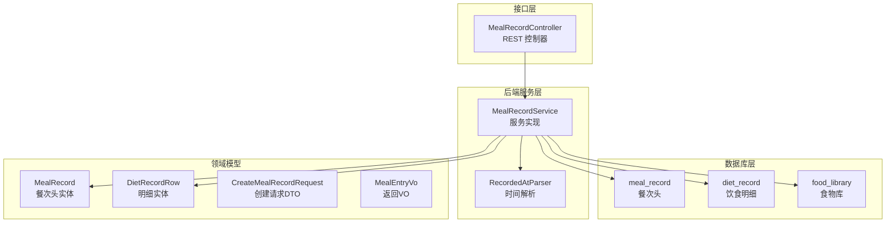
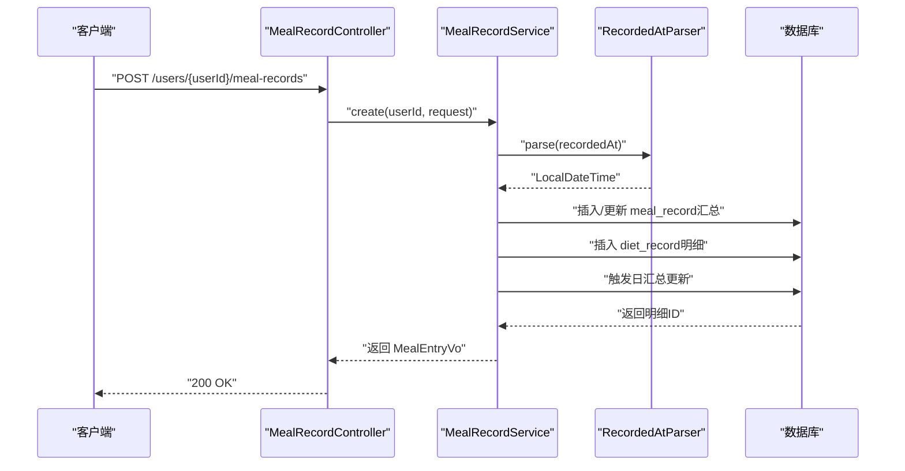
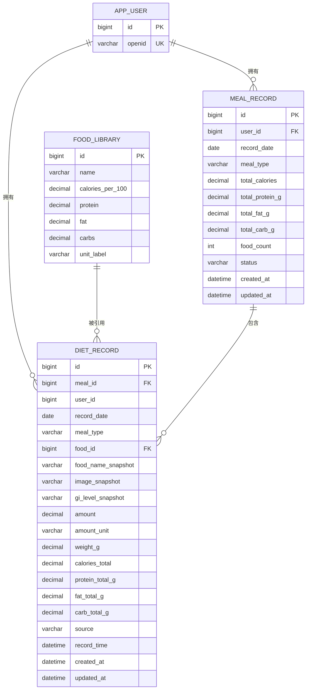
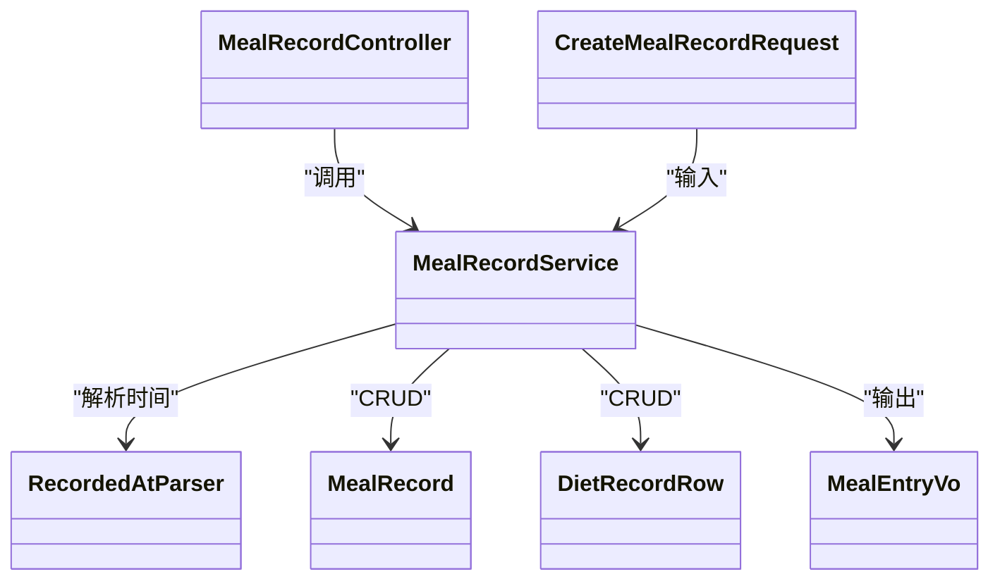

# 饮食记录表设计

<cite>
**本文引用的文件**
- [01_schema.sql](file://database/01_schema.sql)
- [V007__create_meal_record_and_diet_record.sql](file://database/migrations/V007__create_meal_record_and_diet_record.sql)
- [MealRecord.java](file://backend/src/main/java/com/ypfr/loseweight/domain/MealRecord.java)
- [DietRecordRow.java](file://backend/src/main/java/com/ypfr/loseweight/domain/DietRecordRow.java)
- [MealRecordService.java](file://backend/src/main/java/com/ypfr/loseweight/service/MealRecordService.java)
- [CreateMealRecordRequest.java](file://backend/src/main/java/com/ypfr/loseweight/web/dto/CreateMealRecordRequest.java)
- [MealEntryVo.java](file://backend/src/main/java/com/ypfr/loseweight/web/dto/MealEntryVo.java)
- [RecordedAtParser.java](file://backend/src/main/java/com/ypfr/loseweight/util/RecordedAtParser.java)
- [MealRecordController.java](file://backend/src/main/java/com/ypfr/loseweight/web/MealRecordController.java)
- [MealRecommendedMealTypeUtil.java](file://backend/src/main/java/com/ypfr/loseweight/service/photograph/MealRecommendedMealTypeUtil.java)
</cite>

## 目录
1. [简介](#简介)
2. [项目结构](#项目结构)
3. [核心组件](#核心组件)
4. [架构总览](#架构总览)
5. [详细组件分析](#详细组件分析)
6. [依赖关系分析](#依赖关系分析)
7. [性能考量](#性能考量)
8. [故障排查指南](#故障排查指南)
9. [结论](#结论)
10. [附录](#附录)

## 简介
本文件围绕“饮食记录”相关表结构进行系统化梳理，重点解释以下方面：
- 行式设计（单条食物一行）的业务原理与优势
- meal_type 字段的枚举设计与业务含义
- 营养素字段 protein_g、fat_g、carbs_g 的存储策略与精度控制
- amount_value 与 amount_unit 如何支持灵活计量单位
- recorded_at 时间字段的精度与时区处理
- food_library_id 外键关联的设计思路与一致性保障
- 索引优化策略、查询性能与大数据量扩展性
- 饮食记录表结构图与典型业务场景示例

## 项目结构
本次文档聚焦于数据库表与后端领域模型、服务层与接口层之间的映射关系，以及与拍照识别、餐别推荐等业务模块的交互。

图表来源
- [01_schema.sql:36-54](file://database/01_schema.sql#L36-L54)
- [V007__create_meal_record_and_diet_record.sql:10-55](file://database/migrations/V007__create_meal_record_and_diet_record.sql#L10-L55)
- [MealRecordService.java:28-48](file://backend/src/main/java/com/ypfr/loseweight/service/MealRecordService.java#L28-L48)
- [RecordedAtParser.java:8-31](file://backend/src/main/java/com/ypfr/loseweight/util/RecordedAtParser.java#L8-L31)
- [MealRecordController.java:17-60](file://backend/src/main/java/com/ypfr/loseweight/web/MealRecordController.java#L17-L60)
- [MealRecord.java:10-27](file://backend/src/main/java/com/ypfr/loseweight/domain/MealRecord.java#L10-L27)
- [DietRecordRow.java:10-34](file://backend/src/main/java/com/ypfr/loseweight/domain/DietRecordRow.java#L10-L34)

章节来源
- [01_schema.sql:36-54](file://database/01_schema.sql#L36-L54)
- [V007__create_meal_record_and_diet_record.sql:10-55](file://database/migrations/V007__create_meal_record_and_diet_record.sql#L10-L55)

## 核心组件
- 饮食记录表（meal_record）：用于记录“餐次头”，包含日期、餐别、总热量与宏量营养素汇总、记录时间戳等。
- 明细记录表（diet_record）：用于记录“单条食物”的具体摄入，包含食物快照、份量、单位、热量与宏量营养素明细、来源标记等。
- 食物库（food_library）：提供标准化食物的热量与宏量营养素基准，支撑自动换算与一致性校验。
- 服务层（MealRecordService）：负责业务编排、校验、营养计算、头表与明细联动更新、日汇总触发等。
- 接口层（MealRecordController）：暴露创建、批量追加、删除等 REST 接口。
- 工具类（RecordedAtParser）：统一解析 recorded_at 字符串，支持 ISO 本地时间与传统格式。
- 餐别推荐（MealRecommendedMealTypeUtil）：基于时间的默认餐别推荐逻辑。

章节来源
- [MealRecord.java:10-27](file://backend/src/main/java/com/ypfr/loseweight/domain/MealRecord.java#L10-L27)
- [DietRecordRow.java:10-34](file://backend/src/main/java/com/ypfr/loseweight/domain/DietRecordRow.java#L10-L34)
- [MealRecordService.java:28-48](file://backend/src/main/java/com/ypfr/loseweight/service/MealRecordService.java#L28-L48)
- [CreateMealRecordRequest.java:5-17](file://backend/src/main/java/com/ypfr/loseweight/web/dto/CreateMealRecordRequest.java#L5-L17)
- [MealEntryVo.java:6-21](file://backend/src/main/java/com/ypfr/loseweight/web/dto/MealEntryVo.java#L6-L21)
- [RecordedAtParser.java:8-31](file://backend/src/main/java/com/ypfr/loseweight/util/RecordedAtParser.java#L8-L31)
- [MealRecommendedMealTypeUtil.java:6-25](file://backend/src/main/java/com/ypfr/loseweight/service/photograph/MealRecommendedMealTypeUtil.java#L6-L25)

## 架构总览
下图展示从接口到数据库的完整调用链路与数据流向，体现“单条食物一行”的明细设计如何支撑时间线与聚合统计。

图表来源
- [MealRecordController.java:30-37](file://backend/src/main/java/com/ypfr/loseweight/web/MealRecordController.java#L30-L37)
- [MealRecordService.java:50-114](file://backend/src/main/java/com/ypfr/loseweight/service/MealRecordService.java#L50-L114)
- [RecordedAtParser.java:15-30](file://backend/src/main/java/com/ypfr/loseweight/util/RecordedAtParser.java#L15-L30)
- [01_schema.sql:36-54](file://database/01_schema.sql#L36-L54)

## 详细组件分析

### 表结构与字段设计

- 饮食记录表（meal_record）
  - 主键：自增 id
  - 用户维度：user_id 外键关联 app_user
  - 餐别：meal_type（枚举值 breakfast/lunch/dinner/snack）
  - 汇总指标：total_calories、total_protein_g、total_fat_g、total_carb_g
  - 记录时间：recorded_at（DATETIME），用于排序与统计
  - 索引：(user_id, recorded_at)，支持按用户与时间快速检索
  - 外键约束：指向 app_user(id)

- 明细记录表（diet_record）
  - 主键：自增 id
  - 关联：meal_id（指向 meal_record.id），user_id（冗余字段便于查询）
  - 餐别与日期：meal_type、record_date
  - 食物快照：food_id（可选）、food_name_snapshot、image_snapshot、gi_level_snapshot
  - 份量与单位：amount、amount_unit
  - 热量与宏量：calories_total、protein_total_g、fat_total_g、carb_total_g
  - 来源：source（search/custom/photo/manual）
  - 记录时间：record_time（DATETIME）
  - 索引：idx_diet_meal、idx_diet_user_date

- 食物库（food_library）
  - 标准化营养：calories_per_100、protein、fat、carbs
  - 单位标签：unit_label
  - 支撑按 100g 或标准单位进行换算

章节来源
- [01_schema.sql:36-54](file://database/01_schema.sql#L36-L54)
- [V007__create_meal_record_and_diet_record.sql:10-55](file://database/migrations/V007__create_meal_record_and_diet_record.sql#L10-L55)
- [01_schema.sql:84-96](file://database/01_schema.sql#L84-L96)

### 行式设计的业务原理与优势
- 优势
  - 时间线清晰：每条食物一行，天然支持按时间顺序展示与回溯
  - 细粒度统计：便于按餐别、按食物、按来源等多维聚合
  - 可追溯性强：保留食物快照与来源标记，便于审计与修正
  - 扩展灵活：新增食物、修改份量、替换食物库均可独立变更
- 与“头-明细”模式对比
  - 本项目采用“单条食物一行”的明细表（diet_record）作为事实表，meal_record 仅做汇总与状态管理，有利于高并发写入与低锁争用

章节来源
- [MealRecordService.java:50-114](file://backend/src/main/java/com/ypfr/loseweight/service/MealRecordService.java#L50-L114)
- [V007__create_meal_record_and_diet_record.sql:28-55](file://database/migrations/V007__create_meal_record_and_diet_record.sql#L28-L55)

### meal_type 枚举设计与业务含义
- 枚举集合：breakfast、lunch、dinner、snack
- 设计意图
  - 与日常作息对齐，便于日汇总与周统计口径统一
  - 支持拍照识别默认餐别推荐（基于时间区间）
- 默认推荐逻辑
  - 依据当前时间小时数划分区间并返回对应餐别

章节来源
- [MealRecordService.java:31-32](file://backend/src/main/java/com/ypfr/loseweight/service/MealRecordService.java#L31-L32)
- [MealRecommendedMealTypeUtil.java:10-25](file://backend/src/main/java/com/ypfr/loseweight/service/photograph/MealRecommendedMealTypeUtil.java#L10-L25)

### 营养成分字段存储策略与精度
- 字段：protein_g、fat_g、carbs_g（meal_record）与 protein_total_g、fat_total_g、carb_total_g（diet_record）
- 精度：DECIMAL(8,2) 或 DECIMAL(12,2)，满足常见食材的十倍以上精度需求
- 存储策略
  - 明细层：按份量与食物库营养密度精确换算，保留两位小数
  - 汇总层：对明细求和，同样保留两位小数，确保与明细一致
- 精度控制要点
  - 使用统一的舍入模式（HALF_UP），避免累积误差
  - 若食物库未提供宏量，则允许明细层显式传入，作为兜底

章节来源
- [01_schema.sql:43-45](file://database/01_schema.sql#L43-L45)
- [V007__create_meal_record_and_diet_record.sql:16-18](file://database/migrations/V007__create_meal_record_and_diet_record.sql#L16-L18)
- [MealRecordService.java:262-335](file://backend/src/main/java/com/ypfr/loseweight/service/MealRecordService.java#L262-L335)

### amount_value 与 amount_unit 的灵活计量
- amount_value：以 DECIMAL(10,2) 存储，支持小数份量（如 0.5、1.25）
- amount_unit：VARCHAR(16)，支持 g、ml、份、杯、个 等单位
- 换算逻辑
  - 若单位为 g 或 克：直接以重量换算
  - 若单位为标准单位：按食物库标准重量（standard_weight_g）换算
  - 若均不可得：以传入的每单位热量（calories_per_unit）直接乘以数量
- 默认行为
  - 若未传单位，优先使用食物库的 unit_name 作为单位标签

章节来源
- [01_schema.sql:46-47](file://database/01_schema.sql#L46-L47)
- [V007__create_meal_record_and_diet_record.sql:38-40](file://database/migrations/V007__create_meal_record_and_diet_record.sql#L38-L40)
- [MealRecordService.java:262-310](file://backend/src/main/java/com/ypfr/loseweight/service/MealRecordService.java#L262-L310)

### recorded_at 的时间精度与时区处理
- 字段类型：DATETIME（不含时区）
- 解析策略：RecordedAtParser 支持 ISO 本地时间字符串与传统格式，统一转换为 LocalDateTime
- 业务约定
  - 服务层将 recorded_at 解析为本地时间，随后拆分为 record_date 与 record_time
  - 日汇总与查询按 record_date 聚合，按 record_time 排序
- 时区建议
  - 建议在应用层统一使用系统默认时区或 UTC，避免跨时区显示差异

章节来源
- [RecordedAtParser.java:15-30](file://backend/src/main/java/com/ypfr/loseweight/util/RecordedAtParser.java#L15-L30)
- [MealRecordService.java:60-61](file://backend/src/main/java/com/ypfr/loseweight/service/MealRecordService.java#L60-L61)
- [V007__create_meal_record_and_diet_record.sql:46-46](file://database/migrations/V007__create_meal_record_and_diet_record.sql#L46-L46)

### food_library_id 外键关联与一致性
- 关联关系
  - diet_record.food_id → food_library.id
  - meal_record.user_id → app_user.id
- 一致性保障
  - 插入明细时若传入 food_id，需确保存在且有效
  - 删除明细后若无剩余明细，同步删除对应的 meal_record
  - 批量追加时统一校验每条食物的存在性
- 数据质量
  - 食物库提供标准化营养密度，减少人工输入误差
  - 明细层保留 food_name_snapshot、image_snapshot、gi_level_snapshot，便于审计与复核

章节来源
- [V007__create_meal_record_and_diet_record.sql:52-54](file://database/migrations/V007__create_meal_record_and_diet_record.sql#L52-L54)
- [01_schema.sql:53-53](file://database/01_schema.sql#L53-L53)
- [MealRecordService.java:155-158](file://backend/src/main/java/com/ypfr/loseweight/service/MealRecordService.java#L155-L158)
- [MealRecordService.java:346-370](file://backend/src/main/java/com/ypfr/loseweight/service/MealRecordService.java#L346-L370)

### 表结构图

图表来源
- [01_schema.sql:11-34](file://database/01_schema.sql#L11-L34)
- [01_schema.sql:36-54](file://database/01_schema.sql#L36-L54)
- [01_schema.sql:84-96](file://database/01_schema.sql#L84-L96)
- [V007__create_meal_record_and_diet_record.sql:10-55](file://database/migrations/V007__create_meal_record_and_diet_record.sql#L10-L55)

## 依赖关系分析
- 控制器 → 服务层：暴露 REST 接口，参数鉴权与路径用户校验
- 服务层 → 工具类：解析 recorded_at，统一时间格式
- 服务层 → Mapper/Domain：操作 meal_record、diet_record、food_library
- 服务层 → 日汇总服务：每次变更后触发日汇总更新
- 服务层 → 餐别推荐：拍照识别场景下提供默认餐别建议

图表来源
- [MealRecordController.java:17-60](file://backend/src/main/java/com/ypfr/loseweight/web/MealRecordController.java#L17-L60)
- [MealRecordService.java:28-48](file://backend/src/main/java/com/ypfr/loseweight/service/MealRecordService.java#L28-L48)
- [RecordedAtParser.java:8-31](file://backend/src/main/java/com/ypfr/loseweight/util/RecordedAtParser.java#L8-L31)
- [MealRecord.java:10-27](file://backend/src/main/java/com/ypfr/loseweight/domain/MealRecord.java#L10-L27)
- [DietRecordRow.java:10-34](file://backend/src/main/java/com/ypfr/loseweight/domain/DietRecordRow.java#L10-L34)
- [CreateMealRecordRequest.java:5-17](file://backend/src/main/java/com/ypfr/loseweight/web/dto/CreateMealRecordRequest.java#L5-L17)
- [MealEntryVo.java:6-21](file://backend/src/main/java/com/ypfr/loseweight/web/dto/MealEntryVo.java#L6-L21)

## 性能考量
- 索引策略
  - meal_record：(user_id, recorded_at) 用于按用户与时间快速检索
  - diet_record：idx_diet_user_date（user_id, record_date）用于日级查询
  - idx_diet_meal（meal_id）用于按餐次聚合
- 写入性能
  - 明细表单条写入，避免头表频繁更新，降低锁竞争
  - 批量追加时一次性插入多条明细，减少往返
- 读取性能
  - 按用户+日期+餐别组合查询，利用复合索引
  - 分页与排序基于 record_time，避免全表扫描
- 大数据量扩展
  - 建议按月/按用户分表或分区（视业务规模与运维能力）
  - 异步化日汇总任务，避免阻塞主写入路径
  - 缓存热点用户的当日汇总结果

章节来源
- [01_schema.sql:52-52](file://database/01_schema.sql#L52-L52)
- [V007__create_meal_record_and_diet_record.sql:51-51](file://database/migrations/V007__create_meal_record_and_diet_record.sql#L51-L51)
- [MealRecordService.java:119-219](file://backend/src/main/java/com/ypfr/loseweight/service/MealRecordService.java#L119-L219)

## 故障排查指南
- 常见错误与定位
  - meal_type 非法：确认是否为 breakfast/lunch/dinner/snack
  - recorded_at 格式不合法：检查 ISO 本地时间或 yyyy-MM-dd HH:mm:ss
  - 食物库 ID 不存在：确认 food_id 是否有效
  - 份量单位与重量换算异常：检查 amount_unit 与食物库标准单位
- 定位手段
  - 查看接口返回的错误码与提示
  - 核对 diet_record 中的 amount、amount_unit、weight_g、record_time
  - 检查 meal_record 的 total_* 汇总是否与明细一致
- 修复建议
  - 修正请求参数（meal_type、recorded_at、food_id、amount_value/unit）
  - 在食物库补充缺失的营养密度或标准单位
  - 对历史数据执行重新计算与汇总

章节来源
- [MealRecordService.java:54-58](file://backend/src/main/java/com/ypfr/loseweight/service/MealRecordService.java#L54-L58)
- [RecordedAtParser.java:15-29](file://backend/src/main/java/com/ypfr/loseweight/util/RecordedAtParser.java#L15-L29)
- [MealRecordService.java:152-158](file://backend/src/main/java/com/ypfr/loseweight/service/MealRecordService.java#L152-L158)
- [MealRecordService.java:262-310](file://backend/src/main/java/com/ypfr/loseweight/service/MealRecordService.java#L262-L310)

## 结论
本设计通过“单条食物一行”的明细表结构，实现了高并发写入、强时间线与强可追溯性的饮食记录体系。meal_type 枚举与餐别推荐逻辑贴合用户习惯；amount_value 与 amount_unit 的灵活设计覆盖多单位场景；营养成分字段采用 DECIMAL(8,2)/DECIMAL(12,2) 精度控制，确保计算稳定；索引与服务层编排兼顾查询效率与一致性。配合异步日汇总与缓存策略，可在大数据量下保持良好性能。

## 附录

### 典型业务场景示例
- 场景一：手动录入
  - 输入：meal_type、food_name、amount_value、amount_unit、recorded_at、food_library_id（可选）
  - 流程：解析时间 → 计算营养 → 写入明细 → 更新头表汇总 → 触发日汇总
- 场景二：批量追加
  - 输入：record_date、meal_type、items（每项含 food_id、amount_value、amount_unit、recordedAt）
  - 流程：校验日期与餐别 → 逐条换算 → 写入明细 → 重算头表 → 触发日汇总
- 场景三：删除明细
  - 流程：删除明细 → 若无剩余明细则删除头表 → 重算头表 → 触发日汇总

章节来源
- [CreateMealRecordRequest.java:5-17](file://backend/src/main/java/com/ypfr/loseweight/web/dto/CreateMealRecordRequest.java#L5-L17)
- [MealRecordService.java:50-114](file://backend/src/main/java/com/ypfr/loseweight/service/MealRecordService.java#L50-L114)
- [MealRecordService.java:119-219](file://backend/src/main/java/com/ypfr/loseweight/service/MealRecordService.java#L119-L219)
- [MealRecordService.java:346-370](file://backend/src/main/java/com/ypfr/loseweight/service/MealRecordService.java#L346-L370)