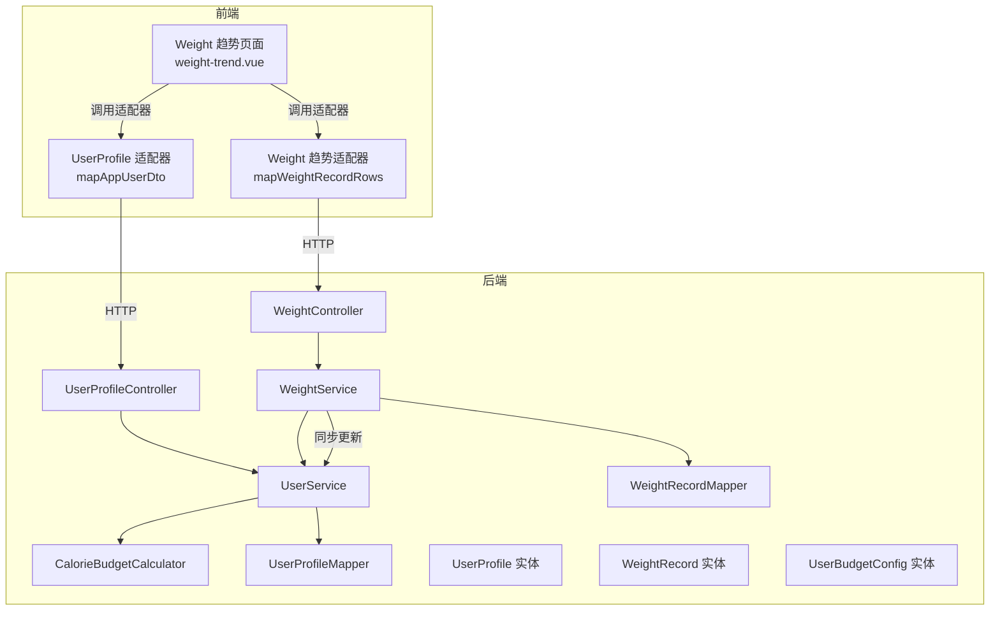
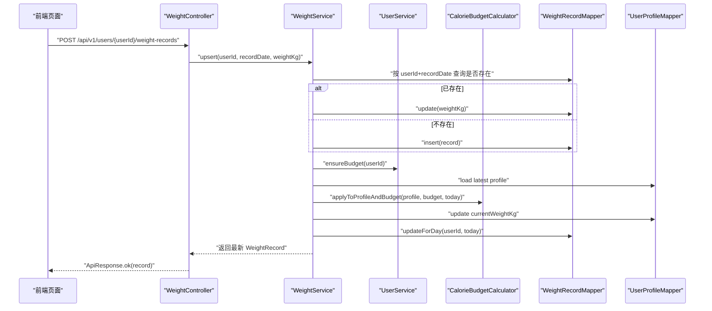
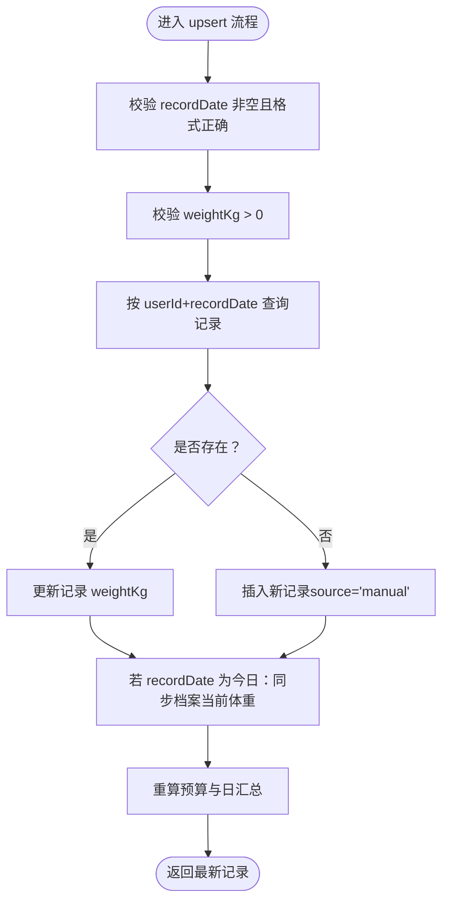
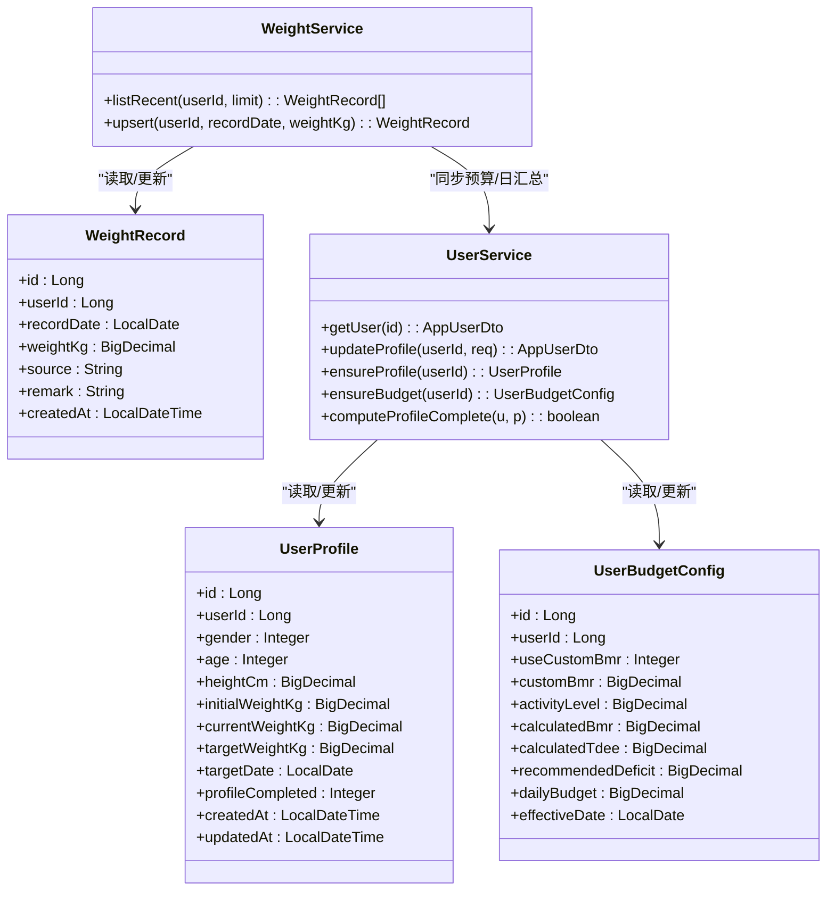
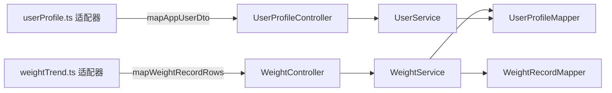

# 健康档案管理

<cite>
**本文引用的文件**
- [UserProfile.java](file://backend/src/main/java/com/ypfr/loseweight/domain/UserProfile.java)
- [WeightRecord.java](file://backend/src/main/java/com/ypfr/loseweight/domain/WeightRecord.java)
- [UserBudgetConfig.java](file://backend/src/main/java/com/ypfr/loseweight/domain/UserBudgetConfig.java)
- [UserProfileController.java](file://backend/src/main/java/com/ypfr/loseweight/web/UserProfileController.java)
- [WeightController.java](file://backend/src/main/java/com/ypfr/loseweight/web/WeightController.java)
- [WeightService.java](file://backend/src/main/java/com/ypfr/loseweight/service/WeightService.java)
- [UserService.java](file://backend/src/main/java/com/ypfr/loseweight/service/UserService.java)
- [CalorieBudgetCalculator.java](file://backend/src/main/java/com/ypfr/loseweight/service/CalorieBudgetCalculator.java)
- [UserProfileMapper.java](file://backend/src/main/java/com/ypfr/loseweight/mapper/UserProfileMapper.java)
- [WeightRecordMapper.java](file://backend/src/main/java/com/ypfr/loseweight/mapper/WeightRecordMapper.java)
- [UpdateProfileRequest.java](file://backend/src/main/java/com/ypfr/loseweight/web/dto/UpdateProfileRequest.java)
- [WeightUpsertRequest.java](file://backend/src/main/java/com/ypfr/loseweight/web/dto/WeightUpsertRequest.java)
- [userProfile.ts（前端适配器）](file://frontend/src/api/adapters/userProfile.ts)
- [weightTrend.ts（前端适配器）](file://frontend/src/api/adapters/weightTrend.ts)
- [weight-trend.vue（前端页面）](file://frontend/src/pages/user/weight-trend.vue)
</cite>

## 目录
1. [简介](#简介)
2. [项目结构](#项目结构)
3. [核心组件](#核心组件)
4. [架构总览](#架构总览)
5. [详细组件分析](#详细组件分析)
6. [依赖分析](#依赖分析)
7. [性能考虑](#性能考虑)
8. [故障排查指南](#故障排查指南)
9. [结论](#结论)
10. [附录](#附录)

## 简介
本文件面向“健康档案管理系统”的实现文档，聚焦以下能力：
- 用户基本信息管理：身高、体重、年龄、性别录入与更新
- 体重记录管理：体重测量、历史趋势展示、目标设定联动
- 用户档案聚合：profile 数据模型、数据完整性检查与预算计算
- 领域模型与调用关系：从接口到服务层、持久层的数据流
- 配置项、参数与返回值：来自实际代码库的约束与取值范围
- 与其他模块的关系：与日汇总、周统计、宏量营养素预算的联动
- 常见问题与优化策略：存储、更新与查询层面的建议

## 项目结构
后端采用分层架构：Web 控制器 → 业务服务 → Mapper 持久层；前端通过适配器统一 DTO 类型，页面组件消费数据。

图表来源
- [UserProfileController.java:57-78](file://backend/src/main/java/com/ypfr/loseweight/web/UserProfileController.java#L57-L78)
- [WeightController.java:26-37](file://backend/src/main/java/com/ypfr/loseweight/web/WeightController.java#L26-L37)
- [UserService.java:75-164](file://backend/src/main/java/com/ypfr/loseweight/service/UserService.java#L75-L164)
- [WeightService.java:39-107](file://backend/src/main/java/com/ypfr/loseweight/service/WeightService.java#L39-L107)
- [CalorieBudgetCalculator.java:67-140](file://backend/src/main/java/com/ypfr/loseweight/service/CalorieBudgetCalculator.java#L67-L140)
- [UserProfileMapper.java:1-9](file://backend/src/main/java/com/ypfr/loseweight/mapper/UserProfileMapper.java#L1-L9)
- [WeightRecordMapper.java:1-9](file://backend/src/main/java/com/ypfr/loseweight/mapper/WeightRecordMapper.java#L1-L9)
- [userProfile.ts（前端适配器）:12-41](file://frontend/src/api/adapters/userProfile.ts#L12-L41)
- [weightTrend.ts（前端适配器）:23-46](file://frontend/src/api/adapters/weightTrend.ts#L23-L46)
- [weight-trend.vue（前端页面）:191-283](file://frontend/src/pages/user/weight-trend.vue#L191-L283)

章节来源
- [UserProfileController.java:1-90](file://backend/src/main/java/com/ypfr/loseweight/web/UserProfileController.java#L1-L90)
- [WeightController.java:1-39](file://backend/src/main/java/com/ypfr/loseweight/web/WeightController.java#L1-L39)
- [UserService.java:1-319](file://backend/src/main/java/com/ypfr/loseweight/service/UserService.java#L1-L319)
- [WeightService.java:1-109](file://backend/src/main/java/com/ypfr/loseweight/service/WeightService.java#L1-L109)
- [userProfile.ts（前端适配器）:1-42](file://frontend/src/api/adapters/userProfile.ts#L1-L42)
- [weightTrend.ts（前端适配器）:1-47](file://frontend/src/api/adapters/weightTrend.ts#L1-L47)
- [weight-trend.vue（前端页面）:191-283](file://frontend/src/pages/user/weight-trend.vue#L191-L283)

## 核心组件
- 用户档案实体（UserProfile）：承载用户基本信息与目标体重、目标日期、初始体重、当前体重等字段，并维护 profile 完成度标记。
- 体重记录实体（WeightRecord）：记录某日体重，支持来源与备注，用于趋势分析。
- 用户预算配置（UserBudgetConfig）：承载活动系数、BMR/TDEE、推荐减重缺口、日预算等，与 UserProfile 协作进行预算计算。
- 用户信息服务（UserService）：负责用户档案读取、更新、预算初始化与计算、档案完整性校验、聚合 DTO 输出。
- 体重服务（WeightService）：负责体重记录的增删改查、同日体重变更对档案与预算的同步更新。
- 控制器层：UserProfileController 与 WeightController 提供 REST 接口，完成鉴权、参数校验与响应封装。

章节来源
- [UserProfile.java:1-124](file://backend/src/main/java/com/ypfr/loseweight/domain/UserProfile.java#L1-L124)
- [WeightRecord.java:1-79](file://backend/src/main/java/com/ypfr/loseweight/domain/WeightRecord.java#L1-L79)
- [UserBudgetConfig.java:51-108](file://backend/src/main/java/com/ypfr/loseweight/domain/UserBudgetConfig.java#L51-L108)
- [UserService.java:75-164](file://backend/src/main/java/com/ypfr/loseweight/service/UserService.java#L75-L164)
- [WeightService.java:39-107](file://backend/src/main/java/com/ypfr/loseweight/service/WeightService.java#L39-L107)

## 架构总览
下图展示从接口到服务与持久层的调用链路，以及体重变更对档案与预算的联动。

图表来源
- [WeightController.java:32-37](file://backend/src/main/java/com/ypfr/loseweight/web/WeightController.java#L32-L37)
- [WeightService.java:47-107](file://backend/src/main/java/com/ypfr/loseweight/service/WeightService.java#L47-L107)
- [UserService.java:66-73](file://backend/src/main/java/com/ypfr/loseweight/service/UserService.java#L66-L73)
- [CalorieBudgetCalculator.java:67-140](file://backend/src/main/java/com/ypfr/loseweight/service/CalorieBudgetCalculator.java#L67-L140)
- [WeightRecordMapper.java:1-9](file://backend/src/main/java/com/ypfr/loseweight/mapper/WeightRecordMapper.java#L1-L9)
- [UserProfileMapper.java:1-9](file://backend/src/main/java/com/ypfr/loseweight/mapper/UserProfileMapper.java#L1-L9)

## 详细组件分析

### 用户基本信息管理（身高、体重、年龄、性别录入）
- 接口与请求体
  - 接口路径：/api/v1/user/profile/update
  - 请求体字段：昵称、头像（base64）、性别、年龄、身高、当前体重、目标体重、初始体重、目标日期、活动系数档位（1-5）、是否使用自定义BMR、自定义BMR（kcal）
  - 参数校验：性别必须为 0/1/2；年龄、身高、当前体重、目标体重需大于 0；目标日期格式为 yyyy-MM-dd；自定义BMR仅在 useCustomBmr=1 时有效且 > 0
- 更新流程
  - 服务层确保用户档案与预算配置存在，按请求体字段选择性更新
  - 若此前未填写初始体重，且满足条件则自动补填为当前体重
  - 重新计算 BMR/TDEE/日预算，并更新档案完成度标记
  - 返回聚合后的 AppUserDto，包含 BMI 解释、活动等级、目标达成等信息
- 数据完整性检查
  - 档案完成度由工具方法判定：昵称非空、性别合法、年龄>0、身高>0、当前体重>0、目标体重>0、目标日期非空
- 与预算联动
  - 活动系数档位映射为小数存库，支持自定义BMR覆盖系统计算

章节来源
- [UserProfileController.java:64-78](file://backend/src/main/java/com/ypfr/loseweight/web/UserProfileController.java#L64-L78)
- [UpdateProfileRequest.java:1-121](file://backend/src/main/java/com/ypfr/loseweight/web/dto/UpdateProfileRequest.java#L1-L121)
- [UserService.java:75-164](file://backend/src/main/java/com/ypfr/loseweight/service/UserService.java#L75-L164)
- [UserService.java:195-218](file://backend/src/main/java/com/ypfr/loseweight/service/UserService.java#L195-L218)
- [CalorieBudgetCalculator.java:38-62](file://backend/src/main/java/com/ypfr/loseweight/service/CalorieBudgetCalculator.java#L38-L62)

### 体重记录管理（体重测量、趋势分析、目标设定）
- 接口与请求体
  - 获取近期体重记录：GET /api/v1/users/{userId}/weight-records?limit=N（上限 200）
  - 新增/更新体重：POST /api/v1/users/{userId}/weight-records
  - 请求体字段：recordDate（yyyy-MM-dd）、weightKg
- 业务逻辑
  - 校验日期格式与体重数值有效性
  - 按 userId+recordDate 去重，存在则更新，否则新增
  - 若记录日期为当天，则同步更新档案当前体重，并触发预算重算与当日日汇总刷新
- 趋势分析与前端展示
  - 前端适配器将后端列表转换为标准化 WeightRecordRow，过滤非法数据
  - 页面根据最近记录与档案初始/目标体重计算累计减重、更新时间提示、Y 轴范围等

图表来源
- [WeightController.java:26-37](file://backend/src/main/java/com/ypfr/loseweight/web/WeightController.java#L26-L37)
- [WeightService.java:47-79](file://backend/src/main/java/com/ypfr/loseweight/service/WeightService.java#L47-L79)
- [WeightService.java:81-107](file://backend/src/main/java/com/ypfr/loseweight/service/WeightService.java#L81-L107)

章节来源
- [WeightController.java:1-39](file://backend/src/main/java/com/ypfr/loseweight/web/WeightController.java#L1-L39)
- [WeightUpsertRequest.java:1-27](file://backend/src/main/java/com/ypfr/loseweight/web/dto/WeightUpsertRequest.java#L1-L27)
- [WeightService.java:39-107](file://backend/src/main/java/com/ypfr/loseweight/service/WeightService.java#L39-L107)
- [weightTrend.ts（前端适配器）:23-46](file://frontend/src/api/adapters/weightTrend.ts#L23-L46)
- [weight-trend.vue（前端页面）:191-283](file://frontend/src/pages/user/weight-trend.vue#L191-L283)

### 用户档案聚合（profile 数据模型、数据完整性检查）
- 数据模型
  - UserProfile：用户基本信息、目标/初始/当前体重、目标日期、完成度标记、创建/更新时间
  - UserBudgetConfig：活动系数、BMR/TDEE、推荐减重缺口、日预算、是否使用自定义BMR及自定义BMR值
  - WeightRecord：体重记录（日期、体重、来源、备注、创建时间）
- 档案聚合输出
  - UserService 将 LoseWeightUser、UserProfile、UserBudgetConfig 聚合成 AppUserDto，补充 BMI 解释、活动等级、目标达成状态、统计指标等
- 数据完整性检查
  - 计算 profileCompleted 的规则：昵称非空、性别合法、年龄>0、身高>0、当前体重>0、目标体重>0、目标日期非空
- 预算计算
  - 使用 Mifflin-St Jeor 公式计算 BMR，乘以活动系数得到 TDEE
  - 若设置目标体重与目标日期，则按公式估算每日缺口与日预算，限制在合理区间

图表来源
- [UserProfile.java:1-124](file://backend/src/main/java/com/ypfr/loseweight/domain/UserProfile.java#L1-L124)
- [UserBudgetConfig.java:51-108](file://backend/src/main/java/com/ypfr/loseweight/domain/UserBudgetConfig.java#L51-L108)
- [WeightRecord.java:1-79](file://backend/src/main/java/com/ypfr/loseweight/domain/WeightRecord.java#L1-L79)
- [UserService.java:56-164](file://backend/src/main/java/com/ypfr/loseweight/service/UserService.java#L56-L164)
- [WeightService.java:39-79](file://backend/src/main/java/com/ypfr/loseweight/service/WeightService.java#L39-L79)

章节来源
- [UserProfile.java:1-124](file://backend/src/main/java/com/ypfr/loseweight/domain/UserProfile.java#L1-L124)
- [UserBudgetConfig.java:51-108](file://backend/src/main/java/com/ypfr/loseweight/domain/UserBudgetConfig.java#L51-L108)
- [WeightRecord.java:1-79](file://backend/src/main/java/com/ypfr/loseweight/domain/WeightRecord.java#L1-L79)
- [UserService.java:220-264](file://backend/src/main/java/com/ypfr/loseweight/service/UserService.java#L220-L264)
- [UserService.java:195-218](file://backend/src/main/java/com/ypfr/loseweight/service/UserService.java#L195-L218)
- [CalorieBudgetCalculator.java:67-140](file://backend/src/main/java/com/ypfr/loseweight/service/CalorieBudgetCalculator.java#L67-L140)

## 依赖分析
- 控制器依赖注入：UserProfileController 与 WeightController 分别注入 JwtService、UserService、WechatAuthService、DailySummaryService、WeightService
- 服务层依赖注入：WeightService 注入 WeightRecordMapper、UserProfileMapper、UserBudgetConfigMapper、UserService、DailySummaryService
- Mapper 接口：UserProfileMapper、WeightRecordMapper 继承 MyBatis 基类，提供标准 CRUD
- 前端适配器：统一将后端返回的数值/字符串转换为前端期望的数字类型，处理空值与非法输入

图表来源
- [UserProfileController.java:34-48](file://backend/src/main/java/com/ypfr/loseweight/web/UserProfileController.java#L34-L48)
- [WeightController.java:20-24](file://backend/src/main/java/com/ypfr/loseweight/web/WeightController.java#L20-L24)
- [WeightService.java:20-37](file://backend/src/main/java/com/ypfr/loseweight/service/WeightService.java#L20-L37)
- [UserService.java:28-54](file://backend/src/main/java/com/ypfr/loseweight/service/UserService.java#L28-L54)
- [userProfile.ts（前端适配器）:12-41](file://frontend/src/api/adapters/userProfile.ts#L12-L41)
- [weightTrend.ts（前端适配器）:23-46](file://frontend/src/api/adapters/weightTrend.ts#L23-L46)

章节来源
- [UserProfileController.java:1-90](file://backend/src/main/java/com/ypfr/loseweight/web/UserProfileController.java#L1-L90)
- [WeightController.java:1-39](file://backend/src/main/java/com/ypfr/loseweight/web/WeightController.java#L1-L39)
- [WeightService.java:1-109](file://backend/src/main/java/com/ypfr/loseweight/service/WeightService.java#L1-L109)
- [UserService.java:1-319](file://backend/src/main/java/com/ypfr/loseweight/service/UserService.java#L1-L319)
- [userProfile.ts（前端适配器）:1-42](file://frontend/src/api/adapters/userProfile.ts#L1-L42)
- [weightTrend.ts（前端适配器）:1-47](file://frontend/src/api/adapters/weightTrend.ts#L1-L47)

## 性能考虑
- 查询优化
  - 体重记录按日期倒序并限制数量，避免全表扫描；建议在 userId、recordDate 上建立联合索引以加速 upsert 去重查询
  - 档案与预算加载使用“按日期倒序+主键倒序”的复合排序，确保稳定取最新配置
- 写入优化
  - 同日体重更新仅在当日触发一次预算重算与日汇总刷新，减少重复计算
  - 批量操作建议通过批量接口（如批量体重记录）降低往返次数
- 计算优化
  - 预算计算为纯内存计算，复杂度低；建议缓存常用用户预算结果（如短期内多次读取）
- 前端渲染
  - 适配器对非法数据进行过滤，避免渲染异常；页面按需加载最近 N 日记录，控制图表数据规模

## 故障排查指南
- 常见错误与定位
  - 参数校验失败：recordDate 必填且格式为 yyyy-MM-dd；weightKg 必须 > 0；目标日期格式无效；自定义BMR需 > 0
  - 用户不存在：读取用户或档案时返回 404
  - 权限不足：缺少 Authorization 或令牌无效，返回 401
- 处理建议
  - 在控制器层捕获并抛出明确的异常信息，便于前端提示
  - 对于当日体重变更导致的日汇总刷新异常，服务层已吞掉异常并记录告警，不影响主流程
- 前端适配
  - 适配器对数值进行严格校验与转换，避免 NaN/无穷大进入图表
  - 页面在无记录时提供降级展示，提升用户体验

章节来源
- [WeightService.java:47-59](file://backend/src/main/java/com/ypfr/loseweight/service/WeightService.java#L47-L59)
- [WeightService.java:103-107](file://backend/src/main/java/com/ypfr/loseweight/service/WeightService.java#L103-L107)
- [UserProfileController.java:50-55](file://backend/src/main/java/com/ypfr/loseweight/web/UserProfileController.java#L50-L55)
- [UserService.java:75-82](file://backend/src/main/java/com/ypfr/loseweight/service/UserService.java#L75-L82)
- [weightTrend.ts（前端适配器）:23-46](file://frontend/src/api/adapters/weightTrend.ts#L23-L46)
- [weight-trend.vue（前端页面）:191-204](file://frontend/src/pages/user/weight-trend.vue#L191-L204)

## 结论
本实现围绕“用户档案”“体重记录”“预算计算”三大核心域构建，通过清晰的分层与严格的参数校验，保障了数据一致性与用户体验。体重变更与预算计算的联动确保了目标导向的健康计划执行；档案聚合输出为前端提供了丰富的展示素材。后续可在索引设计、缓存策略与批量接口方面进一步优化性能。

## 附录
- 关键接口一览
  - 获取用户档案：GET /api/v1/user/profile
  - 更新用户档案：POST /api/v1/user/profile/update
  - 获取体重记录：GET /api/v1/users/{userId}/weight-records?limit=N
  - 新增/更新体重：POST /api/v1/users/{userId}/weight-records
- 关键实体字段说明
  - UserProfile：性别（0/1/2）、年龄、身高、初始/当前/目标体重、目标日期、完成度标记
  - UserBudgetConfig：活动系数、BMR/TDEE、推荐减重缺口、日预算、是否使用自定义BMR
  - WeightRecord：记录日期、体重、来源、备注