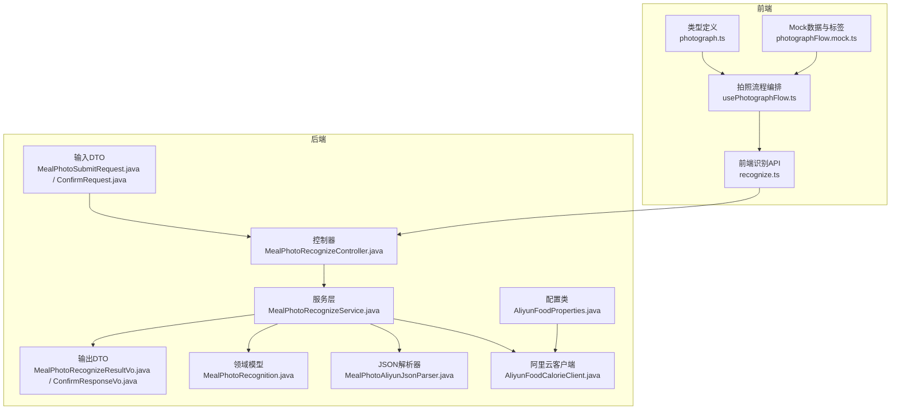
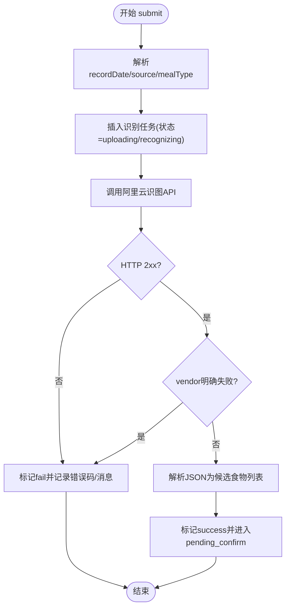
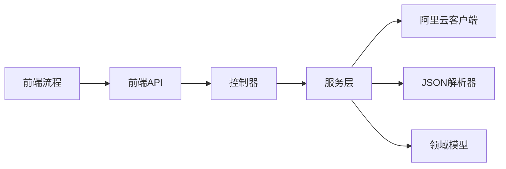

# 拍照识别功能

<cite>
**本文引用的文件**
- [MealPhotoRecognizeService.java](file://backend/src/main/java/com/ypfr/loseweight/service/photograph/MealPhotoRecognizeService.java)
- [MealPhotoAliyunJsonParser.java](file://backend/src/main/java/com/ypfr/loseweight/service/photograph/MealPhotoAliyunJsonParser.java)
- [MealRecommendedMealTypeUtil.java](file://backend/src/main/java/com/ypfr/loseweight/service/photograph/MealRecommendedMealTypeUtil.java)
- [AliyunFoodCalorieClient.java](file://backend/src/main/java/com/ypfr/loseweight/service/AliyunFoodCalorieClient.java)
- [MealPhotoRecognizeController.java](file://backend/src/main/java/com/ypfr/loseweight/web/MealPhotoRecognizeController.java)
- [AliyunFoodProperties.java](file://backend/src/main/java/com/ypfr/loseweight/config/AliyunFoodProperties.java)
- [application-local.yml](file://backend/src/main/resources/application-local.yml)
- [MealPhotoRecognizeResultVo.java](file://backend/src/main/java/com/ypfr/loseweight/web/dto/photograph/MealPhotoRecognizeResultVo.java)
- [MealPhotoFoodItemVo.java](file://backend/src/main/java/com/ypfr/loseweight/web/dto/photograph/MealPhotoFoodItemVo.java)
- [MealPhotoSubmitRequest.java](file://backend/src/main/java/com/ypfr/loseweight/web/dto/photograph/MealPhotoSubmitRequest.java)
- [MealPhotoConfirmRequest.java](file://backend/src/main/java/com/ypfr/loseweight/web/dto/photograph/MealPhotoConfirmRequest.java)
- [MealPhotoConfirmResponseVo.java](file://backend/src/main/java/com/ypfr/loseweight/web/dto/photograph/MealPhotoConfirmResponseVo.java)
- [MealPhotoRecognition.java](file://backend/src/main/java/com/ypfr/loseweight/domain/MealPhotoRecognition.java)
- [recognize.ts](file://frontend/src/api/recognize.ts)
- [usePhotographFlow.ts](file://frontend/src/composables/usePhotographFlow.ts)
- [photograph.ts](file://frontend/src/types/photograph.ts)
- [photographFlow.mock.ts](file://frontend/src/mocks/photographFlow.mock.ts)
</cite>

## 目录
1. [简介](#简介)
2. [项目结构](#项目结构)
3. [核心组件](#核心组件)
4. [架构总览](#架构总览)
5. [详细组件分析](#详细组件分析)
6. [依赖分析](#依赖分析)
7. [性能考虑](#性能考虑)
8. [故障排查指南](#故障排查指南)
9. [结论](#结论)
10. [附录](#附录)

## 简介
本文件面向“拍照识别”功能，系统性阐述从照片拍摄、上传处理、阿里云API调用，到食物识别结果解析、营养成分提取与推荐餐次判断，再到识别流程管理（状态跟踪、错误处理、重试机制）的完整实现细节。文档同时给出调用关系、接口定义、领域模型与使用模式，并结合前端与后端代码路径，提供来自实际代码库的具体示例，记录配置项、参数与返回值，解释与其他组件的关系，给出常见问题的解决方案与优化建议。

## 项目结构
拍照识别功能横跨前端与后端，主要涉及以下模块：
- 前端：页面流程编排、图片选择与预览、识别状态模拟与展示、确认提交
- 后端：控制器、服务层、领域模型、阿里云客户端与解析器、配置类



图表来源
- [MealPhotoRecognizeController.java:1-63](file://backend/src/main/java/com/ypfr/loseweight/web/MealPhotoRecognizeController.java#L1-L63)
- [MealPhotoRecognizeService.java:1-416](file://backend/src/main/java/com/ypfr/loseweight/service/photograph/MealPhotoRecognizeService.java#L1-L416)
- [AliyunFoodCalorieClient.java:1-50](file://backend/src/main/java/com/ypfr/loseweight/service/AliyunFoodCalorieClient.java#L1-L50)
- [MealPhotoAliyunJsonParser.java:1-280](file://backend/src/main/java/com/ypfr/loseweight/service/photograph/MealPhotoAliyunJsonParser.java#L1-L280)
- [AliyunFoodProperties.java:1-44](file://backend/src/main/java/com/ypfr/loseweight/config/AliyunFoodProperties.java#L1-L44)
- [MealPhotoRecognition.java:1-277](file://backend/src/main/java/com/ypfr/loseweight/domain/MealPhotoRecognition.java#L1-L277)
- [recognize.ts:1-142](file://frontend/src/api/recognize.ts#L1-L142)
- [usePhotographFlow.ts:1-508](file://frontend/src/composables/usePhotographFlow.ts#L1-L508)
- [photograph.ts:1-32](file://frontend/src/types/photograph.ts#L1-L32)
- [photographFlow.mock.ts:1-34](file://frontend/src/mocks/photographFlow.mock.ts#L1-L34)

章节来源
- [MealPhotoRecognizeController.java:1-63](file://backend/src/main/java/com/ypfr/loseweight/web/MealPhotoRecognizeController.java#L1-L63)
- [recognize.ts:1-142](file://frontend/src/api/recognize.ts#L1-L142)

## 核心组件
- 控制器：提供提交、查询结果、确认三个REST接口，负责鉴权与请求转发
- 服务层：封装拍照识别全流程，包括状态机推进、阿里云调用、结果解析、落库与二次计算
- JSON解析器：兼容多种阿里云返回结构，抽取食物名称与热量，兜底猜测
- 阿里云客户端：组装请求头与表单参数，调用云市场API
- 配置类：读取host、path与appcode
- 领域模型：持久化识别任务、状态、原始与解析结果
- 前端API与流程：封装HTTP请求、模拟识别阶段、编辑总热量与食用比例、最终确认写库

章节来源
- [MealPhotoRecognizeService.java:38-66](file://backend/src/main/java/com/ypfr/loseweight/service/photograph/MealPhotoRecognizeService.java#L38-L66)
- [MealPhotoAliyunJsonParser.java:16-25](file://backend/src/main/java/com/ypfr/loseweight/service/photograph/MealPhotoAliyunJsonParser.java#L16-L25)
- [AliyunFoodCalorieClient.java:16-25](file://backend/src/main/java/com/ypfr/loseweight/service/AliyunFoodCalorieClient.java#L16-L25)
- [AliyunFoodProperties.java:5-44](file://backend/src/main/java/com/ypfr/loseweight/config/AliyunFoodProperties.java#L5-L44)
- [MealPhotoRecognition.java:10-44](file://backend/src/main/java/com/ypfr/loseweight/domain/MealPhotoRecognition.java#L10-L44)
- [recognize.ts:88-136](file://frontend/src/api/recognize.ts#L88-L136)
- [usePhotographFlow.ts:120-508](file://frontend/src/composables/usePhotographFlow.ts#L120-L508)

## 架构总览
拍照识别采用前后端分离架构，前端通过API提交图片（Base64或URL），后端落地任务并异步调用阿里云识图服务，解析返回后将候选食物列表与预算信息回传前端，用户可在前端进行餐次选择、总热量调整与食用比例调节，最终确认写入数据库并更新日汇总与看板。

```mermaid
sequenceDiagram
participant FE as "前端应用"
participant API as "前端API<br/>recognize.ts"
participant CTRL as "后端控制器<br/>MealPhotoRecognizeController"
participant SVC as "服务层<br/>MealPhotoRecognizeService"
participant CLI as "阿里云客户端<br/>AliyunFoodCalorieClient"
participant PAR as "JSON解析器<br/>MealPhotoAliyunJsonParser"
participant DB as "领域模型/数据库<br/>MealPhotoRecognition"
FE->>API : "提交识图请求"
API->>CTRL : "POST /api/v1/recognize/meal-photo"
CTRL->>SVC : "submit(userId, request)"
SVC->>DB : "插入识别任务(状态=uploading/recognizing)"
SVC->>CLI : "query(imageBase64 或 imageUrl)"
CLI-->>SVC : "HTTP响应(字符串)"
SVC->>PAR : "解析body为候选食物列表"
PAR-->>SVC : "List<FoodItemVo>"
SVC->>DB : "更新状态=success/pending_confirm"
SVC-->>CTRL : "返回识别结果Vo"
CTRL-->>API : "识别结果"
API-->>FE : "展示候选食物与预算信息"
FE->>API : "确认写库请求"
API->>CTRL : "POST /api/v1/recognize/meal-photo/confirm"
CTRL->>SVC : "confirm(userId, request)"
SVC->>DB : "写入餐次记录与明细"
SVC->>DB : "更新识别任务为confirmed"
SVC-->>CTRL : "返回确认响应Vo"
CTRL-->>API : "确认结果"
API-->>FE : "跳转至日记录页"
```

图表来源
- [MealPhotoRecognizeController.java:33-61](file://backend/src/main/java/com/ypfr/loseweight/web/MealPhotoRecognizeController.java#L33-L61)
- [MealPhotoRecognizeService.java:68-138](file://backend/src/main/java/com/ypfr/loseweight/service/photograph/MealPhotoRecognizeService.java#L68-L138)
- [AliyunFoodCalorieClient.java:27-48](file://backend/src/main/java/com/ypfr/loseweight/service/AliyunFoodCalorieClient.java#L27-L48)
- [MealPhotoAliyunJsonParser.java:66-95](file://backend/src/main/java/com/ypfr/loseweight/service/photograph/MealPhotoAliyunJsonParser.java#L66-L95)
- [recognize.ts:88-136](file://frontend/src/api/recognize.ts#L88-L136)

## 详细组件分析

### 后端控制器与鉴权
- 提供三个接口：
  - 提交识图：接收source、mealType、recordDate、imageBase64或imageUrl
  - 查询结果：根据photoJobId与userId查询当前状态与候选食物
  - 确认写库：校验状态、餐次合法性，批量写入餐次记录与明细
- 鉴权：通过Authorization头解析用户ID

章节来源
- [MealPhotoRecognizeController.java:33-61](file://backend/src/main/java/com/ypfr/loseweight/web/MealPhotoRecognizeController.java#L33-L61)

### 服务层：拍照识别全流程
- 输入标准化：解析recordDate、规范化source与mealType，若未提供则按时间推荐
- 任务落库：插入初始状态（uploading→recognizing），记录原始参数与URL
- 调用阿里云：构造表单参数（imageBase64或imageUrl），设置Authorization头
- 结果解析：优先检查vendor失败原因；成功则抽取食物列表，填充候选快照
- 状态推进：成功→pending_confirm；异常→fail并记录错误码与消息
- 确认写库：校验候选任务状态，计算总热量，写入餐次记录与明细，更新识别任务状态为confirmed，返回确认响应



图表来源
- [MealPhotoRecognizeService.java:68-138](file://backend/src/main/java/com/ypfr/loseweight/service/photograph/MealPhotoRecognizeService.java#L68-L138)
- [AliyunFoodCalorieClient.java:27-48](file://backend/src/main/java/com/ypfr/loseweight/service/AliyunFoodCalorieClient.java#L27-L48)
- [MealPhotoAliyunJsonParser.java:32-64](file://backend/src/main/java/com/ypfr/loseweight/service/photograph/MealPhotoAliyunJsonParser.java#L32-L64)

章节来源
- [MealPhotoRecognizeService.java:68-255](file://backend/src/main/java/com/ypfr/loseweight/service/photograph/MealPhotoRecognizeService.java#L68-L255)

### JSON解析器：食物识别结果解析
- 失败检测：当success=false或code非200/0时，返回供应商明确失败的原因文本
- 解析策略：尝试数组、data.items、多级键名（如data.result.items等）、深度遍历收集节点
- 兜底策略：若无法解析，基于文本中的千卡数字猜测总热量，生成单条候选
- 输出：统一转换为前端期望的MealPhotoFoodItemVo列表

章节来源
- [MealPhotoAliyunJsonParser.java:27-280](file://backend/src/main/java/com/ypfr/loseweight/service/photograph/MealPhotoAliyunJsonParser.java#L27-L280)

### 阿里云客户端与配置
- 客户端：校验appcode是否配置，构造Authorization头与表单参数，调用fullUrl
- 配置：host、path与appcode，支持通过外部配置文件覆盖

章节来源
- [AliyunFoodCalorieClient.java:16-49](file://backend/src/main/java/com/ypfr/loseweight/service/AliyunFoodCalorieClient.java#L16-L49)
- [AliyunFoodProperties.java:5-44](file://backend/src/main/java/com/ypfr/loseweight/config/AliyunFoodProperties.java#L5-L44)
- [application-local.yml:14-19](file://backend/src/main/resources/application-local.yml#L14-L19)

### 领域模型：识别任务与状态
- 关键字段：用户ID、餐次、推荐餐次、记录日期、来源、图片URL、识别/确认状态、原始与解析结果、错误码与消息、关联的餐次记录与明细ID等
- 状态机：uploading → recognizing → success/pending_confirm/confirmed/fail

章节来源
- [MealPhotoRecognition.java:10-277](file://backend/src/main/java/com/ypfr/loseweight/domain/MealPhotoRecognition.java#L10-L277)

### 前端：拍照流程与交互
- 流程编排：idle → uploading → recognizing_type → recognizing_weight → success；失败/保存后复位
- 图像处理：读取本地文件为Base64，预览图片
- 识别结果：将后端返回的候选食物映射为前端Mock结构，支持总热量重分配与食用比例调节
- 确认写库：构建确认payload，调用后端接口，成功后跳转至日记录页

章节来源
- [usePhotographFlow.ts:120-508](file://frontend/src/composables/usePhotographFlow.ts#L120-L508)
- [recognize.ts:88-136](file://frontend/src/api/recognize.ts#L88-L136)
- [photograph.ts:1-32](file://frontend/src/types/photograph.ts#L1-L32)
- [photographFlow.mock.ts:18-34](file://frontend/src/mocks/photographFlow.mock.ts#L18-L34)

## 依赖分析
- 组件耦合
  - 控制器依赖服务层；服务层依赖客户端、解析器、领域模型与看板/日汇总服务
  - 前端API依赖后端接口；流程编排依赖类型与Mock数据
- 外部依赖
  - 阿里云市场API（HTTP）
  - MySQL（持久化识别任务与明细）



图表来源
- [MealPhotoRecognizeController.java:24-31](file://backend/src/main/java/com/ypfr/loseweight/web/MealPhotoRecognizeController.java#L24-L31)
- [MealPhotoRecognizeService.java:43-66](file://backend/src/main/java/com/ypfr/loseweight/service/photograph/MealPhotoRecognizeService.java#L43-L66)
- [recognize.ts:88-136](file://frontend/src/api/recognize.ts#L88-L136)

## 性能考虑
- 图片体积控制：前端在提交前尽量压缩图片，避免超长Base64导致请求体过大
- 异步处理：识别过程在服务层异步调用阿里云，前端以轮询或一次性返回的方式展示进度
- 缓存与兜底：解析器对多种返回结构做兼容，减少因供应商格式差异导致的失败
- 计算优化：前端对总热量与食用比例的重分配采用整除与漂移修正，保证数值稳定

## 故障排查指南
- 阿里云appcode未配置
  - 现象：抛出未配置异常
  - 处理：在本地配置文件中填写真实appcode
  - 参考：[AliyunFoodCalorieClient.java:28-30](file://backend/src/main/java/com/ypfr/loseweight/service/AliyunFoodCalorieClient.java#L28-L30)，[application-local.yml:18-19](file://backend/src/main/resources/application-local.yml#L18-L19)
- 识别失败
  - 现象：recognizeStatus=fail，携带errorCode与errorMessage
  - 处理：检查图片清晰度、格式；查看vendor失败原因；重试或更换图片
  - 参考：[MealPhotoRecognizeService.java:103-128](file://backend/src/main/java/com/ypfr/loseweight/service/photograph/MealPhotoRecognizeService.java#L103-L128)
- 确认写库失败
  - 现象：confirmed状态不可用或校验失败
  - 处理：确保任务已成功；mealType合法；items中confirmedCalories为正数
  - 参考：[MealPhotoRecognizeService.java:150-176](file://backend/src/main/java/com/ypfr/loseweight/service/photograph/MealPhotoRecognizeService.java#L150-L176)
- 前端无网络或鉴权缺失
  - 现象：提示“请先登录”或请求失败
  - 处理：检查Authorization头与登录状态
  - 参考：[recognize.ts:90-93](file://frontend/src/api/recognize.ts#L90-L93)

章节来源
- [AliyunFoodCalorieClient.java:28-30](file://backend/src/main/java/com/ypfr/loseweight/service/AliyunFoodCalorieClient.java#L28-L30)
- [application-local.yml:18-19](file://backend/src/main/resources/application-local.yml#L18-L19)
- [MealPhotoRecognizeService.java:103-176](file://backend/src/main/java/com/ypfr/loseweight/service/photograph/MealPhotoRecognizeService.java#L103-L176)
- [recognize.ts:90-93](file://frontend/src/api/recognize.ts#L90-L93)

## 结论
拍照识别功能通过前后端协作，实现了从图片提交、云端识别、结果解析到用户确认写库的完整闭环。服务层承担了状态管理、错误处理与数据落库职责，前端提供了流畅的交互体验与可视化反馈。通过配置化与解析器的兼容策略，系统具备较好的鲁棒性与可维护性。

## 附录

### 接口定义与参数说明
- 提交识图
  - 方法：POST /api/v1/recognize/meal-photo
  - 请求体：source、mealType、recordDate、imageBase64或imageUrl（至少一个）
  - 返回：识别结果Vo（含候选食物、推荐餐次、预算快照、状态等）
  - 参考：[MealPhotoRecognizeController.java:33-41](file://backend/src/main/java/com/ypfr/loseweight/web/MealPhotoRecognizeController.java#L33-L41)，[MealPhotoSubmitRequest.java:6-77](file://backend/src/main/java/com/ypfr/loseweight/web/dto/photograph/MealPhotoSubmitRequest.java#L6-L77)，[recognize.ts:88-102](file://frontend/src/api/recognize.ts#L88-L102)
- 查询结果
  - 方法：GET /api/v1/recognize/meal-photo/result
  - 查询参数：userId、photoJobId
  - 返回：识别结果Vo
  - 参考：[MealPhotoRecognizeController.java:43-51](file://backend/src/main/java/com/ypfr/loseweight/web/MealPhotoRecognizeController.java#L43-L51)，[recognize.ts:104-114](file://frontend/src/api/recognize.ts#L104-L114)
- 确认写库
  - 方法：POST /api/v1/recognize/meal-photo/confirm
  - 请求体：photoJobId、confirmedMealType、recordDate、items（lineId、foodId、confirmedFoodName、confirmedCalories、confirmedEatRatio）
  - 返回：确认响应Vo（含餐次记录ID、明细ID、确认时间、预算快照）
  - 参考：[MealPhotoRecognizeController.java:53-61](file://backend/src/main/java/com/ypfr/loseweight/web/MealPhotoRecognizeController.java#L53-L61)，[MealPhotoConfirmRequest.java:9-58](file://backend/src/main/java/com/ypfr/loseweight/web/dto/photograph/MealPhotoConfirmRequest.java#L9-L58)，[recognize.ts:116-136](file://frontend/src/api/recognize.ts#L116-L136)

### 领域模型与DTO
- 领域模型：识别任务（MealPhotoRecognition）
  - 关键字段：识别/确认状态、餐次、推荐餐次、记录日期、来源、图片URL、原始/解析结果、错误信息、关联ID等
  - 参考：[MealPhotoRecognition.java:10-277](file://backend/src/main/java/com/ypfr/loseweight/domain/MealPhotoRecognition.java#L10-L277)
- 输出DTO：
  - 识别结果Vo：photoJobId、recognizeStatus、recognizePhase、imageUrl、previewUrl、recommendedMealType、foods、recommendedEatRatio、intakeCaloriesToday、dailyBudgetCalories、badgeProgressPercent、confirmStatus、totalRecognizedCalories、errorCode、errorMessage
  - 参考：[MealPhotoRecognizeResultVo.java:9-156](file://backend/src/main/java/com/ypfr/loseweight/web/dto/photograph/MealPhotoRecognizeResultVo.java#L9-L156)
  - 确认响应Vo：mealRecordId、dietRecordIds、confirmStatus、confirmedAt、intakeCaloriesToday、dailyBudgetCalories
  - 参考：[MealPhotoConfirmResponseVo.java:7-65](file://backend/src/main/java/com/ypfr/loseweight/web/dto/photograph/MealPhotoConfirmResponseVo.java#L7-L65)
- 候选食物Vo：lineId、foodName、calories、giLabel、foodId、weightG
  - 参考：[MealPhotoFoodItemVo.java:6-66](file://backend/src/main/java/com/ypfr/loseweight/web/dto/photograph/MealPhotoFoodItemVo.java#L6-L66)

### 配置项
- 阿里云配置（application-local.yml）
  - aliyun.food.host：服务主机
  - aliyun.food.path：接口路径
  - aliyun.food.appcode：云市场APP CODE
  - 参考：[application-local.yml:14-19](file://backend/src/main/resources/application-local.yml#L14-L19)，[AliyunFoodProperties.java:5-44](file://backend/src/main/java/com/ypfr/loseweight/config/AliyunFoodProperties.java#L5-L44)

### 前端类型与流程
- 流程阶段：idle、uploading、recognizing_type、recognizing_weight、success、mealtype_dropdown_open、editing_calorie、adjusting_ratio、failed、saved
  - 参考：[photograph.ts:2-12](file://frontend/src/types/photograph.ts#L2-L12)
- 餐次键：breakfast、lunch、dinner、snack
  - 参考：[photograph.ts](file://frontend/src/types/photograph.ts#L14)
- Mock数据与标签
  - 参考：[photographFlow.mock.ts:3-16](file://frontend/src/mocks/photographFlow.mock.ts#L3-L16)