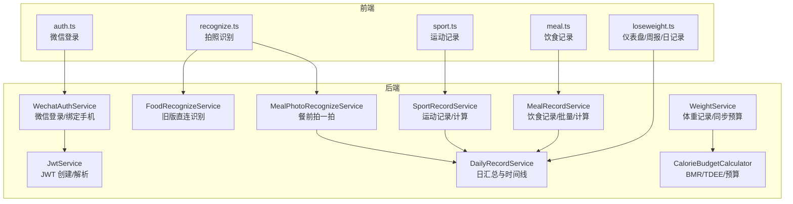
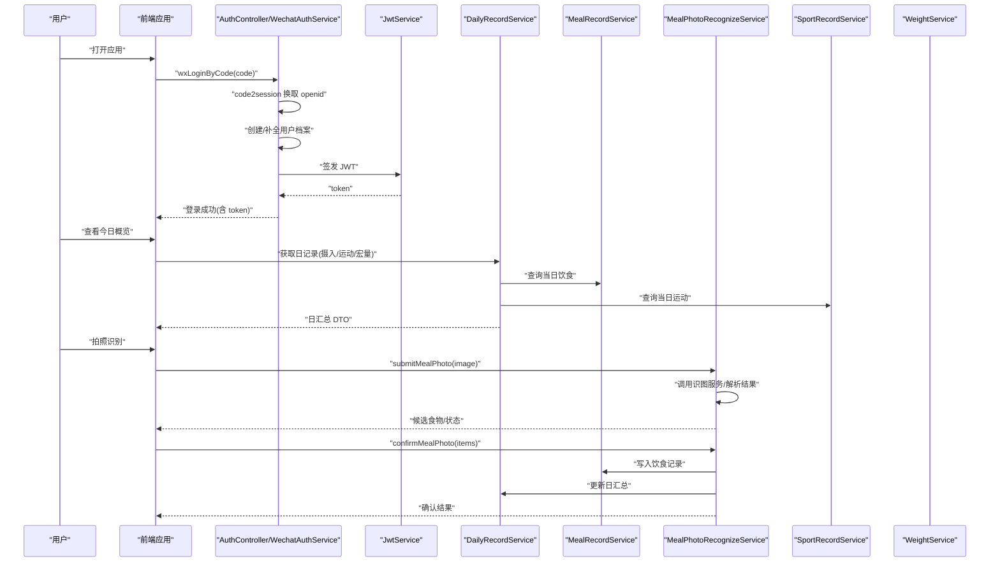
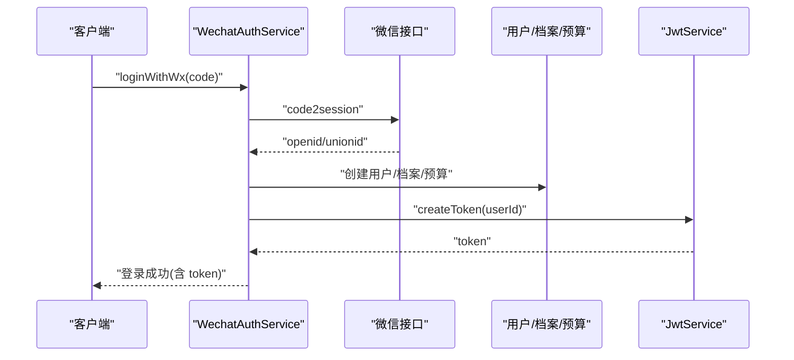
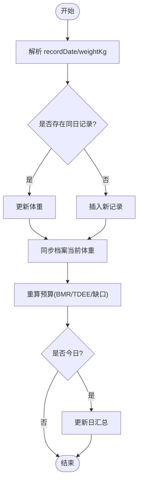
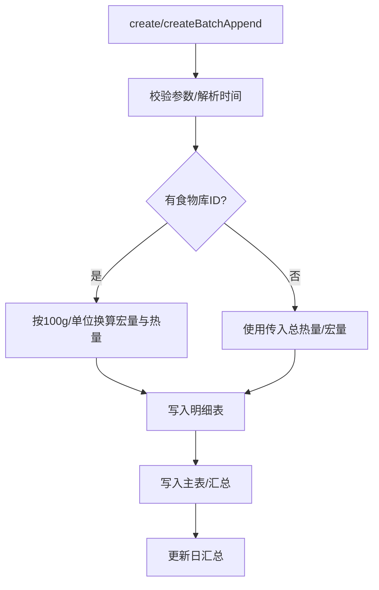
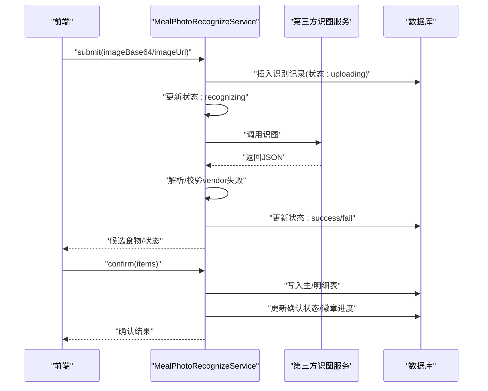
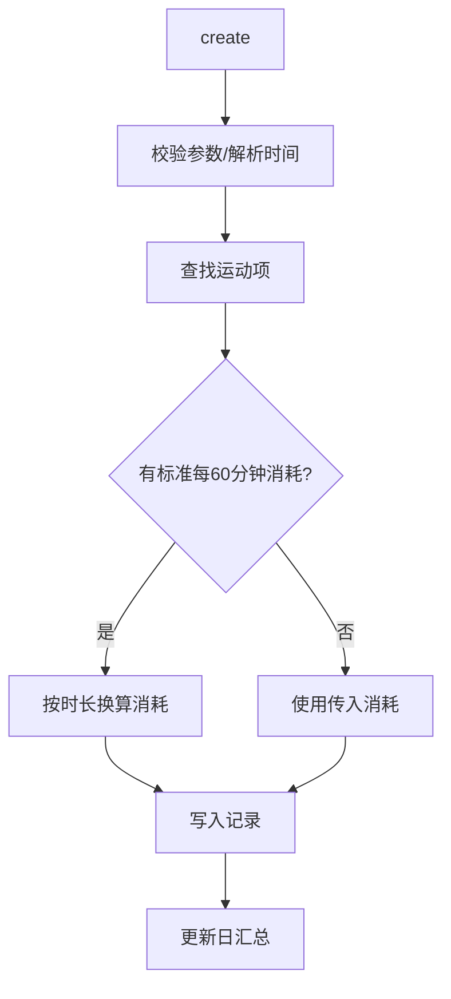
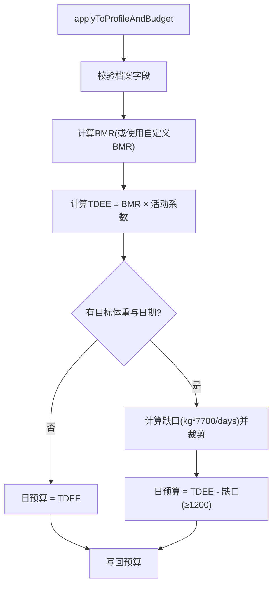
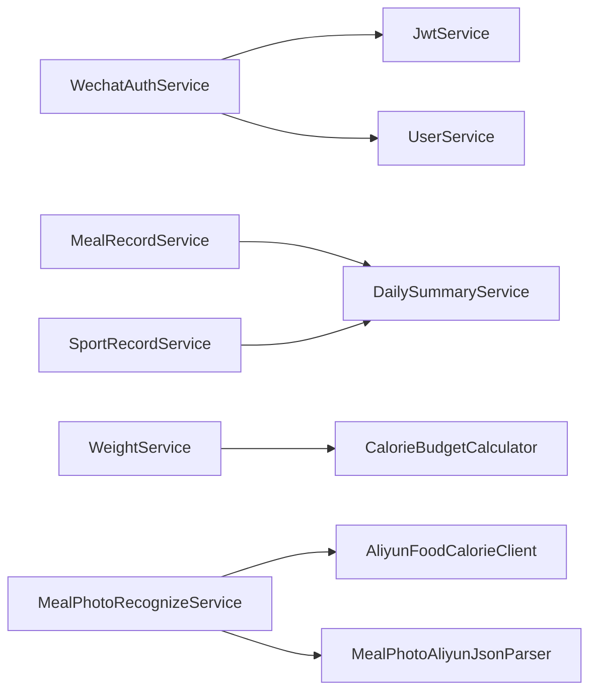

# 核心功能实现

<cite>
**本文引用的文件**
- [WechatAuthService.java](file://backend/src/main/java/com/ypfr/loseweight/service/WechatAuthService.java)
- [JwtService.java](file://backend/src/main/java/com/ypfr/loseweight/service/JwtService.java)
- [DailyRecordService.java](file://backend/src/main/java/com/ypfr/loseweight/service/DailyRecordService.java)
- [FoodRecognizeService.java](file://backend/src/main/java/com/ypfr/loseweight/service/FoodRecognizeService.java)
- [MealPhotoRecognizeService.java](file://backend/src/main/java/com/ypfr/loseweight/service/photograph/MealPhotoRecognizeService.java)
- [MealRecordService.java](file://backend/src/main/java/com/ypfr/loseweight/service/MealRecordService.java)
- [SportRecordService.java](file://backend/src/main/java/com/ypfr/loseweight/service/SportRecordService.java)
- [WeightService.java](file://backend/src/main/java/com/ypfr/loseweight/service/WeightService.java)
- [CalorieBudgetCalculator.java](file://backend/src/main/java/com/ypfr/loseweight/service/CalorieBudgetCalculator.java)
- [auth.ts](file://frontend/src/api/auth.ts)
- [loseweight.ts](file://frontend/src/api/loseweight.ts)
- [meal.ts](file://frontend/src/api/meal.ts)
- [recognize.ts](file://frontend/src/api/recognize.ts)
- [sport.ts](file://frontend/src/api/sport.ts)
</cite>

## 目录
1. [简介](#简介)
2. [项目结构](#项目结构)
3. [核心组件](#核心组件)
4. [架构总览](#架构总览)
5. [详细组件分析](#详细组件分析)
6. [依赖分析](#依赖分析)
7. [性能考虑](#性能考虑)
8. [故障排查指南](#故障排查指南)
9. [结论](#结论)
10. [附录](#附录)

## 简介
本文件聚焦于系统的四大核心功能模块：用户认证与会话（微信登录、JWT 令牌管理）、健康档案（体重记录与宏量营养素概览）、饮食记录（食物搜索、自定义食物、热量计算）、拍照识别（AI 图像识别、食物分类与营养分析）、运动追踪（运动项目库、运动记录、消耗热量计算）、计划制定（个性化减脂方案、目标设定、进度跟踪）。文档从领域模型、调用关系、接口定义、处理流程、错误处理与性能优化等维度进行深入说明，并提供来自实际代码库的路径级引用与可视化图示，帮助开发者快速理解与排障。

## 项目结构
后端采用 Spring Boot 结构，按领域分层组织服务与控制器；前端基于 Vue/UniApp，通过统一 API 封装与适配器对接后端服务。核心服务位于 backend/src/main/java/com/ypfr/loseweight/service 下，前端 API 定义位于 frontend/src/api。

图表来源
- [WechatAuthService.java:28-153](file://backend/src/main/java/com/ypfr/loseweight/service/WechatAuthService.java#L28-L153)
- [JwtService.java:15-57](file://backend/src/main/java/com/ypfr/loseweight/service/JwtService.java#L15-L57)
- [DailyRecordService.java:21-84](file://backend/src/main/java/com/ypfr/loseweight/service/DailyRecordService.java#L21-L84)
- [FoodRecognizeService.java:13-51](file://backend/src/main/java/com/ypfr/loseweight/service/FoodRecognizeService.java#L13-L51)
- [MealPhotoRecognizeService.java:38-138](file://backend/src/main/java/com/ypfr/loseweight/service/photograph/MealPhotoRecognizeService.java#L38-L138)
- [MealRecordService.java:29-114](file://backend/src/main/java/com/ypfr/loseweight/service/MealRecordService.java#L29-L114)
- [SportRecordService.java:18-84](file://backend/src/main/java/com/ypfr/loseweight/service/SportRecordService.java#L18-L84)
- [WeightService.java:18-79](file://backend/src/main/java/com/ypfr/loseweight/service/WeightService.java#L18-L79)
- [CalorieBudgetCalculator.java:11-141](file://backend/src/main/java/com/ypfr/loseweight/service/CalorieBudgetCalculator.java#L11-L141)

章节来源
- [auth.ts:1-10](file://frontend/src/api/auth.ts#L1-L10)
- [loseweight.ts:1-66](file://frontend/src/api/loseweight.ts#L1-L66)
- [meal.ts:1-81](file://frontend/src/api/meal.ts#L1-L81)
- [recognize.ts:1-142](file://frontend/src/api/recognize.ts#L1-L142)
- [sport.ts:1-34](file://frontend/src/api/sport.ts#L1-L34)

## 核心组件
- 用户认证与会话
  - 微信登录：换取 openid、创建/补全用户档案、生成 JWT。
  - JWT 签发与校验：密钥长度校验、过期策略、解析用户标识。
- 健康档案
  - 体重记录：按日期更新当前体重，联动更新预算与日汇总。
  - 宏量营养素概览：按日聚合摄入与运动，计算蛋白质/脂肪/碳水目标与达成情况。
- 饮食记录
  - 自定义食物：手动输入份量与单位，按 100g 或单位换算计算热量与宏量。
  - 批量导入：同一餐次、同一天、同餐型追加多条明细，自动汇总主表。
  - 热量计算：优先使用食物标准数据，支持直接传入总热量。
- 拍照识别
  - 旧版直连：直接调用第三方识图服务返回 JSON。
  - 餐前拍一拍：提交图片 → 调用识图 → 解析候选食物 → 用户确认 → 写入饮食记录与日汇总。
- 运动追踪
  - 运动库检索：按名称模糊搜索，返回图标与每分钟热量参考。
  - 运动记录：按 60 分钟基准换算消耗，支持直接传入消耗。
- 计划制定
  - 基础代谢与总消耗：Mifflin-St Jeor 公式、活动系数、目标日期推导减脂缺口与日预算。
  - 目标设定：身高、年龄、性别、当前体重、目标体重与目标日期联动预算。

章节来源
- [WechatAuthService.java:64-153](file://backend/src/main/java/com/ypfr/loseweight/service/WechatAuthService.java#L64-L153)
- [JwtService.java:29-56](file://backend/src/main/java/com/ypfr/loseweight/service/JwtService.java#L29-L56)
- [WeightService.java:47-79](file://backend/src/main/java/com/ypfr/loseweight/service/WeightService.java#L47-L79)
- [DailyRecordService.java:44-84](file://backend/src/main/java/com/ypfr/loseweight/service/DailyRecordService.java#L44-L84)
- [MealRecordService.java:50-114](file://backend/src/main/java/com/ypfr/loseweight/service/MealRecordService.java#L50-L114)
- [FoodRecognizeService.java:25-50](file://backend/src/main/java/com/ypfr/loseweight/service/FoodRecognizeService.java#L25-L50)
- [MealPhotoRecognizeService.java:68-138](file://backend/src/main/java/com/ypfr/loseweight/service/photograph/MealPhotoRecognizeService.java#L68-L138)
- [SportRecordService.java:33-84](file://backend/src/main/java/com/ypfr/loseweight/service/SportRecordService.java#L33-L84)
- [CalorieBudgetCalculator.java:67-140](file://backend/src/main/java/com/ypfr/loseweight/service/CalorieBudgetCalculator.java#L67-L140)

## 架构总览
下图展示从前端到后端的关键调用链路与职责边界。

图表来源
- [auth.ts:7-9](file://frontend/src/api/auth.ts#L7-L9)
- [WechatAuthService.java:64-153](file://backend/src/main/java/com/ypfr/loseweight/service/WechatAuthService.java#L64-L153)
- [JwtService.java:29-56](file://backend/src/main/java/com/ypfr/loseweight/service/JwtService.java#L29-L56)
- [DailyRecordService.java:44-84](file://backend/src/main/java/com/ypfr/loseweight/service/DailyRecordService.java#L44-L84)
- [MealPhotoRecognizeService.java:68-138](file://backend/src/main/java/com/ypfr/loseweight/service/photograph/MealPhotoRecognizeService.java#L68-L138)
- [MealRecordService.java:119-219](file://backend/src/main/java/com/ypfr/loseweight/service/MealRecordService.java#L119-L219)

## 详细组件分析

### 用户认证系统（微信登录、JWT 令牌管理）
- 功能要点
  - 使用小程序 code 换取 openid/unionid，创建用户并初始化档案与预算。
  - 登录日志记录与错误归因，异常统一抛出业务异常。
  - JWT 密钥长度校验，过期时间配置，解析用户 ID。
- 关键接口与行为
  - 登录入口：接收 code，调用微信接口，解析响应，创建用户，签发 token。
  - 绑定手机号：使用全局 access_token 调用微信手机号接口，写入用户表。
  - JWT：创建 token（带签发/过期时间），解析 token 并校验有效性。
- 错误处理
  - 微信接口失败、响应无效、缺少 openid、登录失败等均抛出业务异常并记录日志。
  - JWT 为空或签名无效时提示重新登录。

图表来源
- [WechatAuthService.java:64-153](file://backend/src/main/java/com/ypfr/loseweight/service/WechatAuthService.java#L64-L153)
- [JwtService.java:29-56](file://backend/src/main/java/com/ypfr/loseweight/service/JwtService.java#L29-L56)

章节来源
- [WechatAuthService.java:64-204](file://backend/src/main/java/com/ypfr/loseweight/service/WechatAuthService.java#L64-L204)
- [JwtService.java:20-56](file://backend/src/main/java/com/ypfr/loseweight/service/JwtService.java#L20-L56)
- [auth.ts:7-9](file://frontend/src/api/auth.ts#L7-L9)

### 健康档案管理（体重记录）
- 功能要点
  - 按日期更新体重，若为今日则同步更新档案与预算，并触发日汇总更新。
  - 支持查询近期体重趋势。
- 关键接口与行为
  - upsert：校验日期与体重，更新或新增记录，同步档案当前体重并重算预算。
  - 同步逻辑：仅对今日体重变更触发预算与日汇总更新。
- 性能与一致性
  - 仅在今日体重变更时触发预算与汇总更新，避免不必要的计算。

图表来源
- [WeightService.java:47-107](file://backend/src/main/java/com/ypfr/loseweight/service/WeightService.java#L47-L107)
- [CalorieBudgetCalculator.java:67-140](file://backend/src/main/java/com/ypfr/loseweight/service/CalorieBudgetCalculator.java#L67-L140)

章节来源
- [WeightService.java:47-107](file://backend/src/main/java/com/ypfr/loseweight/service/WeightService.java#L47-L107)

### 饮食记录系统（食物搜索、自定义食物、热量计算）
- 功能要点
  - 自定义食物：支持手动输入份量、单位、总热量，或通过食物库按 100g/单位换算。
  - 批量导入：同一餐次、同一天、同餐型追加多条明细，自动汇总主表。
  - 热量与宏量计算：优先使用食物标准数据，支持直接传入总热量。
- 关键接口与行为
  - create：校验餐型、名称、时间，计算宏量与总热量，写入主表与明细表。
  - createBatchAppend：批量写入，校验每条明细，汇总后更新主表。
  - delete：删除明细后若无剩余明细则删除主表，否则重新汇总。
- 复杂度与边界
  - 计算复杂度 O(n)（n 为明细数量），批量场景减少多次主表更新次数。

图表来源
- [MealRecordService.java:50-114](file://backend/src/main/java/com/ypfr/loseweight/service/MealRecordService.java#L50-L114)
- [MealRecordService.java:119-219](file://backend/src/main/java/com/ypfr/loseweight/service/MealRecordService.java#L119-L219)

章节来源
- [meal.ts:32-80](file://frontend/src/api/meal.ts#L32-L80)
- [MealRecordService.java:50-435](file://backend/src/main/java/com/ypfr/loseweight/service/MealRecordService.java#L50-L435)

### 拍照识别功能（AI 图像识别、食物分类、营养分析）
- 功能要点
  - 旧版直连：直接调用第三方识图服务，返回原始 JSON。
  - 餐前拍一拍：提交图片 → 调用识图 → 解析候选食物 → 用户确认 → 写入饮食记录与日汇总。
- 关键接口与行为
  - submit：记录来源/餐型/日期，调用识图服务，解析 vendor 失败原因，填充候选食物与状态。
  - getResult/confirm：轮询结果、校验状态、确认后写入主/明细表，更新日汇总与徽章进度。
- 错误处理
  - 供应商失败/HTTP 非 2xx/解析异常均记录错误码与消息，状态置为 fail。

图表来源
- [recognize.ts:89-136](file://frontend/src/api/recognize.ts#L89-L136)
- [MealPhotoRecognizeService.java:68-138](file://backend/src/main/java/com/ypfr/loseweight/service/photograph/MealPhotoRecognizeService.java#L68-L138)
- [MealPhotoRecognizeService.java:149-255](file://backend/src/main/java/com/ypfr/loseweight/service/photograph/MealPhotoRecognizeService.java#L149-L255)

章节来源
- [recognize.ts:79-142](file://frontend/src/api/recognize.ts#L79-L142)
- [FoodRecognizeService.java:25-50](file://backend/src/main/java/com/ypfr/loseweight/service/FoodRecognizeService.java#L25-L50)
- [MealPhotoRecognizeService.java:68-416](file://backend/src/main/java/com/ypfr/loseweight/service/photograph/MealPhotoRecognizeService.java#L68-L416)

### 运动追踪系统（运动项目库、运动记录、消耗热量计算）
- 功能要点
  - 运动库检索：支持关键词与限制数量，返回图标与每分钟热量参考。
  - 运动记录：按 60 分钟基准换算消耗，支持直接传入消耗。
- 关键接口与行为
  - create：校验名称与时长，查找运动项，按 60 分钟基准换算消耗，写入记录并更新日汇总。
  - delete：删除记录并更新对应日期的日汇总。
- 性能与一致性
  - 消耗计算 O(1)，日汇总更新幂等。

图表来源
- [sport.ts:21-33](file://frontend/src/api/sport.ts#L21-L33)
- [SportRecordService.java:33-84](file://backend/src/main/java/com/ypfr/loseweight/service/SportRecordService.java#L33-L84)

章节来源
- [sport.ts:1-34](file://frontend/src/api/sport.ts#L1-L34)
- [SportRecordService.java:33-111](file://backend/src/main/java/com/ypfr/loseweight/service/SportRecordService.java#L33-L111)

### 计划制定系统（个性化减脂方案、目标设定、进度跟踪）
- 功能要点
  - 基础代谢与总消耗：Mifflin-St Jeor 公式、活动系数、目标日期推导减脂缺口与日预算。
  - 目标设定：身高、年龄、性别、当前体重、目标体重与目标日期联动预算。
- 关键算法与行为
  - BMR：根据性别/年龄/身高/体重计算。
  - 活动系数：1-5 档映射至小数，支持自定义 BMR。
  - TDEE：BMR × 活动系数。
  - 减脂缺口：按目标体重与日期计算每日缺口，限定范围并推导日预算。
- 进度跟踪
  - 日汇总中展示摄入/预算/徽章进度，结合体重变化评估。

图表来源
- [CalorieBudgetCalculator.java:67-140](file://backend/src/main/java/com/ypfr/loseweight/service/CalorieBudgetCalculator.java#L67-L140)

章节来源
- [CalorieBudgetCalculator.java:11-142](file://backend/src/main/java/com/ypfr/loseweight/service/CalorieBudgetCalculator.java#L11-L142)
- [WeightService.java:81-107](file://backend/src/main/java/com/ypfr/loseweight/service/WeightService.java#L81-L107)

## 依赖分析
- 组件内聚与耦合
  - 认证与会话：WechatAuthService 依赖 JwtService 与用户域服务，职责清晰。
  - 饮食与运动：MealRecordService 与 SportRecordService 均依赖 DailySummaryService 更新日汇总，保证数据一致性。
  - 体重与预算：WeightService 在今日体重变更时联动 CalorieBudgetCalculator 重算预算。
- 外部依赖
  - 第三方识图服务：MealPhotoRecognizeService 依赖 AliyunFoodCalorieClient 与解析器。
  - 微信接口：WechatAuthService 依赖 RestTemplate 与微信配置。

图表来源
- [WechatAuthService.java:33-59](file://backend/src/main/java/com/ypfr/loseweight/service/WechatAuthService.java#L33-L59)
- [MealRecordService.java:34-47](file://backend/src/main/java/com/ypfr/loseweight/service/MealRecordService.java#L34-L47)
- [SportRecordService.java:20-31](file://backend/src/main/java/com/ypfr/loseweight/service/SportRecordService.java#L20-L31)
- [WeightService.java:20-37](file://backend/src/main/java/com/ypfr/loseweight/service/WeightService.java#L20-L37)
- [MealPhotoRecognizeService.java:43-66](file://backend/src/main/java/com/ypfr/loseweight/service/photograph/MealPhotoRecognizeService.java#L43-L66)

章节来源
- [WechatAuthService.java:33-59](file://backend/src/main/java/com/ypfr/loseweight/service/WechatAuthService.java#L33-L59)
- [MealRecordService.java:34-47](file://backend/src/main/java/com/ypfr/loseweight/service/MealRecordService.java#L34-L47)
- [SportRecordService.java:20-31](file://backend/src/main/java/com/ypfr/loseweight/service/SportRecordService.java#L20-L31)
- [WeightService.java:20-37](file://backend/src/main/java/com/ypfr/loseweight/service/WeightService.java#L20-L37)
- [MealPhotoRecognizeService.java:43-66](file://backend/src/main/java/com/ypfr/loseweight/service/photograph/MealPhotoRecognizeService.java#L43-L66)

## 性能考虑
- 批量写入优化：批量导入同一餐次明细，减少主表更新次数，提升吞吐。
- 日汇总惰性更新：仅在关键操作（体重今日变更、饮食/运动/拍照确认）触发，降低重复计算。
- 热量计算复用：优先使用食物标准数据，避免重复换算；直接传入总热量时跳过换算。
- 事务边界：拍照确认与日汇总更新在同一事务内，确保一致性与原子性。

## 故障排查指南
- 微信登录失败
  - 现象：返回 401 或“登录失败”。
  - 排查：检查 app-secret 是否配置、微信接口是否可达、响应是否包含 errcode/errmsg。
  - 参考
    - [WechatAuthService.java:66-100](file://backend/src/main/java/com/ypfr/loseweight/service/WechatAuthService.java#L66-L100)
- JWT 校验失败
  - 现象：提示“请先登录/登录已失效”。
  - 排查：确认密钥长度 ≥ 32 字节、token 未过期、客户端存储与传输正确。
  - 参考
    - [JwtService.java:22-56](file://backend/src/main/java/com/ypfr/loseweight/service/JwtService.java#L22-L56)
- 识图失败
  - 现象：识别状态 fail，返回错误码/消息。
  - 排查：检查图片格式/大小、URL 可达性、第三方服务状态、vendor 失败原因。
  - 参考
    - [MealPhotoRecognizeService.java:96-138](file://backend/src/main/java/com/ypfr/loseweight/service/photograph/MealPhotoRecognizeService.java#L96-L138)
- 饮食/运动记录异常
  - 现象：参数校验失败或计算异常。
  - 排查：确认餐型/名称/时长/单位/日期约束，检查食物库是否存在。
  - 参考
    - [MealRecordService.java:50-114](file://backend/src/main/java/com/ypfr/loseweight/service/MealRecordService.java#L50-L114)
    - [SportRecordService.java:33-84](file://backend/src/main/java/com/ypfr/loseweight/service/SportRecordService.java#L33-L84)
- 体重更新未生效
  - 现象：体重变更但预算/日汇总未更新。
  - 排查：确认 recordDate 为今日，检查同步逻辑是否触发。
  - 参考
    - [WeightService.java:81-107](file://backend/src/main/java/com/ypfr/loseweight/service/WeightService.java#L81-L107)

章节来源
- [WechatAuthService.java:66-100](file://backend/src/main/java/com/ypfr/loseweight/service/WechatAuthService.java#L66-L100)
- [JwtService.java:22-56](file://backend/src/main/java/com/ypfr/loseweight/service/JwtService.java#L22-L56)
- [MealPhotoRecognizeService.java:96-138](file://backend/src/main/java/com/ypfr/loseweight/service/photograph/MealPhotoRecognizeService.java#L96-L138)
- [MealRecordService.java:50-114](file://backend/src/main/java/com/ypfr/loseweight/service/MealRecordService.java#L50-L114)
- [SportRecordService.java:33-84](file://backend/src/main/java/com/ypfr/loseweight/service/SportRecordService.java#L33-L84)
- [WeightService.java:81-107](file://backend/src/main/java/com/ypfr/loseweight/service/WeightService.java#L81-L107)

## 结论
本系统围绕“用户认证—健康档案—饮食记录—拍照识别—运动追踪—计划制定”的完整闭环设计，前后端职责清晰、接口定义明确、领域模型稳定。通过批量导入、事务一致性与惰性更新等策略，在保证数据准确的同时兼顾性能与可维护性。建议在生产环境中持续关注第三方服务稳定性、JWT 密钥安全与日汇总更新的幂等性。

## 附录
- 前端 API 使用示例（路径级引用）
  - 微信登录：[auth.ts:7-9](file://frontend/src/api/auth.ts#L7-L9)
  - 仪表盘/周报/日记录：[loseweight.ts:15-52](file://frontend/src/api/loseweight.ts#L15-L52)
  - 饮食记录：[meal.ts:32-80](file://frontend/src/api/meal.ts#L32-L80)
  - 拍照识别：[recognize.ts:89-136](file://frontend/src/api/recognize.ts#L89-L136)
  - 运动记录：[sport.ts:21-33](file://frontend/src/api/sport.ts#L21-L33)