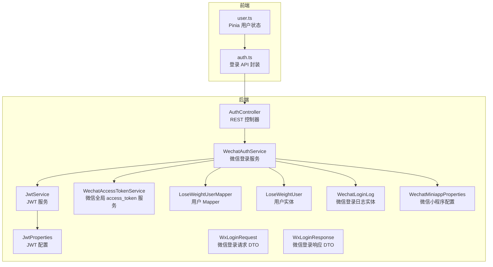
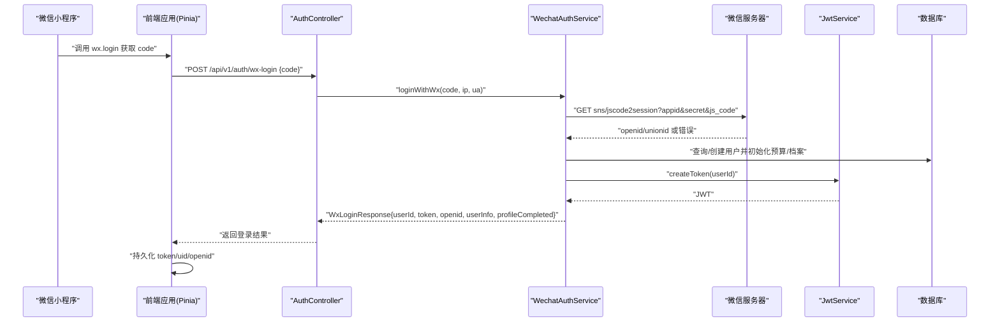
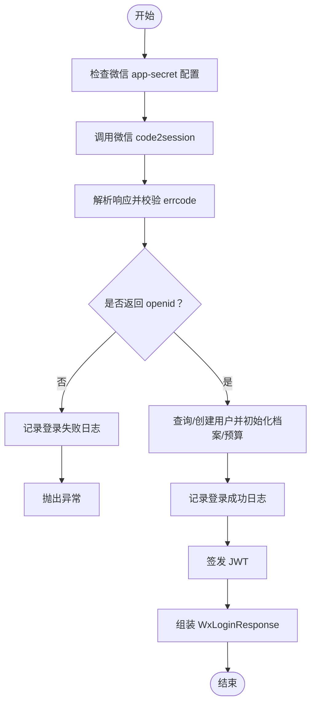
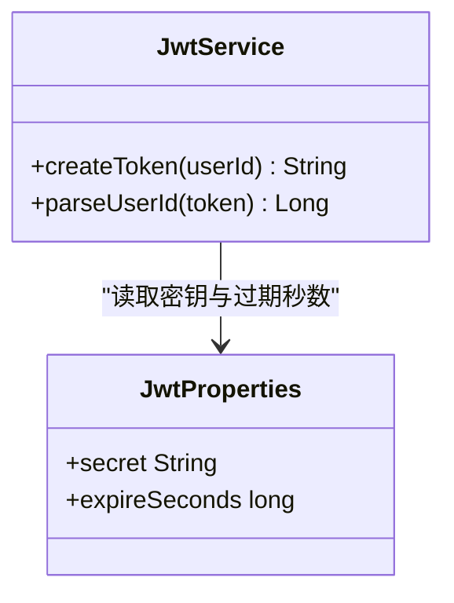
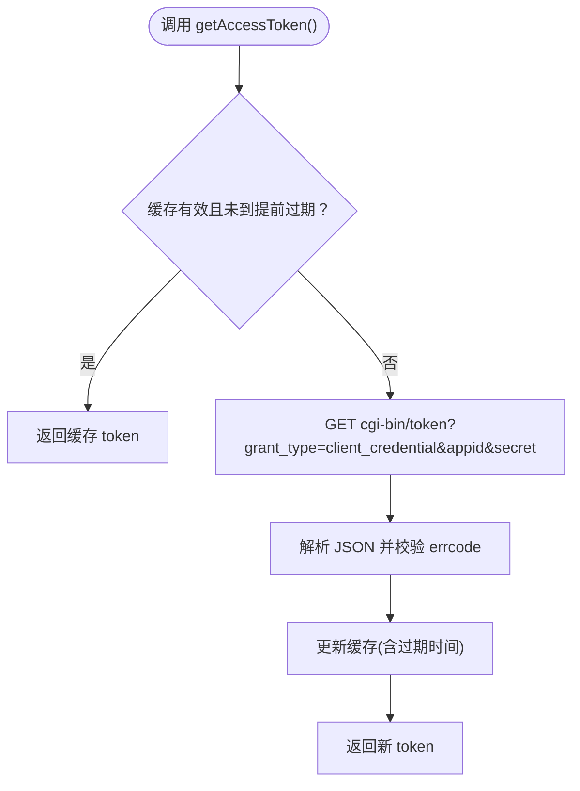
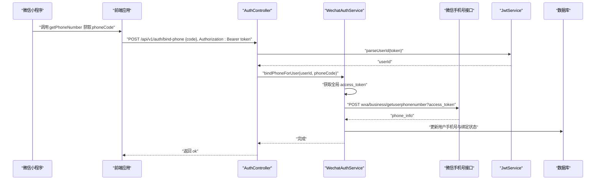
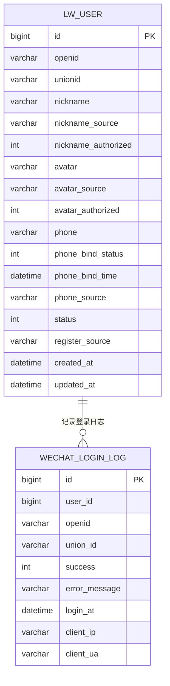
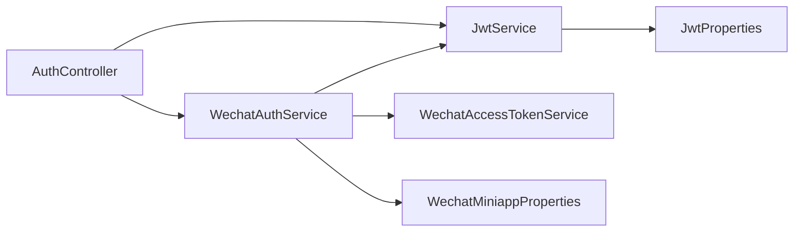

# 用户认证系统

<cite>
**本文引用的文件**
- [WechatAuthService.java](file://backend/src/main/java/com/ypfr/loseweight/service/WechatAuthService.java)
- [JwtService.java](file://backend/src/main/java/com/ypfr/loseweight/service/JwtService.java)
- [WechatAccessTokenService.java](file://backend/src/main/java/com/ypfr/loseweight/service/WechatAccessTokenService.java)
- [AuthController.java](file://backend/src/main/java/com/ypfr/loseweight/web/AuthController.java)
- [WechatMiniappProperties.java](file://backend/src/main/java/com/ypfr/loseweight/config/WechatMiniappProperties.java)
- [JwtProperties.java](file://backend/src/main/java/com/ypfr/loseweight/config/JwtProperties.java)
- [WxLoginRequest.java](file://backend/src/main/java/com/ypfr/loseweight/web/dto/WxLoginRequest.java)
- [WxLoginResponse.java](file://backend/src/main/java/com/ypfr/loseweight/web/dto/WxLoginResponse.java)
- [application.yml](file://backend/src/main/resources/application.yml)
- [LoseWeightUser.java](file://backend/src/main/java/com/ypfr/loseweight/domain/LoseWeightUser.java)
- [WechatLoginLog.java](file://backend/src/main/java/com/ypfr/loseweight/domain/WechatLoginLog.java)
- [LoseWeightUserMapper.java](file://backend/src/main/java/com/ypfr/loseweight/mapper/LoseWeightUserMapper.java)
- [user.ts](file://frontend/src/stores/user.ts)
- [auth.ts](file://frontend/src/api/auth.ts)
</cite>

## 目录
1. [简介](#简介)
2. [项目结构](#项目结构)
3. [核心组件](#核心组件)
4. [架构总览](#架构总览)
5. [详细组件分析](#详细组件分析)
6. [依赖分析](#依赖分析)
7. [性能考虑](#性能考虑)
8. [故障排查指南](#故障排查指南)
9. [结论](#结论)
10. [附录](#附录)

## 简介
本文件面向“用户认证系统”的实现文档，聚焦以下目标：
- 微信登录流程：授权码获取、用户信息绑定、JWT 令牌发放
- JWT 令牌管理：签发、解析与失效处理
- 微信授权访问令牌服务：access_token 获取与内存缓存
- 接口定义、领域模型、调用关系与使用模式
- 与前端会话管理、小程序登录、安全令牌处理的最佳实践

## 项目结构
后端采用 Spring Boot 层次化组织：web 控制层、service 业务层、mapper 数据层、domain 领域模型、config 配置项、dto 请求/响应对象。前端使用 Pinia 管理用户状态与本地存储。

图表来源
- [AuthController.java:20-55](file://backend/src/main/java/com/ypfr/loseweight/web/AuthController.java#L20-L55)
- [WechatAuthService.java:27-59](file://backend/src/main/java/com/ypfr/loseweight/service/WechatAuthService.java#L27-L59)
- [JwtService.java:14-27](file://backend/src/main/java/com/ypfr/loseweight/service/JwtService.java#L14-L27)
- [WechatAccessTokenService.java:17-36](file://backend/src/main/java/com/ypfr/loseweight/service/WechatAccessTokenService.java#L17-L36)
- [LoseWeightUserMapper.java:1-9](file://backend/src/main/java/com/ypfr/loseweight/mapper/LoseWeightUserMapper.java#L1-L9)
- [LoseWeightUser.java:8-31](file://backend/src/main/java/com/ypfr/loseweight/domain/LoseWeightUser.java#L8-L31)
- [WechatLoginLog.java:8-22](file://backend/src/main/java/com/ypfr/loseweight/domain/WechatLoginLog.java#L8-L22)
- [WechatMiniappProperties.java:5-27](file://backend/src/main/java/com/ypfr/loseweight/config/WechatMiniappProperties.java#L5-L27)
- [JwtProperties.java:5-28](file://backend/src/main/java/com/ypfr/loseweight/config/JwtProperties.java#L5-L28)
- [WxLoginRequest.java:5-63](file://backend/src/main/java/com/ypfr/loseweight/web/dto/WxLoginRequest.java#L5-L63)
- [WxLoginResponse.java:7-56](file://backend/src/main/java/com/ypfr/loseweight/web/dto/WxLoginResponse.java#L7-L56)
- [user.ts:26-104](file://frontend/src/stores/user.ts#L26-L104)
- [auth.ts:6-9](file://frontend/src/api/auth.ts#L6-L9)

章节来源
- [AuthController.java:20-55](file://backend/src/main/java/com/ypfr/loseweight/web/AuthController.java#L20-L55)
- [WechatAuthService.java:27-59](file://backend/src/main/java/com/ypfr/loseweight/service/WechatAuthService.java#L27-L59)
- [JwtService.java:14-27](file://backend/src/main/java/com/ypfr/loseweight/service/JwtService.java#L14-L27)
- [WechatAccessTokenService.java:17-36](file://backend/src/main/java/com/ypfr/loseweight/service/WechatAccessTokenService.java#L17-L36)
- [LoseWeightUserMapper.java:1-9](file://backend/src/main/java/com/ypfr/loseweight/mapper/LoseWeightUserMapper.java#L1-L9)
- [LoseWeightUser.java:8-31](file://backend/src/main/java/com/ypfr/loseweight/domain/LoseWeightUser.java#L8-L31)
- [WechatLoginLog.java:8-22](file://backend/src/main/java/com/ypfr/loseweight/domain/WechatLoginLog.java#L8-L22)
- [WechatMiniappProperties.java:5-27](file://backend/src/main/java/com/ypfr/loseweight/config/WechatMiniappProperties.java#L5-L27)
- [JwtProperties.java:5-28](file://backend/src/main/java/com/ypfr/loseweight/config/JwtProperties.java#L5-L28)
- [WxLoginRequest.java:5-63](file://backend/src/main/java/com/ypfr/loseweight/web/dto/WxLoginRequest.java#L5-L63)
- [WxLoginResponse.java:7-56](file://backend/src/main/java/com/ypfr/loseweight/web/dto/WxLoginResponse.java#L7-L56)
- [user.ts:26-104](file://frontend/src/stores/user.ts#L26-L104)
- [auth.ts:6-9](file://frontend/src/api/auth.ts#L6-L9)

## 核心组件
- 微信登录服务：负责 code2session、用户查询/创建、登录日志、手机号绑定
- JWT 服务：负责密钥校验、签发与解析
- 微信 access_token 服务：负责全局 access_token 获取与内存缓存
- 认证控制器：对外暴露 /api/v1/auth/wx-login 与 /api/v1/auth/bind-phone
- 领域模型：LoseWeightUser、WechatLoginLog
- 配置项：WechatMiniappProperties、JwtProperties
- DTO：WxLoginRequest、WxLoginResponse

章节来源
- [WechatAuthService.java:27-153](file://backend/src/main/java/com/ypfr/loseweight/service/WechatAuthService.java#L27-L153)
- [JwtService.java:14-57](file://backend/src/main/java/com/ypfr/loseweight/service/JwtService.java#L14-L57)
- [WechatAccessTokenService.java:17-80](file://backend/src/main/java/com/ypfr/loseweight/service/WechatAccessTokenService.java#L17-L80)
- [AuthController.java:20-55](file://backend/src/main/java/com/ypfr/loseweight/web/AuthController.java#L20-L55)
- [LoseWeightUser.java:8-168](file://backend/src/main/java/com/ypfr/loseweight/domain/LoseWeightUser.java#L8-L168)
- [WechatLoginLog.java:8-95](file://backend/src/main/java/com/ypfr/loseweight/domain/WechatLoginLog.java#L8-L95)
- [WechatMiniappProperties.java:5-27](file://backend/src/main/java/com/ypfr/loseweight/config/WechatMiniappProperties.java#L5-L27)
- [JwtProperties.java:5-28](file://backend/src/main/java/com/ypfr/loseweight/config/JwtProperties.java#L5-L28)
- [WxLoginRequest.java:5-63](file://backend/src/main/java/com/ypfr/loseweight/web/dto/WxLoginRequest.java#L5-L63)
- [WxLoginResponse.java:7-56](file://backend/src/main/java/com/ypfr/loseweight/web/dto/WxLoginResponse.java#L7-L56)

## 架构总览
后端通过 AuthController 提供 REST 接口，内部由 WechatAuthService 协调微信登录与用户态建立，随后由 JwtService 生成 JWT 并返回给前端。前端使用 Pinia Store 管理 token、用户信息与本地持久化。

图表来源
- [AuthController.java:32-39](file://backend/src/main/java/com/ypfr/loseweight/web/AuthController.java#L32-L39)
- [WechatAuthService.java:64-153](file://backend/src/main/java/com/ypfr/loseweight/service/WechatAuthService.java#L64-L153)
- [JwtService.java:29-37](file://backend/src/main/java/com/ypfr/loseweight/service/JwtService.java#L29-L37)
- [user.ts:45-57](file://frontend/src/stores/user.ts#L45-L57)

## 详细组件分析

### 微信登录流程（授权码获取、用户信息绑定、token 生成）
- 入口：POST /api/v1/auth/wx-login
- 参数：WxLoginRequest（至少包含 code）
- 流程要点：
  - 校验微信 app-secret 是否配置
  - 调用微信 code2session 接口换取 openid/unionid
  - 解析响应并处理错误码
  - 查询或创建用户，初始化档案与预算
  - 写入微信登录日志
  - 生成 JWT 并返回 WxLoginResponse

图表来源
- [WechatAuthService.java:64-153](file://backend/src/main/java/com/ypfr/loseweight/service/WechatAuthService.java#L64-L153)
- [AuthController.java:32-39](file://backend/src/main/java/com/ypfr/loseweight/web/AuthController.java#L32-L39)
- [WxLoginRequest.java:24-30](file://backend/src/main/java/com/ypfr/loseweight/web/dto/WxLoginRequest.java#L24-L30)
- [WxLoginResponse.java:17-31](file://backend/src/main/java/com/ypfr/loseweight/web/dto/WxLoginResponse.java#L17-L31)

章节来源
- [AuthController.java:32-39](file://backend/src/main/java/com/ypfr/loseweight/web/AuthController.java#L32-L39)
- [WechatAuthService.java:64-153](file://backend/src/main/java/com/ypfr/loseweight/service/WechatAuthService.java#L64-L153)
- [WxLoginRequest.java:5-63](file://backend/src/main/java/com/ypfr/loseweight/web/dto/WxLoginRequest.java#L5-L63)
- [WxLoginResponse.java:7-56](file://backend/src/main/java/com/ypfr/loseweight/web/dto/WxLoginResponse.java#L7-L56)

### JWT 令牌管理（签发、验证）
- 签发：JwtService.createToken(userId)
  - 使用配置的 HS256 密钥与过期时间生成 JWT
  - 过期时间由 app.jwt.expire-seconds 控制
- 解析：JwtService.parseUserId(token)
  - 校验签名与格式，提取 subject 作为 userId
  - 异常统一转换为 401

图表来源
- [JwtService.java:14-57](file://backend/src/main/java/com/ypfr/loseweight/service/JwtService.java#L14-L57)
- [JwtProperties.java:5-28](file://backend/src/main/java/com/ypfr/loseweight/config/JwtProperties.java#L5-L28)

章节来源
- [JwtService.java:14-57](file://backend/src/main/java/com/ypfr/loseweight/service/JwtService.java#L14-L57)
- [JwtProperties.java:5-28](file://backend/src/main/java/com/ypfr/loseweight/config/JwtProperties.java#L5-L28)

### 微信授权访问令牌服务（access_token 获取与缓存）
- 作用：为需要全局 access_token 的接口（如手机号解密）提供可用 token
- 缓存策略：内存缓存，过期前 1 分钟内复用
- 获取流程：调用微信 cgi-bin/token 接口，解析并设置过期时间

图表来源
- [WechatAccessTokenService.java:38-80](file://backend/src/main/java/com/ypfr/loseweight/service/WechatAccessTokenService.java#L38-L80)

章节来源
- [WechatAccessTokenService.java:14-80](file://backend/src/main/java/com/ypfr/loseweight/service/WechatAccessTokenService.java#L14-L80)

### 手机号绑定流程（基于 access_token）
- 入口：POST /api/v1/auth/bind-phone
- 参数：Authorization: Bearer <token> + BindPhoneRequest(code)
- 流程：
  - 解析 Authorization 获取 token 并解析 userId
  - 通过 WechatAuthService.bindPhoneForUser(userId, phoneCode)
  - 调用微信手机号接口，解析响应并更新用户手机号

图表来源
- [AuthController.java:41-53](file://backend/src/main/java/com/ypfr/loseweight/web/AuthController.java#L41-L53)
- [WechatAuthService.java:155-204](file://backend/src/main/java/com/ypfr/loseweight/service/WechatAuthService.java#L155-L204)
- [JwtService.java:40-56](file://backend/src/main/java/com/ypfr/loseweight/service/JwtService.java#L40-L56)

章节来源
- [AuthController.java:41-53](file://backend/src/main/java/com/ypfr/loseweight/web/AuthController.java#L41-L53)
- [WechatAuthService.java:155-204](file://backend/src/main/java/com/ypfr/loseweight/service/WechatAuthService.java#L155-L204)
- [JwtService.java:40-56](file://backend/src/main/java/com/ypfr/loseweight/service/JwtService.java#L40-L56)

### 领域模型与数据流
- LoseWeightUser：用户主表，包含 openid/unionid、昵称/头像来源、手机号及绑定状态、注册来源、状态与时间戳
- WechatLoginLog：微信登录日志，记录 openid/unionid、客户端 IP/UA、登录时间、成功标志与错误信息
- Mapper：LoseWeightUserMapper 提供基础 CRUD

图表来源
- [LoseWeightUser.java:8-168](file://backend/src/main/java/com/ypfr/loseweight/domain/LoseWeightUser.java#L8-L168)
- [WechatLoginLog.java:8-95](file://backend/src/main/java/com/ypfr/loseweight/domain/WechatLoginLog.java#L8-L95)
- [LoseWeightUserMapper.java:1-9](file://backend/src/main/java/com/ypfr/loseweight/mapper/LoseWeightUserMapper.java#L1-L9)

章节来源
- [LoseWeightUser.java:8-168](file://backend/src/main/java/com/ypfr/loseweight/domain/LoseWeightUser.java#L8-L168)
- [WechatLoginLog.java:8-95](file://backend/src/main/java/com/ypfr/loseweight/domain/WechatLoginLog.java#L8-L95)
- [LoseWeightUserMapper.java:1-9](file://backend/src/main/java/com/ypfr/loseweight/mapper/LoseWeightUserMapper.java#L1-L9)

### 前端会话管理与最佳实践
- 登录：前端调用 wxLoginByCode(code)，收到 WxLoginResponse 后写入 Pinia Store，并持久化 token/uid/openid
- 获取用户资料：后续通过 token 调用用户资料接口，更新 userInfo
- 绑定手机：调用 bindPhone 接口，成功后刷新用户资料
- 最佳实践：
  - 在 AuthController 中统一校验 Authorization 头
  - 前端统一拦截 401 并跳转登录
  - 本地存储使用安全的键名常量，避免硬编码

章节来源
- [user.ts:26-104](file://frontend/src/stores/user.ts#L26-L104)
- [auth.ts:6-9](file://frontend/src/api/auth.ts#L6-L9)
- [AuthController.java:41-53](file://backend/src/main/java/com/ypfr/loseweight/web/AuthController.java#L41-L53)

## 依赖分析
- 控制器依赖服务：AuthController 依赖 WechatAuthService 与 JwtService
- 业务服务依赖：
  - WechatAuthService 依赖：RestTemplate、ObjectMapper、WechatMiniappProperties、LoseWeightUserMapper、WechatLoginLogMapper、JwtService、WechatAccessTokenService、UserService
  - JwtService 依赖：JwtProperties
  - WechatAccessTokenService 依赖：RestTemplate、ObjectMapper、WechatMiniappProperties
- 配置依赖：application.yml 中提供 wechat.miniapp 与 app.jwt 的默认值，生产环境建议在 application-local.yml 覆盖

图表来源
- [AuthController.java:24-30](file://backend/src/main/java/com/ypfr/loseweight/web/AuthController.java#L24-L30)
- [WechatAuthService.java:33-58](file://backend/src/main/java/com/ypfr/loseweight/service/WechatAuthService.java#L33-L58)
- [JwtService.java:17-26](file://backend/src/main/java/com/ypfr/loseweight/service/JwtService.java#L17-L26)
- [WechatAccessTokenService.java:22-35](file://backend/src/main/java/com/ypfr/loseweight/service/WechatAccessTokenService.java#L22-L35)
- [WechatMiniappProperties.java:5-27](file://backend/src/main/java/com/ypfr/loseweight/config/WechatMiniappProperties.java#L5-L27)
- [JwtProperties.java:5-28](file://backend/src/main/java/com/ypfr/loseweight/config/JwtProperties.java#L5-L28)

章节来源
- [AuthController.java:24-30](file://backend/src/main/java/com/ypfr/loseweight/web/AuthController.java#L24-L30)
- [WechatAuthService.java:33-58](file://backend/src/main/java/com/ypfr/loseweight/service/WechatAuthService.java#L33-L58)
- [JwtService.java:17-26](file://backend/src/main/java/com/ypfr/loseweight/service/JwtService.java#L17-L26)
- [WechatAccessTokenService.java:22-35](file://backend/src/main/java/com/ypfr/loseweight/service/WechatAccessTokenService.java#L22-L35)
- [WechatMiniappProperties.java:5-27](file://backend/src/main/java/com/ypfr/loseweight/config/WechatMiniappProperties.java#L5-L27)
- [JwtProperties.java:5-28](file://backend/src/main/java/com/ypfr/loseweight/config/JwtProperties.java#L5-L28)

## 性能考虑
- access_token 内存缓存：避免频繁请求微信接口，减少网络抖动影响
- 缓存提前过期：在过期前 1 分钟刷新，降低并发场景下过期导致的失败率
- JWT 过期时间：根据业务风险调整 app.jwt.expire-seconds，默认一周
- 日志与异常：登录日志记录失败原因，便于定位微信接口异常

[本节为通用指导，无需列出具体文件来源]

## 故障排查指南
- 微信 app-secret 未配置或为占位符：触发 500，检查 application-local.yml
- 微信接口调用失败：触发 502，检查网络与微信服务状态
- 微信响应无效/未返回 openid：触发 401，检查 code 是否过期或非法
- access_token 获取失败/解析失败：触发 502，检查 app-secret 与微信返回
- JWT 解析失败：触发 401，确认 Authorization 头格式与密钥一致
- 绑定手机号失败：检查 phoneCode 来源与全局 access_token 有效性

章节来源
- [WechatAuthService.java:66-106](file://backend/src/main/java/com/ypfr/loseweight/service/WechatAuthService.java#L66-L106)
- [WechatAuthService.java:155-204](file://backend/src/main/java/com/ypfr/loseweight/service/WechatAuthService.java#L155-L204)
- [WechatAccessTokenService.java:43-79](file://backend/src/main/java/com/ypfr/loseweight/service/WechatAccessTokenService.java#L43-L79)
- [JwtService.java:40-56](file://backend/src/main/java/com/ypfr/loseweight/service/JwtService.java#L40-L56)
- [application.yml:31-46](file://backend/src/main/resources/application.yml#L31-L46)

## 结论
本认证体系以微信 code2session 为核心入口，结合用户档案与预算初始化、JWT 令牌签发与解析、以及微信全局 access_token 的内存缓存，形成闭环的小程序登录与会话管理方案。配合前端 Pinia 状态管理与本地存储，实现稳定可靠的用户认证体验。建议在生产环境严格管理密钥与配置，合理设置 JWT 过期时间，并持续监控登录日志与微信接口健康状况。

[本节为总结性内容，无需列出具体文件来源]

## 附录

### 接口定义与参数
- POST /api/v1/auth/wx-login
  - 请求体：WxLoginRequest（至少包含 code）
  - 响应体：WxLoginResponse（包含 userId、token、openid、userInfo、profileCompleted）
- POST /api/v1/auth/bind-phone
  - 请求头：Authorization: Bearer <token>
  - 请求体：BindPhoneRequest（包含 phoneCode）
  - 响应体：通用响应包装

章节来源
- [AuthController.java:32-39](file://backend/src/main/java/com/ypfr/loseweight/web/AuthController.java#L32-L39)
- [AuthController.java:41-53](file://backend/src/main/java/com/ypfr/loseweight/web/AuthController.java#L41-L53)
- [WxLoginRequest.java:24-30](file://backend/src/main/java/com/ypfr/loseweight/web/dto/WxLoginRequest.java#L24-L30)
- [WxLoginResponse.java:17-55](file://backend/src/main/java/com/ypfr/loseweight/web/dto/WxLoginResponse.java#L17-L55)

### 配置项与默认值
- wechat.miniapp.app-id / app-secret：小程序应用标识与密钥
- app.jwt.secret：JWT HS256 密钥（建议 ≥32 字节）
- app.jwt.expire-seconds：JWT 过期秒数（默认一周）

章节来源
- [application.yml:31-46](file://backend/src/main/resources/application.yml#L31-L46)
- [WechatMiniappProperties.java:8-26](file://backend/src/main/java/com/ypfr/loseweight/config/WechatMiniappProperties.java#L8-L26)
- [JwtProperties.java:9-27](file://backend/src/main/java/com/ypfr/loseweight/config/JwtProperties.java#L9-L27)