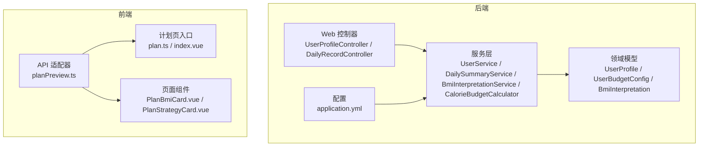
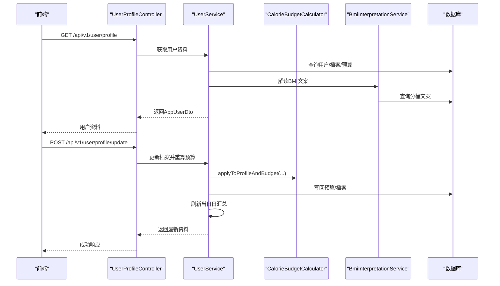
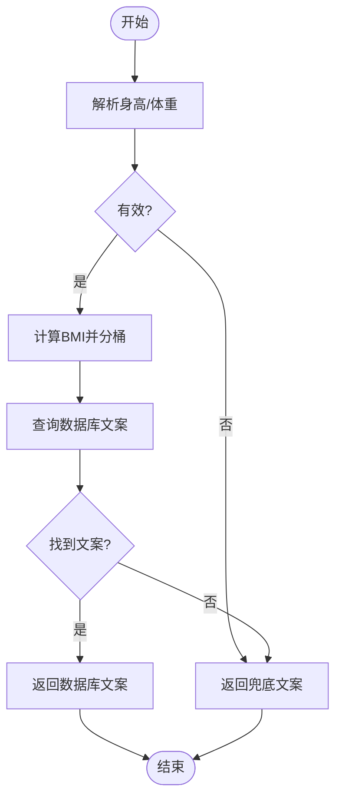
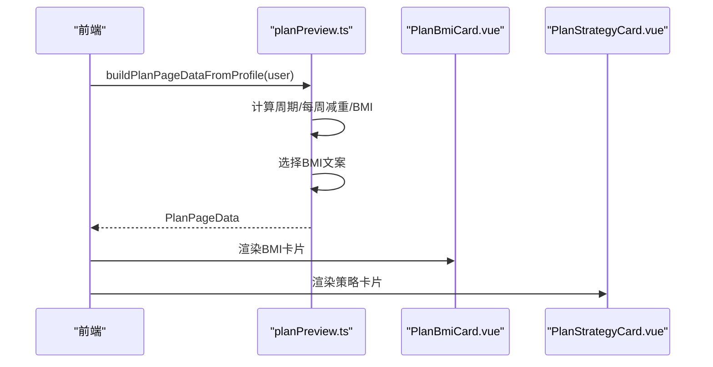
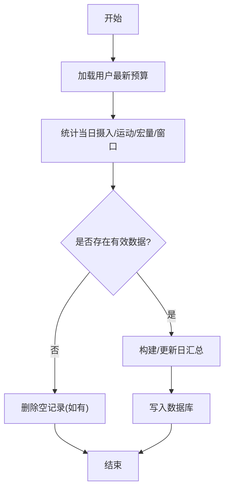
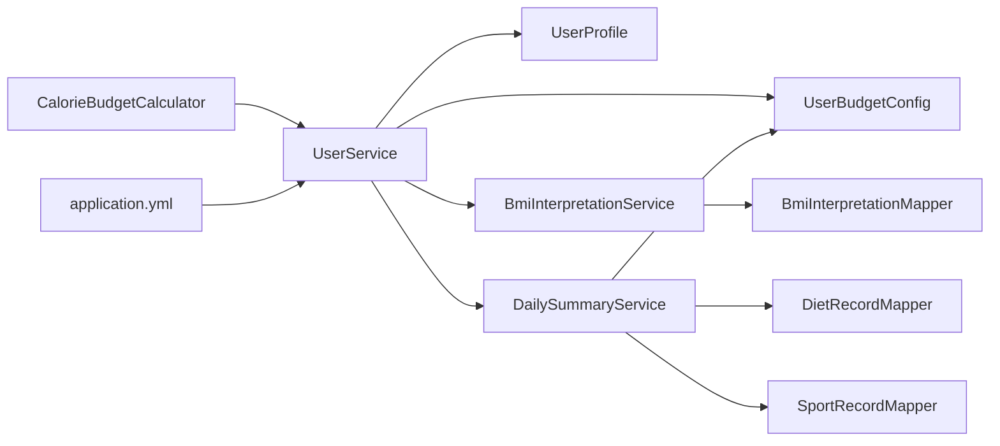
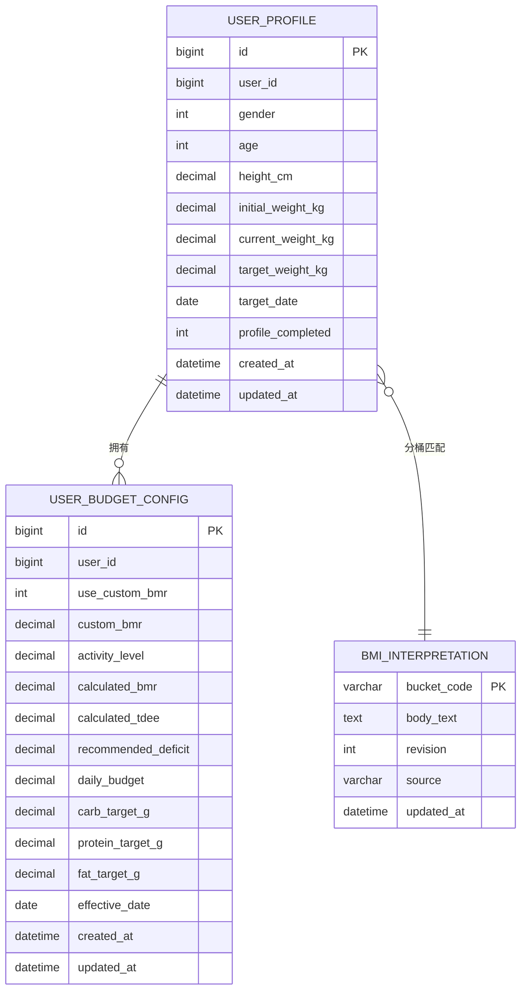

# 计划制定系统

<cite>
**本文引用的文件**
- [CalorieBudgetCalculator.java](file://backend/src/main/java/com/ypfr/loseweight/service/CalorieBudgetCalculator.java)
- [BmiInterpretationService.java](file://backend/src/main/java/com/ypfr/loseweight/service/BmiInterpretationService.java)
- [UserProfile.java](file://backend/src/main/java/com/ypfr/loseweight/domain/UserProfile.java)
- [UserBudgetConfig.java](file://backend/src/main/java/com/ypfr/loseweight/domain/UserBudgetConfig.java)
- [BmiInterpretation.java](file://backend/src/main/java/com/ypfr/loseweight/domain/BmiInterpretation.java)
- [BmiInterpretationMapper.java](file://backend/src/main/java/com/ypfr/loseweight/mapper/BmiInterpretationMapper.java)
- [UserService.java](file://backend/src/main/java/com/ypfr/loseweight/service/UserService.java)
- [DailySummaryService.java](file://backend/src/main/java/com/ypfr/loseweight/service/DailySummaryService.java)
- [UserProfileController.java](file://backend/src/main/java/com/ypfr/loseweight/web/UserProfileController.java)
- [DailyRecordController.java](file://backend/src/main/java/com/ypfr/loseweight/web/DailyRecordController.java)
- [application.yml](file://backend/src/main/resources/application.yml)
- [planPreview.ts](file://frontend/src/api/adapters/planPreview.ts)
- [PlanBmiCard.vue](file://frontend/src/components/plan/PlanBmiCard.vue)
- [PlanStrategyCard.vue](file://frontend/src/components/plan/PlanStrategyCard.vue)
- [plan.ts](file://frontend/src/api/plan.ts)
- [index.vue](file://frontend/src/pages/plan-result/index.vue)
</cite>

## 目录
1. [简介](#简介)
2. [项目结构](#项目结构)
3. [核心组件](#核心组件)
4. [架构总览](#架构总览)
5. [详细组件分析](#详细组件分析)
6. [依赖分析](#依赖分析)
7. [性能考虑](#性能考虑)
8. [故障排查指南](#故障排查指南)
9. [结论](#结论)
10. [附录](#附录)

## 简介
本系统围绕“计划制定”这一核心目标，提供从用户健康数据采集到个性化减脂计划生成的完整链路。系统以用户档案与预算配置为核心数据载体，通过BMI评估与热量预算计算两大引擎，输出可执行的计划要素（目标周期、每周减重、热量缺口、饮食节奏与运动建议），并配套日汇总与进度跟踪能力，帮助用户科学、可持续地达成减重目标。

## 项目结构
后端采用Spring Boot工程，按领域模型与职责分层组织；前端采用Vue生态，通过适配器将用户资料聚合为计划页面所需的数据结构。



图表来源
- [UserProfileController.java:28-90](file://backend/src/main/java/com/ypfr/loseweight/web/UserProfileController.java#L28-L90)
- [UserService.java:25-319](file://backend/src/main/java/com/ypfr/loseweight/service/UserService.java#L25-L319)
- [DailySummaryService.java:17-165](file://backend/src/main/java/com/ypfr/loseweight/service/DailySummaryService.java#L17-L165)
- [BmiInterpretationService.java:13-94](file://backend/src/main/java/com/ypfr/loseweight/service/BmiInterpretationService.java#L13-L94)
- [CalorieBudgetCalculator.java:10-142](file://backend/src/main/java/com/ypfr/loseweight/service/CalorieBudgetCalculator.java#L10-L142)
- [UserProfile.java:10-124](file://backend/src/main/java/com/ypfr/loseweight/domain/UserProfile.java#L10-L124)
- [UserBudgetConfig.java:10-151](file://backend/src/main/java/com/ypfr/loseweight/domain/UserBudgetConfig.java#L10-L151)
- [BmiInterpretation.java:8-59](file://backend/src/main/java/com/ypfr/loseweight/domain/BmiInterpretation.java#L8-L59)
- [application.yml:1-54](file://backend/src/main/resources/application.yml#L1-L54)
- [planPreview.ts:1-236](file://frontend/src/api/adapters/planPreview.ts#L1-L236)
- [PlanBmiCard.vue:1-197](file://frontend/src/components/plan/PlanBmiCard.vue#L1-L197)
- [PlanStrategyCard.vue:1-92](file://frontend/src/components/plan/PlanStrategyCard.vue#L1-L92)
- [plan.ts:1-10](file://frontend/src/api/plan.ts#L1-L10)
- [index.vue:1-42](file://frontend/src/pages/plan-result/index.vue#L1-L42)

章节来源
- [application.yml:1-54](file://backend/src/main/resources/application.yml#L1-L54)

## 核心组件
- BMI评估与健康解读：基于WHO常用分界对BMI进行分桶，结合数据库文案与兜底文案输出健康解读。
- 热量预算计算：依据Mifflin-St Jeor公式计算基础代谢率（BMR），结合活动系数（TDEE），根据目标体重与目标日期推导每日热量缺口与目标摄入。
- 个性化减脂计划：以用户资料为输入，生成计划周期、每周减重、BMI解读、热量缺口、饮食节奏与运动建议等展示数据。
- 日汇总与预算联动：资料更新后自动刷新当日日汇总，确保预算变更与实际摄入/运动一致。

章节来源
- [BmiInterpretationService.java:13-94](file://backend/src/main/java/com/ypfr/loseweight/service/BmiInterpretationService.java#L13-L94)
- [CalorieBudgetCalculator.java:10-142](file://backend/src/main/java/com/ypfr/loseweight/service/CalorieBudgetCalculator.java#L10-L142)
- [UserService.java:25-319](file://backend/src/main/java/com/ypfr/loseweight/service/UserService.java#L25-L319)
- [DailySummaryService.java:17-165](file://backend/src/main/java/com/ypfr/loseweight/service/DailySummaryService.java#L17-L165)
- [planPreview.ts:1-236](file://frontend/src/api/adapters/planPreview.ts#L1-L236)

## 架构总览
系统遵循“控制器-服务-领域模型-配置”的分层架构，前端通过适配器聚合用户资料生成计划页数据，后端通过服务层完成BMI与预算计算，并持久化至领域模型中。



图表来源
- [UserProfileController.java:57-78](file://backend/src/main/java/com/ypfr/loseweight/web/UserProfileController.java#L57-L78)
- [UserService.java:75-164](file://backend/src/main/java/com/ypfr/loseweight/service/UserService.java#L75-L164)
- [CalorieBudgetCalculator.java:67-140](file://backend/src/main/java/com/ypfr/loseweight/service/CalorieBudgetCalculator.java#L67-L140)
- [BmiInterpretationService.java:62-79](file://backend/src/main/java/com/ypfr/loseweight/service/BmiInterpretationService.java#L62-L79)

## 详细组件分析

### BMI评估与健康解读
- 分桶逻辑：依据WHO分界将BMI分为“偏瘦/正常/超重/肥胖”，并返回对应分桶代码。
- 文案解析：优先从数据库查询对应分桶的文案，失败或缺失时使用内置兜底文案。
- 输出：供前端BMI卡片展示与计划页描述使用。



图表来源
- [BmiInterpretationService.java:29-79](file://backend/src/main/java/com/ypfr/loseweight/service/BmiInterpretationService.java#L29-L79)
- [BmiInterpretation.java:8-59](file://backend/src/main/java/com/ypfr/loseweight/domain/BmiInterpretation.java#L8-L59)
- [BmiInterpretationMapper.java:1-9](file://backend/src/main/java/com/ypfr/loseweight/mapper/BmiInterpretationMapper.java#L1-L9)

章节来源
- [BmiInterpretationService.java:13-94](file://backend/src/main/java/com/ypfr/loseweight/service/BmiInterpretationService.java#L13-L94)
- [BmiInterpretation.java:8-59](file://backend/src/main/java/com/ypfr/loseweight/domain/BmiInterpretation.java#L8-L59)
- [BmiInterpretationMapper.java:1-9](file://backend/src/main/java/com/ypfr/loseweight/mapper/BmiInterpretationMapper.java#L1-L9)

### 热量预算计算（BMR/TDEE/目标热量缺口）
- BMR计算：采用Mifflin-St Jeor公式，性别、年龄、身高、体重作为输入。
- 活动系数：前端1-5档映射为系数，支持自定义BMR开关与数值。
- 目标缺口：根据当前体重、目标体重与目标日期计算每日缺口，限制在合理区间并确保不低于1200kcal。
- 结果落库：计算得到的BMR、TDEE、推荐缺口与日预算写入用户预算配置。

```mermaid
flowchart TD
S(["开始"]) --> CheckInputs["校验档案字段"]
CheckInputs --> InputsOK{"字段齐全?"}
InputsOK --> |否| SetDefault["设置默认缺口与日预算"]
InputsOK --> |是| CalcBMR["计算BMR"]
CalcBMR --> UseCustom{"启用自定义BMR?"}
UseCustom --> |是| BMR=Custom["使用自定义BMR"]
UseCustom --> |否| BMR=BMRFormula["使用Mifflin-St Jeor"]
BMR=Custom --> TDEE["TDEE = BMR × 活动系数"]
BMR=BMRFormula --> TDEE
TDEE --> Target["计算目标缺口"]
Target --> Clamp["约束缺口范围并确保最低摄入"]
Clamp --> Write["写入BMR/TDEE/缺口/日预算"]
SetDefault --> End(["结束"])
Write --> End
```

图表来源
- [CalorieBudgetCalculator.java:67-140](file://backend/src/main/java/com/ypfr/loseweight/service/CalorieBudgetCalculator.java#L67-L140)

章节来源
- [CalorieBudgetCalculator.java:10-142](file://backend/src/main/java/com/ypfr/loseweight/service/CalorieBudgetCalculator.java#L10-L142)
- [UserBudgetConfig.java:10-151](file://backend/src/main/java/com/ypfr/loseweight/domain/UserBudgetConfig.java#L10-L151)

### 个性化减脂计划（计划周期、目标设定、执行策略、进度跟踪）
- 计划周期：根据目标日期推导总天数，换算为4-24周区间。
- 每周减重：总减重/周数，保留一位小数。
- BMI解读：结合服务端文案与前端兜底文案。
- 执行策略：前端静态文案（热量缺口、运动频率、饮食节奏、饮食推荐）。
- 进度跟踪：前端里程碑权重值与时间轴标签生成。



图表来源
- [planPreview.ts:180-235](file://frontend/src/api/adapters/planPreview.ts#L180-L235)
- [PlanBmiCard.vue:1-197](file://frontend/src/components/plan/PlanBmiCard.vue#L1-L197)
- [PlanStrategyCard.vue:1-92](file://frontend/src/components/plan/PlanStrategyCard.vue#L1-L92)

章节来源
- [planPreview.ts:1-236](file://frontend/src/api/adapters/planPreview.ts#L1-L236)
- [PlanBmiCard.vue:1-197](file://frontend/src/components/plan/PlanBmiCard.vue#L1-L197)
- [PlanStrategyCard.vue:1-92](file://frontend/src/components/plan/PlanStrategyCard.vue#L1-L92)
- [plan.ts:1-10](file://frontend/src/api/plan.ts#L1-L10)
- [index.vue:1-42](file://frontend/src/pages/plan-result/index.vue#L1-L42)

### 日汇总与预算联动
- 预算读取：按用户加载最新预算配置。
- 汇总计算：摄入总热量、运动消耗、剩余/缺口、宏量与进食窗口等。
- 条件写入：当存在任何有效数据时写入或更新；否则删除空记录。
- 变更触发：资料更新后刷新当日日汇总，确保预算变更与日汇总一致。



图表来源
- [DailySummaryService.java:41-154](file://backend/src/main/java/com/ypfr/loseweight/service/DailySummaryService.java#L41-L154)
- [UserProfileController.java:71-76](file://backend/src/main/java/com/ypfr/loseweight/web/UserProfileController.java#L71-L76)

章节来源
- [DailySummaryService.java:17-165](file://backend/src/main/java/com/ypfr/loseweight/service/DailySummaryService.java#L17-L165)
- [UserProfileController.java:57-78](file://backend/src/main/java/com/ypfr/loseweight/web/UserProfileController.java#L57-L78)

## 依赖分析
- 组件耦合
  - UserService依赖UserBudgetConfig、UserProfile、BmiInterpretationService、DailySummaryMapper等，承担资料聚合与预算计算职责。
  - CalorieBudgetCalculator为纯工具类，被UserService调用，无外部依赖。
  - BmiInterpretationService依赖BmiInterpretationMapper，负责BMI文案解析。
  - DailySummaryService依赖DailySummaryMapper、DietRecordMapper、SportRecordMapper与UserService，负责日汇总与预算联动。
- 外部依赖
  - 数据源：MySQL（application.yml配置）。
  - 前端：Vue组件与适配器，通过API聚合用户资料生成计划页数据。



图表来源
- [UserService.java:25-54](file://backend/src/main/java/com/ypfr/loseweight/service/UserService.java#L25-L54)
- [DailySummaryService.java:17-34](file://backend/src/main/java/com/ypfr/loseweight/service/DailySummaryService.java#L17-L34)
- [BmiInterpretationService.java:13-27](file://backend/src/main/java/com/ypfr/loseweight/service/BmiInterpretationService.java#L13-L27)
- [application.yml:8-11](file://backend/src/main/resources/application.yml#L8-L11)

章节来源
- [UserService.java:25-54](file://backend/src/main/java/com/ypfr/loseweight/service/UserService.java#L25-L54)
- [DailySummaryService.java:17-34](file://backend/src/main/java/com/ypfr/loseweight/service/DailySummaryService.java#L17-L34)
- [BmiInterpretationService.java:13-27](file://backend/src/main/java/com/ypfr/loseweight/service/BmiInterpretationService.java#L13-L27)
- [application.yml:8-11](file://backend/src/main/resources/application.yml#L8-L11)

## 性能考虑
- 计算复杂度
  - BMI与BMR计算为常数时间操作，开销极低。
  - 日汇总涉及多表统计，建议在数据库层面建立合适索引（用户ID、日期范围）以提升查询效率。
- 缓存策略
  - 可对BMI文案与常用计划参数进行缓存，减少重复查询。
- 并发与一致性
  - 资料更新与日汇总刷新在同一事务边界内处理，避免脏读与不一致。

## 故障排查指南
- BMI文案为空
  - 现象：BMI解读显示兜底文案。
  - 排查：确认bmi_interpretation表中对应分桶存在且body_text非空；检查数据库连接与权限。
- 预算未更新
  - 现象：日汇总remain/budgetDeficit未变化。
  - 排查：确认UserProfileController在更新资料后调用了dailySummaryService.updateForDay；检查数据库写入是否成功。
- 活动系数异常
  - 现象：TDEE与日预算不符合预期。
  - 排查：确认前端传入的activityLevel档位（1-5）正确映射；检查UserBudgetConfig.activityLevel是否被正确写入。
- 目标缺口越界
  - 现象：缺口过小或过大。
  - 排查：确认目标体重与目标日期计算逻辑；检查CalorieBudgetCalculator中缺口上下限与最低摄入约束。

章节来源
- [BmiInterpretationService.java:68-78](file://backend/src/main/java/com/ypfr/loseweight/service/BmiInterpretationService.java#L68-L78)
- [UserProfileController.java:71-76](file://backend/src/main/java/com/ypfr/loseweight/web/UserProfileController.java#L71-L76)
- [CalorieBudgetCalculator.java:127-139](file://backend/src/main/java/com/ypfr/loseweight/service/CalorieBudgetCalculator.java#L127-L139)
- [DailySummaryService.java:76-85](file://backend/src/main/java/com/ypfr/loseweight/service/DailySummaryService.java#L76-L85)

## 结论
本系统通过清晰的领域模型与服务层职责划分，实现了从BMI评估到热量预算再到计划生成与日汇总联动的闭环。前后端协作以适配器模式聚合用户资料，既保证了后端算法的稳定性，也提升了前端展示的灵活性。建议在生产环境中进一步完善缓存与索引策略，并持续优化文案与策略的可配置性。

## 附录

### 领域模型与关键字段
- 用户档案（UserProfile）
  - 关键字段：性别、年龄、身高cm、当前体重kg、目标体重kg、目标日期、初始体重kg、档案完成状态。
  - 作用：承载BMI计算与目标设定输入。
- 预算配置（UserBudgetConfig）
  - 关键字段：是否使用自定义BMR、自定义BMR值、活动系数、计算出的BMR/TDEE、推荐缺口、日预算、宏量目标（碳水/蛋白/脂肪）、生效日期。
  - 作用：承载热量预算计算结果与计划执行依据。
- BMI文案（BmiInterpretation）
  - 关键字段：分桶代码、文案内容、版本号、来源、更新时间。
  - 作用：提供健康解读文案。



图表来源
- [UserProfile.java:10-124](file://backend/src/main/java/com/ypfr/loseweight/domain/UserProfile.java#L10-L124)
- [UserBudgetConfig.java:10-151](file://backend/src/main/java/com/ypfr/loseweight/domain/UserBudgetConfig.java#L10-L151)
- [BmiInterpretation.java:8-59](file://backend/src/main/java/com/ypfr/loseweight/domain/BmiInterpretation.java#L8-L59)

### 接口与调用关系
- 用户资料接口
  - GET /api/v1/user/profile：返回AppUserDto（含BMI解读、BMR、TDEE、日预算、活动档位等）。
  - POST /api/v1/user/profile/update：更新档案并重算预算，随后刷新当日日汇总。
- 日记录接口
  - GET /api/v1/users/{userId}/daily-records：按日期查询当日日汇总（摄入、运动、剩余、缺口、宏量、窗口等）。

章节来源
- [UserProfileController.java:57-78](file://backend/src/main/java/com/ypfr/loseweight/web/UserProfileController.java#L57-L78)
- [DailyRecordController.java:27-38](file://backend/src/main/java/com/ypfr/loseweight/web/DailyRecordController.java#L27-L38)

### 配置项与参数
- 数据库连接
  - spring.datasource.url、username、password：用于连接MySQL。
- 应用与安全
  - app.jwt.secret（需≥32字符）、expire-seconds：JWT密钥与过期时间。
- 第三方服务
  - aliyun.food.host/path/appcode：食物热量查询接口配置（与计划制定流程解耦）。

章节来源
- [application.yml:8-46](file://backend/src/main/resources/application.yml#L8-L46)