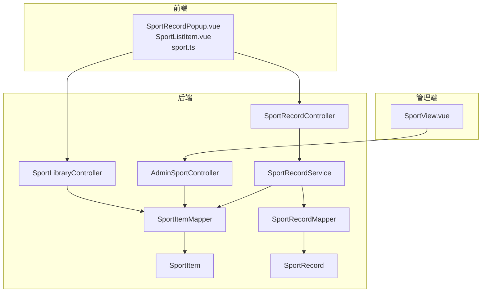
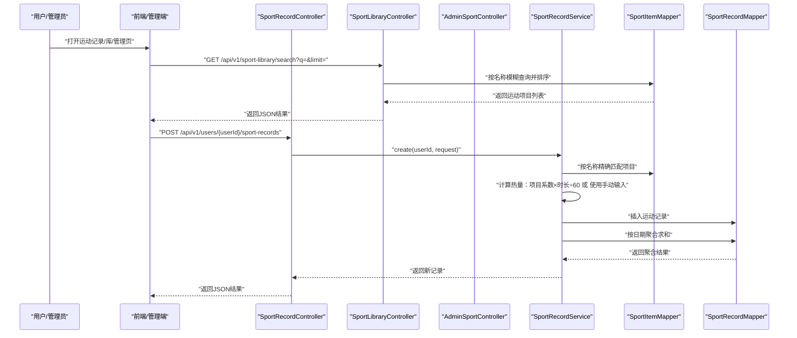
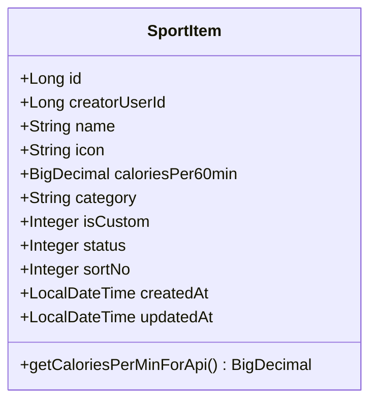
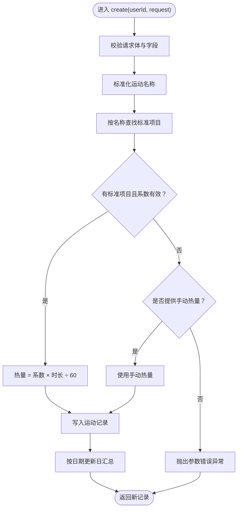
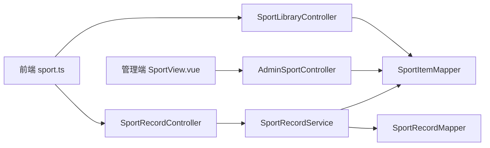

# 运动追踪系统

<cite>
**本文引用的文件**
- [SportItem.java](file://backend/src/main/java/com/ypfr/loseweight/domain/SportItem.java)
- [SportRecord.java](file://backend/src/main/java/com/ypfr/loseweight/domain/SportRecord.java)
- [SportRecordService.java](file://backend/src/main/java/com/ypfr/loseweight/service/SportRecordService.java)
- [SportRecordController.java](file://backend/src/main/java/com/ypfr/loseweight/web/SportRecordController.java)
- [SportLibraryController.java](file://backend/src/main/java/com/ypfr/loseweight/web/SportLibraryController.java)
- [SportItemMapper.java](file://backend/src/main/java/com/ypfr/loseweight/mapper/SportItemMapper.java)
- [SportRecordMapper.java](file://backend/src/main/java/com/ypfr/loseweight/mapper/SportRecordMapper.java)
- [CreateSportRecordRequest.java](file://backend/src/main/java/com/ypfr/loseweight/web/dto/CreateSportRecordRequest.java)
- [AdminSportController.java](file://backend/src/main/java/com/ypfr/loseweight/web/AdminSportController.java)
- [application.yml](file://backend/src/main/resources/application.yml)
- [sport.ts](file://frontend/src/api/sport.ts)
- [SportListItem.vue](file://frontend/src/components/SportListItem.vue)
- [SportRecordPopup.vue](file://frontend/src/components/SportRecordPopup.vue)
- [SportView.vue](file://admin-frontend/src/views/SportView.vue)
- [V006__sport_item_migrate.sql](file://database/migrations/V006__sport_item_migrate.sql)
- [V009__sport_record_prd_columns.sql](file://database/migrations/V009__sport_record_prd_columns.sql)
</cite>

## 目录
1. [简介](#简介)
2. [项目结构](#项目结构)
3. [核心组件](#核心组件)
4. [架构总览](#架构总览)
5. [详细组件分析](#详细组件分析)
6. [依赖分析](#依赖分析)
7. [性能考虑](#性能考虑)
8. [故障排查指南](#故障排查指南)
9. [结论](#结论)
10. [附录](#附录)

## 简介
本文件为“运动追踪系统”的实现文档，聚焦于以下目标：
- 运动项目库管理：标准运动项目、热量消耗系数、分类组织与维护
- 运动记录管理：运动类型选择、时长记录、热量计算与持久化
- 运动数据治理：数据标准化、质量控制、历史数据迁移
- 领域模型与调用关系：接口定义、参数与返回值、错误处理
- 准确性保障与用户习惯培养策略：基于代码实现的实践建议

## 项目结构
后端采用 Spring Boot + MyBatis-Plus 架构，按领域分层组织：
- domain 层：实体类（运动项目、运动记录）
- mapper 层：数据库访问接口
- service 层：业务逻辑（运动记录创建、删除、查询等）
- web 层：控制器（运动记录、运动库、管理员运动项目）
- 前端与管理端：分别提供用户侧运动记录录入与管理员侧运动项目维护界面
- 数据库迁移脚本：支持运动项目与运动记录的演进

图表来源
- [SportRecordController.java:14-36](file://backend/src/main/java/com/ypfr/loseweight/web/SportRecordController.java#L14-L36)
- [SportLibraryController.java:14-36](file://backend/src/main/java/com/ypfr/loseweight/web/SportLibraryController.java#L14-L36)
- [AdminSportController.java:20-67](file://backend/src/main/java/com/ypfr/loseweight/web/AdminSportController.java#L20-L67)
- [SportRecordService.java:17-111](file://backend/src/main/java/com/ypfr/loseweight/service/SportRecordService.java#L17-L111)
- [SportItemMapper.java:1-9](file://backend/src/main/java/com/ypfr/loseweight/mapper/SportItemMapper.java#L1-L9)
- [SportRecordMapper.java:13-31](file://backend/src/main/java/com/ypfr/loseweight/mapper/SportRecordMapper.java#L13-L31)
- [SportItem.java:14-131](file://backend/src/main/java/com/ypfr/loseweight/domain/SportItem.java#L14-L131)
- [SportRecord.java:10-124](file://backend/src/main/java/com/ypfr/loseweight/domain/SportRecord.java#L10-L124)

章节来源
- [application.yml:1-54](file://backend/src/main/resources/application.yml#L1-L54)

## 核心组件
- 运动项目实体（SportItem）：包含名称、图标、每60分钟消耗热量、分类、自定义标记、状态、排序、时间戳等字段，并提供每分钟消耗的兼容字段
- 运动记录实体（SportRecord）：包含用户ID、记录日期、运动项目ID、快照信息（名称、图标）、时长（分钟）、消耗热量、来源、记录时间等
- 运动记录服务（SportRecordService）：负责创建、删除、查询当日运动记录；根据项目系数或手动输入热量进行计算；触发日汇总更新
- 运动记录控制器（SportRecordController）：暴露创建与删除接口
- 运动库控制器（SportLibraryController）：提供运动项目检索接口
- 运动项目映射（SportItemMapper）与运动记录映射（SportRecordMapper）：提供基础 CRUD 与聚合查询
- 管理员运动项目控制器（AdminSportController）：提供管理员侧的增删改查
- 前端 API（sport.ts）与组件（SportRecordPopup.vue、SportListItem.vue）：用户侧运动记录录入与展示
- 管理端页面（SportView.vue）：管理员侧运动项目维护

章节来源
- [SportItem.java:14-131](file://backend/src/main/java/com/ypfr/loseweight/domain/SportItem.java#L14-L131)
- [SportRecord.java:10-124](file://backend/src/main/java/com/ypfr/loseweight/domain/SportRecord.java#L10-L124)
- [SportRecordService.java:17-111](file://backend/src/main/java/com/ypfr/loseweight/service/SportRecordService.java#L17-L111)
- [SportRecordController.java:14-36](file://backend/src/main/java/com/ypfr/loseweight/web/SportRecordController.java#L14-L36)
- [SportLibraryController.java:14-36](file://backend/src/main/java/com/ypfr/loseweight/web/SportLibraryController.java#L14-L36)
- [SportItemMapper.java:1-9](file://backend/src/main/java/com/ypfr/loseweight/mapper/SportItemMapper.java#L1-L9)
- [SportRecordMapper.java:13-31](file://backend/src/main/java/com/ypfr/loseweight/mapper/SportRecordMapper.java#L13-L31)
- [AdminSportController.java:20-67](file://backend/src/main/java/com/ypfr/loseweight/web/AdminSportController.java#L20-L67)
- [sport.ts:1-34](file://frontend/src/api/sport.ts#L1-L34)
- [SportRecordPopup.vue:1-216](file://frontend/src/components/SportRecordPopup.vue#L1-L216)
- [SportListItem.vue:1-87](file://frontend/src/components/SportListItem.vue#L1-L87)
- [SportView.vue:1-144](file://admin-frontend/src/views/SportView.vue#L1-L144)

## 架构总览
系统遵循典型的 MVC 分层与领域驱动设计：
- 控制器层：接收请求，校验参数，调用服务层
- 服务层：编排业务规则（如热量计算、数据一致性），调用映射层
- 映射层：封装 SQL 查询与聚合
- 前端/管理端：通过 HTTP 接口与后端交互

图表来源
- [SportLibraryController.java:24-34](file://backend/src/main/java/com/ypfr/loseweight/web/SportLibraryController.java#L24-L34)
- [SportRecordController.java:24-34](file://backend/src/main/java/com/ypfr/loseweight/web/SportRecordController.java#L24-L34)
- [SportRecordService.java:33-84](file://backend/src/main/java/com/ypfr/loseweight/service/SportRecordService.java#L33-L84)
- [SportItemMapper.java:1-9](file://backend/src/main/java/com/ypfr/loseweight/mapper/SportItemMapper.java#L1-L9)
- [SportRecordMapper.java:16-29](file://backend/src/main/java/com/ypfr/loseweight/mapper/SportRecordMapper.java#L16-L29)

## 详细组件分析

### 运动项目库管理（标准项目、系数、分类）
- 数据模型
  - 字段要点：名称、图标、每60分钟消耗热量、分类、是否自定义、状态、排序、时间戳
  - 兼容字段：提供每分钟消耗的序列化字段，便于旧前端兼容
- 检索接口
  - 支持关键词模糊匹配与限制返回条数
  - 返回字段包含名称、图标、分类、每分钟消耗等
- 管理端维护
  - 管理员可新增、编辑、删除运动项目，设置分类、排序、状态与每60分钟消耗

图表来源
- [SportItem.java:14-131](file://backend/src/main/java/com/ypfr/loseweight/domain/SportItem.java#L14-L131)

章节来源
- [SportLibraryController.java:24-34](file://backend/src/main/java/com/ypfr/loseweight/web/SportLibraryController.java#L24-L34)
- [SportItemMapper.java:1-9](file://backend/src/main/java/com/ypfr/loseweight/mapper/SportItemMapper.java#L1-L9)
- [SportView.vue:1-144](file://admin-frontend/src/views/SportView.vue#L1-L144)
- [AdminSportController.java:32-65](file://backend/src/main/java/com/ypfr/loseweight/web/AdminSportController.java#L32-L65)

### 运动记录管理（类型选择、时长、热量计算）
- 请求体与参数
  - 字段：运动名称、时长（分钟）、热量（可选）、图标快照、记录时间字符串
- 创建流程
  - 校验必填项与数值范围
  - 按名称匹配标准运动项目，取其每60分钟消耗系数
  - 热量计算优先级：项目系数×时长÷60；若无项目则使用手动输入热量
  - 写入记录并按日期触发日汇总更新
- 删除流程
  - 校验记录存在与归属，删除后按日期更新汇总

图表来源
- [SportRecordService.java:33-84](file://backend/src/main/java/com/ypfr/loseweight/service/SportRecordService.java#L33-L84)
- [CreateSportRecordRequest.java:3-51](file://backend/src/main/java/com/ypfr/loseweight/web/dto/CreateSportRecordRequest.java#L3-L51)

章节来源
- [SportRecordService.java:33-110](file://backend/src/main/java/com/ypfr/loseweight/service/SportRecordService.java#L33-L110)
- [SportRecordController.java:24-34](file://backend/src/main/java/com/ypfr/loseweight/web/SportRecordController.java#L24-L34)
- [SportRecordMapper.java:16-29](file://backend/src/main/java/com/ypfr/loseweight/mapper/SportRecordMapper.java#L16-L29)
- [sport.ts:21-33](file://frontend/src/api/sport.ts#L21-L33)
- [SportRecordPopup.vue:1-216](file://frontend/src/components/SportRecordPopup.vue#L1-L216)

### 运动数据治理（标准化、质量控制、迁移）
- 数据标准化
  - 统一使用“每60分钟消耗热量”作为标准系数，前端兼容“每分钟消耗”
  - 记录中同时保留项目快照（名称、图标），避免后续变更影响历史记录
- 质量控制
  - 参数校验：名称非空、时长正数、热量非负
  - 热量来源优先级：项目系数 > 手动输入；两者缺失时报错
- 历史数据迁移
  - 迁移脚本包含运动项目与运动记录的结构演进，确保历史数据可读与可写
  - 迁移脚本对字段命名与约束进行规范化，提升一致性

章节来源
- [SportItem.java:23-40](file://backend/src/main/java/com/ypfr/loseweight/domain/SportItem.java#L23-L40)
- [SportRecordService.java:33-84](file://backend/src/main/java/com/ypfr/loseweight/service/SportRecordService.java#L33-L84)
- [V006__sport_item_migrate.sql](file://database/migrations/V006__sport_item_migrate.sql)
- [V009__sport_record_prd_columns.sql](file://database/migrations/V009__sport_record_prd_columns.sql)

## 依赖分析
- 控制器依赖服务，服务依赖映射层
- 前端通过 API 调用控制器，管理端通过管理员控制器维护项目
- 映射层依赖数据库表结构（运动项目、运动记录）

图表来源
- [sport.ts:1-34](file://frontend/src/api/sport.ts#L1-L34)
- [SportRecordController.java:14-36](file://backend/src/main/java/com/ypfr/loseweight/web/SportRecordController.java#L14-L36)
- [SportLibraryController.java:14-36](file://backend/src/main/java/com/ypfr/loseweight/web/SportLibraryController.java#L14-L36)
- [AdminSportController.java:20-67](file://backend/src/main/java/com/ypfr/loseweight/web/AdminSportController.java#L20-L67)
- [SportRecordService.java:17-31](file://backend/src/main/java/com/ypfr/loseweight/service/SportRecordService.java#L17-L31)
- [SportItemMapper.java:1-9](file://backend/src/main/java/com/ypfr/loseweight/mapper/SportItemMapper.java#L1-L9)
- [SportRecordMapper.java:13-31](file://backend/src/main/java/com/ypfr/loseweight/mapper/SportRecordMapper.java#L13-L31)

## 性能考虑
- 查询优化
  - 运动库检索支持关键词模糊匹配与上限限制，避免全表扫描
  - 日汇总通过按日期分组聚合，减少重复计算
- 计算精度
  - 热量计算使用高精度小数运算，并在服务层统一四舍五入到指定精度
- 并发与一致性
  - 记录创建后按日期更新日汇总，尽量降低并发冲突影响

## 故障排查指南
- 常见错误与定位
  - 请求体为空或字段缺失：检查前端提交字段与后端 DTO 定义
  - 时长非正或热量无效：确认用户输入与服务端校验逻辑
  - 无标准项目且未提供手动热量：需补充项目系数或允许手动输入
- 排查步骤
  - 查看控制器与服务层日志，确认参数解析与业务分支
  - 核对数据库中运动项目是否存在且状态正常
  - 检查迁移脚本是否执行完成，确认表结构与字段约束

章节来源
- [SportRecordService.java:33-84](file://backend/src/main/java/com/ypfr/loseweight/service/SportRecordService.java#L33-L84)
- [SportRecordController.java:24-34](file://backend/src/main/java/com/ypfr/loseweight/web/SportRecordController.java#L24-L34)

## 结论
本系统以清晰的领域模型与分层架构实现了运动项目库与运动记录的完整闭环：标准项目与系数驱动计算，手动输入作为兜底；前端与管理端协同，保障用户体验与运营效率。通过迁移脚本与参数校验，系统具备良好的可演进性与数据质量保障。

## 附录

### 接口定义与参数说明
- 运动库检索
  - 方法与路径：GET /api/v1/sport-library/search
  - 查询参数：q（关键词，可选）、limit（返回条数，默认50，范围1~200）
  - 返回：运动项目列表（包含名称、图标、分类、每分钟消耗等）
- 创建运动记录
  - 方法与路径：POST /api/v1/users/{userId}/sport-records
  - 请求体字段：sportName、durationMin、calories（可选）、icon（可选）、recordedAt
  - 返回：新建运动记录对象
- 删除运动记录
  - 方法与路径：DELETE /api/v1/users/{userId}/sport-records/{id}
  - 返回：空对象

章节来源
- [SportLibraryController.java:24-34](file://backend/src/main/java/com/ypfr/loseweight/web/SportLibraryController.java#L24-L34)
- [SportRecordController.java:24-34](file://backend/src/main/java/com/ypfr/loseweight/web/SportRecordController.java#L24-L34)
- [CreateSportRecordRequest.java:3-51](file://backend/src/main/java/com/ypfr/loseweight/web/dto/CreateSportRecordRequest.java#L3-L51)

### 领域模型与字段说明
- 运动项目（SportItem）
  - 关键字段：id、creatorUserId、name、icon、caloriesPer60min、category、isCustom、status、sortNo、createdAt、updatedAt
  - 兼容字段：caloriesPerMin（每分钟消耗）
- 运动记录（SportRecord）
  - 关键字段：id、userId、recordDate、sportItemId、sportNameSnapshot、iconSnapshot、durationMin、caloriesBurned、source、recordTime、createdAt、updatedAt

章节来源
- [SportItem.java:14-131](file://backend/src/main/java/com/ypfr/loseweight/domain/SportItem.java#L14-L131)
- [SportRecord.java:10-124](file://backend/src/main/java/com/ypfr/loseweight/domain/SportRecord.java#L10-L124)

### 用户体验与习惯培养策略
- 精准反馈：在运动记录弹窗中展示名称与预计消耗，帮助用户建立量化意识
- 便捷入口：运动库支持快速检索，减少选择成本
- 可靠性：记录快照与系数优先策略，确保历史数据稳定可追溯
- 管理效率：管理员端集中维护项目，统一标准与分类，减少歧义

章节来源
- [SportRecordPopup.vue:1-216](file://frontend/src/components/SportRecordPopup.vue#L1-L216)
- [SportListItem.vue:1-87](file://frontend/src/components/SportListItem.vue#L1-L87)
- [SportView.vue:1-144](file://admin-frontend/src/views/SportView.vue#L1-L144)