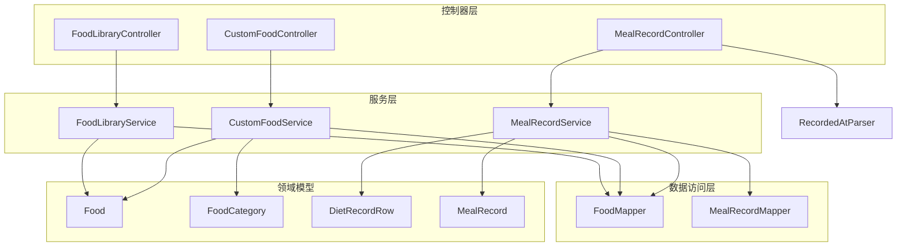
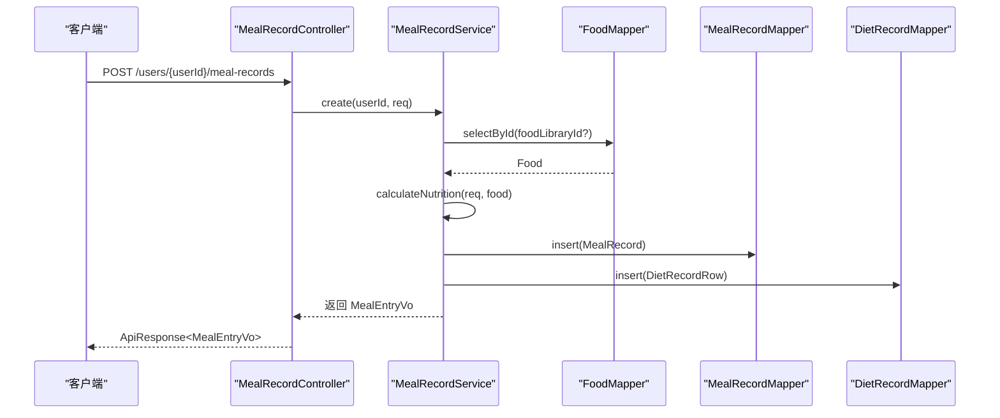
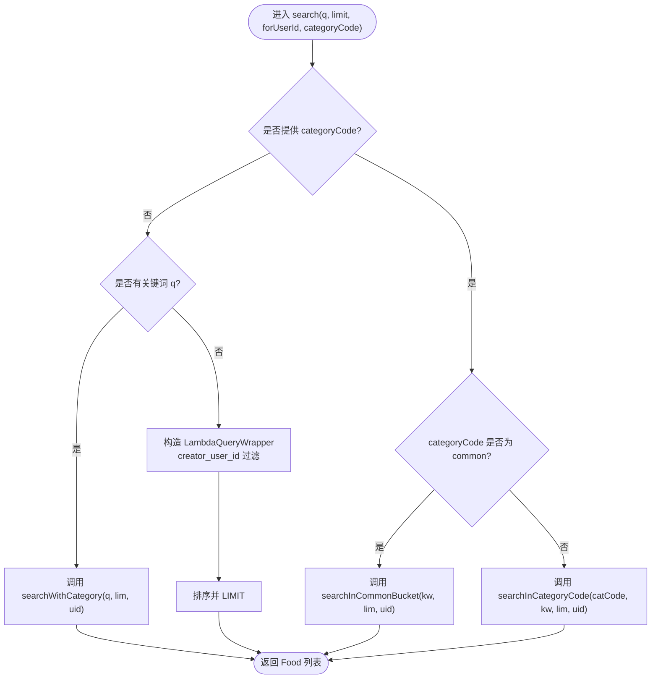
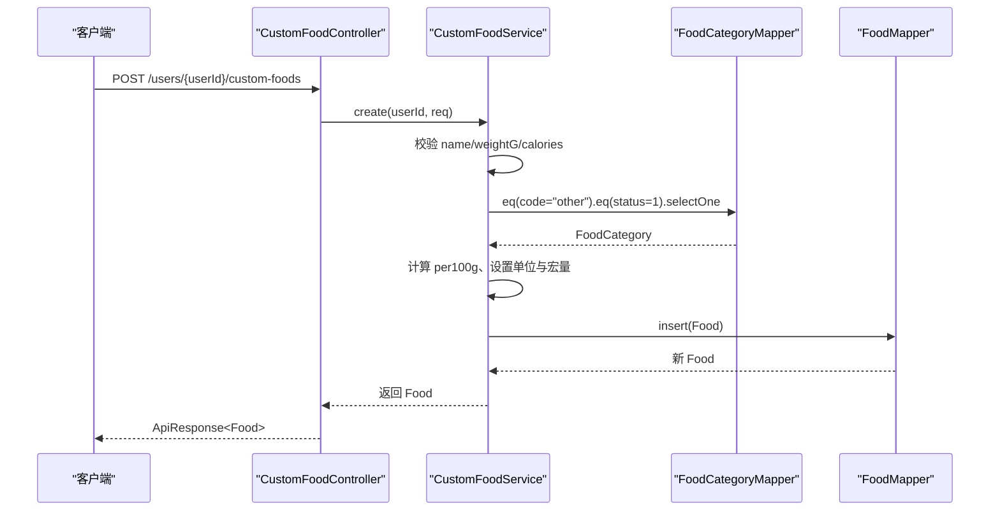
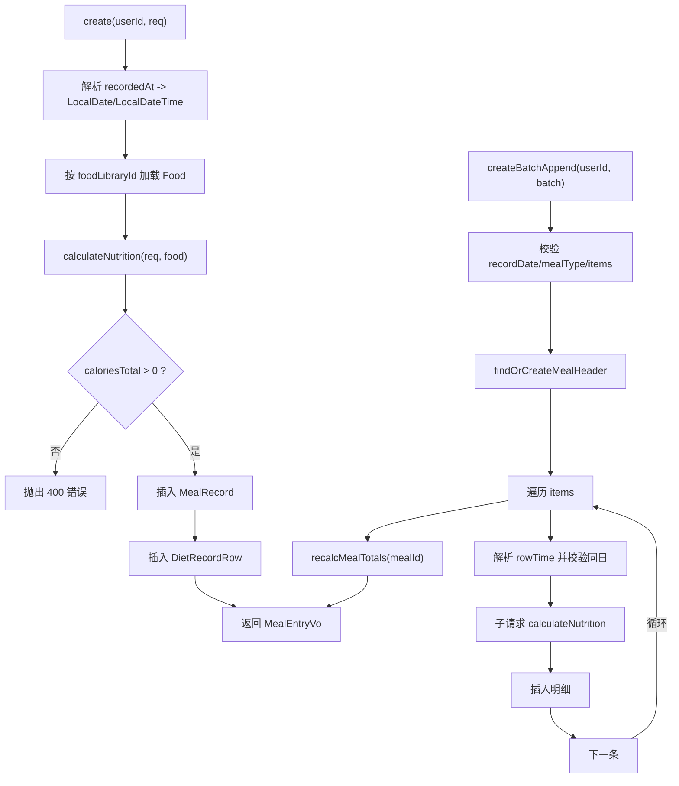
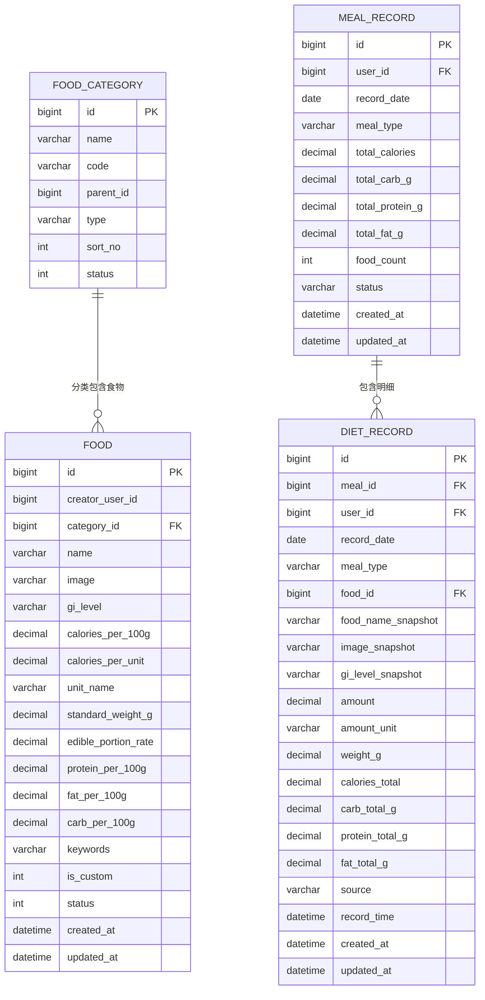
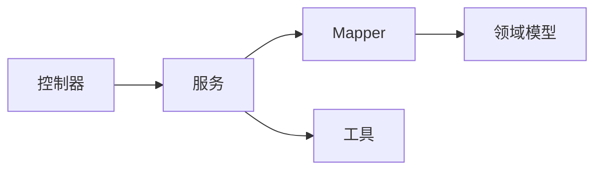

# 饮食记录系统

<cite>
**本文引用的文件**
- [Food.java](file://backend/src/main/java/com/ypfr/loseweight/domain/Food.java)
- [FoodCategory.java](file://backend/src/main/java/com/ypfr/loseweight/domain/FoodCategory.java)
- [DietRecordRow.java](file://backend/src/main/java/com/ypfr/loseweight/domain/DietRecordRow.java)
- [MealRecord.java](file://backend/src/main/java/com/ypfr/loseweight/domain/MealRecord.java)
- [FoodLibraryService.java](file://backend/src/main/java/com/ypfr/loseweight/service/FoodLibraryService.java)
- [CustomFoodService.java](file://backend/src/main/java/com/ypfr/loseweight/service/CustomFoodService.java)
- [MealRecordService.java](file://backend/src/main/java/com/ypfr/loseweight/service/MealRecordService.java)
- [FoodLibraryController.java](file://backend/src/main/java/com/ypfr/loseweight/web/FoodLibraryController.java)
- [CustomFoodController.java](file://backend/src/main/java/com/ypfr/loseweight/web/CustomFoodController.java)
- [MealRecordController.java](file://backend/src/main/java/com/ypfr/loseweight/web/MealRecordController.java)
- [FoodMapper.java](file://backend/src/main/java/com/ypfr/loseweight/mapper/FoodMapper.java)
- [MealRecordMapper.java](file://backend/src/main/java/com/ypfr/loseweight/mapper/MealRecordMapper.java)
- [CreateCustomFoodRequest.java](file://backend/src/main/java/com/ypfr/loseweight/web/dto/CreateCustomFoodRequest.java)
- [CreateMealRecordRequest.java](file://backend/src/main/java/com/ypfr/loseweight/web/dto/CreateMealRecordRequest.java)
- [RecordedAtParser.java](file://backend/src/main/java/com/ypfr/loseweight/util/RecordedAtParser.java)
- [application.yml](file://backend/src/main/resources/application.yml)
</cite>

## 目录
1. [简介](#简介)
2. [项目结构](#项目结构)
3. [核心组件](#核心组件)
4. [架构总览](#架构总览)
5. [详细组件分析](#详细组件分析)
6. [依赖分析](#依赖分析)
7. [性能考虑](#性能考虑)
8. [故障排查指南](#故障排查指南)
9. [结论](#结论)
10. [附录](#附录)

## 简介
本文件面向“饮食记录系统”的实现与使用，围绕以下目标展开：
- 食物库查询：标准食物数据、分类检索、营养成分查询
- 自定义食物创建：用户自定义食物、热量计算、数据验证
- 饮食记录管理：餐次记录、时间戳处理、数据聚合

文档从接口定义、领域模型、调用关系、数据流、错误处理与性能优化等维度进行深入说明，并结合实际代码路径给出参考定位。

## 项目结构
后端采用 Spring Boot + MyBatis-Plus 的分层架构：
- 控制器层：对外暴露 REST 接口，负责参数解析与鉴权
- 服务层：业务编排与规则校验，协调 Mapper 完成持久化
- 数据访问层：基于 MyBatis-Plus 的 Mapper 接口
- 领域模型：对应数据库表的实体类
- 工具与配置：时间解析工具、应用配置

图表来源
- [FoodLibraryController.java:1-31](file://backend/src/main/java/com/ypfr/loseweight/web/FoodLibraryController.java#L1-L31)
- [CustomFoodController.java:1-36](file://backend/src/main/java/com/ypfr/loseweight/web/CustomFoodController.java#L1-L36)
- [MealRecordController.java:1-61](file://backend/src/main/java/com/ypfr/loseweight/web/MealRecordController.java#L1-L61)
- [FoodLibraryService.java:1-53](file://backend/src/main/java/com/ypfr/loseweight/service/FoodLibraryService.java#L1-L53)
- [CustomFoodService.java:1-88](file://backend/src/main/java/com/ypfr/loseweight/service/CustomFoodService.java#L1-L88)
- [MealRecordService.java:1-435](file://backend/src/main/java/com/ypfr/loseweight/service/MealRecordService.java#L1-L435)
- [FoodMapper.java:1-69](file://backend/src/main/java/com/ypfr/loseweight/mapper/FoodMapper.java#L1-L69)
- [MealRecordMapper.java:1-9](file://backend/src/main/java/com/ypfr/loseweight/mapper/MealRecordMapper.java#L1-L9)
- [Food.java:1-213](file://backend/src/main/java/com/ypfr/loseweight/domain/Food.java#L1-L213)
- [FoodCategory.java:1-83](file://backend/src/main/java/com/ypfr/loseweight/domain/FoodCategory.java#L1-L83)
- [DietRecordRow.java:1-196](file://backend/src/main/java/com/ypfr/loseweight/domain/DietRecordRow.java#L1-L196)
- [MealRecord.java:1-125](file://backend/src/main/java/com/ypfr/loseweight/domain/MealRecord.java#L1-L125)
- [RecordedAtParser.java:1-32](file://backend/src/main/java/com/ypfr/loseweight/util/RecordedAtParser.java#L1-L32)

章节来源
- [FoodLibraryController.java:1-31](file://backend/src/main/java/com/ypfr/loseweight/web/FoodLibraryController.java#L1-L31)
- [CustomFoodController.java:1-36](file://backend/src/main/java/com/ypfr/loseweight/web/CustomFoodController.java#L1-L36)
- [MealRecordController.java:1-61](file://backend/src/main/java/com/ypfr/loseweight/web/MealRecordController.java#L1-L61)
- [FoodLibraryService.java:1-53](file://backend/src/main/java/com/ypfr/loseweight/service/FoodLibraryService.java#L1-L53)
- [CustomFoodService.java:1-88](file://backend/src/main/java/com/ypfr/loseweight/service/CustomFoodService.java#L1-L88)
- [MealRecordService.java:1-435](file://backend/src/main/java/com/ypfr/loseweight/service/MealRecordService.java#L1-L435)
- [FoodMapper.java:1-69](file://backend/src/main/java/com/ypfr/loseweight/mapper/FoodMapper.java#L1-L69)
- [MealRecordMapper.java:1-9](file://backend/src/main/java/com/ypfr/loseweight/mapper/MealRecordMapper.java#L1-L9)
- [Food.java:1-213](file://backend/src/main/java/com/ypfr/loseweight/domain/Food.java#L1-L213)
- [FoodCategory.java:1-83](file://backend/src/main/java/com/ypfr/loseweight/domain/FoodCategory.java#L1-L83)
- [DietRecordRow.java:1-196](file://backend/src/main/java/com/ypfr/loseweight/domain/DietRecordRow.java#L1-L196)
- [MealRecord.java:1-125](file://backend/src/main/java/com/ypfr/loseweight/domain/MealRecord.java#L1-L125)
- [RecordedAtParser.java:1-32](file://backend/src/main/java/com/ypfr/loseweight/util/RecordedAtParser.java#L1-L32)

## 核心组件
- 食物库查询服务：支持关键词模糊匹配、分类过滤、公共与自定义混合桶检索
- 自定义食物服务：校验输入、计算每 100g 营养密度、落库为自定义食物
- 饮食记录服务：单条与批量创建、餐次头表聚合、明细表营养汇总、删除联动更新
- 控制器：统一鉴权与参数透传，返回 ApiResponse 包装结果

章节来源
- [FoodLibraryService.java:1-53](file://backend/src/main/java/com/ypfr/loseweight/service/FoodLibraryService.java#L1-L53)
- [CustomFoodService.java:1-88](file://backend/src/main/java/com/ypfr/loseweight/service/CustomFoodService.java#L1-L88)
- [MealRecordService.java:1-435](file://backend/src/main/java/com/ypfr/loseweight/service/MealRecordService.java#L1-L435)

## 架构总览
系统以“控制器-服务-数据访问-领域模型”分层组织，核心调用链如下：

图表来源
- [MealRecordController.java:1-61](file://backend/src/main/java/com/ypfr/loseweight/web/MealRecordController.java#L1-L61)
- [MealRecordService.java:1-435](file://backend/src/main/java/com/ypfr/loseweight/service/MealRecordService.java#L1-L435)
- [FoodMapper.java:1-69](file://backend/src/main/java/com/ypfr/loseweight/mapper/FoodMapper.java#L1-L69)
- [MealRecordMapper.java:1-9](file://backend/src/main/java/com/ypfr/loseweight/mapper/MealRecordMapper.java#L1-L9)

## 详细组件分析

### 食物库查询（标准食物数据、分类检索、营养成分查询）
- 查询入口与参数
  - 控制器：GET /api/v1/food-library/search?q=&limit=&forUserId=&categoryCode=
  - 参数说明：
    - q：关键词（模糊匹配食物名）
    - limit：限制数量，默认 30，范围 1~100
    - forUserId：当前用户 ID，用于区分公共与自定义食物
    - categoryCode：分类编码；当为空时走全库模糊；当为 "common" 时走“常用”桶；否则按分类 code 过滤
- 服务逻辑
  - 若未提供分类编码：有关键词时按“带分类 JOIN 的模糊匹配”，无关键词时按 creator_user_id 过滤并排序后 LIMIT
  - 提供分类编码：
    - "common"：公共 common 分类 + 当前用户自定义食物（可选关键词）
    - 其他 code：仅公共库，可选关键词
- SQL 行为
  - searchWithCategory：对食物名模糊匹配，按是否传入用户 ID 决定是否包含自定义食物
  - searchInCommonBucket：常用桶合并公共 common 与当前用户自定义
  - searchInCategoryCode：指定分类 code 的公共库查询，可选关键词

图表来源
- [FoodLibraryService.java:1-53](file://backend/src/main/java/com/ypfr/loseweight/service/FoodLibraryService.java#L1-L53)
- [FoodMapper.java:1-69](file://backend/src/main/java/com/ypfr/loseweight/mapper/FoodMapper.java#L1-L69)

章节来源
- [FoodLibraryController.java:1-31](file://backend/src/main/java/com/ypfr/loseweight/web/FoodLibraryController.java#L1-L31)
- [FoodLibraryService.java:1-53](file://backend/src/main/java/com/ypfr/loseweight/service/FoodLibraryService.java#L1-L53)
- [FoodMapper.java:1-69](file://backend/src/main/java/com/ypfr/loseweight/mapper/FoodMapper.java#L1-L69)

### 自定义食物创建（用户自定义食物、热量计算、数据验证）
- 接口与请求体
  - POST /api/v1/users/{userId}/custom-foods
  - 请求体：CreateCustomFoodRequest（name、weightG、calories）
- 服务逻辑
  - 输入校验：名称非空且截断至 128；weightG、calories > 0
  - 计算：每 100g 热量 = 总热量 × 100 ÷ 重量；单位设为“份”
  - 归属：分类固定为 code="other" 的分类；标记为自定义食物；默认图片、GI、宏量营养素为 0
  - 插入：写入 Food 表，返回新创建的 Food
- 关键点
  - 依赖 FoodCategoryMapper 查找分类；若缺失则抛出 500 异常
  - 使用四舍五入到 2 位小数的统一精度

图表来源
- [CustomFoodController.java:1-36](file://backend/src/main/java/com/ypfr/loseweight/web/CustomFoodController.java#L1-L36)
- [CustomFoodService.java:1-88](file://backend/src/main/java/com/ypfr/loseweight/service/CustomFoodService.java#L1-L88)
- [FoodCategory.java:1-83](file://backend/src/main/java/com/ypfr/loseweight/domain/FoodCategory.java#L1-L83)
- [Food.java:1-213](file://backend/src/main/java/com/ypfr/loseweight/domain/Food.java#L1-L213)

章节来源
- [CustomFoodController.java:1-36](file://backend/src/main/java/com/ypfr/loseweight/web/CustomFoodController.java#L1-L36)
- [CustomFoodService.java:1-88](file://backend/src/main/java/com/ypfr/loseweight/service/CustomFoodService.java#L1-L88)
- [CreateCustomFoodRequest.java:1-38](file://backend/src/main/java/com/ypfr/loseweight/web/dto/CreateCustomFoodRequest.java#L1-L38)

### 饮食记录管理（餐次记录、时间戳处理、数据聚合）
- 接口与请求体
  - POST /api/v1/users/{userId}/meal-records：单条创建
  - POST /api/v1/users/{userId}/meal-records/batch：批量追加
  - DELETE /api/v1/users/{userId}/meal-records/{id}：删除明细
- 时间戳处理
  - recordedAt 支持 ISO-8601 本地时间或 yyyy-MM-dd HH:mm:ss 两种格式
  - 解析失败或为空将抛出 400 错误
- 核心流程
  - 单条创建：
    - 校验 mealType、foodName、recordedAt
    - 可选读取 Food（按 foodLibraryId）
    - 计算营养：calculateNutrition（支持按 g 或按标准单位乘以标准重量）
    - 写入 MealRecord（头表）与 DietRecordRow（明细表）
  - 批量追加：
    - 校验 recordDate、mealType、items
    - 为每个明细解析 rowTime，确保落在 recordDate 当日
    - 复用或新建 MealRecord，逐条写入明细并聚合更新头表
  - 删除：
    - 删除明细后，若头表无明细则删除头表；否则重新聚合头表
- 营养计算规则
  - 若传入 food：优先按 g 计算；否则按 amount × standardWeightG；若仍不可得则按 amount × caloriesPerUnit
  - 若未传入 food 但传入总热量，则直接使用请求中的总热量
  - 宏量营养素按重量比例折算（若存在 per100g）

图表来源
- [MealRecordController.java:1-61](file://backend/src/main/java/com/ypfr/loseweight/web/MealRecordController.java#L1-L61)
- [MealRecordService.java:1-435](file://backend/src/main/java/com/ypfr/loseweight/service/MealRecordService.java#L1-L435)
- [RecordedAtParser.java:1-32](file://backend/src/main/java/com/ypfr/loseweight/util/RecordedAtParser.java#L1-L32)

章节来源
- [MealRecordController.java:1-61](file://backend/src/main/java/com/ypfr/loseweight/web/MealRecordController.java#L1-L61)
- [MealRecordService.java:1-435](file://backend/src/main/java/com/ypfr/loseweight/service/MealRecordService.java#L1-L435)
- [RecordedAtParser.java:1-32](file://backend/src/main/java/com/ypfr/loseweight/util/RecordedAtParser.java#L1-L32)
- [CreateMealRecordRequest.java:1-99](file://backend/src/main/java/com/ypfr/loseweight/web/dto/CreateMealRecordRequest.java#L1-L99)

### 领域模型与数据流
- 食物（Food）
  - 字段要点：名称、图片、GI、每 100g 热量、每单位热量、单位名、标准重量、可食部率、关键词、是否自定义、状态、分类关联
  - JSON 属性别名：caloriesPer100 对应 calories_per_100g
- 食物分类（FoodCategory）
  - 字段要点：name、code、parentId、type、sortNo、status
- 明细记录（DietRecordRow）
  - 字段要点：mealId、userId、recordDate、mealType、foodId、快照信息、份量、重量 g、总热量、宏量、来源、recordTime
- 餐次头（MealRecord）
  - 字段要点：userId、recordDate、mealType、总量（总热量、碳水、蛋白、脂肪）、食物条目数、状态

图表来源
- [Food.java:1-213](file://backend/src/main/java/com/ypfr/loseweight/domain/Food.java#L1-L213)
- [FoodCategory.java:1-83](file://backend/src/main/java/com/ypfr/loseweight/domain/FoodCategory.java#L1-L83)
- [DietRecordRow.java:1-196](file://backend/src/main/java/com/ypfr/loseweight/domain/DietRecordRow.java#L1-L196)
- [MealRecord.java:1-125](file://backend/src/main/java/com/ypfr/loseweight/domain/MealRecord.java#L1-L125)

章节来源
- [Food.java:1-213](file://backend/src/main/java/com/ypfr/loseweight/domain/Food.java#L1-L213)
- [FoodCategory.java:1-83](file://backend/src/main/java/com/ypfr/loseweight/domain/FoodCategory.java#L1-L83)
- [DietRecordRow.java:1-196](file://backend/src/main/java/com/ypfr/loseweight/domain/DietRecordRow.java#L1-L196)
- [MealRecord.java:1-125](file://backend/src/main/java/com/ypfr/loseweight/domain/MealRecord.java#L1-L125)

## 依赖分析
- 组件耦合
  - 控制器仅依赖服务层，职责清晰
  - 服务层依赖 Mapper 与工具类，避免跨层依赖
  - 领域模型之间通过外键关联（FoodCategory → Food；MealRecord → DietRecordRow）
- 外部依赖
  - MySQL 数据源、MyBatis-Plus 日志与驼峰映射
  - 阿里云食物热量查询（配置项，非本模块核心逻辑）
- 循环依赖
  - 未发现循环依赖迹象

图表来源
- [application.yml:1-54](file://backend/src/main/resources/application.yml#L1-L54)
- [FoodLibraryController.java:1-31](file://backend/src/main/java/com/ypfr/loseweight/web/FoodLibraryController.java#L1-L31)
- [CustomFoodController.java:1-36](file://backend/src/main/java/com/ypfr/loseweight/web/CustomFoodController.java#L1-L36)
- [MealRecordController.java:1-61](file://backend/src/main/java/com/ypfr/loseweight/web/MealRecordController.java#L1-L61)
- [FoodLibraryService.java:1-53](file://backend/src/main/java/com/ypfr/loseweight/service/FoodLibraryService.java#L1-L53)
- [CustomFoodService.java:1-88](file://backend/src/main/java/com/ypfr/loseweight/service/CustomFoodService.java#L1-L88)
- [MealRecordService.java:1-435](file://backend/src/main/java/com/ypfr/loseweight/service/MealRecordService.java#L1-L435)
- [FoodMapper.java:1-69](file://backend/src/main/java/com/ypfr/loseweight/mapper/FoodMapper.java#L1-L69)
- [MealRecordMapper.java:1-9](file://backend/src/main/java/com/ypfr/loseweight/mapper/MealRecordMapper.java#L1-L9)

章节来源
- [application.yml:1-54](file://backend/src/main/resources/application.yml#L1-L54)

## 性能考虑
- 查询限制
  - limit 最大 100，防止超大结果集
- 索引建议
  - 建议在 food(name)、food(category_id)、diet_record(user_id, record_date)、meal_record(user_id, record_date, meal_type) 上建立索引以提升检索与聚合效率
- 聚合策略
  - 批量导入时复用头表，减少重复写入
- 精度控制
  - 统一使用 2 位小数，避免浮点误差累积

## 故障排查指南
- 常见错误与原因
  - recordedAt 缺失或格式不正确：解析器要求必填且符合 ISO-8601 或 yyyy-MM-dd HH:mm:ss
  - 餐次类型非法：必须为 breakfast/lunch/dinner/snack
  - 食物不存在：批量导入时明细 foodId 无效
  - 热量无效：计算后总热量 ≤ 0
  - 分类缺失：自定义食物需要 code="other" 的分类存在
- 排查步骤
  - 检查请求体字段与格式
  - 核对 recordedAt 与 recordDate 是否同日
  - 确认分类 code 与状态
  - 查看服务层异常消息与状态码

章节来源
- [RecordedAtParser.java:1-32](file://backend/src/main/java/com/ypfr/loseweight/util/RecordedAtParser.java#L1-L32)
- [MealRecordService.java:1-435](file://backend/src/main/java/com/ypfr/loseweight/service/MealRecordService.java#L1-L435)
- [CustomFoodService.java:1-88](file://backend/src/main/java/com/ypfr/loseweight/service/CustomFoodService.java#L1-L88)

## 结论
本系统通过清晰的分层设计与严格的输入校验，实现了稳定的食物库查询、自定义食物创建与饮食记录管理能力。服务层对营养计算与时间处理进行了集中封装，配合 SQL 层的分类与模糊查询，满足了日常使用场景。建议后续在索引与批量导入性能方面进一步优化，并持续完善分类与食物数据治理策略。

## 附录
- 配置项参考
  - 数据源与 MyBatis-Plus：application.yml
  - 阿里云食物热量查询：host、path、appcode
- 接口一览
  - GET /api/v1/food-library/search
  - POST /api/v1/users/{userId}/custom-foods
  - POST /api/v1/users/{userId}/meal-records
  - POST /api/v1/users/{userId}/meal-records/batch
  - DELETE /api/v1/users/{userId}/meal-records/{id}

章节来源
- [application.yml:1-54](file://backend/src/main/resources/application.yml#L1-L54)
- [FoodLibraryController.java:1-31](file://backend/src/main/java/com/ypfr/loseweight/web/FoodLibraryController.java#L1-L31)
- [CustomFoodController.java:1-36](file://backend/src/main/java/com/ypfr/loseweight/web/CustomFoodController.java#L1-L36)
- [MealRecordController.java:1-61](file://backend/src/main/java/com/ypfr/loseweight/web/MealRecordController.java#L1-L61)