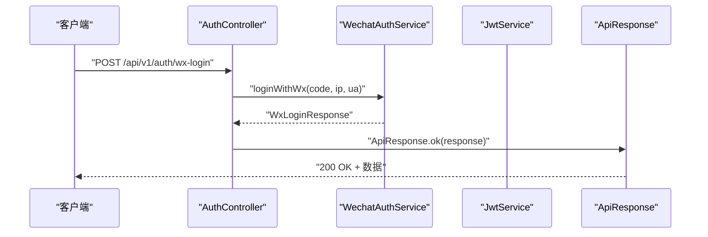
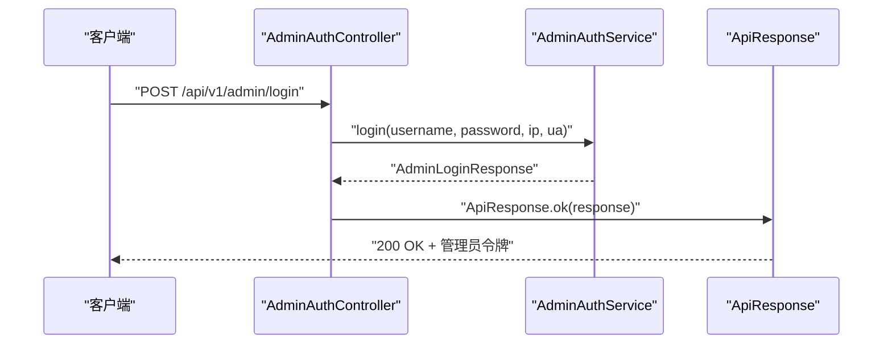
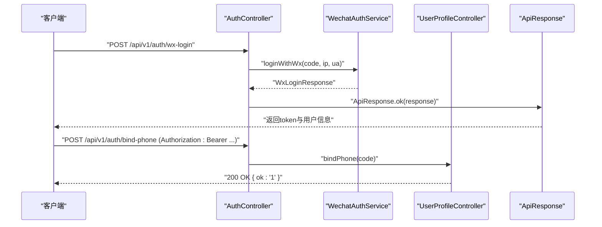
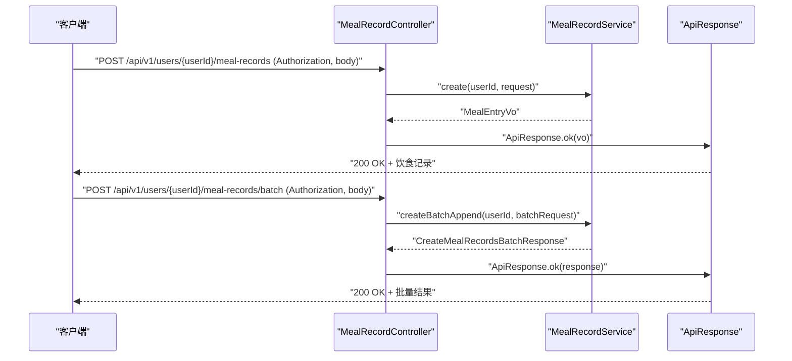
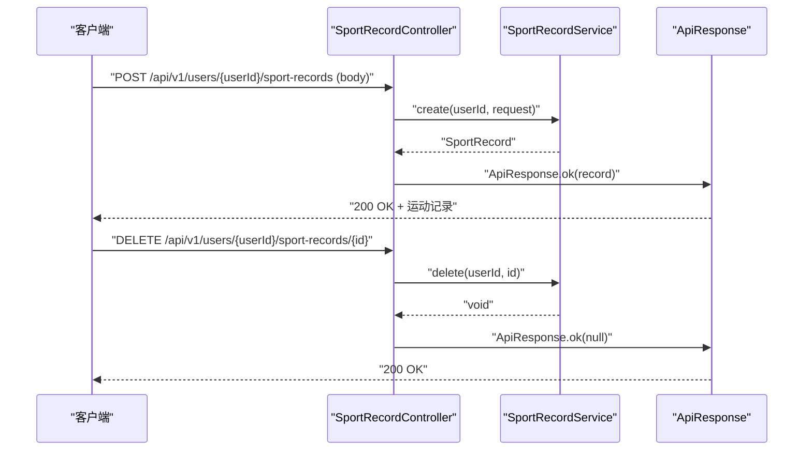
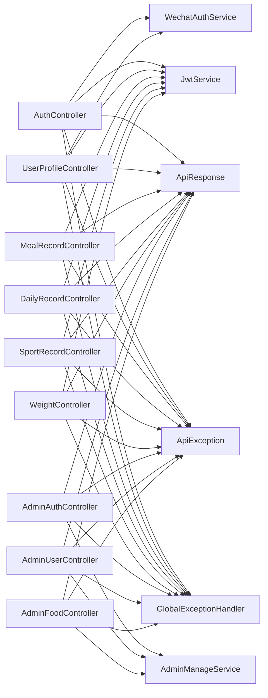

# API测试用例

<cite>
**本文档引用的文件**
- [AuthController.java](file://backend/src/main/java/com/ypfr/loseweight/web/AuthController.java)
- [UserProfileController.java](file://backend/src/main/java/com/ypfr/loseweight/web/UserProfileController.java)
- [AdminAuthController.java](file://backend/src/main/java/com/ypfr/loseweight/web/AdminAuthController.java)
- [AdminUserController.java](file://backend/src/main/java/com/ypfr/loseweight/web/AdminUserController.java)
- [AdminFoodController.java](file://backend/src/main/java/com/ypfr/loseweight/web/AdminFoodController.java)
- [DailyRecordController.java](file://backend/src/main/java/com/ypfr/loseweight/web/DailyRecordController.java)
- [MealRecordController.java](file://backend/src/main/java/com/ypfr/loseweight/web/MealRecordController.java)
- [SportRecordController.java](file://backend/src/main/java/com/ypfr/loseweight/web/SportRecordController.java)
- [WeightController.java](file://backend/src/main/java/com/ypfr/loseweight/web/WeightController.java)
- [FoodLibraryController.java](file://backend/src/main/java/com/ypfr/loseweight/web/FoodLibraryController.java)
- [FoodRecognizeController.java](file://backend/src/main/java/com/ypfr/loseweight/web/FoodRecognizeController.java)
- [UserController.java](file://backend/src/main/java/com/ypfr/loseweight/web/UserController.java)
- [WxLoginRequest.java](file://backend/src/main/java/com/ypfr/loseweight/web/dto/WxLoginRequest.java)
- [WxLoginResponse.java](file://backend/src/main/java/com/ypfr/loseweight/web/dto/WxLoginResponse.java)
- [BindPhoneRequest.java](file://backend/src/main/java/com/ypfr/loseweight/web/dto/BindPhoneRequest.java)
- [CreateMealRecordRequest.java](file://backend/src/main/java/com/ypfr/loseweight/web/dto/CreateMealRecordRequest.java)
- [CreateSportRecordRequest.java](file://backend/src/main/java/com/ypfr/loseweight/web/dto/CreateSportRecordRequest.java)
- [WeightUpsertRequest.java](file://backend/src/main/java/com/ypfr/loseweight/web/dto/WeightUpsertRequest.java)
- [ApiResponse.java](file://backend/src/main/java/com/ypfr/loseweight/common/ApiResponse.java)
- [ApiException.java](file://backend/src/main/java/com/ypfr/loseweight/common/ApiException.java)
- [GlobalExceptionHandler.java](file://backend/src/main/java/com/ypfr/loseweight/common/GlobalExceptionHandler.java)
- [JwtService.java](file://backend/src/main/java/com/ypfr/loseweight/service/JwtService.java)
- [WechatAuthService.java](file://backend/src/main/java/com/ypfr/loseweight/service/WechatAuthService.java)
- [AdminAuthService.java](file://backend/src/main/java/com/ypfr/loseweight/service/AdminAuthService.java)
- [AdminManageService.java](file://backend/src/main/java/com/ypfr/loseweight/service/AdminManageService.java)
- [DailyRecordService.java](file://backend/src/main/java/com/ypfr/loseweight/service/DailyRecordService.java)
- [MealRecordService.java](file://backend/src/main/java/com/ypfr/loseweight/service/MealRecordService.java)
- [SportRecordService.java](file://backend/src/main/java/com/ypfr/loseweight/service/SportRecordService.java)
- [WeightService.java](file://backend/src/main/java/com/ypfr/loseweight/service/WeightService.java)
- [FoodLibraryService.java](file://backend/src/main/java/com/ypfr/loseweight/service/FoodLibraryService.java)
- [FoodRecognizeService.java](file://backend/src/main/java/com/ypfr/loseweight/service/FoodRecognizeService.java)
- [UserService.java](file://backend/src/main/java/com/ypfr/loseweight/service/UserService.java)
- [WeekStatsService.java](file://backend/src/main/java/com/ypfr/loseweight/service/WeekStatsService.java)
- [application.yml](file://backend/src/main/resources/application.yml)
</cite>

## 目录
1. [简介](#简介)
2. [项目结构](#项目结构)
3. [核心组件](#核心组件)
4. [架构总览](#架构总览)
5. [详细组件分析](#详细组件分析)
6. [依赖分析](#依赖分析)
7. [性能考虑](#性能考虑)
8. [故障排查指南](#故障排查指南)
9. [结论](#结论)
10. [附录](#附录)

## 简介
本测试文档面向后端API接口，围绕认证测试（JWT令牌验证、权限控制测试、会话管理测试）、业务流程测试（用户注册登录流程、饮食记录流程、运动记录流程）、边界条件测试（空值测试、超长字符串测试、数值边界测试）以及错误处理与性能测试，提供系统化的测试方案与最佳实践。文档同时给出测试数据设计、场景覆盖、错误处理策略与质量保证标准，帮助确保API的稳定性、安全性与一致性。

## 项目结构
后端采用Spring Boot工程，API控制器按功能域划分，主要模块包括：
- 认证与用户：AuthController、UserProfileController、UserController
- 日常记录：DailyRecordController、WeightController
- 饮食与运动：MealRecordController、SportRecordController、FoodLibraryController、FoodRecognizeController
- 管理后台：AdminAuthController、AdminUserController、AdminFoodController
- 通用响应与异常：ApiResponse、ApiException、GlobalExceptionHandler
- 服务层：JwtService、WechatAuthService、AdminAuthService、AdminManageService、DailyRecordService、MealRecordService、SportRecordService、WeightService、FoodLibraryService、FoodRecognizeService、UserService、WeekStatsService

```mermaid
graph TB
subgraph "认证与用户"
AC["AuthController"]
UPC["UserProfileController"]
UC["UserController"]
end
subgraph "日常记录"
DRC["DailyRecordController"]
WC["WeightController"]
end
subgraph "饮食与运动"
MRC["MealRecordController"]
SRC["SportRecordController"]
FL["FoodLibraryController"]
FR["FoodRecognizeController"]
end
subgraph "管理后台"
AAC["AdminAuthController"]
AUC["AdminUserController"]
AFC["AdminFoodController"]
end
subgraph "通用"
AR["ApiResponse"]
AE["ApiException"]
GEH["GlobalExceptionHandler"]
JS["JwtService"]
WAS["WechatAuthService"]
AMS["AdminManageService"]
end
AC --> WAS
AC --> JS
UPC --> JS
UPC --> WAS
MRC --> JS
DRC --> JS
SRC --> JS
WC --> JS
AAC --> AMS
AUC --> AMS
AFC --> AMS
AC --> AR
UPC --> AR
MRC --> AR
DRC --> AR
SRC --> AR
WC --> AR
FL --> AR
FR --> AR
AAC --> AR
AUC --> AR
AFC --> AR
AC --> AE
UPC --> AE
MRC --> AE
DRC --> AE
SRC --> AE
WC --> AE
AAC --> AE
AUC --> AE
AFC --> AE
AC --> GEH
UPC --> GEH
MRC --> GEH
DRC --> GEH
SRC --> GEH
WC --> GEH
AAC --> GEH
AUC --> GEH
AFC --> GEH
```

图表来源
- [AuthController.java:1-55](file://backend/src/main/java/com/ypfr/loseweight/web/AuthController.java#L1-L55)
- [UserProfileController.java:1-90](file://backend/src/main/java/com/ypfr/loseweight/web/UserProfileController.java#L1-L90)
- [DailyRecordController.java:1-40](file://backend/src/main/java/com/ypfr/loseweight/web/DailyRecordController.java#L1-L40)
- [MealRecordController.java:1-61](file://backend/src/main/java/com/ypfr/loseweight/web/MealRecordController.java#L1-L61)
- [SportRecordController.java:1-36](file://backend/src/main/java/com/ypfr/loseweight/web/SportRecordController.java#L1-L36)
- [WeightController.java:1-39](file://backend/src/main/java/com/ypfr/loseweight/web/WeightController.java#L1-L39)
- [FoodLibraryController.java:1-31](file://backend/src/main/java/com/ypfr/loseweight/web/FoodLibraryController.java#L1-L31)
- [FoodRecognizeController.java:1-28](file://backend/src/main/java/com/ypfr/loseweight/web/FoodRecognizeController.java#L1-L28)
- [AdminAuthController.java:1-62](file://backend/src/main/java/com/ypfr/loseweight/web/AdminAuthController.java#L1-L62)
- [AdminUserController.java:1-35](file://backend/src/main/java/com/ypfr/loseweight/web/AdminUserController.java#L1-L35)
- [AdminFoodController.java:1-67](file://backend/src/main/java/com/ypfr/loseweight/web/AdminFoodController.java#L1-L67)
- [ApiResponse.java](file://backend/src/main/java/com/ypfr/loseweight/common/ApiResponse.java)
- [ApiException.java](file://backend/src/main/java/com/ypfr/loseweight/common/ApiException.java)
- [GlobalExceptionHandler.java](file://backend/src/main/java/com/ypfr/loseweight/common/GlobalExceptionHandler.java)
- [JwtService.java](file://backend/src/main/java/com/ypfr/loseweight/service/JwtService.java)
- [WechatAuthService.java](file://backend/src/main/java/com/ypfr/loseweight/service/WechatAuthService.java)
- [AdminManageService.java](file://backend/src/main/java/com/ypfr/loseweight/service/AdminManageService.java)

章节来源
- [AuthController.java:1-55](file://backend/src/main/java/com/ypfr/loseweight/web/AuthController.java#L1-L55)
- [UserProfileController.java:1-90](file://backend/src/main/java/com/ypfr/loseweight/web/UserProfileController.java#L1-L90)
- [AdminAuthController.java:1-62](file://backend/src/main/java/com/ypfr/loseweight/web/AdminAuthController.java#L1-L62)
- [DailyRecordController.java:1-40](file://backend/src/main/java/com/ypfr/loseweight/web/DailyRecordController.java#L1-L40)
- [MealRecordController.java:1-61](file://backend/src/main/java/com/ypfr/loseweight/web/MealRecordController.java#L1-L61)
- [SportRecordController.java:1-36](file://backend/src/main/java/com/ypfr/loseweight/web/SportRecordController.java#L1-L36)
- [WeightController.java:1-39](file://backend/src/main/java/com/ypfr/loseweight/web/WeightController.java#L1-L39)
- [FoodLibraryController.java:1-31](file://backend/src/main/java/com/ypfr/loseweight/web/FoodLibraryController.java#L1-L31)
- [FoodRecognizeController.java:1-28](file://backend/src/main/java/com/ypfr/loseweight/web/FoodRecognizeController.java#L1-L28)
- [AdminUserController.java:1-35](file://backend/src/main/java/com/ypfr/loseweight/web/AdminUserController.java#L1-L35)
- [AdminFoodController.java:1-67](file://backend/src/main/java/com/ypfr/loseweight/web/AdminFoodController.java#L1-L67)

## 核心组件
- 认证与用户：提供微信登录、绑定手机号、个人资料查询与更新等能力，并通过JWT进行身份校验。
- 日常记录：提供体重记录查询与新增，以及按日期查询用户的日常汇总。
- 饮食与运动：支持单条/批量饮食记录创建与删除，支持运动记录创建与删除，并提供食物库检索与识别能力。
- 管理后台：提供管理员登录、修改密码、仪表盘统计、用户列表与食物管理等能力。
- 通用响应与异常：统一返回结构与全局异常处理，便于测试断言与错误定位。

章节来源
- [AuthController.java:1-55](file://backend/src/main/java/com/ypfr/loseweight/web/AuthController.java#L1-L55)
- [UserProfileController.java:1-90](file://backend/src/main/java/com/ypfr/loseweight/web/UserProfileController.java#L1-L90)
- [DailyRecordController.java:1-40](file://backend/src/main/java/com/ypfr/loseweight/web/DailyRecordController.java#L1-L40)
- [MealRecordController.java:1-61](file://backend/src/main/java/com/ypfr/loseweight/web/MealRecordController.java#L1-L61)
- [SportRecordController.java:1-36](file://backend/src/main/java/com/ypfr/loseweight/web/SportRecordController.java#L1-L36)
- [WeightController.java:1-39](file://backend/src/main/java/com/ypfr/loseweight/web/WeightController.java#L1-L39)
- [FoodLibraryController.java:1-31](file://backend/src/main/java/com/ypfr/loseweight/web/FoodLibraryController.java#L1-L31)
- [FoodRecognizeController.java:1-28](file://backend/src/main/java/com/ypfr/loseweight/web/FoodRecognizeController.java#L1-L28)
- [AdminAuthController.java:1-62](file://backend/src/main/java/com/ypfr/loseweight/web/AdminAuthController.java#L1-L62)
- [AdminUserController.java:1-35](file://backend/src/main/java/com/ypfr/loseweight/web/AdminUserController.java#L1-L35)
- [AdminFoodController.java:1-67](file://backend/src/main/java/com/ypfr/loseweight/web/AdminFoodController.java#L1-L67)
- [ApiResponse.java](file://backend/src/main/java/com/ypfr/loseweight/common/ApiResponse.java)
- [ApiException.java](file://backend/src/main/java/com/ypfr/loseweight/common/ApiException.java)
- [GlobalExceptionHandler.java](file://backend/src/main/java/com/ypfr/loseweight/common/GlobalExceptionHandler.java)

## 架构总览
API层通过控制器暴露REST接口，控制器依赖服务层实现业务逻辑，服务层调用领域模型与持久化组件。认证通过JWT解析用户ID，权限通过AdminAuthResolver或AuthUserResolver进行校验，异常由全局处理器统一捕获并转换为标准响应格式。

图表来源
- [AuthController.java:32-39](file://backend/src/main/java/com/ypfr/loseweight/web/AuthController.java#L32-L39)
- [WxLoginRequest.java:1-64](file://backend/src/main/java/com/ypfr/loseweight/web/dto/WxLoginRequest.java#L1-L64)
- [WxLoginResponse.java:1-57](file://backend/src/main/java/com/ypfr/loseweight/web/dto/WxLoginResponse.java#L1-L57)
- [WechatAuthService.java](file://backend/src/main/java/com/ypfr/loseweight/service/WechatAuthService.java)
- [JwtService.java](file://backend/src/main/java/com/ypfr/loseweight/service/JwtService.java)
- [ApiResponse.java](file://backend/src/main/java/com/ypfr/loseweight/common/ApiResponse.java)

## 详细组件分析

### 认证测试（JWT令牌验证、权限控制测试、会话管理测试）
- JWT令牌验证
  - 接口：/api/v1/auth/wx-login（微信登录）、/api/v1/user/profile/update（个人资料更新）、/api/v1/user/bind-phone（绑定手机）
  - 测试要点：Authorization头必须以“Bearer ”开头；无效或缺失令牌应返回401；成功登录后返回token与用户信息。
  - 关键实现参考：[AuthController.java:32-39](file://backend/src/main/java/com/ypfr/loseweight/web/AuthController.java#L32-L39)、[UserProfileController.java:50-55](file://backend/src/main/java/com/ypfr/loseweight/web/UserProfileController.java#L50-L55)、[JwtService.java](file://backend/src/main/java/com/ypfr/loseweight/service/JwtService.java)
- 权限控制测试
  - 接口：/api/v1/admin/login（管理员登录）、/api/v1/admin/change-password（修改密码）、/api/v1/admin/dashboard/stats（仪表盘统计）、/api/v1/admin/users（用户列表）、/api/v1/admin/foods（食物管理）
  - 测试要点：未携带或无效管理员令牌应被拒绝；不同角色访问受限资源应返回403或相应错误码。
  - 关键实现参考：[AdminAuthController.java:36-60](file://backend/src/main/java/com/ypfr/loseweight/web/AdminAuthController.java#L36-L60)、[AdminUserController.java:25-33](file://backend/src/main/java/com/ypfr/loseweight/web/AdminUserController.java#L25-L33)、[AdminFoodController.java:32-65](file://backend/src/main/java/com/ypfr/loseweight/web/AdminFoodController.java#L32-L65)
- 会话管理测试
  - 登录后生成JWT，后续请求需携带Authorization头；登出可通过服务端策略或令牌失效机制实现（当前控制器未显式提供登出接口）。
  - 关键实现参考：[AuthController.java:32-39](file://backend/src/main/java/com/ypfr/loseweight/web/AuthController.java#L32-L39)、[UserProfileController.java:50-55](file://backend/src/main/java/com/ypfr/loseweight/web/UserProfileController.java#L50-L55)

图表来源
- [AdminAuthController.java:36-42](file://backend/src/main/java/com/ypfr/loseweight/web/AdminAuthController.java#L36-L42)
- [AdminAuthService.java](file://backend/src/main/java/com/ypfr/loseweight/service/AdminAuthService.java)
- [ApiResponse.java](file://backend/src/main/java/com/ypfr/loseweight/common/ApiResponse.java)

章节来源
- [AuthController.java:1-55](file://backend/src/main/java/com/ypfr/loseweight/web/AuthController.java#L1-L55)
- [UserProfileController.java:1-90](file://backend/src/main/java/com/ypfr/loseweight/web/UserProfileController.java#L1-L90)
- [AdminAuthController.java:1-62](file://backend/src/main/java/com/ypfr/loseweight/web/AdminAuthController.java#L1-L62)
- [AdminUserController.java:1-35](file://backend/src/main/java/com/ypfr/loseweight/web/AdminUserController.java#L1-L35)
- [AdminFoodController.java:1-67](file://backend/src/main/java/com/ypfr/loseweight/web/AdminFoodController.java#L1-L67)
- [JwtService.java](file://backend/src/main/java/com/ypfr/loseweight/service/JwtService.java)

### 业务流程测试（用户注册登录流程、饮食记录流程、运动记录流程）

#### 用户注册登录流程
- 步骤
  1) 微信登录：提交code换取openId并绑定用户，返回token与用户信息。
  2) 绑定手机号：使用Bearer token调用绑定接口。
  3) 更新个人资料：携带token更新用户信息，触发预算配置重算与当日日汇总刷新。
- 关键接口
  - /api/v1/auth/wx-login
  - /api/v1/auth/bind-phone
  - /api/v1/user/profile/update
- 关键实现参考
  - [AuthController.java:32-53](file://backend/src/main/java/com/ypfr/loseweight/web/AuthController.java#L32-L53)
  - [UserProfileController.java:65-78](file://backend/src/main/java/com/ypfr/loseweight/web/UserProfileController.java#L65-L78)
  - [WxLoginRequest.java:1-64](file://backend/src/main/java/com/ypfr/loseweight/web/dto/WxLoginRequest.java#L1-L64)
  - [BindPhoneRequest.java:1-19](file://backend/src/main/java/com/ypfr/loseweight/web/dto/BindPhoneRequest.java#L1-L19)

图表来源
- [AuthController.java:32-53](file://backend/src/main/java/com/ypfr/loseweight/web/AuthController.java#L32-L53)
- [UserProfileController.java:80-88](file://backend/src/main/java/com/ypfr/loseweight/web/UserProfileController.java#L80-L88)
- [WxLoginRequest.java:1-64](file://backend/src/main/java/com/ypfr/loseweight/web/dto/WxLoginRequest.java#L1-L64)
- [BindPhoneRequest.java:1-19](file://backend/src/main/java/com/ypfr/loseweight/web/dto/BindPhoneRequest.java#L1-L19)

章节来源
- [AuthController.java:1-55](file://backend/src/main/java/com/ypfr/loseweight/web/AuthController.java#L1-L55)
- [UserProfileController.java:1-90](file://backend/src/main/java/com/ypfr/loseweight/web/UserProfileController.java#L1-L90)
- [WxLoginRequest.java:1-64](file://backend/src/main/java/com/ypfr/loseweight/web/dto/WxLoginRequest.java#L1-L64)
- [BindPhoneRequest.java:1-19](file://backend/src/main/java/com/ypfr/loseweight/web/dto/BindPhoneRequest.java#L1-L19)

#### 饮食记录流程
- 步骤
  1) 创建单条饮食记录：携带Authorization与userId，提交CreateMealRecordRequest。
  2) 批量创建：同一餐次下批量追加多条明细。
  3) 删除记录：按id删除指定记录。
- 关键接口
  - /api/v1/users/{userId}/meal-records
  - /api/v1/users/{userId}/meal-records/batch
  - /api/v1/users/{userId}/meal-records/{id}
- 关键实现参考
  - [MealRecordController.java:30-59](file://backend/src/main/java/com/ypfr/loseweight/web/MealRecordController.java#L30-L59)
  - [CreateMealRecordRequest.java:1-99](file://backend/src/main/java/com/ypfr/loseweight/web/dto/CreateMealRecordRequest.java#L1-L99)

图表来源
- [MealRecordController.java:30-49](file://backend/src/main/java/com/ypfr/loseweight/web/MealRecordController.java#L30-L49)
- [CreateMealRecordRequest.java:1-99](file://backend/src/main/java/com/ypfr/loseweight/web/dto/CreateMealRecordRequest.java#L1-L99)
- [MealRecordService.java](file://backend/src/main/java/com/ypfr/loseweight/service/MealRecordService.java)
- [ApiResponse.java](file://backend/src/main/java/com/ypfr/loseweight/common/ApiResponse.java)

章节来源
- [MealRecordController.java:1-61](file://backend/src/main/java/com/ypfr/loseweight/web/MealRecordController.java#L1-L61)
- [CreateMealRecordRequest.java:1-99](file://backend/src/main/java/com/ypfr/loseweight/web/dto/CreateMealRecordRequest.java#L1-L99)

#### 运动记录流程
- 步骤
  1) 创建运动记录：提交CreateSportRecordRequest。
  2) 删除运动记录：按id删除。
- 关键接口
  - /api/v1/users/{userId}/sport-records
  - /api/v1/users/{userId}/sport-records/{id}
- 关键实现参考
  - [SportRecordController.java:24-34](file://backend/src/main/java/com/ypfr/loseweight/web/SportRecordController.java#L24-L34)
  - [CreateSportRecordRequest.java:1-51](file://backend/src/main/java/com/ypfr/loseweight/web/dto/CreateSportRecordRequest.java#L1-L51)

图表来源
- [SportRecordController.java:24-34](file://backend/src/main/java/com/ypfr/loseweight/web/SportRecordController.java#L24-L34)
- [CreateSportRecordRequest.java:1-51](file://backend/src/main/java/com/ypfr/loseweight/web/dto/CreateSportRecordRequest.java#L1-L51)
- [SportRecordService.java](file://backend/src/main/java/com/ypfr/loseweight/service/SportRecordService.java)
- [ApiResponse.java](file://backend/src/main/java/com/ypfr/loseweight/common/ApiResponse.java)

章节来源
- [SportRecordController.java:1-36](file://backend/src/main/java/com/ypfr/loseweight/web/SportRecordController.java#L1-L36)
- [CreateSportRecordRequest.java:1-51](file://backend/src/main/java/com/ypfr/loseweight/web/dto/CreateSportRecordRequest.java#L1-L51)

### 边界条件测试（空值测试、超长字符串测试、数值边界测试）
- 空值测试
  - 必填字段为空：Authorization头缺失或不以“Bearer ”开头；code为空；用户名/密码为空；userId非法。
  - 断言：返回401或相应错误码；全局异常处理器捕获并返回标准格式。
  - 参考：[AuthController.java:46-48](file://backend/src/main/java/com/ypfr/loseweight/web/AuthController.java#L46-L48)、[UserProfileController.java:50-55](file://backend/src/main/java/com/ypfr/loseweight/web/UserProfileController.java#L50-L55)、[ApiException.java](file://backend/src/main/java/com/ypfr/loseweight/common/ApiException.java)
- 超长字符串测试
  - 请求体字段长度超过服务端限制：如食物名称、运动名称、备注等。
  - 断言：触发参数校验异常，返回400与错误信息；必要时截断或抛出异常。
  - 参考：DTO类字段定义与服务端校验逻辑。
- 数值边界测试
  - 卡路里、蛋白质/脂肪/碳水含量、体重等数值越界或精度异常。
  - 断言：服务端进行范围校验，返回400或默认值处理；数据库层面约束避免脏数据。
  - 参考：[CreateMealRecordRequest.java:1-99](file://backend/src/main/java/com/ypfr/loseweight/web/dto/CreateMealRecordRequest.java#L1-L99)、[WeightUpsertRequest.java:1-27](file://backend/src/main/java/com/ypfr/loseweight/web/dto/WeightUpsertRequest.java#L1-L27)

章节来源
- [AuthController.java:46-48](file://backend/src/main/java/com/ypfr/loseweight/web/AuthController.java#L46-L48)
- [UserProfileController.java:50-55](file://backend/src/main/java/com/ypfr/loseweight/web/UserProfileController.java#L50-L55)
- [ApiException.java](file://backend/src/main/java/com/ypfr/loseweight/common/ApiException.java)
- [CreateMealRecordRequest.java:1-99](file://backend/src/main/java/com/ypfr/loseweight/web/dto/CreateMealRecordRequest.java#L1-L99)
- [WeightUpsertRequest.java:1-27](file://backend/src/main/java/com/ypfr/loseweight/web/dto/WeightUpsertRequest.java#L1-L27)

### 错误处理测试
- 全局异常处理
  - 通过GlobalExceptionHandler统一捕获异常，转换为ApiResponse格式，便于测试断言。
  - 断言：HTTP状态码与响应体结构一致；错误码与消息符合预期。
- 参数校验异常
  - DTO上注解触发校验失败，返回400与具体错误信息。
- 权限异常
  - 未授权访问或令牌无效，返回401；管理员权限不足返回相应错误码。

章节来源
- [GlobalExceptionHandler.java](file://backend/src/main/java/com/ypfr/loseweight/common/GlobalExceptionHandler.java)
- [ApiResponse.java](file://backend/src/main/java/com/ypfr/loseweight/common/ApiResponse.java)
- [ApiException.java](file://backend/src/main/java/com/ypfr/loseweight/common/ApiException.java)

### 性能测试
- 并发与吞吐
  - 使用JMeter或Locust对高频接口（如/food-library/search、/users/{userId}/daily-records）进行并发压测，观察响应时间与错误率。
- 资源限制
  - 限制查询limit（如体重记录limit最大200），防止资源滥用。
- 缓存策略
  - 对静态数据（如食物库）引入缓存，减少数据库压力。
- 日志与监控
  - 记录关键接口耗时与错误堆栈，结合APM工具定位瓶颈。

章节来源
- [WeightController.java:27-30](file://backend/src/main/java/com/ypfr/loseweight/web/WeightController.java#L27-L30)
- [FoodLibraryController.java:22-29](file://backend/src/main/java/com/ypfr/loseweight/web/FoodLibraryController.java#L22-L29)

## 依赖分析
- 控制器到服务层：各控制器通过构造函数注入对应服务，职责清晰，耦合度低。
- 服务层到领域模型：服务层负责编排业务规则，避免控制器承担过多逻辑。
- 异常与响应：统一通过ApiResponse与ApiException处理，便于测试断言与前端消费。

图表来源
- [AuthController.java:1-55](file://backend/src/main/java/com/ypfr/loseweight/web/AuthController.java#L1-L55)
- [UserProfileController.java:1-90](file://backend/src/main/java/com/ypfr/loseweight/web/UserProfileController.java#L1-L90)
- [DailyRecordController.java:1-40](file://backend/src/main/java/com/ypfr/loseweight/web/DailyRecordController.java#L1-L40)
- [MealRecordController.java:1-61](file://backend/src/main/java/com/ypfr/loseweight/web/MealRecordController.java#L1-L61)
- [SportRecordController.java:1-36](file://backend/src/main/java/com/ypfr/loseweight/web/SportRecordController.java#L1-L36)
- [WeightController.java:1-39](file://backend/src/main/java/com/ypfr/loseweight/web/WeightController.java#L1-L39)
- [AdminAuthController.java:1-62](file://backend/src/main/java/com/ypfr/loseweight/web/AdminAuthController.java#L1-L62)
- [AdminUserController.java:1-35](file://backend/src/main/java/com/ypfr/loseweight/web/AdminUserController.java#L1-L35)
- [AdminFoodController.java:1-67](file://backend/src/main/java/com/ypfr/loseweight/web/AdminFoodController.java#L1-L67)
- [ApiResponse.java](file://backend/src/main/java/com/ypfr/loseweight/common/ApiResponse.java)
- [ApiException.java](file://backend/src/main/java/com/ypfr/loseweight/common/ApiException.java)
- [GlobalExceptionHandler.java](file://backend/src/main/java/com/ypfr/loseweight/common/GlobalExceptionHandler.java)

## 性能考虑
- 接口限流与熔断：对高频接口设置限流策略，避免雪崩效应。
- 分页与分段：列表接口使用分页参数，避免一次性返回大量数据。
- 查询优化：对常用查询建立索引，减少慢查询。
- 缓存：热点数据（如食物库、用户基本信息）引入缓存层。
- 监控指标：记录QPS、P95/P99延迟、错误率与数据库连接池使用情况。

## 故障排查指南
- 401未授权
  - 检查Authorization头是否正确；确认token未过期；核对用户是否存在。
  - 参考：[AuthController.java:46-48](file://backend/src/main/java/com/ypfr/loseweight/web/AuthController.java#L46-L48)、[UserProfileController.java:50-55](file://backend/src/main/java/com/ypfr/loseweight/web/UserProfileController.java#L50-L55)
- 403权限不足
  - 管理员接口需有效管理员令牌；检查AdminAuthResolver校验逻辑。
  - 参考：[AdminAuthController.java:47-59](file://backend/src/main/java/com/ypfr/loseweight/web/AdminAuthController.java#L47-L59)、[AdminUserController.java](file://backend/src/main/java/com/ypfr/loseweight/web/AdminUserController.java#L31)
- 400参数错误
  - 校验DTO字段是否满足约束；检查必填项与格式。
  - 参考：[WxLoginRequest.java:7-8](file://backend/src/main/java/com/ypfr/loseweight/web/dto/WxLoginRequest.java#L7-L8)、[BindPhoneRequest.java](file://backend/src/main/java/com/ypfr/loseweight/web/dto/BindPhoneRequest.java#L8)、[CreateMealRecordRequest.java:1-99](file://backend/src/main/java/com/ypfr/loseweight/web/dto/CreateMealRecordRequest.java#L1-L99)
- 500服务器错误
  - 查看GlobalExceptionHandler输出的日志与堆栈；修复服务层异常分支。
  - 参考：[GlobalExceptionHandler.java](file://backend/src/main/java/com/ypfr/loseweight/common/GlobalExceptionHandler.java)

章节来源
- [AuthController.java:46-48](file://backend/src/main/java/com/ypfr/loseweight/web/AuthController.java#L46-L48)
- [UserProfileController.java:50-55](file://backend/src/main/java/com/ypfr/loseweight/web/UserProfileController.java#L50-L55)
- [AdminAuthController.java:47-59](file://backend/src/main/java/com/ypfr/loseweight/web/AdminAuthController.java#L47-L59)
- [AdminUserController.java](file://backend/src/main/java/com/ypfr/loseweight/web/AdminUserController.java#L31)
- [WxLoginRequest.java:7-8](file://backend/src/main/java/com/ypfr/loseweight/web/dto/WxLoginRequest.java#L7-L8)
- [BindPhoneRequest.java](file://backend/src/main/java/com/ypfr/loseweight/web/dto/BindPhoneRequest.java#L8)
- [CreateMealRecordRequest.java:1-99](file://backend/src/main/java/com/ypfr/loseweight/web/dto/CreateMealRecordRequest.java#L1-L99)
- [GlobalExceptionHandler.java](file://backend/src/main/java/com/ypfr/loseweight/common/GlobalExceptionHandler.java)

## 结论
本测试文档基于后端API的实际实现，构建了覆盖认证、业务流程、边界条件、错误处理与性能的关键测试方案。通过统一的响应格式与异常处理，测试断言更加稳定可靠；通过明确的权限与参数校验，保障了系统的安全与一致性。建议在持续集成中加入自动化测试流水线，配合监控与告警，确保API质量与稳定性。

## 附录
- 测试数据设计建议
  - 用户：准备已注册用户与未完善资料用户，用于测试登录与资料更新流程。
  - 食物：准备食物库条目，用于搜索与识别测试。
  - 记录：准备历史体重、饮食与运动记录，用于查询与统计测试。
- 场景覆盖清单
  - 认证：登录成功/失败、绑定手机号、资料更新、权限访问。
  - 饮食：创建单条/批量记录、删除记录、跨餐次复用。
  - 运动：创建/删除记录、重复录入校验。
  - 管理：登录、修改密码、用户列表、食物增删改查。
- 最佳实践与质量保证标准
  - 统一响应格式与错误码；严格的参数校验；完善的日志与监控；接口限流与降级；自动化测试与回归。