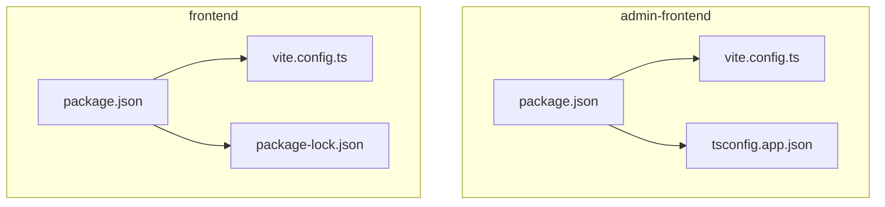
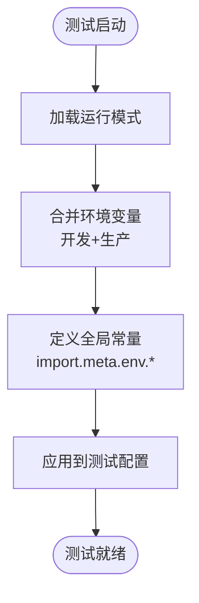
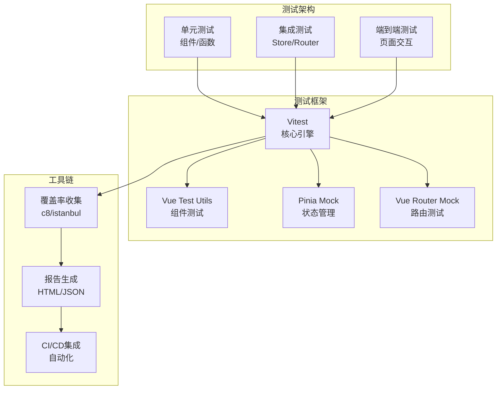
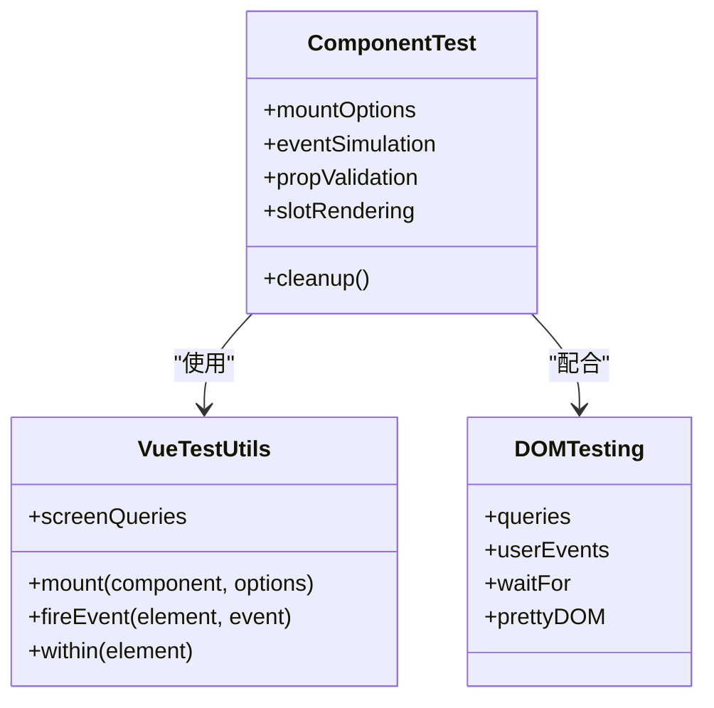
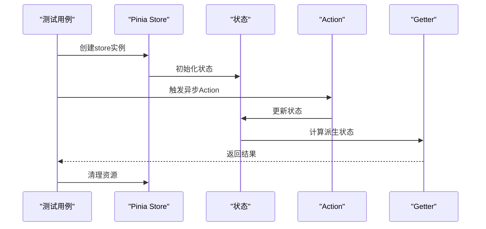
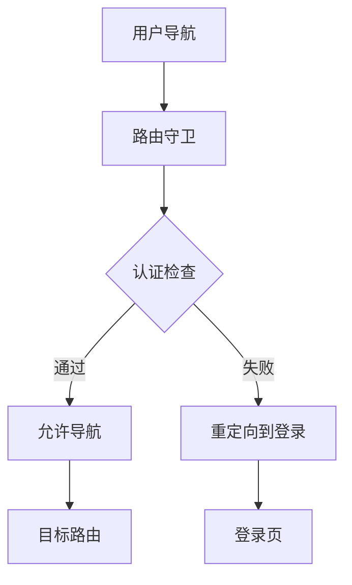
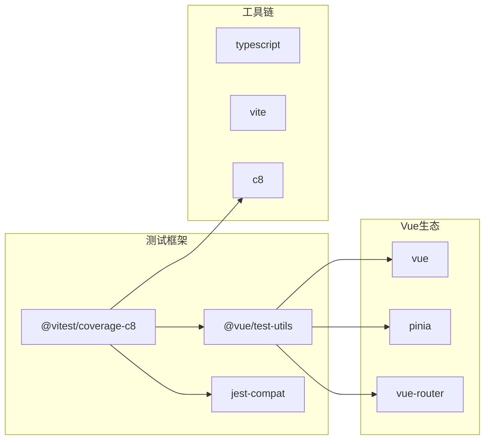

# 前端测试配置

<cite>
**本文档引用的文件**
- [admin-frontend/package.json](file://admin-frontend/package.json)
- [frontend/package.json](file://frontend/package.json)
- [admin-frontend/vite.config.ts](file://admin-frontend/vite.config.ts)
- [frontend/vite.config.ts](file://frontend/vite.config.ts)
- [admin-frontend/tsconfig.app.json](file://admin-frontend/tsconfig.app.json)
- [frontend/package-lock.json](file://frontend/package-lock.json)
</cite>

## 目录
1. [简介](#简介)
2. [项目结构](#项目结构)
3. [核心组件](#核心组件)
4. [架构概览](#架构概览)
5. [详细组件分析](#详细组件分析)
6. [依赖分析](#依赖分析)
7. [性能考虑](#性能考虑)
8. [故障排除指南](#故障排除指南)
9. [结论](#结论)
10. [附录](#附录)

## 简介

本文件为前端测试配置的综合技术文档，重点说明Vitest测试框架配置、Jest兼容性设置、测试环境变量配置、覆盖率收集器设置，并涵盖组件测试配置（Vue Test Utils、DOM测试工具、事件模拟）、状态管理测试（Pinia Store测试、异步状态测试）、路由测试（路由守卫测试、导航测试）。同时提供测试脚本配置、CI/CD集成建议以及测试报告生成方案。

当前仓库中未发现现成的测试配置文件（如vitest.config.*或jest.config.*），但通过分析现有项目结构和依赖，可以明确测试框架选型与集成路径。本文将基于现有Vite配置与依赖关系，给出可实施的测试配置方案与最佳实践。

## 项目结构

前端项目采用多包结构，包含两个独立的前端应用：
- admin-frontend：基于Vue 3 + Vite的后台管理系统
- frontend：基于uni-app + Vite的跨平台前端应用

两套项目均使用Vite作为构建工具，具备良好的测试框架适配性。



**图表来源**
- [admin-frontend/package.json:1-27](file://admin-frontend/package.json#L1-L27)
- [admin-frontend/vite.config.ts:1-8](file://admin-frontend/vite.config.ts#L1-L8)
- [admin-frontend/tsconfig.app.json:1-13](file://admin-frontend/tsconfig.app.json#L1-L13)
- [frontend/package.json:1-78](file://frontend/package.json#L1-L78)
- [frontend/vite.config.ts:1-23](file://frontend/vite.config.ts#L1-L23)
- [frontend/package-lock.json:3104-3143](file://frontend/package-lock.json#L3104-L3143)

**章节来源**
- [admin-frontend/package.json:1-27](file://admin-frontend/package.json#L1-L27)
- [frontend/package.json:1-78](file://frontend/package.json#L1-L78)
- [admin-frontend/vite.config.ts:1-8](file://admin-frontend/vite.config.ts#L1-L8)
- [frontend/vite.config.ts:1-23](file://frontend/vite.config.ts#L1-L23)

## 核心组件

### 测试框架选型与兼容性

根据项目依赖分析，推荐使用Vitest作为主要测试框架，理由如下：
- 与Vite构建工具无缝集成，启动速度快
- 内置TypeScript支持，无需额外编译步骤
- 与Vue生态兼容良好，适合组件测试
- 支持Jest语法兼容模式，便于迁移

Jest兼容性设置要点：
- 使用Jest兼容模式时，保持测试文件命名规范（*.test.js/.ts或*.spec.js/.ts）
- 通过环境配置启用Jest兼容API
- 统一测试断言库（推荐使用内置expect）

### 测试环境变量配置

基于现有Vite配置，测试环境变量应遵循以下原则：



**图表来源**
- [frontend/vite.config.ts:5-22](file://frontend/vite.config.ts#L5-L22)

**章节来源**
- [frontend/vite.config.ts:5-22](file://frontend/vite.config.ts#L5-L22)

### 覆盖率收集器设置

覆盖率收集器配置建议：
- 使用c8作为默认覆盖率收集器（与Vitest集成度高）
- 支持多种输出格式（HTML、JSON、文本）
- 可配置忽略规则（node_modules、测试文件、类型声明等）

## 架构概览

测试架构采用分层设计，确保各模块测试的独立性与可维护性：



## 详细组件分析

### 组件测试配置

#### Vue Test Utils集成

组件测试应重点关注：
- 挂载选项配置（挂载到DOM或轻量模式）
- 事件模拟与用户交互测试
- Props传递与响应式更新验证
- 插槽内容渲染测试



**图表来源**
- [admin-frontend/tsconfig.app.json:1-13](file://admin-frontend/tsconfig.app.json#L1-L13)

#### 事件模拟策略

事件模拟应覆盖：
- 用户输入事件（键盘、鼠标、触摸）
- 表单提交与验证
- 导航触发事件
- 异步操作完成回调

### 状态管理测试（Pinia）

#### Pinia Store测试

Pinia测试的关键点：
- Store实例化与依赖注入
- 状态变更与计算属性验证
- 异步Action测试
- 多Store协作测试



**图表来源**
- [frontend/package.json:59-61](file://frontend/package.json#L59-L61)

#### 异步状态测试

异步状态测试要点：
- Promise处理与错误捕获
- Loading状态与错误状态验证
- 并发请求处理
- 状态重置与清理

### 路由测试

#### 路由守卫测试

路由守卫测试应包括：
- 导航守卫逻辑验证
- 权限控制测试
- 重定向行为测试
- 守卫参数传递验证



**图表来源**
- [admin-frontend/package.json:16](file://admin-frontend/package.json#L16)

#### 导航测试

导航测试策略：
- 编程式导航测试
- 声明式导航测试
- 历史记录与回退测试
- 导航参数传递验证

## 依赖分析

### 测试相关依赖

基于现有项目依赖，测试相关的关键依赖包括：



**图表来源**
- [frontend/package.json:59-61](file://frontend/package.json#L59-L61)
- [admin-frontend/package.json:14-16](file://admin-frontend/package.json#L14-L16)

### 依赖版本兼容性

- Vitest与Vue 3的兼容性良好，建议使用最新稳定版本
- @vue/test-utils需要与Vue版本匹配
- TypeScript配置需与项目现有tsconfig保持一致

**章节来源**
- [frontend/package.json:59-61](file://frontend/package.json#L59-L61)
- [admin-frontend/package.json:14-16](file://admin-frontend/package.json#L14-L16)
- [frontend/package-lock.json:3104-3143](file://frontend/package-lock.json#L3104-L3143)

## 性能考虑

### 测试执行性能优化

1. **并行测试执行**
   - 利用Vitest的并行能力提升测试速度
   - 合理划分测试文件，避免相互依赖

2. **缓存策略**
   - 启用Vite缓存机制
   - TypeScript编译缓存优化

3. **测试隔离**
   - 每个测试用例独立运行
   - 避免全局状态污染

4. **覆盖率优化**
   - 合理配置覆盖率阈值
   - 排除不必要文件的覆盖率统计

## 故障排除指南

### 常见问题与解决方案

#### 测试环境变量问题
- **现象**：测试中无法访问VITE_*环境变量
- **原因**：环境变量加载顺序问题
- **解决**：参考现有Vite配置的环境变量合并逻辑

#### 类型检查问题
- **现象**：TypeScript类型错误影响测试执行
- **解决**：确保tsconfig配置与测试文件类型匹配

#### 依赖冲突
- **现象**：测试框架与现有依赖版本冲突
- **解决**：检查package-lock.json中的依赖版本

**章节来源**
- [frontend/vite.config.ts:10-13](file://frontend/vite.config.ts#L10-L13)
- [frontend/package-lock.json:3104-3143](file://frontend/package-lock.json#L3104-L3143)

## 结论

本测试配置文档基于现有项目结构和依赖关系，提出了完整的Vitest测试框架实施方案。通过合理的配置与最佳实践，可以建立高效、可靠的前端测试体系，覆盖组件测试、状态管理测试和路由测试等关键领域。建议按照本文档的配置方案逐步实施，并根据实际项目需求进行调整优化。

## 附录

### 测试脚本配置建议

```json
{
  "scripts": {
    "test": "vitest",
    "test:run": "vitest run",
    "test:coverage": "vitest --coverage",
    "test:watch": "vitest --watch",
    "test:ui": "vitest --ui"
  }
}
```

### CI/CD集成建议

1. **测试执行阶段**
   - 安装依赖后执行测试
   - 收集覆盖率报告
   - 上传测试结果

2. **报告生成**
   - HTML格式报告用于人工审查
   - JSON格式报告用于CI系统解析
   - 覆盖率阈值控制质量门禁