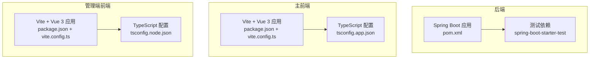
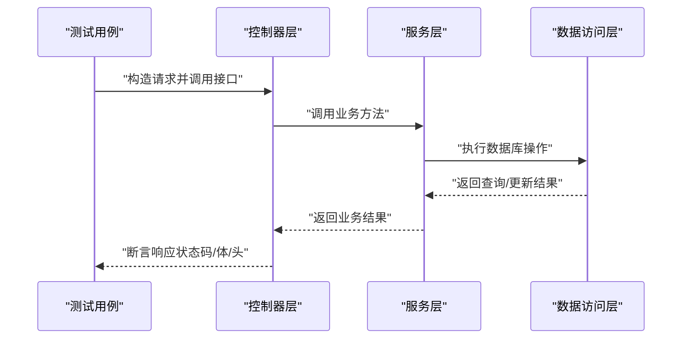
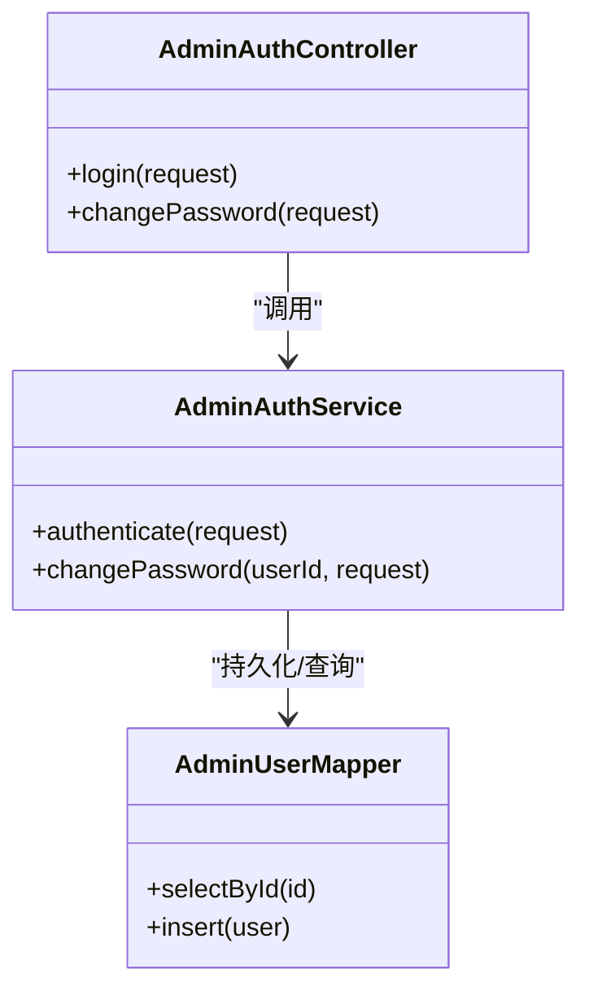
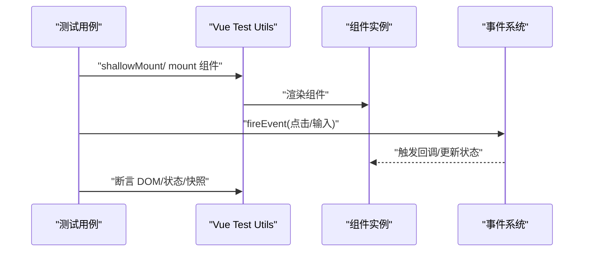
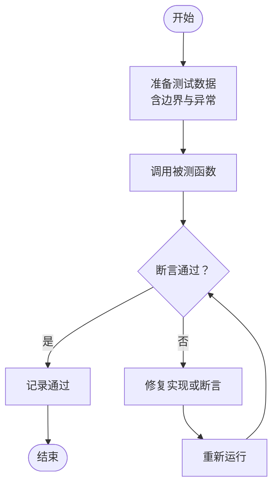
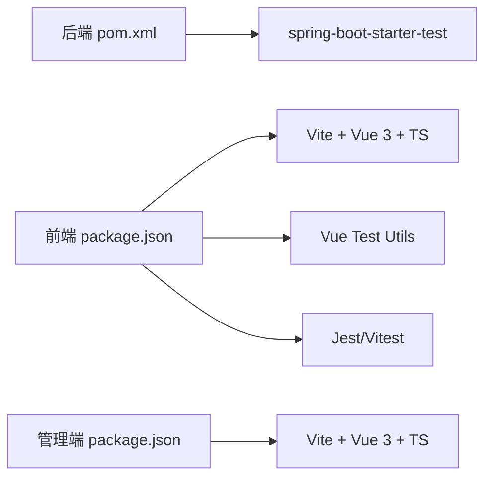

# 单元测试

<cite>
**本文引用的文件**
- [pom.xml](file://backend/pom.xml)
- [WebConfig.java](file://backend/src/main/java/com/ypfr/loseweight/config/WebConfig.java)
- [package.json](file://frontend/package.json)
- [vite.config.ts](file://frontend/vite.config.ts)
- [package.json](file://admin-frontend/package.json)
- [vite.config.ts](file://admin-frontend/vite.config.ts)
- [tsconfig.app.json](file://frontend/tsconfig.app.json)
- [tsconfig.node.json](file://admin-frontend/tsconfig.node.json)
- [package-lock.json](file://frontend/package-lock.json)
</cite>

## 目录
1. [简介](#简介)
2. [项目结构](#项目结构)
3. [核心组件](#核心组件)
4. [架构总览](#架构总览)
5. [详细组件分析](#详细组件分析)
6. [依赖分析](#依赖分析)
7. [性能考虑](#性能考虑)
8. [故障排查指南](#故障排查指南)
9. [结论](#结论)
10. [附录](#附录)

## 简介
本文件面向后端服务、前端组件与工具函数三类单元测试场景，提供系统化的测试文档，涵盖：
- 后端服务单元测试：Spring Boot 测试注解、Mockito 模拟、JUnit 配置与运行方式
- 前端组件单元测试：Vue Test Utils 使用、组件快照测试、交互行为测试
- 工具函数测试：纯函数边界条件、错误处理与可测试性设计建议

同时给出测试文件组织结构、测试用例编写规范、Mock 数据准备与断言策略，并结合仓库现有配置文件说明如何在当前工程中落地。

## 项目结构
本仓库包含后端 Spring Boot 应用与两个前端应用（主前端与管理端前端），测试工作应分别在各自工程内进行：
- 后端：基于 Maven 的 Spring Boot 工程，使用 spring-boot-starter-test 提供测试依赖
- 前端：基于 Vite + Vue 3 的多平台工程，使用 TypeScript；管理端前端同样基于 Vite + Vue 3
- 管理端前端：独立的 Vite 工程，便于单独运行与测试

图表来源
- [pom.xml:54-57](file://backend/pom.xml#L54-L57)
- [package.json:1-78](file://frontend/package.json#L1-L78)
- [vite.config.ts](file://frontend/vite.config.ts)
- [tsconfig.app.json:1-13](file://frontend/tsconfig.app.json#L1-L13)
- [package.json:1-27](file://admin-frontend/package.json#L1-L27)
- [vite.config.ts](file://admin-frontend/vite.config.ts)
- [tsconfig.node.json:1-23](file://admin-frontend/tsconfig.node.json#L1-L23)

章节来源
- [pom.xml:1-86](file://backend/pom.xml#L1-L86)
- [package.json:1-78](file://frontend/package.json#L1-L78)
- [vite.config.ts](file://frontend/vite.config.ts)
- [tsconfig.app.json:1-13](file://frontend/tsconfig.app.json#L1-L13)
- [package.json:1-27](file://admin-frontend/package.json#L1-L27)
- [vite.config.ts](file://admin-frontend/vite.config.ts)
- [tsconfig.node.json:1-23](file://admin-frontend/tsconfig.node.json#L1-L23)

## 核心组件
- 后端服务测试基础
  - 依赖：spring-boot-starter-test（含 JUnit、Mockito、AssertJ 等）
  - 运行：Maven Surefire 插件或 IDE Runner
  - 典型注解：@ExtendWith(MockitoExtension.class)、@Mock、@InjectMocks、@BeforeEach、@AfterEach、@Test
  - 控制器层测试：Mock Service 层，验证响应状态码、响应体结构与头信息
  - 业务层测试：Mock Mapper/Repository，验证逻辑分支与异常路径
- 前端组件测试基础
  - 依赖：Vite + Vue 3 + TypeScript
  - 测试框架：Jest 或 Vitest（推荐 Vitest，与 Vite 生态更契合）
  - 组件测试：Vue Test Utils（mount/shallowMount、fireEvent、findAll、getByTestId 等）
  - 快照测试：对渲染结果进行快照对比，确保 UI 变更受控
  - 交互测试：模拟用户事件，断言状态变化与副作用
- 工具函数测试基础
  - 纯函数：输入输出确定、无外部依赖
  - 边界条件：空值、极值、非法参数、分隔符等
  - 错误处理：抛出异常或返回错误对象，断言错误类型与消息

章节来源
- [pom.xml:54-57](file://backend/pom.xml#L54-L57)
- [package.json:63-76](file://frontend/package.json#L63-L76)
- [vite.config.ts](file://frontend/vite.config.ts)

## 架构总览
下图展示后端控制器、服务与数据访问层之间的典型调用关系，以及测试时的模拟策略：

图表来源
- [WebConfig.java:10-30](file://backend/src/main/java/com/ypfr/loseweight/config/WebConfig.java#L10-L30)

## 详细组件分析

### 后端服务单元测试（Spring Boot）
- 测试文件组织
  - 建议按功能模块划分测试包，如：service、controller、mapper
  - 测试类命名：被测类名 + Test 或 Spec，例如 AdminAuthServiceTest
- 编写规范
  - 使用 @ExtendWith(MockitoExtension.class) 启用 Mockito
  - 使用 @Mock 注入依赖，@InjectMocks 注入被测对象
  - 使用 @BeforeEach 准备 Mock 行为与测试数据
  - 使用 @Test 分别覆盖正常路径、边界条件与异常路径
- Mock 数据与断言
  - 使用 Mockito.when(...).thenReturn(...) 预设返回值
  - 使用 Assertions 断言响应状态码、响应体字段、头信息
  - 对于异常场景，使用 assertThrows 或 @Test(expected = ...) 断言异常类型
- 示例参考路径
  - 控制器层测试：[AdminAuthController.java](file://backend/src/main/java/com/ypfr/loseweight/web/AdminAuthController.java)
  - 服务层测试：[AdminAuthService.java](file://backend/src/main/java/com/ypfr/loseweight/service/AdminAuthService.java)
  - 数据访问层测试：[AdminUserMapper.java](file://backend/src/main/java/com/ypfr/loseweight/mapper/AdminUserMapper.java)

图表来源
- [AdminAuthController.java](file://backend/src/main/java/com/ypfr/loseweight/web/AdminAuthController.java)
- [AdminAuthService.java](file://backend/src/main/java/com/ypfr/loseweight/service/AdminAuthService.java)
- [AdminUserMapper.java](file://backend/src/main/java/com/ypfr/loseweight/mapper/AdminUserMapper.java)

章节来源
- [pom.xml:54-57](file://backend/pom.xml#L54-L57)
- [WebConfig.java:10-30](file://backend/src/main/java/com/ypfr/loseweight/config/WebConfig.java#L10-L30)

### 前端组件单元测试（Vue Test Utils）
- 测试文件组织
  - 建议与组件同级目录放置测试文件，命名：组件名.test.ts 或 组件名.spec.ts
  - 将通用的测试工具与工厂函数放入 tests/utils 或 mocks 目录
- 编写规范
  - 使用 shallowMount/mount 加载组件，根据需要选择浅渲染或完整渲染
  - 使用 fireEvent 触发用户交互，如点击、输入、选择等
  - 使用 findByTestId/getByTestId 定位元素，避免脆弱的选择器
  - 对于异步交互，等待 nextTick 或 await 事件完成
- 快照测试
  - 使用 renderer（或 render）生成快照，首次提交时接受快照，后续对比
  - 当 UI 变更合理时，更新快照；否则修正实现或断言
- 交互行为测试
  - 验证 props 输入、事件触发回调、状态变更与副作用
  - 对于依赖外部服务的组件，使用依赖注入或适配器替换真实调用
- 示例参考路径
  - 主前端组件示例：[HomeCalorieGauge.vue](file://frontend/src/components/home/HomeCalorieGauge.vue)
  - 管理端组件示例：[AdminLayout.vue](file://admin-frontend/src/layouts/AdminLayout.vue)

图表来源
- [vite.config.ts](file://frontend/vite.config.ts)
- [tsconfig.app.json:1-13](file://frontend/tsconfig.app.json#L1-L13)

章节来源
- [package.json:63-76](file://frontend/package.json#L63-L76)
- [vite.config.ts](file://frontend/vite.config.ts)
- [tsconfig.app.json:1-13](file://frontend/tsconfig.app.json#L1-L13)

### 工具函数测试（纯函数、边界条件、错误处理）
- 测试文件组织
  - 在 utils 目录下为每个工具函数建立独立测试文件，命名：函数名.test.ts
  - 将公共的测试辅助函数放入 tests/helpers
- 编写规范
  - 纯函数：输入确定、无副作用，优先使用参数化测试覆盖多种输入组合
  - 边界条件：空字符串、零、负数、极大值、特殊字符、null/undefined
  - 错误处理：断言抛出的异常类型与错误消息，或断言返回的错误对象
- Mock 数据准备
  - 使用工厂函数生成测试数据，保证可重复性与可读性
  - 对于日期时间类工具，使用可控的时间源或时间戳
- 断言策略
  - 使用 toEqual/toBeCloseTo/toHaveLength 等精确断言
  - 对于浮点运算，使用容差断言
  - 对于复杂对象，使用部分断言或序列化后断言
- 示例参考路径
  - 日期工具：[date.ts](file://frontend/src/utils/date.ts)
  - HTTP 工具：[http.ts](file://frontend/src/utils/http.ts)
  - 查询串工具：[queryString.ts](file://frontend/src/utils/queryString.ts)

图表来源
- [package.json:63-76](file://frontend/package.json#L63-L76)

章节来源
- [package.json:63-76](file://frontend/package.json#L63-L76)

## 依赖分析
- 后端测试依赖
  - spring-boot-starter-test：提供 JUnit、Mockito、AssertJ、JSON 断言等
  - 运行插件：spring-boot-maven-plugin（用于打包与集成测试）
- 前端测试依赖
  - Vite + Vue 3 + TypeScript：由 package.json 与 tsconfig.* 管理
  - 测试框架：Jest 或 Vitest（建议 Vitest，与 Vite 集成度更高）
  - Vue Test Utils：用于组件测试
- 管理端前端测试依赖
  - 独立的 Vite 工程，依赖与主前端类似，便于隔离测试

图表来源
- [pom.xml:54-57](file://backend/pom.xml#L54-L57)
- [package.json:1-78](file://frontend/package.json#L1-L78)
- [package.json:1-27](file://admin-frontend/package.json#L1-L27)

章节来源
- [pom.xml:1-86](file://backend/pom.xml#L1-L86)
- [package.json:1-78](file://frontend/package.json#L1-L78)
- [package.json:1-27](file://admin-frontend/package.json#L1-L27)

## 性能考虑
- 后端测试
  - 使用 @Transactional + @Rollback 管理事务，避免真实数据库写入
  - 使用 @DirtiesContext 控制上下文刷新范围，减少不必要的重启
  - 对外部依赖（HTTP、存储）使用本地桩或容器化服务（如 WireMock、MinIO）
- 前端测试
  - 使用 Vitest 并启用缓存与并发，提升测试速度
  - 对网络请求使用拦截器或适配器，避免真实网络调用
  - 将重渲染与异步逻辑拆分为小单元，减少快照与 DOM 断言的脆弱性
- 工具函数测试
  - 避免在测试中引入随机性，必要时固定种子或时间源
  - 对 IO 密集函数使用同步替身，缩短测试耗时

## 故障排查指南
- 后端测试常见问题
  - 依赖注入失败：确认 @Mock 与 @InjectMocks 的作用域与生命周期
  - JSON 断言不匹配：使用 JSON 路径断言或序列化后再断言
  - CORS/跨域导致的测试失败：在测试配置中放宽或关闭 CORS
- 前端测试常见问题
  - 异步断言超时：确保等待 Promise 或 nextTick 完成
  - 快照频繁变动：仅对稳定 UI 做快照，动态内容使用选择器断言
  - 事件未触发：检查事件名称大小写与修饰符是否正确
- 工具函数测试常见问题
  - 浮点误差：使用容差断言或转换为整数单位
  - 日期时区：统一使用 UTC 或固定时区，避免本地时区差异

章节来源
- [WebConfig.java:10-30](file://backend/src/main/java/com/ypfr/loseweight/config/WebConfig.java#L10-L30)
- [package.json:63-76](file://frontend/package.json#L63-L76)

## 结论
- 后端：以 spring-boot-starter-test 为基础，结合 Mockito 与 JUnit，覆盖控制器、服务与数据层
- 前端：以 Vitest/Vue Test Utils 为核心，结合快照与交互测试，保障组件稳定性
- 工具函数：强调纯函数与边界条件，配合参数化与容错断言
- 在当前工程中，后端已具备测试依赖，前端与管理端前端具备 Vite + Vue 3 基础，可直接扩展测试套件

## 附录
- 测试运行建议
  - 后端：使用 Maven Surefire 插件或 IDE Runner 执行测试
  - 前端：使用 Vitest CLI 或 IDE 插件运行测试
  - 管理端前端：同主前端，独立运行与构建
- 配置参考
  - 后端测试依赖：见 [pom.xml:54-57](file://backend/pom.xml#L54-L57)
  - 前端工程配置：见 [package.json:1-78](file://frontend/package.json#L1-L78)、[vite.config.ts](file://frontend/vite.config.ts)、[tsconfig.app.json:1-13](file://frontend/tsconfig.app.json#L1-L13)
  - 管理端前端工程配置：见 [package.json:1-27](file://admin-frontend/package.json#L1-L27)、[vite.config.ts](file://admin-frontend/vite.config.ts)、[tsconfig.node.json:1-23](file://admin-frontend/tsconfig.node.json#L1-L23)