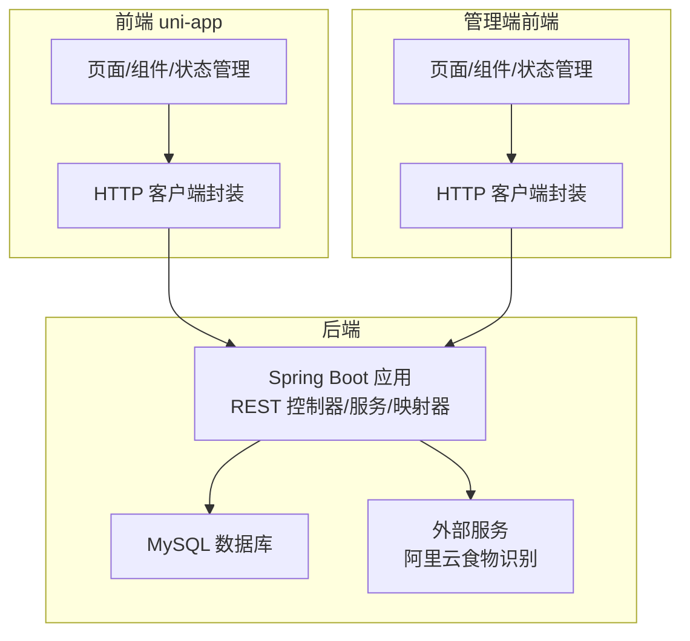
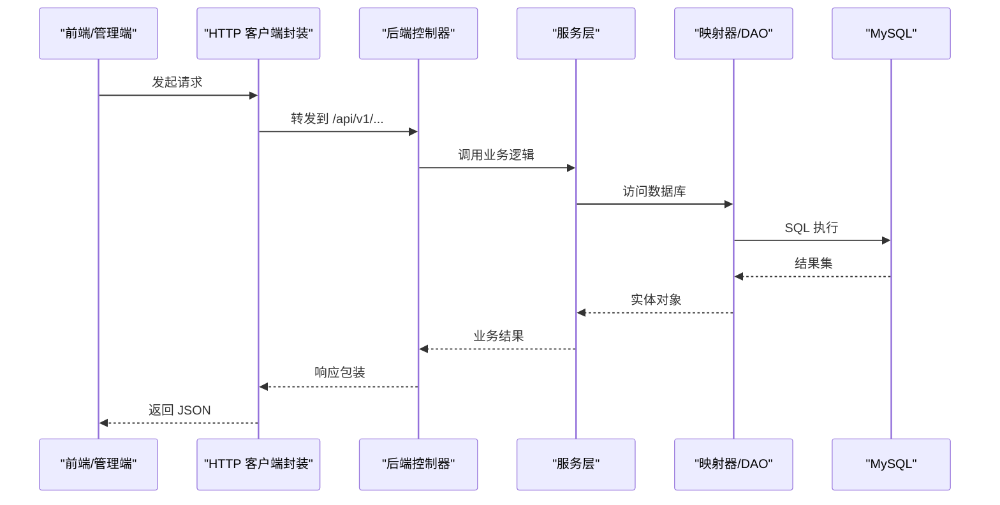
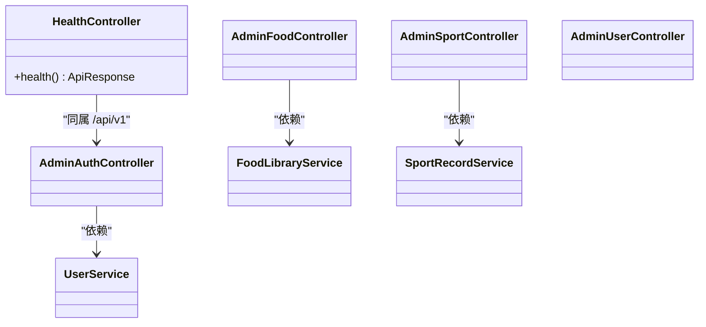
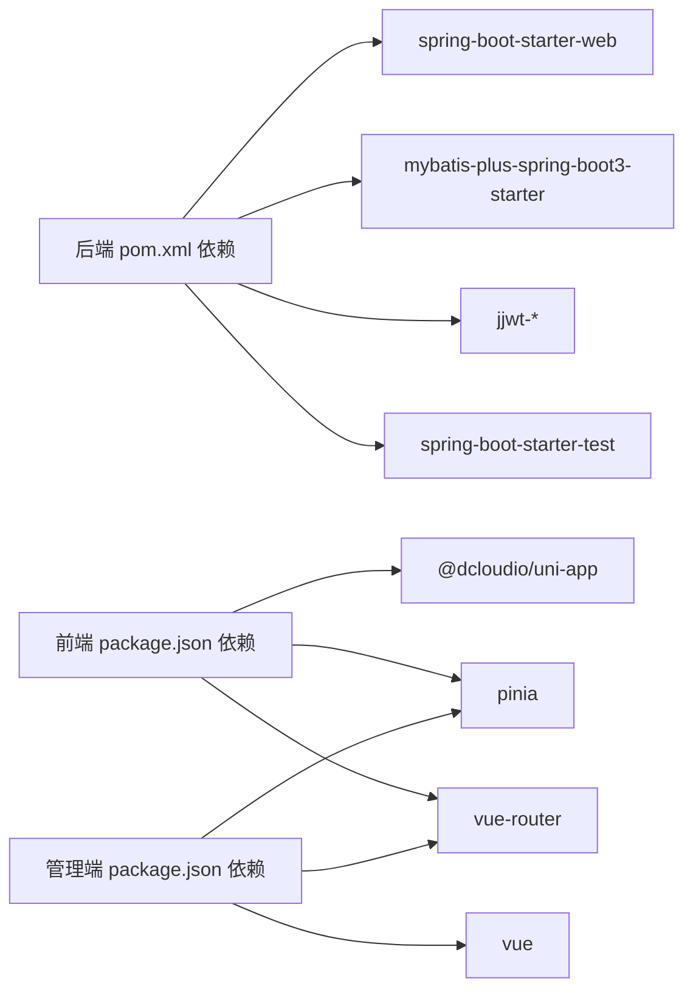

# 测试策略

<cite>
**本文引用的文件**   
- [后端 pom.xml](file://backend/pom.xml)
- [后端 application.yml](file://backend/src/main/resources/application.yml)
- [健康检查控制器](file://backend/src/main/java/com/ypfr/loseweight/web/HealthController.java)
- [管理员前端 package.json](file://admin-frontend/package.json)
- [管理员前端 vite.config.ts](file://admin-frontend/vite.config.ts)
- [前端 uni-app package.json](file://frontend/package.json)
- [前端 vite.config.ts](file://frontend/vite.config.ts)
- [项目基线 PRD（可执行）](file://docs/final/project-current-baseline-prd.md)
- [管理员前端 API 封装示例](file://admin-frontend/src/api/admin.ts)
</cite>

## 目录
1. [引言](#引言)
2. [项目结构](#项目结构)
3. [核心组件](#核心组件)
4. [架构总览](#架构总览)
5. [详细组件分析](#详细组件分析)
6. [依赖分析](#依赖分析)
7. [性能考虑](#性能考虑)
8. [故障排查指南](#故障排查指南)
9. [结论](#结论)
10. [附录](#附录)

## 引言
本测试策略面向“减脂/饮食记录”微信小程序全栈项目，覆盖后端服务、前端组件与工具函数的单元测试，API 接口与数据库、外部服务的集成测试，以及前端测试配置（Vue 组件、状态管理、路由）。文档同时给出测试框架选择建议、测试数据准备方法、自动化测试流程与持续集成配置思路，并明确测试覆盖率与质量保证标准。

## 项目结构
- 后端采用 Spring Boot 3 + MyBatis-Plus，使用 Maven 构建，提供 REST API。
- 前端采用 uni-app（Vue 3 + TypeScript），支持多端构建，包含 H5 与微信小程序目标平台。
- 管理端前端采用 Vue 3 + TypeScript + Vite，使用 Element Plus、Pinia、Vue Router。
- 数据库为 MySQL 8，配合 Flyway 迁移与种子数据脚本。
- 外部服务包括阿里云食物识别能力（通过 HTTP 客户端调用）。

图表来源
- [后端 pom.xml:25-75](file://backend/pom.xml#L25-L75)
- [后端 application.yml:1-54](file://backend/src/main/resources/application.yml#L1-L54)
- [前端 uni-app package.json:42-76](file://frontend/package.json#L42-L76)
- [管理员前端 package.json:11-25](file://admin-frontend/package.json#L11-L25)

章节来源
- [后端 pom.xml:1-86](file://backend/pom.xml#L1-L86)
- [后端 application.yml:1-54](file://backend/src/main/resources/application.yml#L1-L54)
- [前端 uni-app package.json:1-78](file://frontend/package.json#L1-L78)
- [管理员前端 package.json:1-27](file://admin-frontend/package.json#L1-L27)

## 核心组件
- 后端服务层：包含认证、用户、食物、运动、体重、仪表盘、识别等模块的服务与控制器。
- 前端领域 API：按功能域拆分的 API 文件，统一响应包装与类型定义。
- 管理端 API：后台管理的增删改查接口封装。
- 健康检查：对外暴露 /api/v1/health，用于快速验证服务可用性。

章节来源
- [健康检查控制器:1-17](file://backend/src/main/java/com/ypfr/loseweight/web/HealthController.java#L1-L17)
- [项目基线 PRD（可执行）:131-158](file://docs/final/project-current-baseline-prd.md#L131-L158)
- [管理员前端 API 封装示例:42-84](file://admin-frontend/src/api/admin.ts#L42-L84)

## 架构总览
后端通过 REST API 提供统一入口，前端通过各自 API 封装进行调用；外部服务通过 HTTP 客户端访问；数据库通过 MyBatis-Plus 访问。

图表来源
- [后端 pom.xml:25-75](file://backend/pom.xml#L25-L75)
- [后端 application.yml:1-54](file://backend/src/main/resources/application.yml#L1-L54)
- [项目基线 PRD（可执行）:123-158](file://docs/final/project-current-baseline-prd.md#L123-L158)

## 详细组件分析

### 后端服务测试（单元测试）
- 测试范围
  - 控制器层：验证请求参数解析、鉴权注解、响应包装一致性。
  - 服务层：验证业务规则、计算逻辑、异常分支。
  - 映射器/DAO：验证 SQL 正确性与边界条件。
- 测试框架
  - JUnit 5 + Spring Boot Test（starter-test 已引入）。
- Mock 与隔离
  - 使用 @MockBean/@SpyBean 替换外部依赖（如 HTTP 客户端、存储服务）。
  - 使用 @DataJpaTest/@MybatisTest 针对数据库层进行轻量测试。
- 覆盖率与质量
  - 关键路径：控制器 → 服务 → 映射器。
  - 覆盖率目标：服务层与控制器层行覆盖率 ≥ 80%，分支覆盖率 ≥ 60%。

图表来源
- [健康检查控制器:1-17](file://backend/src/main/java/com/ypfr/loseweight/web/HealthController.java#L1-L17)
- [后端 pom.xml:25-75](file://backend/pom.xml#L25-L75)

章节来源
- [后端 pom.xml:55-57](file://backend/pom.xml#L55-L57)

### 前端组件测试（Vue 组件测试）
- 测试范围
  - 页面与通用组件：交互、渲染、事件触发、props 输入输出。
  - 类型与工具函数：输入校验、格式化、日期处理。
- 测试框架
  - Vitest（推荐）或 Jest（已存在 jest 相关依赖）。
- 测试配置
  - 管理端：基于 Vite 插件的 Vue 测试环境。
  - uni-app：基于 Vite 插件的多端测试环境。
- 覆盖率与质量
  - 组件渲染与交互覆盖率 ≥ 80%；关键工具函数 100% 覆盖。

章节来源
- [管理员前端 vite.config.ts:1-8](file://admin-frontend/vite.config.ts#L1-L8)
- [前端 vite.config.ts:1-23](file://frontend/vite.config.ts#L1-L23)

### 工具函数测试
- 测试范围
  - 日期与时间处理、查询字符串拼接、滚动窗口计算、图片与文件处理等。
- 测试策略
  - 边界值测试（最小/最大值、空值、非法格式）。
  - 时区与本地化处理验证。
- 覆盖率目标：工具函数行覆盖率 ≥ 90%。

章节来源
- [前端 uni-app package.json:63-76](file://frontend/package.json#L63-L76)

### 集成测试策略
- API 接口测试
  - 使用 REST 客户端（如 RestAssured 或 axios）对 /api/v1 下的接口进行端到端验证。
  - 覆盖认证流程、鉴权失败、参数校验、业务异常、幂等性与并发安全。
- 数据库集成测试
  - 使用 Testcontainers 启动 MySQL 容器，Flyway 初始化迁移，针对关键业务流程进行事务性测试。
- 外部服务集成测试
  - 使用 WireMock 或 Mock Server 对阿里云食物识别接口进行桩/替身测试，验证错误重试与降级策略。

章节来源
- [后端 application.yml:36-46](file://backend/src/main/resources/application.yml#L36-L46)
- [项目基线 PRD（可执行）:131-158](file://docs/final/project-current-baseline-prd.md#L131-L158)

### 前端测试配置（Vue 组件、状态管理、路由）
- 组件测试
  - 使用 Vitest + @vue/test-utils 或 Jest + Vue Test Utils。
  - 通过 shallowMount/stub 模拟子组件与副作用。
- 状态管理测试（Pinia）
  - 直接调用 store 的 action/getter，断言状态变更与副作用。
- 路由测试
  - 使用 Memory Router 或 @testing-library/vue 的 renderWithRouter，验证路由守卫与参数传递。

章节来源
- [管理员前端 package.json:11-25](file://admin-frontend/package.json#L11-L25)
- [前端 uni-app package.json:42-76](file://frontend/package.json#L42-L76)

### API 测试用例设计
- 认证测试
  - 微信登录流程：code 有效/无效、返回 token 与用户信息结构。
  - Bearer Token：合法/过期/篡改、权限不足、匿名访问策略。
- 业务流程测试
  - 饮食记录：创建、更新、删除、批量导入、跨天与跨餐次。
  - 运动记录：创建、删除、统计汇总。
  - 体重记录：按日 upsert、趋势查询。
  - 拍照识图：提交、轮询、确认写入。
- 边界条件测试
  - 参数为空/超长/越界、日期范围非法、数量限制（如 limit 最大值）。
  - 并发写入与重复提交的幂等性。

章节来源
- [项目基线 PRD（可执行）:131-158](file://docs/final/project-current-baseline-prd.md#L131-L158)

## 依赖分析
- 后端依赖
  - Spring Web、Validation、Security Crypto、MyBatis-Plus、MySQL Connector、JWT。
- 前端依赖
  - uni-app 生态、Vue 3、Pinia、Vue Router、Axios。
- 测试依赖
  - Spring Boot Test、JUnit 5、Mockito、Testcontainers（数据库集成）、WireMock（外部服务）。

图表来源
- [后端 pom.xml:25-75](file://backend/pom.xml#L25-L75)
- [前端 uni-app package.json:42-76](file://frontend/package.json#L42-L76)
- [管理员前端 package.json:11-25](file://admin-frontend/package.json#L11-L25)

章节来源
- [后端 pom.xml:25-75](file://backend/pom.xml#L25-L75)
- [前端 uni-app package.json:42-76](file://frontend/package.json#L42-L76)
- [管理员前端 package.json:11-25](file://admin-frontend/package.json#L11-L25)

## 性能考虑
- 接口性能
  - 对热点接口（搜索、识图、统计）进行压力测试，设定 P95/P99 延迟阈值。
- 数据库性能
  - 针对高频查询建立必要索引，避免 N+1 查询；使用连接池监控与慢查询日志。
- 外部服务性能
  - 设置合理的超时与重试策略，实现降级与熔断。

## 故障排查指南
- 健康检查
  - 通过 /api/v1/health 快速判断服务是否可用。
- 日志与监控
  - 后端开启调试日志，关注 MyBatis SQL 与外部服务调用链。
- 配置核对
  - 确认数据库连接、JWT 密钥、上传目录、阿里云 AppCode 等配置项。

章节来源
- [健康检查控制器:1-17](file://backend/src/main/java/com/ypfr/loseweight/web/HealthController.java#L1-L17)
- [后端 application.yml:36-54](file://backend/src/main/resources/application.yml#L36-L54)

## 结论
本测试策略以“后端服务 + 前端组件 + 工具函数”的单元测试为基础，结合 API、数据库与外部服务的集成测试，形成完整的质量保障闭环。通过明确的覆盖率与质量标准、可落地的测试配置与流程，确保系统在演进过程中保持高可靠性与可维护性。

## 附录
- 测试数据准备
  - 使用 Flyway 迁移初始化测试库，构造典型用户、食物、运动、体重与识别任务数据。
- 自动化测试流程与持续集成
  - CI 阶段：安装依赖 → 编译 → 单元测试（含覆盖率）→ 集成测试（容器化数据库）→ 外部服务桩测试 → 生成报告。
- 质量门禁
  - 代码合并前需满足最低覆盖率阈值与无阻断缺陷。