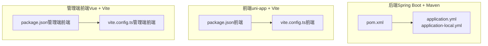
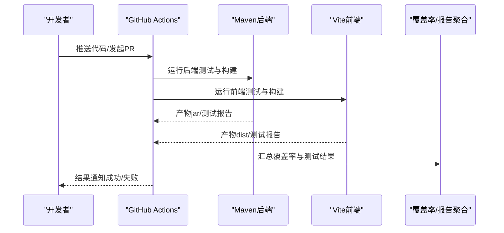
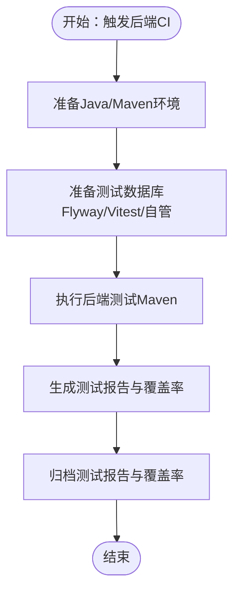
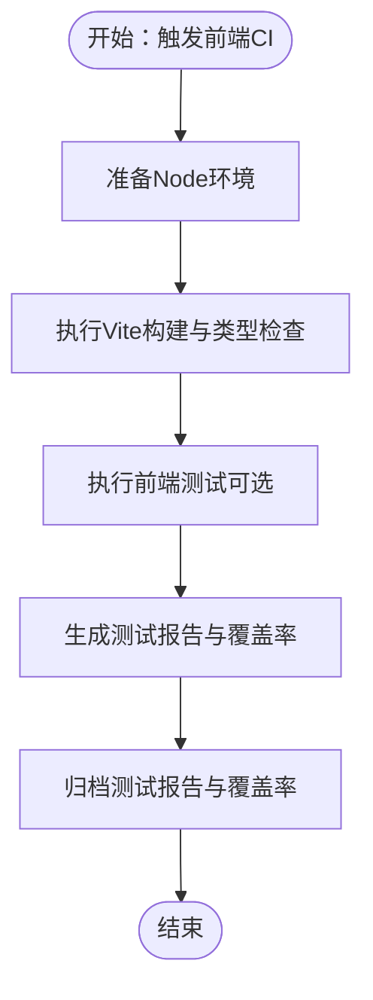
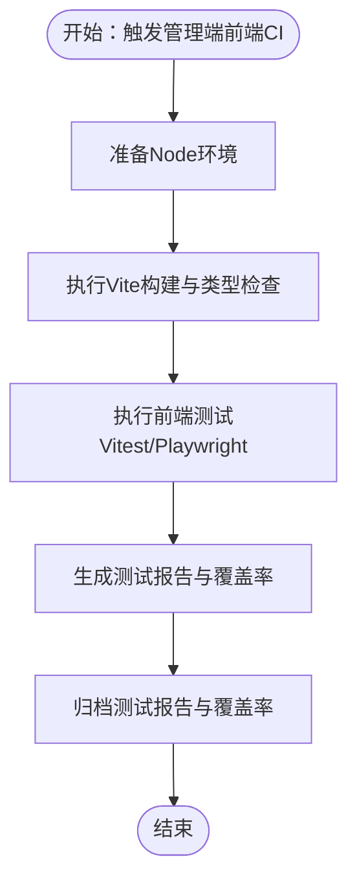
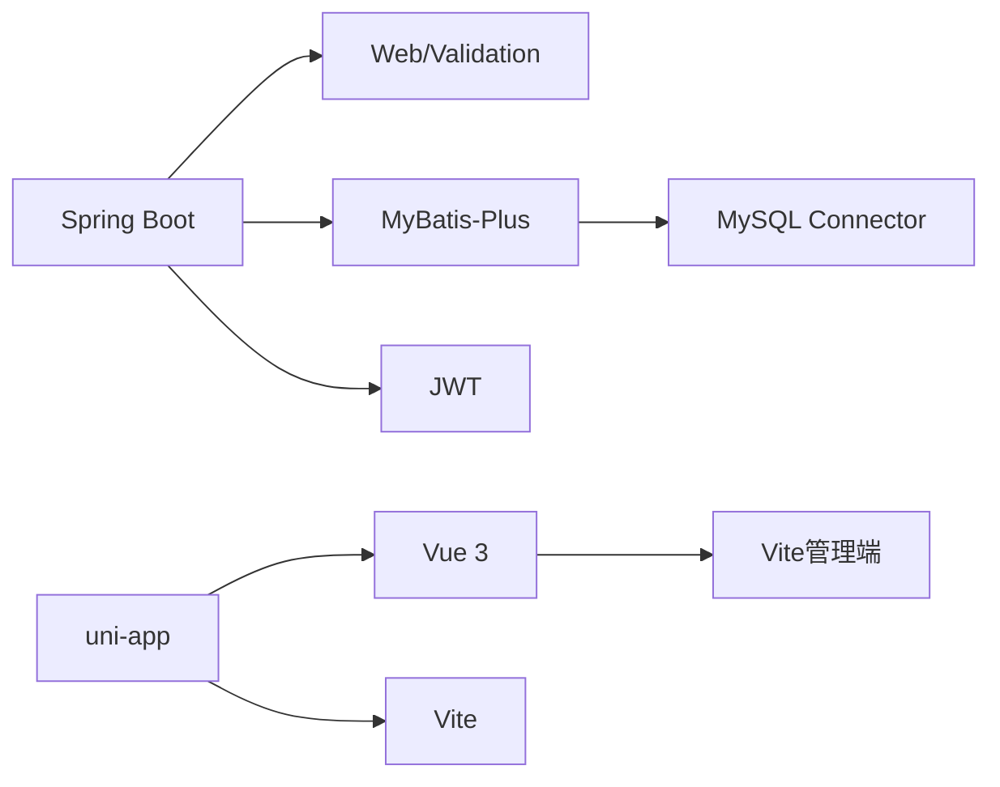

# 测试自动化与CI/CD

<cite>
**本文引用的文件**
- [pom.xml](file://backend/pom.xml)
- [application.yml](file://backend/src/main/resources/application.yml)
- [application-local.yml](file://backend/src/main/resources/application-local.yml)
- [package.json（前端）](file://frontend/package.json)
- [vite.config.ts（前端）](file://frontend/vite.config.ts)
- [package.json（管理端前端）](file://admin-frontend/package.json)
- [vite.config.ts（管理端前端）](file://admin-frontend/vite.config.ts)
</cite>

## 目录
1. [简介](#简介)
2. [项目结构](#项目结构)
3. [核心组件](#核心组件)
4. [架构总览](#架构总览)
5. [详细组件分析](#详细组件分析)
6. [依赖分析](#依赖分析)
7. [性能考虑](#性能考虑)
8. [故障排查指南](#故障排查指南)
9. [结论](#结论)
10. [附录](#附录)

## 简介
本文件面向测试自动化与CI/CD落地，结合当前仓库的后端（Spring Boot + Maven）与前后端（Vue + Vite）技术栈，系统性阐述如何在GitHub Actions中构建持续集成流水线，实现后端与前端的自动化测试执行、并行化与分组策略、失败重试机制、覆盖率与测试结果报告生成，并配套测试环境管理、测试数据清理、测试结果监控与质量门禁设置。同时提供测试自动化的最佳实践与运维建议。

## 项目结构
- 后端采用Spring Boot 3 + MyBatis-Plus，使用Maven进行依赖与构建管理。
- 前端分为两套：移动端前端（基于uni-app）与管理端前端（Vue 3），均使用Vite作为构建工具。
- 配置文件采用Spring Profile与多环境配置，便于在CI中注入不同环境变量与数据库连接参数。

图表来源
- [pom.xml](file://backend/pom.xml)
- [application.yml](file://backend/src/main/resources/application.yml)
- [application-local.yml](file://backend/src/main/resources/application-local.yml)
- [package.json（前端）](file://frontend/package.json)
- [vite.config.ts（前端）](file://frontend/vite.config.ts)
- [package.json（管理端前端）](file://admin-frontend/package.json)
- [vite.config.ts（管理端前端）](file://admin-frontend/vite.config.ts)

章节来源
- [pom.xml](file://backend/pom.xml)
- [application.yml](file://backend/src/main/resources/application.yml)
- [application-local.yml](file://backend/src/main/resources/application-local.yml)
- [package.json（前端）](file://frontend/package.json)
- [vite.config.ts（前端）](file://frontend/vite.config.ts)
- [package.json（管理端前端）](file://admin-frontend/package.json)
- [vite.config.ts（管理端前端）](file://admin-frontend/vite.config.ts)

## 核心组件
- 后端测试与构建
  - 依赖与插件：Spring Boot Starter Test、MyBatis-Plus Starter、MySQL Connector等。
  - 构建插件：spring-boot-maven-plugin用于打包与运行。
- 前端测试与构建
  - uni-app前端：提供多平台构建脚本，Vite配置支持环境变量注入。
  - 管理端前端：Vue + Vite，基础构建与开发脚本。
- 配置与环境
  - application.yml定义默认数据库、日志、上传路径等；application-local.yml用于本地覆盖敏感信息。

章节来源
- [pom.xml](file://backend/pom.xml)
- [application.yml](file://backend/src/main/resources/application.yml)
- [application-local.yml](file://backend/src/main/resources/application-local.yml)
- [package.json（前端）](file://frontend/package.json)
- [vite.config.ts（前端）](file://frontend/vite.config.ts)
- [package.json（管理端前端）](file://admin-frontend/package.json)
- [vite.config.ts（管理端前端）](file://admin-frontend/vite.config.ts)

## 架构总览
下图展示CI流水线中后端与前端的测试与构建阶段，以及关键产物（构建包、测试报告、覆盖率报告）的生成与归档流程。

图表来源
- [pom.xml](file://backend/pom.xml)
- [package.json（前端）](file://frontend/package.json)
- [package.json（管理端前端）](file://admin-frontend/package.json)

## 详细组件分析

### 后端（Spring Boot + Maven）测试与CI
- 测试框架与依赖
  - Spring Boot Starter Test用于单元与集成测试。
  - MyBatis-Plus Starter与MySQL Connector用于数据库访问与迁移。
- 构建与打包
  - spring-boot-maven-plugin负责打包与启动。
- CI建议
  - 在流水线中添加“后端测试”步骤，使用Maven命令执行测试并生成JUnit报告。
  - 使用覆盖率插件（如Jacoco）生成覆盖率报告并在质量门禁中校验阈值。
  - 将测试报告与覆盖率报告归档，供后续分析与质量门禁使用。

图表来源
- [pom.xml](file://backend/pom.xml)

章节来源
- [pom.xml](file://backend/pom.xml)

### 前端（uni-app + Vite）测试与CI
- 构建与脚本
  - 提供多平台构建脚本，Vite配置支持从环境变量注入API地址。
- 测试建议
  - 在CI中执行Vite构建与类型检查，确保构建链路稳定。
  - 若需要UI测试，可在管理端前端引入Vitest或Playwright，并在CI中执行测试与覆盖率收集。
  - 将测试报告与覆盖率报告归档，统一由质量门禁读取。

图表来源
- [package.json（前端）](file://frontend/package.json)
- [vite.config.ts（前端）](file://frontend/vite.config.ts)

章节来源
- [package.json（前端）](file://frontend/package.json)
- [vite.config.ts（前端）](file://frontend/vite.config.ts)

### 管理端前端（Vue + Vite）测试与CI
- 构建与脚本
  - Vue + Vite基础脚本，支持开发与构建。
- 测试建议
  - 引入Vitest或Playwright进行单元与端到端测试。
  - 在CI中执行测试并生成Jest风格的JUnit报告与覆盖率报告，便于统一归档与质量门禁。

图表来源
- [package.json（管理端前端）](file://admin-frontend/package.json)
- [vite.config.ts（管理端前端）](file://admin-frontend/vite.config.ts)

章节来源
- [package.json（管理端前端）](file://admin-frontend/package.json)
- [vite.config.ts（管理端前端）](file://admin-frontend/vite.config.ts)

### 测试并行化、分组与失败重试
- 并行化
  - 后端：在CI中并行执行不同模块的测试任务（如按包或功能模块拆分）。
  - 前端：并行执行不同平台的构建任务（如微信小程序、H5等）。
- 分组
  - 将测试按功能域分组（认证、记录、报表等），分别在独立作业中执行。
- 失败重试
  - 对不稳定环节（网络请求、第三方服务调用）启用重试策略，避免偶发失败影响整体质量。

章节来源
- [pom.xml](file://backend/pom.xml)
- [package.json（前端）](file://frontend/package.json)
- [package.json（管理端前端）](file://admin-frontend/package.json)

### 测试报告生成与质量门禁
- 报告类型
  - 测试结果报告：JUnit XML（后端）、Jest JUnit XML（前端）。
  - 覆盖率报告：JaCoCo（后端）、Vitest覆盖率（前端）。
- 归档与可视化
  - 在CI中归档报告，使用覆盖率与测试结果可视化工具进行展示。
- 质量门禁
  - 设置最小覆盖率阈值与失败用例阈值，未达标则阻断合并。

章节来源
- [pom.xml](file://backend/pom.xml)
- [package.json（前端）](file://frontend/package.json)
- [package.json（管理端前端）](file://admin-frontend/package.json)

### 测试环境管理与数据清理
- 环境隔离
  - 使用独立的测试数据库实例，避免与开发/生产数据冲突。
- 数据清理
  - 在测试前/后执行SQL脚本或使用迁移工具回滚至基线状态。
- 配置注入
  - 通过环境变量注入数据库连接、第三方服务密钥等，避免硬编码。

章节来源
- [application.yml](file://backend/src/main/resources/application.yml)
- [application-local.yml](file://backend/src/main/resources/application-local.yml)

## 依赖分析
- 后端依赖关系
  - Spring Boot Web、Validation、Security Crypto、MyBatis-Plus、MySQL Connector、JWT相关依赖。
- 前端依赖关系
  - uni-app生态、Vue 3、Vite、TypeScript等。
- CI中的耦合点
  - 后端与数据库的连通性、前端与后端API的可达性、第三方服务（如阿里云）的可用性。

图表来源
- [pom.xml](file://backend/pom.xml)
- [package.json（前端）](file://frontend/package.json)
- [package.json（管理端前端）](file://admin-frontend/package.json)

章节来源
- [pom.xml](file://backend/pom.xml)
- [package.json（前端）](file://frontend/package.json)
- [package.json（管理端前端）](file://admin-frontend/package.json)

## 性能考虑
- 测试执行时间优化
  - 并行化执行、缓存依赖与构建产物、减少冷启动。
- 报告生成与存储
  - 使用轻量级报告格式，控制报告体积，提升归档与下载效率。
- 环境准备
  - 预热数据库、复用容器镜像、减少网络请求延迟。

## 故障排查指南
- 后端常见问题
  - 数据源连接失败：检查CI中的数据库URL、账号、密码是否正确注入。
  - 测试超时：检查第三方服务（如阿里云）接口可用性与超时配置。
- 前端常见问题
  - 构建失败：检查Node版本、依赖安装与Vite配置中的环境变量。
  - API地址错误：确认Vite配置中API地址是否正确注入。
- 报告缺失
  - 确认测试命令是否生成JUnit或覆盖率报告文件，并在CI中正确归档。

章节来源
- [application.yml](file://backend/src/main/resources/application.yml)
- [application-local.yml](file://backend/src/main/resources/application-local.yml)
- [vite.config.ts（前端）](file://frontend/vite.config.ts)
- [vite.config.ts（管理端前端）](file://admin-frontend/vite.config.ts)

## 结论
通过在GitHub Actions中整合后端与前端的测试与构建流程，配合并行化、分组与失败重试策略，能够显著提升交付质量与效率。结合覆盖率与测试结果报告的统一归档与质量门禁，可有效保障代码健康度与稳定性。

## 附录
- 最佳实践清单
  - 使用独立测试数据库与环境变量，避免污染。
  - 将测试报告与覆盖率报告归档，便于追溯与趋势分析。
  - 设置质量门禁阈值，阻断低质量变更。
  - 对不稳定环节启用重试，提高成功率。
  - 在PR中展示关键指标，辅助评审决策。