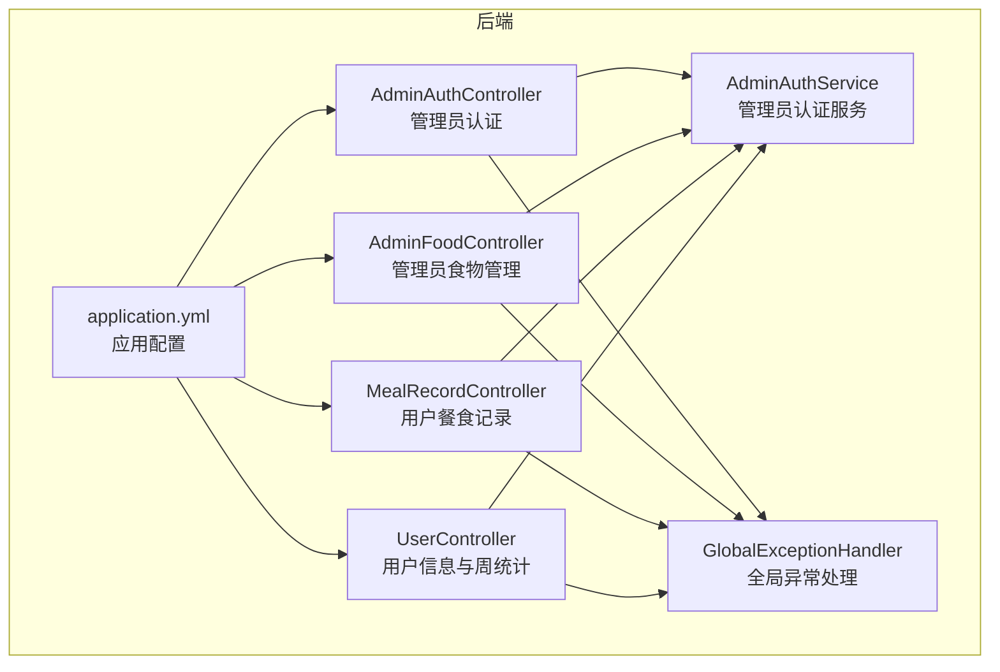
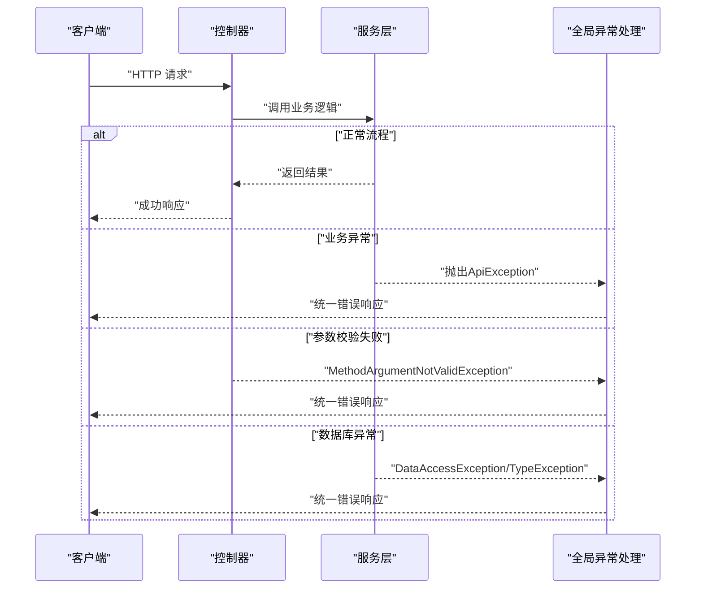
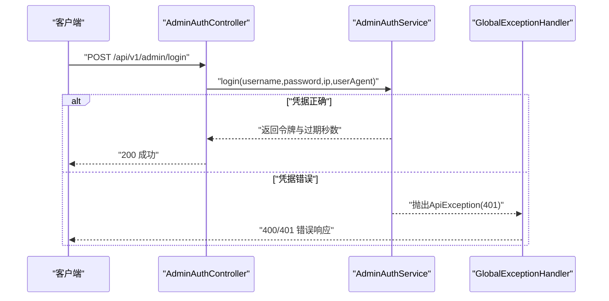
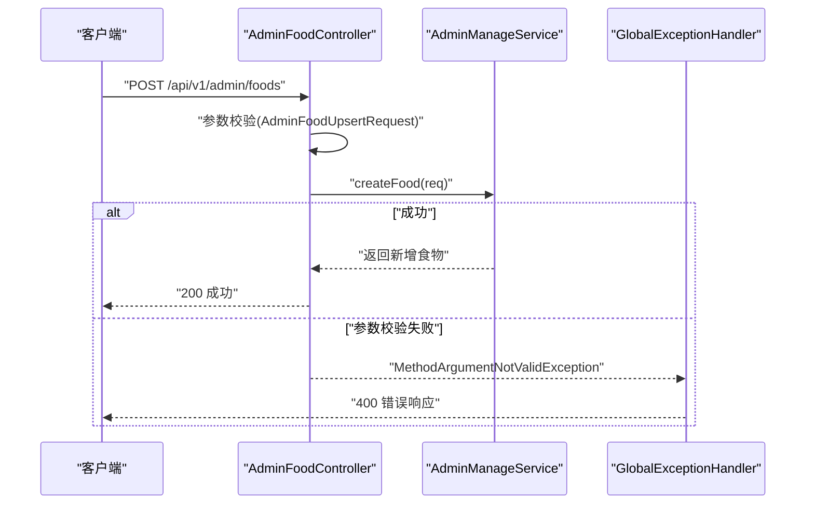
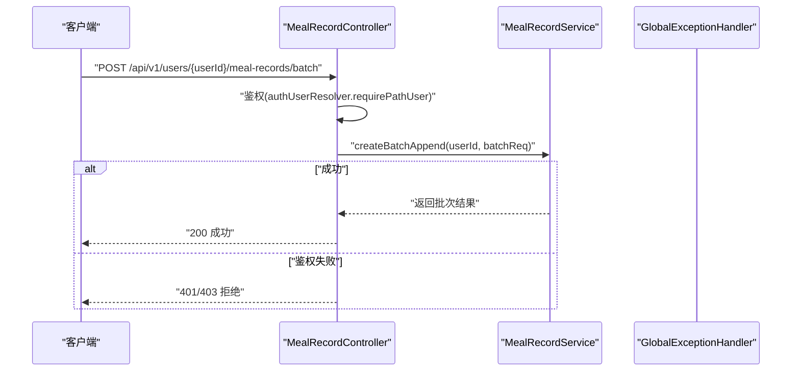
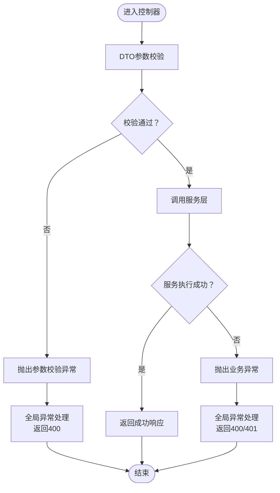
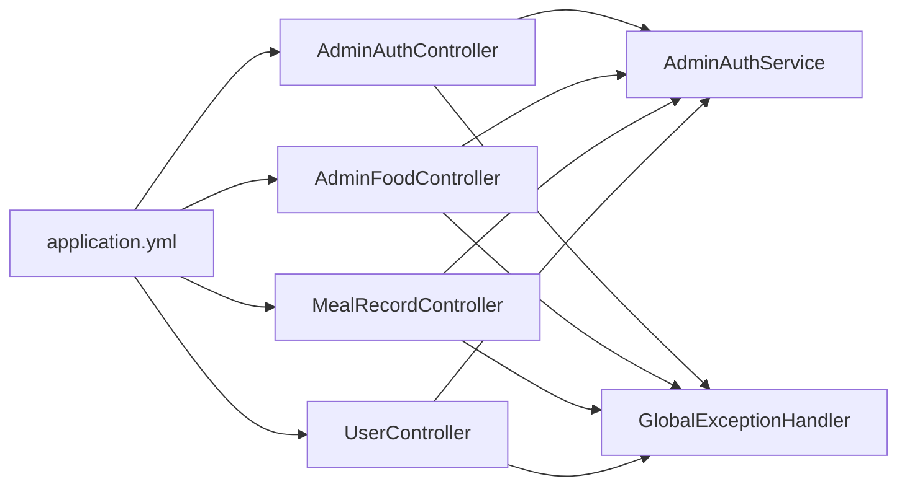

# API集成测试

<cite>
**本文引用的文件**
- [AdminAuthController.java](file://backend/src/main/java/com/ypfr/loseweight/web/AdminAuthController.java)
- [AdminAuthService.java](file://backend/src/main/java/com/ypfr/loseweight/service/AdminAuthService.java)
- [AdminFoodController.java](file://backend/src/main/java/com/ypfr/loseweight/web/AdminFoodController.java)
- [AdminFoodUpsertRequest.java](file://backend/src/main/java/com/ypfr/loseweight/web/dto/admin/AdminFoodUpsertRequest.java)
- [AdminLoginRequest.java](file://backend/src/main/java/com/ypfr/loseweight/web/dto/admin/AdminLoginRequest.java)
- [MealRecordController.java](file://backend/src/main/java/com/ypfr/loseweight/web/MealRecordController.java)
- [CreateMealRecordRequest.java](file://backend/src/main/java/com/ypfr/loseweight/web/dto/CreateMealRecordRequest.java)
- [CreateMealRecordsBatchRequest.java](file://backend/src/main/java/com/ypfr/loseweight/web/dto/CreateMealRecordsBatchRequest.java)
- [BatchMealItemRequest.java](file://backend/src/main/java/com/ypfr/loseweight/web/dto/BatchMealItemRequest.java)
- [UserController.java](file://backend/src/main/java/com/ypfr/loseweight/web/UserController.java)
- [GlobalExceptionHandler.java](file://backend/src/main/java/com/ypfr/loseweight/common/GlobalExceptionHandler.java)
- [application.yml](file://backend/src/main/resources/application.yml)
- [pom.xml](file://backend/pom.xml)
</cite>

## 目录
1. [引言](#引言)
2. [项目结构](#项目结构)
3. [核心组件](#核心组件)
4. [架构总览](#架构总览)
5. [详细组件分析](#详细组件分析)
6. [依赖分析](#依赖分析)
7. [性能考虑](#性能考虑)
8. [故障排查指南](#故障排查指南)
9. [结论](#结论)
10. [附录](#附录)

## 引言
本文件面向API集成测试，系统化说明RESTful API集成测试的设计与实现，覆盖控制器层测试、DTO验证测试、异常处理测试。内容包含测试环境配置、Mock数据准备、API端点测试策略、请求响应验证与断言方法，并提供具体测试用例示例：用户认证测试、数据CRUD操作测试、批量操作测试与错误场景测试。同时给出如何使用Postman进行API测试集合管理与自动化测试的实践建议。

## 项目结构
后端采用Spring Boot工程，API集中在web包的控制器中，业务逻辑位于service包，通用异常处理由全局异常处理器统一处理。配置文件定义了数据库连接、服务器端口与上传目录等关键参数。

图表来源
- [AdminAuthController.java:1-62](file://backend/src/main/java/com/ypfr/loseweight/web/AdminAuthController.java#L1-L62)
- [AdminFoodController.java:1-67](file://backend/src/main/java/com/ypfr/loseweight/web/AdminFoodController.java#L1-L67)
- [MealRecordController.java:1-61](file://backend/src/main/java/com/ypfr/loseweight/web/MealRecordController.java#L1-L61)
- [UserController.java:1-41](file://backend/src/main/java/com/ypfr/loseweight/web/UserController.java#L1-L41)
- [AdminAuthService.java:1-80](file://backend/src/main/java/com/ypfr/loseweight/service/AdminAuthService.java#L1-L80)
- [GlobalExceptionHandler.java:1-107](file://backend/src/main/java/com/ypfr/loseweight/common/GlobalExceptionHandler.java#L1-L107)
- [application.yml:1-54](file://backend/src/main/resources/application.yml#L1-L54)

章节来源
- [application.yml:1-54](file://backend/src/main/resources/application.yml#L1-L54)
- [pom.xml:1-86](file://backend/pom.xml#L1-L86)

## 核心组件
- 控制器层：负责HTTP端点暴露与请求参数解析，典型控制器包括管理员认证控制器、管理员食物管理控制器、用户餐食记录控制器、用户信息控制器。
- DTO层：封装请求与响应的数据结构，包含校验注解，确保输入合法性。
- 服务层：实现业务逻辑，如管理员认证、食物增删改查等。
- 全局异常处理：集中处理业务异常、参数校验异常、数据库访问异常与未捕获异常，返回统一的响应格式。

章节来源
- [AdminAuthController.java:1-62](file://backend/src/main/java/com/ypfr/loseweight/web/AdminAuthController.java#L1-L62)
- [AdminFoodController.java:1-67](file://backend/src/main/java/com/ypfr/loseweight/web/AdminFoodController.java#L1-L67)
- [MealRecordController.java:1-61](file://backend/src/main/java/com/ypfr/loseweight/web/MealRecordController.java#L1-L61)
- [UserController.java:1-41](file://backend/src/main/java/com/ypfr/loseweight/web/UserController.java#L1-L41)
- [AdminAuthService.java:1-80](file://backend/src/main/java/com/ypfr/loseweight/service/AdminAuthService.java#L1-L80)
- [GlobalExceptionHandler.java:1-107](file://backend/src/main/java/com/ypfr/loseweight/common/GlobalExceptionHandler.java#L1-L107)

## 架构总览
以下序列图展示从客户端到控制器、服务与异常处理的整体调用链路，体现集成测试的关键交互路径。

图表来源
- [AdminAuthController.java:36-60](file://backend/src/main/java/com/ypfr/loseweight/web/AdminAuthController.java#L36-L60)
- [AdminAuthService.java:31-68](file://backend/src/main/java/com/ypfr/loseweight/service/AdminAuthService.java#L31-L68)
- [GlobalExceptionHandler.java:19-66](file://backend/src/main/java/com/ypfr/loseweight/common/GlobalExceptionHandler.java#L19-L66)

## 详细组件分析

### 管理员认证与仪表盘（AdminAuthController）
- 端点设计
  - 登录：POST /api/v1/admin/login
  - 修改密码：POST /api/v1/admin/change-password
  - 获取仪表盘统计：GET /api/v1/admin/dashboard/stats
- 关键行为
  - 登录：接收用户名/密码，校验后生成令牌并返回过期秒数。
  - 修改密码：鉴权后校验旧密码与新密码合规性，更新加密后的密码。
  - 仪表盘统计：鉴权后返回统计数据。
- 测试要点
  - 登录：用户名/密码为空、错误凭据、账户禁用等边界场景。
  - 修改密码：旧密码错误、新旧密码相同、账户状态异常。
  - 仪表盘：未携带有效令牌时拒绝访问。

图表来源
- [AdminAuthController.java:36-42](file://backend/src/main/java/com/ypfr/loseweight/web/AdminAuthController.java#L36-L42)
- [AdminAuthService.java:31-51](file://backend/src/main/java/com/ypfr/loseweight/service/AdminAuthService.java#L31-L51)
- [GlobalExceptionHandler.java:19-32](file://backend/src/main/java/com/ypfr/loseweight/common/GlobalExceptionHandler.java#L19-L32)

章节来源
- [AdminAuthController.java:36-60](file://backend/src/main/java/com/ypfr/loseweight/web/AdminAuthController.java#L36-L60)
- [AdminAuthService.java:31-68](file://backend/src/main/java/com/ypfr/loseweight/service/AdminAuthService.java#L31-L68)
- [AdminLoginRequest.java:1-29](file://backend/src/main/java/com/ypfr/loseweight/web/dto/admin/AdminLoginRequest.java#L1-L29)

### 管理员食物管理（AdminFoodController）
- 端点设计
  - 列表查询：GET /api/v1/admin/foods?keyword=&status=
  - 新增：POST /api/v1/admin/foods
  - 更新：PUT /api/v1/admin/foods/{id}
  - 删除：DELETE /api/v1/admin/foods/{id}
- 关键行为
  - 查询：支持关键词与状态过滤。
  - 新增/更新：使用AdminFoodUpsertRequest进行参数校验。
  - 删除：鉴权后删除指定食物。
- 测试要点
  - 参数校验：categoryId/name/status为空。
  - 权限校验：未携带令牌或令牌无效。
  - 业务异常：重复状态值、数据不存在等。

图表来源
- [AdminFoodController.java:41-47](file://backend/src/main/java/com/ypfr/loseweight/web/AdminFoodController.java#L41-L47)
- [AdminFoodUpsertRequest.java:1-142](file://backend/src/main/java/com/ypfr/loseweight/web/dto/admin/AdminFoodUpsertRequest.java#L1-L142)
- [GlobalExceptionHandler.java:24-32](file://backend/src/main/java/com/ypfr/loseweight/common/GlobalExceptionHandler.java#L24-L32)

章节来源
- [AdminFoodController.java:32-65](file://backend/src/main/java/com/ypfr/loseweight/web/AdminFoodController.java#L32-L65)
- [AdminFoodUpsertRequest.java:9-28](file://backend/src/main/java/com/ypfr/loseweight/web/dto/admin/AdminFoodUpsertRequest.java#L9-L28)

### 用户餐食记录（MealRecordController）
- 端点设计
  - 创建单条：POST /api/v1/users/{userId}/meal-records
  - 批量创建：POST /api/v1/users/{userId}/meal-records/batch
  - 删除：DELETE /api/v1/users/{userId}/meal-records/{id}
- 关键行为
  - 创建：鉴权要求路径userId与令牌一致，使用CreateMealRecordRequest。
  - 批量：CreateMealRecordsBatchRequest包含日期、餐次与明细列表BatchMealItemRequest。
  - 删除：鉴权后删除指定记录。
- 测试要点
  - 身份校验：路径userId与令牌不匹配。
  - 参数校验：必填字段缺失、时间格式非法。
  - 批量场景：同一天同一餐次复用已有主记录。

图表来源
- [MealRecordController.java:42-49](file://backend/src/main/java/com/ypfr/loseweight/web/MealRecordController.java#L42-L49)
- [CreateMealRecordsBatchRequest.java:1-50](file://backend/src/main/java/com/ypfr/loseweight/web/dto/CreateMealRecordsBatchRequest.java#L1-L50)
- [BatchMealItemRequest.java:1-46](file://backend/src/main/java/com/ypfr/loseweight/web/dto/BatchMealItemRequest.java#L1-L46)

章节来源
- [MealRecordController.java:30-59](file://backend/src/main/java/com/ypfr/loseweight/web/MealRecordController.java#L30-L59)
- [CreateMealRecordRequest.java:1-99](file://backend/src/main/java/com/ypfr/loseweight/web/dto/CreateMealRecordRequest.java#L1-L99)
- [CreateMealRecordsBatchRequest.java:1-50](file://backend/src/main/java/com/ypfr/loseweight/web/dto/CreateMealRecordsBatchRequest.java#L1-L50)
- [BatchMealItemRequest.java:1-46](file://backend/src/main/java/com/ypfr/loseweight/web/dto/BatchMealItemRequest.java#L1-L46)

### 用户信息与周统计（UserController）
- 端点设计
  - 获取用户：GET /api/v1/users/{id}
  - 周统计：GET /api/v1/users/{userId}/week-stats?startDate=&endDate=
- 关键行为
  - 返回AppUserDto与WeekStatsDto。
- 测试要点
  - 日期参数格式校验与边界值。
  - 用户不存在或被禁用的异常路径。

章节来源
- [UserController.java:28-39](file://backend/src/main/java/com/ypfr/loseweight/web/UserController.java#L28-L39)

### DTO验证与异常处理
- DTO验证
  - AdminLoginRequest：用户名与密码非空校验。
  - AdminFoodUpsertRequest：categoryId/name/status非空校验，数值型字段范围校验。
  - CreateMealRecordRequest：日期字符串、宏量营养素字段类型校验。
  - CreateMealRecordsBatchRequest：批次日期、餐次与明细列表校验。
- 全局异常处理
  - ApiException：业务异常，返回400与错误码。
  - MethodArgumentNotValidException：参数校验失败，返回400与首个字段错误。
  - DataAccessException/TypeException：数据库访问与类型映射异常，返回500。
  - 其他异常：兜底返回500“服务器内部错误”。

图表来源
- [AdminLoginRequest.java:7-11](file://backend/src/main/java/com/ypfr/loseweight/web/dto/admin/AdminLoginRequest.java#L7-L11)
- [AdminFoodUpsertRequest.java:9-28](file://backend/src/main/java/com/ypfr/loseweight/web/dto/admin/AdminFoodUpsertRequest.java#L9-L28)
- [CreateMealRecordRequest.java:12-14](file://backend/src/main/java/com/ypfr/loseweight/web/dto/CreateMealRecordRequest.java#L12-L14)
- [GlobalExceptionHandler.java:24-32](file://backend/src/main/java/com/ypfr/loseweight/common/GlobalExceptionHandler.java#L24-L32)

章节来源
- [GlobalExceptionHandler.java:19-66](file://backend/src/main/java/com/ypfr/loseweight/common/GlobalExceptionHandler.java#L19-L66)

## 依赖分析
- 控制器依赖服务层与鉴权解析器，服务层依赖Mapper与工具类。
- 全局异常处理对所有控制器生效，保证错误响应一致性。
- 应用配置影响数据库连接、服务器监听地址与上传目录等运行时行为。

图表来源
- [AdminAuthController.java:23-34](file://backend/src/main/java/com/ypfr/loseweight/web/AdminAuthController.java#L23-L34)
- [AdminFoodController.java:24-30](file://backend/src/main/java/com/ypfr/loseweight/web/AdminFoodController.java#L24-L30)
- [MealRecordController.java:21-28](file://backend/src/main/java/com/ypfr/loseweight/web/MealRecordController.java#L21-L28)
- [UserController.java:19-26](file://backend/src/main/java/com/ypfr/loseweight/web/UserController.java#L19-L26)
- [GlobalExceptionHandler.java:14-15](file://backend/src/main/java/com/ypfr/loseweight/common/GlobalExceptionHandler.java#L14-L15)
- [application.yml:1-54](file://backend/src/main/resources/application.yml#L1-L54)

章节来源
- [pom.xml:25-75](file://backend/pom.xml#L25-L75)

## 性能考虑
- 并发与超时：合理设置Tomcat最大线程与连接超时，避免高并发下的连接堆积。
- 数据库：关注MyBatis Plus日志级别与慢查询，结合索引优化常见查询路径。
- 上传与缓存：控制文件大小限制与上传目录容量，避免I/O瓶颈。
- 缓存策略：对只读数据（如食物库）引入Redis缓存，降低数据库压力。

## 故障排查指南
- 参数校验失败
  - 现象：返回400，包含首个字段的错误提示。
  - 排查：确认必填字段、格式与取值范围。
- 业务异常
  - 现象：返回400，携带错误码与消息。
  - 排查：核对账户状态、权限与业务规则。
- 数据库异常
  - 现象：返回500，包含友好提示与原始错误片段。
  - 排查：按提示执行迁移脚本，检查表结构与列是否存在。
- 未捕获异常
  - 现象：返回500“服务器内部错误”。
  - 排查：查看服务端日志定位根因。

章节来源
- [GlobalExceptionHandler.java:34-66](file://backend/src/main/java/com/ypfr/loseweight/common/GlobalExceptionHandler.java#L34-L66)

## 结论
通过明确的控制器层职责、严格的DTO参数校验与统一的异常处理机制，本项目具备良好的API集成测试基础。建议在测试中重点覆盖身份鉴权、参数校验、业务规则与异常路径，并结合Postman集合进行自动化回归。

## 附录

### 测试环境配置
- 数据库连接
  - 地址与凭证：application.yml中配置。
  - 迁移脚本：按需执行database/migrations中的SQL脚本以对齐表结构。
- 服务器监听
  - 端口与地址：默认监听0.0.0.0:8080，便于局域网联调。
- 上传目录
  - 头像与食物图片目录：./uploads/avatars、./uploads/food-images。

章节来源
- [application.yml:8-18](file://backend/src/main/resources/application.yml#L8-L18)
- [application.yml:47-49](file://backend/src/main/resources/application.yml#L47-L49)

### Mock数据准备
- 管理员账户：准备一个状态正常的管理员账户用于登录与修改密码测试。
- 用户账户：准备至少两个用户ID，用于餐食记录与周统计测试。
- 食物库：准备若干食物项，满足AdminFoodUpsertRequest的字段要求。
- 批量场景：准备同一天、同一餐次的多条明细，验证批量写入与复用主记录逻辑。

### API端点测试策略
- 控制器层测试
  - 登录：构造AdminLoginRequest，验证令牌生成与过期秒数。
  - 修改密码：构造AdminChangePasswordRequest，验证旧密码校验与新旧密码相同性。
  - 食物管理：构造AdminFoodUpsertRequest，验证新增/更新/删除。
  - 餐食记录：构造CreateMealRecordRequest与CreateMealRecordsBatchRequest，验证鉴权与业务逻辑。
  - 用户信息：构造日期参数，验证周统计范围与边界。
- DTO验证测试
  - 非空校验：逐项清空必填字段，验证400响应。
  - 类型校验：传入错误类型或非法格式，验证400响应。
  - 数值范围：超出范围或负值，验证400响应。
- 异常处理测试
  - 业务异常：账户禁用、旧密码错误、数据不存在等。
  - 参数校验异常：首个字段错误提示。
  - 数据库异常：缺失列或类型映射失败，验证友好提示。

### 请求响应验证与断言
- 状态码断言：200成功、400参数错误、401未授权、403禁止、500服务器错误。
- 响应体断言：统一响应包装对象的code/message/data结构，校验关键字段。
- 头部断言：Content-Type、Authorization等。
- 文件上传：校验文件大小限制与上传目录存在性。

### 具体测试用例示例
- 用户认证测试
  - 正常用例：正确用户名/密码登录，断言返回令牌与过期秒数。
  - 错误用例：空用户名/密码、错误凭据、账户禁用，断言401。
- 数据CRUD操作测试
  - 新增食物：AdminFoodUpsertRequest必填字段齐全，断言返回新增食物。
  - 更新食物：更新名称与状态，断言返回更新后的食物。
  - 删除食物：断言删除成功并返回true。
- 批量操作测试
  - 批量写入：CreateMealRecordsBatchRequest包含items，断言返回批次结果。
  - 复用主记录：同一天同一餐次再次提交，断言复用已有主记录。
- 错误场景测试
  - 参数缺失：逐项缺失必填字段，断言400与首个字段错误。
  - 鉴权失败：路径userId与令牌不匹配，断言401/403。
  - 业务异常：旧密码错误、新旧密码相同，断言400与错误消息。

### Postman测试集合管理与自动化
- 集合组织
  - 将测试分为“认证”、“管理员食物”、“用户餐食记录”、“用户信息”、“异常场景”等文件夹。
  - 使用环境变量管理URL、端口、令牌与用户ID。
- 预请求脚本
  - 登录后提取Authorization与用户ID，写入环境变量。
- 测试脚本
  - 断言状态码与响应体结构。
  - 提取关键字段（如食物ID、令牌）供后续请求使用。
- 自动化执行
  - 使用newman命令行执行集合，输出JSON报告，接入CI流水线。
- 最佳实践
  - 统一命名规范与断言风格。
  - 分离公共前置条件与清理步骤。
  - 对敏感数据使用环境变量与集合变量。