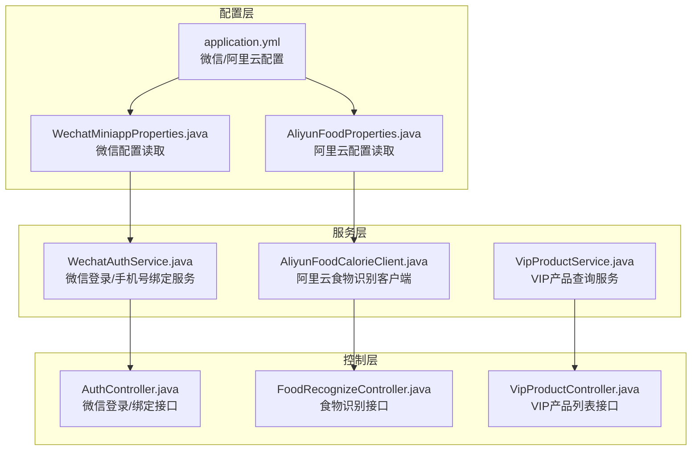
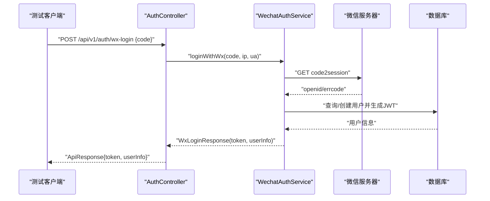
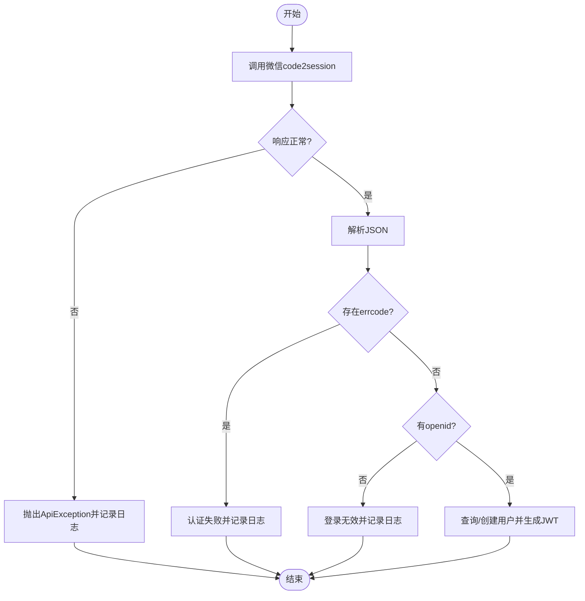
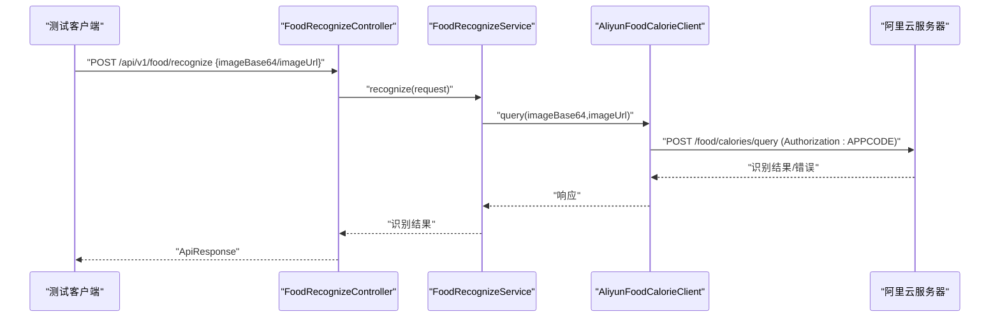
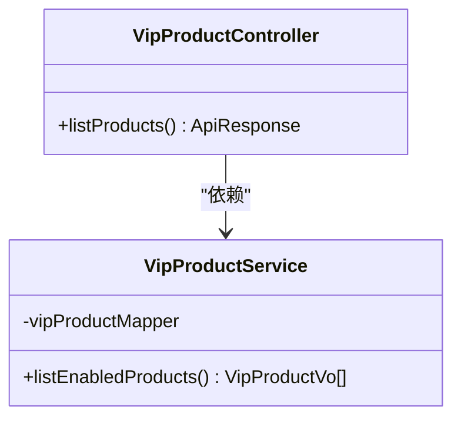
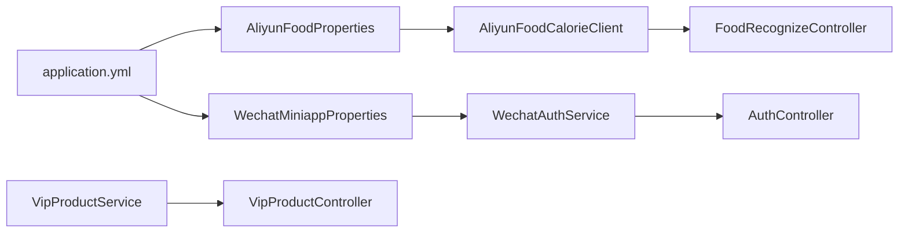

# 外部服务集成测试

<cite>
**本文档引用的文件**
- [application.yml](file://backend/src/main/resources/application.yml)
- [AliyunFoodProperties.java](file://backend/src/main/java/com/ypfr/loseweight/config/AliyunFoodProperties.java)
- [WechatMiniappProperties.java](file://backend/src/main/java/com/ypfr/loseweight/config/WechatMiniappProperties.java)
- [AliyunFoodCalorieClient.java](file://backend/src/main/java/com/ypfr/loseweight/service/AliyunFoodCalorieClient.java)
- [WechatAuthService.java](file://backend/src/main/java/com/ypfr/loseweight/service/WechatAuthService.java)
- [AuthController.java](file://backend/src/main/java/com/ypfr/loseweight/web/AuthController.java)
- [FoodRecognizeController.java](file://backend/src/main/java/com/ypfr/loseweight/web/FoodRecognizeController.java)
- [VipProductController.java](file://backend/src/main/java/com/ypfr/loseweight/web/VipProductController.java)
- [VipProductService.java](file://backend/src/main/java/com/ypfr/loseweight/service/VipProductService.java)
</cite>

## 目录
1. [简介](#简介)
2. [项目结构](#项目结构)
3. [核心组件](#核心组件)
4. [架构总览](#架构总览)
5. [详细组件分析](#详细组件分析)
6. [依赖关系分析](#依赖关系分析)
7. [性能考虑](#性能考虑)
8. [故障排查指南](#故障排查指南)
9. [结论](#结论)
10. [附录](#附录)

## 简介
本文件面向外部服务集成测试场景，聚焦以下三类外部服务的测试方案：
- 微信小程序登录与手机号绑定（微信API）
- 阿里云食物热量识别（阿里云API）
- 支付服务相关流程（VIP产品查询）

测试目标包括：
- Mock服务搭建与外部API调用测试
- 网络异常与超时重试机制验证
- 具体业务流程测试：微信登录、食物识别、文件上传、VIP购买流程
- 外部服务不可用时的降级策略与验证方法

## 项目结构
后端采用Spring Boot工程，外部服务配置集中在配置文件中，服务层通过RestTemplate发起HTTP调用，Web层提供REST接口。

**图表来源**
- [application.yml:31-46](file://backend/src/main/resources/application.yml#L31-L46)
- [AliyunFoodProperties.java:1-44](file://backend/src/main/java/com/ypfr/loseweight/config/AliyunFoodProperties.java#L1-L44)
- [WechatMiniappProperties.java:1-28](file://backend/src/main/java/com/ypfr/loseweight/config/WechatMiniappProperties.java#L1-L28)
- [AliyunFoodCalorieClient.java:1-50](file://backend/src/main/java/com/ypfr/loseweight/service/AliyunFoodCalorieClient.java#L1-L50)
- [WechatAuthService.java:1-233](file://backend/src/main/java/com/ypfr/loseweight/service/WechatAuthService.java#L1-L233)
- [VipProductService.java:1-54](file://backend/src/main/java/com/ypfr/loseweight/service/VipProductService.java#L1-L54)
- [AuthController.java:1-55](file://backend/src/main/java/com/ypfr/loseweight/web/AuthController.java#L1-L55)
- [FoodRecognizeController.java:1-28](file://backend/src/main/java/com/ypfr/loseweight/web/FoodRecognizeController.java#L1-L28)
- [VipProductController.java:1-27](file://backend/src/main/java/com/ypfr/loseweight/web/VipProductController.java#L1-L27)

**章节来源**
- [application.yml:31-46](file://backend/src/main/resources/application.yml#L31-L46)
- [AliyunFoodProperties.java:1-44](file://backend/src/main/java/com/ypfr/loseweight/config/AliyunFoodProperties.java#L1-L44)
- [WechatMiniappProperties.java:1-28](file://backend/src/main/java/com/ypfr/loseweight/config/WechatMiniappProperties.java#L1-L28)
- [AliyunFoodCalorieClient.java:1-50](file://backend/src/main/java/com/ypfr/loseweight/service/AliyunFoodCalorieClient.java#L1-L50)
- [WechatAuthService.java:1-233](file://backend/src/main/java/com/ypfr/loseweight/service/WechatAuthService.java#L1-L233)
- [VipProductService.java:1-54](file://backend/src/main/java/com/ypfr/loseweight/service/VipProductService.java#L1-L54)
- [AuthController.java:1-55](file://backend/src/main/java/com/ypfr/loseweight/web/AuthController.java#L1-L55)
- [FoodRecognizeController.java:1-28](file://backend/src/main/java/com/ypfr/loseweight/web/FoodRecognizeController.java#L1-L28)
- [VipProductController.java:1-27](file://backend/src/main/java/com/ypfr/loseweight/web/VipProductController.java#L1-L27)

## 核心组件
- 微信配置与调用
  - 配置项：微信小程序AppId、AppSecret
  - 关键调用：code2session换取openid、手机号绑定
  - 控制器：/api/v1/auth/wx-login、/api/v1/auth/bind-phone
- 阿里云食物识别
  - 配置项：Host、Path、AppCode
  - 客户端：以APPCODE认证，POST表单参数（imageBase64或imageUrl）
  - 控制器：/api/v1/food/recognize
- VIP产品查询
  - 服务：查询启用状态的VIP产品列表
  - 控制器：/api/v1/vip/products

**章节来源**
- [application.yml:31-46](file://backend/src/main/resources/application.yml#L31-L46)
- [WechatMiniappProperties.java:1-28](file://backend/src/main/java/com/ypfr/loseweight/config/WechatMiniappProperties.java#L1-L28)
- [AliyunFoodProperties.java:1-44](file://backend/src/main/java/com/ypfr/loseweight/config/AliyunFoodProperties.java#L1-L44)
- [AliyunFoodCalorieClient.java:1-50](file://backend/src/main/java/com/ypfr/loseweight/service/AliyunFoodCalorieClient.java#L1-L50)
- [WechatAuthService.java:1-233](file://backend/src/main/java/com/ypfr/loseweight/service/WechatAuthService.java#L1-L233)
- [AuthController.java:1-55](file://backend/src/main/java/com/ypfr/loseweight/web/AuthController.java#L1-L55)
- [FoodRecognizeController.java:1-28](file://backend/src/main/java/com/ypfr/loseweight/web/FoodRecognizeController.java#L1-L28)
- [VipProductController.java:1-27](file://backend/src/main/java/com/ypfr/loseweight/web/VipProductController.java#L1-L27)
- [VipProductService.java:1-54](file://backend/src/main/java/com/ypfr/loseweight/service/VipProductService.java#L1-L54)

## 架构总览
外部服务集成测试关注点：
- 配置注入与校验（微信/阿里云）
- HTTP客户端封装（RestTemplate）
- 控制器接口暴露
- 异常处理与日志记录
- 降级策略（外部服务不可用时的回退）

**图表来源**
- [AuthController.java:32-39](file://backend/src/main/java/com/ypfr/loseweight/web/AuthController.java#L32-L39)
- [WechatAuthService.java:64-153](file://backend/src/main/java/com/ypfr/loseweight/service/WechatAuthService.java#L64-L153)

## 详细组件分析

### 微信API测试
- 测试目标
  - 微信登录：code2session成功/失败、errcode处理、openid缺失处理
  - 手机号绑定：access_token获取、手机号接口调用、解析与落库
- Mock策略
  - 使用HTTP Mock Server拦截微信域名请求，模拟不同响应（正常/错误/超时/网络异常）
  - 替换微信配置为Mock地址，确保不调用真实微信服务器
- 测试步骤
  - 登录：构造有效/无效code，验证返回token与用户信息
  - 绑定：构造手机号code，验证手机号写入用户表
- 异常与重试
  - 网络异常：断言捕获ApiException并记录登录日志
  - 超时重试：在RestTemplate层面配置超时与重试（见“性能考虑”）
- 降级策略
  - 微信服务不可用：返回统一错误码并记录日志，前端引导重试或提示

**图表来源**
- [WechatAuthService.java:71-106](file://backend/src/main/java/com/ypfr/loseweight/service/WechatAuthService.java#L71-L106)

**章节来源**
- [WechatAuthService.java:61-153](file://backend/src/main/java/com/ypfr/loseweight/service/WechatAuthService.java#L61-L153)
- [AuthController.java:32-39](file://backend/src/main/java/com/ypfr/loseweight/web/AuthController.java#L32-L39)

### 阿里云API测试
- 测试目标
  - 食物识别：APPCODE鉴权、表单参数（imageBase64或imageUrl）、响应解析
  - 配置校验：未配置AppCode时抛出异常
- Mock策略
  - 使用HTTP Mock Server拦截阿里云Host，模拟不同响应（成功/错误/超时/网络异常）
  - 替换阿里云配置为Mock地址
- 测试步骤
  - 正常识别：传入图片Base64或URL，验证返回结果
  - 参数缺失：不传入任一参数，验证接口行为
  - 配置缺失：移除AppCode，验证异常抛出
- 异常与重试
  - 网络异常：断言捕获异常并记录
  - 超时重试：在RestTemplate层面配置超时与重试（见“性能考虑”）
- 降级策略
  - 阿里云服务不可用：返回统一错误码并提示用户重试

**图表来源**
- [FoodRecognizeController.java:23-26](file://backend/src/main/java/com/ypfr/loseweight/web/FoodRecognizeController.java#L23-L26)
- [AliyunFoodCalorieClient.java:27-48](file://backend/src/main/java/com/ypfr/loseweight/service/AliyunFoodCalorieClient.java#L27-L48)

**章节来源**
- [AliyunFoodCalorieClient.java:27-48](file://backend/src/main/java/com/ypfr/loseweight/service/AliyunFoodCalorieClient.java#L27-L48)
- [FoodRecognizeController.java:23-26](file://backend/src/main/java/com/ypfr/loseweight/web/FoodRecognizeController.java#L23-L26)

### 支付服务测试（基于VIP产品）
- 测试目标
  - VIP产品查询：启用的产品列表按排序返回
  - 降级策略：数据库异常时返回空列表并记录警告
- Mock策略
  - Mock数据库访问，模拟异常路径
  - 验证服务层对异常的捕获与降级逻辑
- 测试步骤
  - 正常：返回启用产品列表
  - 异常：数据库查询失败，验证返回空列表与日志

**图表来源**
- [VipProductController.java:21-25](file://backend/src/main/java/com/ypfr/loseweight/web/VipProductController.java#L21-L25)
- [VipProductService.java:24-40](file://backend/src/main/java/com/ypfr/loseweight/service/VipProductService.java#L24-L40)

**章节来源**
- [VipProductController.java:21-25](file://backend/src/main/java/com/ypfr/loseweight/web/VipProductController.java#L21-L25)
- [VipProductService.java:24-40](file://backend/src/main/java/com/ypfr/loseweight/service/VipProductService.java#L24-L40)

## 依赖关系分析
- 配置依赖
  - application.yml提供微信与阿里云的基础配置
  - AliyunFoodProperties与WechatMiniappProperties负责配置读取与拼接
- 服务依赖
  - WechatAuthService依赖RestTemplate、ObjectMapper、WechatMiniappProperties、JwtService、数据库访问
  - AliyunFoodCalorieClient依赖RestTemplate、AliyunFoodProperties
  - VipProductService依赖VipProductMapper
- 控制器依赖
  - AuthController依赖WechatAuthService、JwtService
  - FoodRecognizeController依赖FoodRecognizeService
  - VipProductController依赖VipProductService

**图表来源**
- [application.yml:31-46](file://backend/src/main/resources/application.yml#L31-L46)
- [AliyunFoodProperties.java:1-44](file://backend/src/main/java/com/ypfr/loseweight/config/AliyunFoodProperties.java#L1-L44)
- [WechatMiniappProperties.java:1-28](file://backend/src/main/java/com/ypfr/loseweight/config/WechatMiniappProperties.java#L1-L28)
- [AliyunFoodCalorieClient.java:1-50](file://backend/src/main/java/com/ypfr/loseweight/service/AliyunFoodCalorieClient.java#L1-L50)
- [WechatAuthService.java:1-233](file://backend/src/main/java/com/ypfr/loseweight/service/WechatAuthService.java#L1-L233)
- [VipProductService.java:1-54](file://backend/src/main/java/com/ypfr/loseweight/service/VipProductService.java#L1-L54)
- [AuthController.java:1-55](file://backend/src/main/java/com/ypfr/loseweight/web/AuthController.java#L1-L55)
- [FoodRecognizeController.java:1-28](file://backend/src/main/java/com/ypfr/loseweight/web/FoodRecognizeController.java#L1-L28)
- [VipProductController.java:1-27](file://backend/src/main/java/com/ypfr/loseweight/web/VipProductController.java#L1-L27)

**章节来源**
- [application.yml:31-46](file://backend/src/main/resources/application.yml#L31-L46)
- [AliyunFoodProperties.java:1-44](file://backend/src/main/java/com/ypfr/loseweight/config/AliyunFoodProperties.java#L1-L44)
- [WechatMiniappProperties.java:1-28](file://backend/src/main/java/com/ypfr/loseweight/config/WechatMiniappProperties.java#L1-L28)
- [AliyunFoodCalorieClient.java:1-50](file://backend/src/main/java/com/ypfr/loseweight/service/AliyunFoodCalorieClient.java#L1-L50)
- [WechatAuthService.java:1-233](file://backend/src/main/java/com/ypfr/loseweight/service/WechatAuthService.java#L1-L233)
- [VipProductService.java:1-54](file://backend/src/main/java/com/ypfr/loseweight/service/VipProductService.java#L1-L54)
- [AuthController.java:1-55](file://backend/src/main/java/com/ypfr/loseweight/web/AuthController.java#L1-L55)
- [FoodRecognizeController.java:1-28](file://backend/src/main/java/com/ypfr/loseweight/web/FoodRecognizeController.java#L1-L28)
- [VipProductController.java:1-27](file://backend/src/main/java/com/ypfr/loseweight/web/VipProductController.java#L1-L27)

## 性能考虑
- 超时与重试
  - 在RestTemplate层面配置连接超时、读取超时与重试策略，避免长时间阻塞影响用户体验
  - 对微信与阿里云接口分别设置合理的超时阈值与重试次数
- 并发与限流
  - 控制并发请求数，防止外部服务过载
  - 对高频接口增加本地缓存与限流策略
- 资源限制
  - 配置最大内存与表单大小，避免大文件上传导致内存溢出

[本节为通用建议，无需特定文件来源]

## 故障排查指南
- 常见问题定位
  - 微信登录失败：检查AppSecret配置、code有效性、微信接口响应errcode
  - 阿里云识别失败：检查AppCode配置、网络连通性、请求参数
  - VIP产品为空：检查数据库迁移脚本是否执行、查询异常日志
- 日志与监控
  - 记录登录日志、错误消息长度截断，避免日志过大
  - 对外部调用进行埋点，统计成功率与耗时
- 降级与回退
  - 外部服务不可用时，返回统一错误码并提示用户稍后重试
  - 对关键路径进行快速失败与优雅降级

**章节来源**
- [WechatAuthService.java:206-231](file://backend/src/main/java/com/ypfr/loseweight/service/WechatAuthService.java#L206-L231)
- [VipProductService.java:36-40](file://backend/src/main/java/com/ypfr/loseweight/service/VipProductService.java#L36-L40)

## 结论
通过Mock服务与严格的异常/超时测试，可以全面验证微信、阿里云与VIP相关接口的稳定性与可用性。结合降级策略与监控告警，能够在外部服务不可用时保障系统基本功能，并为后续优化提供数据支持。

[本节为总结，无需特定文件来源]

## 附录

### 测试实施清单
- 微信登录测试
  - 有效code：验证返回token与用户信息
  - 无效code：验证错误码与日志记录
  - 网络异常：验证ApiException与日志
  - 超时重试：验证重试策略生效
- 食物识别测试
  - Base64/URL参数：验证识别结果
  - 无参数：验证接口行为
  - AppCode缺失：验证异常抛出
  - 网络异常/超时：验证异常与重试
- 文件上传测试
  - 图片格式与大小：验证上传与识别
  - 大文件/异常：验证资源限制与错误提示
- VIP购买流程测试
  - 产品列表：验证启用产品返回
  - 异常降级：验证空列表与日志

[本节为通用指导，无需特定文件来源]