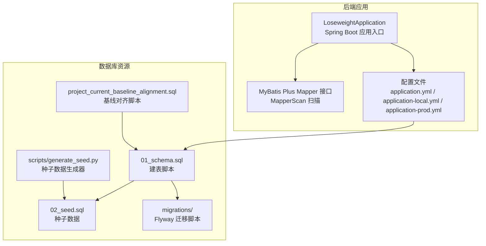
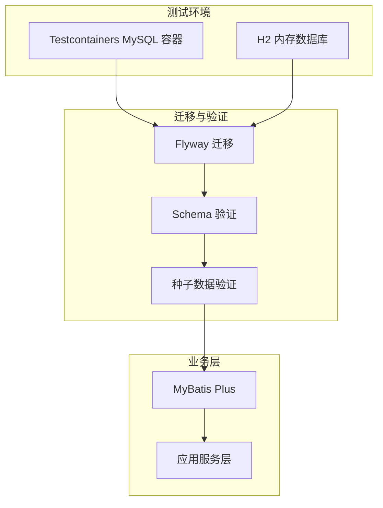
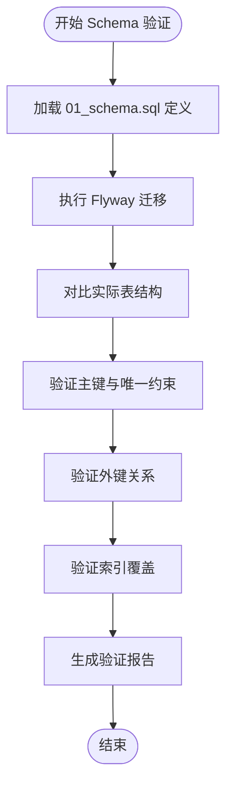
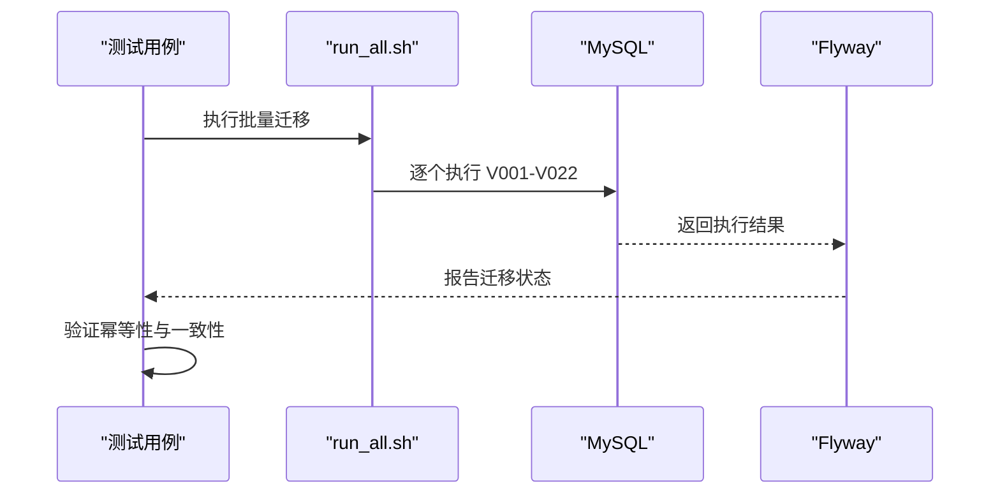
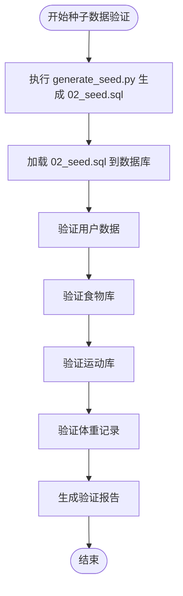
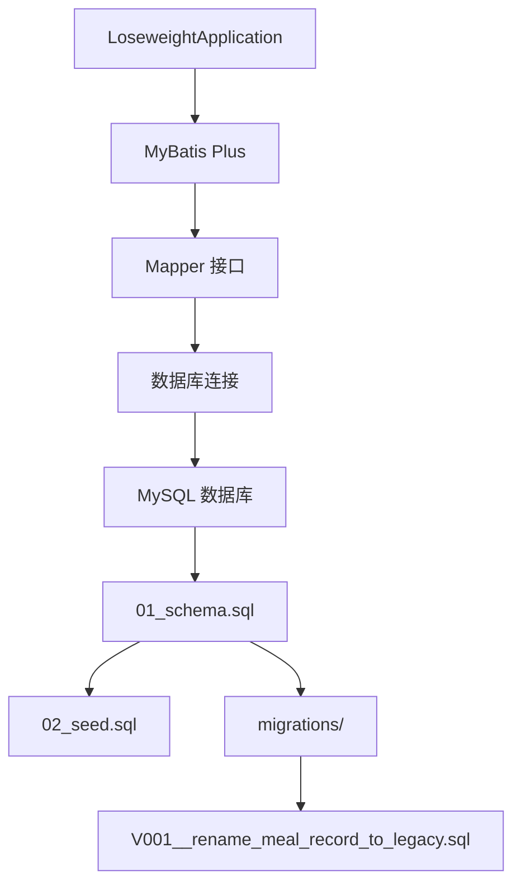

# 数据库集成测试

<cite>
**本文档引用的文件**
- [application.yml](file://backend/src/main/resources/application.yml)
- [application-local.yml.example](file://backend/src/main/resources/application-local.yml.example)
- [application-prod.yml](file://backend/src/main/resources/application-prod.yml)
- [pom.xml](file://backend/pom.xml)
- [LoseweightApplication.java](file://backend/src/main/java/com/ypfr/loseweight/LoseweightApplication.java)
- [01_schema.sql](file://database/01_schema.sql)
- [02_seed.sql](file://database/02_seed.sql)
- [project_current_baseline_alignment.sql](file://database/project_current_baseline_alignment.sql)
- [V001__rename_meal_record_to_legacy.sql](file://database/migrations/V001__rename_meal_record_to_legacy.sql)
- [run_all.sh](file://database/migrations/run_all.sh)
- [generate_seed.py](file://database/scripts/generate_seed.py)
- [migration_tables.sql](file://tools/food_migration/migration_tables.sql)
- [migrator.py](file://tools/food_migration/migrator.py)
</cite>

## 目录
1. [简介](#简介)
2. [项目结构](#项目结构)
3. [核心组件](#核心组件)
4. [架构概览](#架构概览)
5. [详细组件分析](#详细组件分析)
6. [依赖分析](#依赖分析)
7. [性能考虑](#性能考虑)
8. [故障排除指南](#故障排除指南)
9. [结论](#结论)
10. [附录](#附录)

## 简介
本文件为数据库集成测试的综合文档，面向数据库测试策略与实践，涵盖以下主题：
- Schema 验证测试：确保数据库结构符合设计规范，包括表、索引、约束等
- 数据迁移测试：验证 Flyway 迁移脚本的正确性与幂等性
- 种子数据测试：验证初始数据的完整性与一致性
- 事务测试：验证业务流程中的事务边界与一致性
- Testcontainers 使用：容器化数据库环境以实现隔离与可重复性
- H2 内存数据库配置：用于快速验证与单元测试
- Flyway 迁移测试：自动化迁移脚本验证
- 数据一致性验证：跨表、跨版本的数据一致性检查
- 连接池测试：验证连接池配置与资源管理
- 并发访问测试：验证高并发场景下的稳定性
- 性能基准测试：评估数据库操作的性能表现
- 测试数据清理策略：确保测试隔离与环境清洁
- 测试隔离机制：避免测试间的相互影响
- 数据库版本兼容性测试：验证不同 MySQL 版本的兼容性

## 项目结构
后端采用 Spring Boot + MyBatis Plus 架构，数据库相关资源集中在 database 目录，包含建表脚本、迁移脚本与种子数据生成脚本。

**图表来源**
- [LoseweightApplication.java:1-26](file://backend/src/main/java/com/ypfr/loseweight/LoseweightApplication.java#L1-L26)
- [application.yml:1-54](file://backend/src/main/resources/application.yml#L1-L54)
- [01_schema.sql:1-159](file://database/01_schema.sql#L1-L159)
- [02_seed.sql:1-800](file://database/02_seed.sql#L1-L800)
- [project_current_baseline_alignment.sql:1-24](file://database/project_current_baseline_alignment.sql#L1-L24)
- [generate_seed.py:1-315](file://database/scripts/generate_seed.py#L1-L315)

**章节来源**
- [application.yml:1-54](file://backend/src/main/resources/application.yml#L1-L54)
- [LoseweightApplication.java:1-26](file://backend/src/main/java/com/ypfr/loseweight/LoseweightApplication.java#L1-L26)
- [01_schema.sql:1-159](file://database/01_schema.sql#L1-L159)
- [02_seed.sql:1-800](file://database/02_seed.sql#L1-L800)
- [project_current_baseline_alignment.sql:1-24](file://database/project_current_baseline_alignment.sql#L1-L24)
- [generate_seed.py:1-315](file://database/scripts/generate_seed.py#L1-L315)

## 核心组件
- 数据源配置：通过 application.yml 与 application-local.yml 提供 MySQL 连接参数，支持生产与本地开发环境
- MyBatis Plus：通过 Mapper 接口访问数据库，自动扫描 com.ypfr.loseweight.mapper 包
- 迁移系统：Flyway 迁移脚本位于 database/migrations，按版本号顺序执行
- 种子数据：通过 02_seed.sql 与 generate_seed.py 生成测试数据
- 基线对齐：project_current_baseline_alignment.sql 用于将现有数据库对齐到项目当前基线

**章节来源**
- [application.yml:1-54](file://backend/src/main/resources/application.yml#L1-L54)
- [application-local.yml.example:1-27](file://backend/src/main/resources/application-local.yml.example#L1-L27)
- [application-prod.yml:1-18](file://backend/src/main/resources/application-prod.yml#L1-L18)
- [LoseweightApplication.java:1-26](file://backend/src/main/java/com/ypfr/loseweight/LoseweightApplication.java#L1-L26)
- [01_schema.sql:1-159](file://database/01_schema.sql#L1-L159)
- [02_seed.sql:1-800](file://database/02_seed.sql#L1-L800)
- [project_current_baseline_alignment.sql:1-24](file://database/project_current_baseline_alignment.sql#L1-L24)

## 架构概览
数据库集成测试的整体架构围绕以下关键点展开：
- 测试环境隔离：使用 Testcontainers 启动独立的 MySQL 容器，确保测试互不干扰
- 迁移验证：通过 Flyway 执行迁移脚本，验证版本升级路径的正确性
- 数据一致性：基于 01_schema.sql 与 02_seed.sql，验证表结构与初始数据
- 连接池与并发：验证连接池配置与高并发场景下的稳定性
- 性能基准：对关键查询与写入操作进行性能评估

[本图为概念性架构图，不直接映射具体源文件，故无图表来源]

## 详细组件分析

### Schema 验证测试
目标：确保数据库表结构符合设计规范，包括表、索引、约束等。

- 验证内容
  - 表存在性与字段类型
  - 主键与唯一约束
  - 外键关系与级联规则
  - 索引覆盖关键查询路径
- 实施方法
  - 使用 01_schema.sql 作为权威定义
  - 通过 Flyway 迁移后对比实际表结构
  - 编写 SQL 查询验证约束与索引
- 关键文件
  - [01_schema.sql:1-159](file://database/01_schema.sql#L1-L159)

**图表来源**
- [01_schema.sql:1-159](file://database/01_schema.sql#L1-L159)

**章节来源**
- [01_schema.sql:1-159](file://database/01_schema.sql#L1-L159)

### 数据迁移测试
目标：验证 Flyway 迁移脚本的正确性与幂等性，确保版本升级路径稳定。

- 验证内容
  - 迁移脚本按顺序执行
  - 幂等性：重复执行不产生副作用
  - 回滚路径：必要时可安全回滚
- 实施方法
  - 使用 run_all.sh 批量执行 V001-V022
  - 针对特定版本编写回归测试
  - 验证迁移前后数据一致性
- 关键文件
  - [run_all.sh:1-25](file://database/migrations/run_all.sh#L1-L25)
  - [V001__rename_meal_record_to_legacy.sql:1-25](file://database/migrations/V001__rename_meal_record_to_legacy.sql#L1-L25)

**图表来源**
- [run_all.sh:1-25](file://database/migrations/run_all.sh#L1-L25)
- [V001__rename_meal_record_to_legacy.sql:1-25](file://database/migrations/V001__rename_meal_record_to_legacy.sql#L1-L25)

**章节来源**
- [run_all.sh:1-25](file://database/migrations/run_all.sh#L1-L25)
- [V001__rename_meal_record_to_legacy.sql:1-25](file://database/migrations/V001__rename_meal_record_to_legacy.sql#L1-L25)

### 种子数据测试
目标：验证初始数据的完整性与一致性，确保测试环境具备稳定的基准数据。

- 验证内容
  - 用户数据、食物库、运动库、体重记录等
  - 数据范围与分布符合预期
  - 重复执行不破坏现有数据
- 实施方法
  - 使用 generate_seed.py 生成 02_seed.sql
  - 验证关键表的数据量与关键字段
  - 对比历史备份与当前种子数据
- 关键文件
  - [generate_seed.py:1-315](file://database/scripts/generate_seed.py#L1-315)
  - [02_seed.sql:1-800](file://database/02_seed.sql#L1-800)

**图表来源**
- [generate_seed.py:1-315](file://database/scripts/generate_seed.py#L1-L315)
- [02_seed.sql:1-800](file://database/02_seed.sql#L1-L800)

**章节来源**
- [generate_seed.py:1-315](file://database/scripts/generate_seed.py#L1-L315)
- [02_seed.sql:1-800](file://database/02_seed.sql#L1-L800)

### 事务测试
目标：验证业务流程中的事务边界与一致性，确保数据在异常情况下保持一致。

- 验证内容
  - 事务边界：BEGIN/COMMIT/ROLLBACK 的正确使用
  - 异常回滚：异常发生时数据恢复到一致状态
  - 并发事务：多事务并发执行的一致性
- 实施方法
  - 编写集成测试覆盖关键业务流程
  - 使用数据库事务模拟异常场景
  - 验证最终一致性与原子性
- 关键文件
  - [01_schema.sql:1-159](file://database/01_schema.sql#L1-L159)

**章节来源**
- [01_schema.sql:1-159](file://database/01_schema.sql#L1-L159)

### Testcontainers 使用
目标：通过容器化数据库环境实现测试隔离与可重复性。

- 使用场景
  - 启动独立 MySQL 容器用于集成测试
  - 自动清理测试数据，避免污染
  - 支持并行测试执行
- 实施要点
  - 配置容器镜像与初始化脚本
  - 在测试前执行迁移与种子数据加载
  - 测试后清理数据库状态
- 关键文件
  - [application.yml:1-54](file://backend/src/main/resources/application.yml#L1-L54)

**章节来源**
- [application.yml:1-54](file://backend/src/main/resources/application.yml#L1-L54)

### H2 内存数据库配置
目标：在开发与单元测试中使用 H2 内存数据库，提升测试速度与隔离性。

- 使用场景
  - 单元测试与快速验证
  - 无需外部依赖的本地测试
- 实施要点
  - 配置 H2 数据源与 Schema 初始化
  - 使用与 MySQL 相同的 SQL 语法
  - 通过 Flyway 或自定义脚本初始化 H2 Schema
- 关键文件
  - [application.yml:1-54](file://backend/src/main/resources/application.yml#L1-L54)

**章节来源**
- [application.yml:1-54](file://backend/src/main/resources/application.yml#L1-L54)

### Flyway 迁移测试
目标：自动化验证迁移脚本的正确性与幂等性。

- 验证内容
  - 迁移版本顺序与依赖关系
  - 幂等性：重复迁移不产生副作用
  - 数据迁移：从旧版本到新版本的数据转换
- 实施方法
  - 使用 Flyway CLI 或编程方式执行迁移
  - 编写迁移测试用例，覆盖关键场景
  - 对比迁移前后的数据结构与数据
- 关键文件
  - [run_all.sh:1-25](file://database/migrations/run_all.sh#L1-L25)
  - [project_current_baseline_alignment.sql:1-24](file://database/project_current_baseline_alignment.sql#L1-L24)

**章节来源**
- [run_all.sh:1-25](file://database/migrations/run_all.sh#L1-L25)
- [project_current_baseline_alignment.sql:1-24](file://database/project_current_baseline_alignment.sql#L1-L24)

### 数据一致性验证
目标：跨表、跨版本的数据一致性检查，确保业务规则得到满足。

- 验证内容
  - 外键约束：引用完整性
  - 数据类型与精度：字段约束
  - 业务规则：触发器或存储过程
- 实施方法
  - 编写 SQL 查询验证关键约束
  - 使用迁移前后的数据对比
  - 针对复杂业务逻辑编写专项测试
- 关键文件
  - [01_schema.sql:1-159](file://database/01_schema.sql#L1-L159)

**章节来源**
- [01_schema.sql:1-159](file://database/01_schema.sql#L1-L159)

### 连接池测试
目标：验证连接池配置与资源管理，确保在高负载下稳定运行。

- 验证内容
  - 连接池大小与超时设置
  - 连接泄漏检测
  - 连接复用与健康检查
- 实施方法
  - 使用数据库监控工具观察连接池状态
  - 编写压力测试验证连接池性能
  - 配置连接池参数并进行 A/B 测试
- 关键文件
  - [application.yml:1-54](file://backend/src/main/resources/application.yml#L1-L54)

**章节来源**
- [application.yml:1-54](file://backend/src/main/resources/application.yml#L1-L54)

### 并发访问测试
目标：验证高并发场景下的稳定性与性能表现。

- 验证内容
  - 并发写入：INSERT/UPDATE 的并发控制
  - 读写冲突：锁竞争与死锁预防
  - 事务隔离级别：避免脏读与幻读
- 实施方法
  - 使用并发测试框架模拟高并发请求
  - 监控数据库锁等待与事务回滚
  - 优化慢查询与索引缺失问题
- 关键文件
  - [01_schema.sql:1-159](file://database/01_schema.sql#L1-L159)

**章节来源**
- [01_schema.sql:1-159](file://database/01_schema.sql#L1-L159)

### 性能基准测试
目标：评估数据库操作的性能表现，识别瓶颈并优化。

- 评估内容
  - 查询性能：慢查询分析与索引优化
  - 写入性能：批量插入与事务优化
  - 连接性能：连接池与网络延迟
- 实施方法
  - 使用性能测试工具（如 JMeter、LoadRunner）
  - 分析慢查询日志与执行计划
  - 优化 SQL 与索引设计
- 关键文件
  - [01_schema.sql:1-159](file://database/01_schema.sql#L1-L159)

**章节来源**
- [01_schema.sql:1-159](file://database/01_schema.sql#L1-L159)

### 测试数据清理策略
目标：确保测试隔离与环境清洁，避免测试间相互影响。

- 策略
  - 测试前：加载种子数据，重置关键表
  - 测试中：使用事务回滚或临时表隔离
  - 测试后：删除临时数据，恢复初始状态
- 实施方法
  - 编写清理脚本与初始化脚本
  - 使用数据库事务管理测试状态
  - 定期清理长时间未使用的测试数据
- 关键文件
  - [02_seed.sql:1-800](file://database/02_seed.sql#L1-800)

**章节来源**
- [02_seed.sql:1-800](file://database/02_seed.sql#L1-L800)

### 测试隔离机制
目标：避免测试间的相互影响，确保测试结果的可靠性。

- 机制
  - 数据隔离：每个测试使用独立的 Schema 或临时表
  - 环境隔离：Testcontainers 为每个测试启动独立容器
  - 并发隔离：使用连接池与事务隔离高并发场景
- 实施方法
  - 配置测试环境变量与数据库连接
  - 使用测试框架提供的隔离能力
  - 定期清理测试残留数据
- 关键文件
  - [application.yml:1-54](file://backend/src/main/resources/application.yml#L1-L54)

**章节来源**
- [application.yml:1-54](file://backend/src/main/resources/application.yml#L1-L54)

### 数据库版本兼容性测试
目标：验证不同 MySQL 版本的兼容性，确保迁移与功能在各版本上正常工作。

- 验证内容
  - SQL 语法兼容性：不同版本的语法差异
  - 存储引擎：InnoDB 特性支持
  - 系统变量：版本差异导致的行为变化
- 实施方法
  - 在多个 MySQL 版本上执行迁移与测试
  - 使用兼容性检查工具识别潜在问题
  - 编写针对特定版本的适配脚本
- 关键文件
  - [01_schema.sql:1-159](file://database/01_schema.sql#L1-L159)

**章节来源**
- [01_schema.sql:1-159](file://database/01_schema.sql#L1-L159)

## 依赖分析
后端应用与数据库资源之间的依赖关系如下：

**图表来源**
- [LoseweightApplication.java:1-26](file://backend/src/main/java/com/ypfr/loseweight/LoseweightApplication.java#L1-L26)
- [01_schema.sql:1-159](file://database/01_schema.sql#L1-L159)
- [02_seed.sql:1-800](file://database/02_seed.sql#L1-L800)
- [V001__rename_meal_record_to_legacy.sql:1-25](file://database/migrations/V001__rename_meal_record_to_legacy.sql#L1-L25)

**章节来源**
- [LoseweightApplication.java:1-26](file://backend/src/main/java/com/ypfr/loseweight/LoseweightApplication.java#L1-L26)
- [01_schema.sql:1-159](file://database/01_schema.sql#L1-L159)
- [02_seed.sql:1-800](file://database/02_seed.sql#L1-L800)
- [V001__rename_meal_record_to_legacy.sql:1-25](file://database/migrations/V001__rename_meal_record_to_legacy.sql#L1-L25)

## 性能考虑
- 索引优化：为高频查询字段建立合适索引，减少全表扫描
- 连接池调优：根据并发需求调整连接池大小与超时参数
- SQL 优化：避免 N+1 查询，使用批量操作减少往返次数
- 缓存策略：对热点数据使用缓存，减轻数据库压力
- 监控与告警：建立数据库性能监控体系，及时发现并解决问题

## 故障排除指南
- 迁移失败
  - 检查迁移脚本语法与依赖关系
  - 确认数据库权限与字符集设置
  - 查看迁移日志定位具体错误
- 连接问题
  - 验证数据库连接参数与网络连通性
  - 检查防火墙与安全组配置
  - 确认连接池配置与资源限制
- 性能问题
  - 分析慢查询日志与执行计划
  - 优化索引与 SQL 语句
  - 监控数据库指标并进行容量规划

**章节来源**
- [application.yml:1-54](file://backend/src/main/resources/application.yml#L1-L54)
- [application-local.yml.example:1-27](file://backend/src/main/resources/application-local.yml.example#L1-L27)
- [application-prod.yml:1-18](file://backend/src/main/resources/application-prod.yml#L1-L18)

## 结论
通过系统化的数据库集成测试策略，可以有效保障数据库结构、迁移脚本、种子数据与业务逻辑的正确性与稳定性。结合 Testcontainers、H2 内存数据库与 Flyway 迁移测试，能够实现测试环境的隔离与可重复性。同时，通过连接池测试、并发访问测试与性能基准测试，可以全面评估数据库在不同场景下的表现。完善的测试数据清理策略与隔离机制，确保测试结果的可靠性与可追溯性。

## 附录
- 配置文件参考
  - [application.yml:1-54](file://backend/src/main/resources/application.yml#L1-L54)
  - [application-local.yml.example:1-27](file://backend/src/main/resources/application-local.yml.example#L1-L27)
  - [application-prod.yml:1-18](file://backend/src/main/resources/application-prod.yml#L1-L18)
- 数据库脚本参考
  - [01_schema.sql:1-159](file://database/01_schema.sql#L1-L159)
  - [02_seed.sql:1-800](file://database/02_seed.sql#L1-L800)
  - [project_current_baseline_alignment.sql:1-24](file://database/project_current_baseline_alignment.sql#L1-L24)
  - [V001__rename_meal_record_to_legacy.sql:1-25](file://database/migrations/V001__rename_meal_record_to_legacy.sql#L1-L25)
  - [run_all.sh:1-25](file://database/migrations/run_all.sh#L1-L25)
  - [generate_seed.py:1-315](file://database/scripts/generate_seed.py#L1-315)
  - [migration_tables.sql:1-23](file://tools/food_migration/migration_tables.sql#L1-L23)
  - [migrator.py:547-705](file://tools/food_migration/migrator.py#L547-L705)