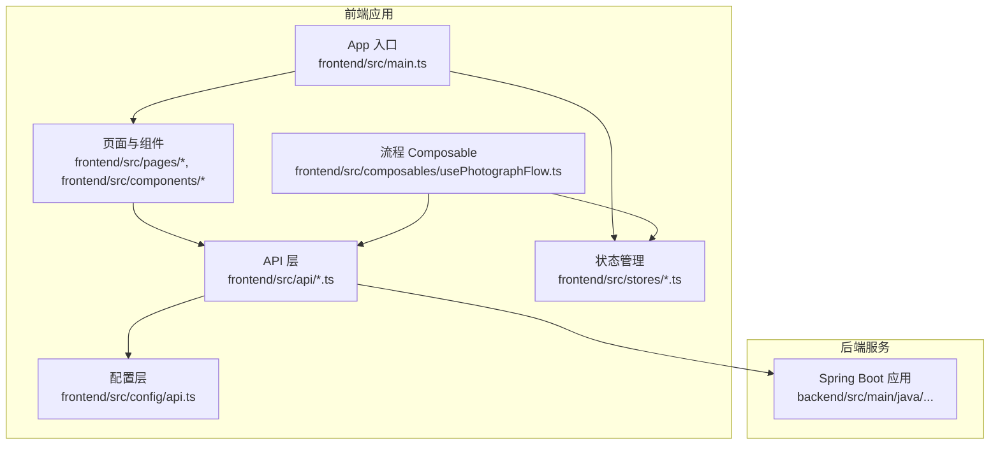
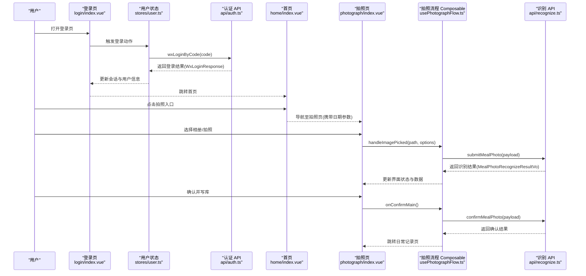
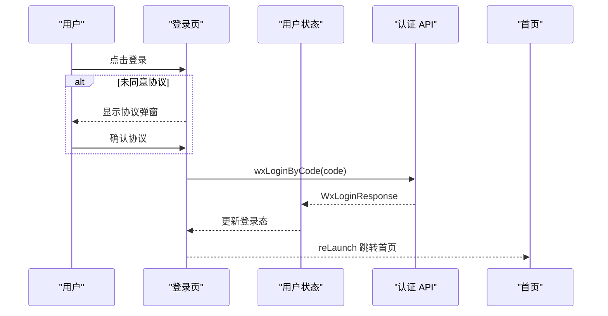
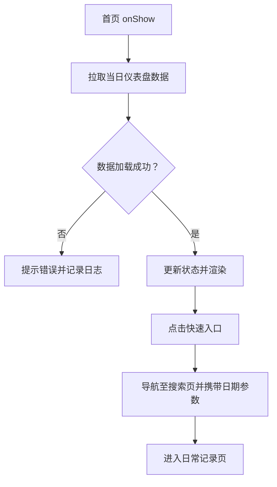
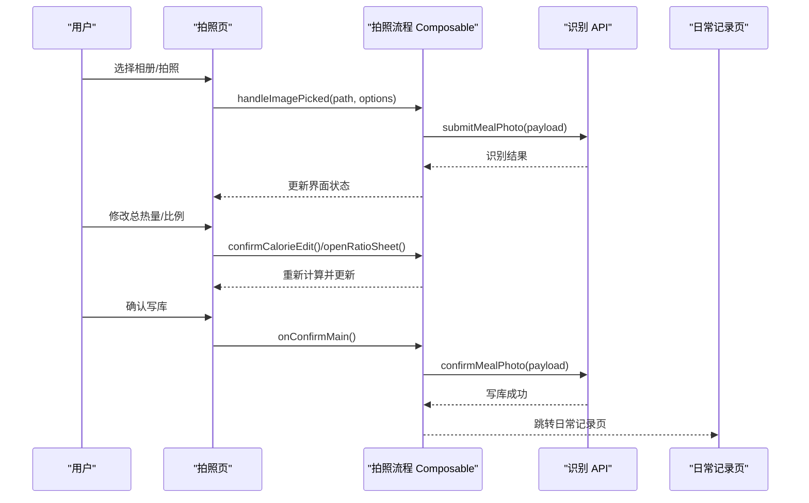
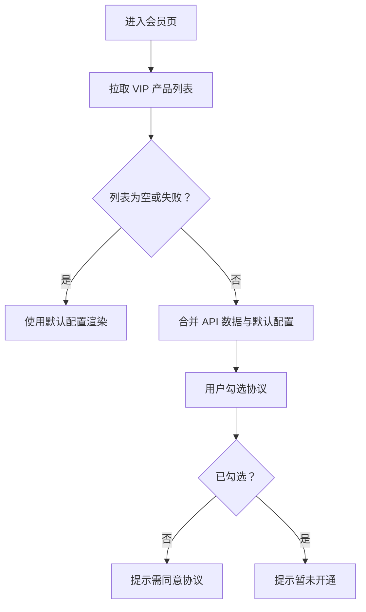
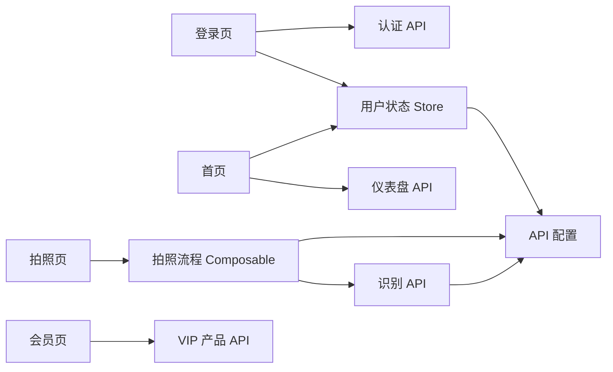

# 端到端测试

<cite>
**本文引用的文件**
- [frontend/src/main.ts](file://frontend/src/main.ts)
- [frontend/src/config/api.ts](file://frontend/src/config/api.ts)
- [frontend/src/api/auth.ts](file://frontend/src/api/auth.ts)
- [frontend/src/stores/user.ts](file://frontend/src/stores/user.ts)
- [frontend/src/stores/userProfile.ts](file://frontend/src/stores/userProfile.ts)
- [frontend/src/api/recognize.ts](file://frontend/src/api/recognize.ts)
- [frontend/src/composables/usePhotographFlow.ts](file://frontend/src/composables/usePhotographFlow.ts)
- [frontend/src/mocks/photographFlow.mock.ts](file://frontend/src/mocks/photographFlow.mock.ts)
- [frontend/src/pages/login/index.vue](file://frontend/src/pages/login/index.vue)
- [frontend/src/pages/home/index.vue](file://frontend/src/pages/home/index.vue)
- [frontend/src/pages/photograph/index.vue](file://frontend/src/pages/photograph/index.vue)
- [frontend/src/components/photograph/CameraPreviewCard.vue](file://frontend/src/components/photograph/CameraPreviewCard.vue)
- [frontend/src/pages/member/index.vue](file://frontend/src/pages/member/index.vue)
</cite>

## 目录
1. [简介](#简介)
2. [项目结构](#项目结构)
3. [核心组件](#核心组件)
4. [架构总览](#架构总览)
5. [详细组件分析](#详细组件分析)
6. [依赖关系分析](#依赖关系分析)
7. [性能考量](#性能考量)
8. [故障排查指南](#故障排查指南)
9. [结论](#结论)
10. [附录](#附录)

## 简介
本文件面向端到端测试，围绕“用户界面到后端服务”的完整测试流程进行设计与说明，覆盖以下典型业务链路：
- 用户登录流程测试
- 健康记录全流程测试（首页概览、搜索与录入、日常记录）
- 拍照识别流程测试（拍照/相册、上传、识别、确认写库）
- 支付流程测试（会员购买示意）

文档同时涵盖前端组件测试、路由导航测试、状态管理测试与跨页面数据传递测试，并提供测试场景设计、用户操作模拟、异步操作处理与测试数据管理的最佳实践。

## 项目结构
前端采用 Vue 3 + Pinia 架构，页面通过 uni-app 进行多端渲染，API 层统一通过 http 工具封装，状态管理集中在 Pinia Store 中，业务流程通过 Composable 抽象为可复用的流程控制器。

图表来源
- [frontend/src/main.ts:1-12](file://frontend/src/main.ts#L1-L12)
- [frontend/src/config/api.ts:1-42](file://frontend/src/config/api.ts#L1-L42)
- [frontend/src/api/auth.ts:1-10](file://frontend/src/api/auth.ts#L1-L10)
- [frontend/src/stores/user.ts:1-104](file://frontend/src/stores/user.ts#L1-L104)
- [frontend/src/stores/userProfile.ts:1-109](file://frontend/src/stores/userProfile.ts#L1-L109)
- [frontend/src/composables/usePhotographFlow.ts:1-508](file://frontend/src/composables/usePhotographFlow.ts#L1-L508)

章节来源
- [frontend/src/main.ts:1-12](file://frontend/src/main.ts#L1-L12)
- [frontend/src/config/api.ts:1-42](file://frontend/src/config/api.ts#L1-L42)

## 核心组件
- 应用入口与状态注入：应用在入口处注册 Pinia，确保全局状态可用。
- API 配置：集中管理后端地址、路径前缀、用户 ID 解析与存储键。
- 登录与用户状态：封装微信登录、会话持久化、用户资料获取与更新。
- 拍照识别流程：统一的拍照/相册选择、上传、识别、确认写库与跳转逻辑。
- 页面与组件：登录页、首页、拍照页、相机预览组件等构成端到端流程的关键节点。

章节来源
- [frontend/src/stores/user.ts:26-104](file://frontend/src/stores/user.ts#L26-L104)
- [frontend/src/stores/userProfile.ts:26-109](file://frontend/src/stores/userProfile.ts#L26-L109)
- [frontend/src/composables/usePhotographFlow.ts:120-508](file://frontend/src/composables/usePhotographFlow.ts#L120-L508)
- [frontend/src/pages/login/index.vue:115-162](file://frontend/src/pages/login/index.vue#L115-L162)
- [frontend/src/pages/home/index.vue:161-179](file://frontend/src/pages/home/index.vue#L161-L179)
- [frontend/src/pages/photograph/index.vue:148-290](file://frontend/src/pages/photograph/index.vue#L148-L290)
- [frontend/src/components/photograph/CameraPreviewCard.vue:74-236](file://frontend/src/components/photograph/CameraPreviewCard.vue#L74-L236)

## 架构总览
端到端测试关注从前端页面到后端服务的完整链路，包括：
- 前端页面与组件交互
- 路由导航与页面参数传递
- 状态管理（登录态、用户资料、识别流程状态）
- 异步 API 请求与错误处理
- Mock 与真实后端切换策略

图表来源
- [frontend/src/pages/login/index.vue:115-162](file://frontend/src/pages/login/index.vue#L115-L162)
- [frontend/src/stores/user.ts:54-57](file://frontend/src/stores/user.ts#L54-L57)
- [frontend/src/api/auth.ts:7-9](file://frontend/src/api/auth.ts#L7-L9)
- [frontend/src/pages/home/index.vue:180-201](file://frontend/src/pages/home/index.vue#L180-L201)
- [frontend/src/pages/photograph/index.vue:232-285](file://frontend/src/pages/photograph/index.vue#L232-L285)
- [frontend/src/composables/usePhotographFlow.ts:315-332](file://frontend/src/composables/usePhotographFlow.ts#L315-L332)
- [frontend/src/api/recognize.ts:89-102](file://frontend/src/api/recognize.ts#L89-L102)
- [frontend/src/api/recognize.ts:116-136](file://frontend/src/api/recognize.ts#L116-L136)

## 详细组件分析

### 用户登录流程测试
- 测试目标
  - 微信登录授权流程
  - 登录态持久化与首页跳转
  - 协议弹窗与同意状态
- 关键点
  - 登录页仅在微信小程序环境下触发登录
  - 登录成功后写入 Token、用户 ID、OpenID 与资料完成标记
  - 首页加载时同步仪表盘数据
- 测试场景设计
  - 正常登录：同意协议 -> 微信授权 -> 登录成功 -> 首页
  - 未同意协议：点击登录弹出协议弹窗 -> 确认后继续登录
  - 非微信环境：提示请在微信小程序中打开
  - 登录失败：捕获异常并提示
- 异步处理与数据管理
  - 使用 Pinia Store 持久化登录态
  - 通过适配器映射后端响应为前端模型
  - 首页 onShow 时刷新数据

图表来源
- [frontend/src/pages/login/index.vue:115-162](file://frontend/src/pages/login/index.vue#L115-L162)
- [frontend/src/stores/user.ts:54-57](file://frontend/src/stores/user.ts#L54-L57)
- [frontend/src/api/auth.ts:7-9](file://frontend/src/api/auth.ts#L7-L9)

章节来源
- [frontend/src/pages/login/index.vue:115-162](file://frontend/src/pages/login/index.vue#L115-L162)
- [frontend/src/stores/user.ts:38-57](file://frontend/src/stores/user.ts#L38-L57)
- [frontend/src/api/auth.ts:7-9](file://frontend/src/api/auth.ts#L7-L9)

### 健康记录全流程测试（首页、搜索、日常记录）
- 测试目标
  - 首页仪表盘数据加载与高亮
  - 搜索与快速入口跳转
  - 日常记录页数据展示
- 关键点
  - 首页 onShow 时拉取当日数据
  - 快速入口支持运动与四餐类型
  - 日常记录页通过日期参数接收
- 测试场景设计
  - 首页加载：检查摄入、运动、预算与剩余热量
  - 快速入口：点击不同餐别进入对应搜索页并携带日期参数
  - 日常记录：接收日期参数并展示当日记录

图表来源
- [frontend/src/pages/home/index.vue:161-179](file://frontend/src/pages/home/index.vue#L161-L179)
- [frontend/src/pages/home/index.vue:180-201](file://frontend/src/pages/home/index.vue#L180-L201)
- [frontend/src/pages/home/index.vue:203-207](file://frontend/src/pages/home/index.vue#L203-L207)

章节来源
- [frontend/src/pages/home/index.vue:161-179](file://frontend/src/pages/home/index.vue#L161-L179)
- [frontend/src/pages/home/index.vue:180-201](file://frontend/src/pages/home/index.vue#L180-L201)
- [frontend/src/pages/home/index.vue:203-207](file://frontend/src/pages/home/index.vue#L203-L207)

### 拍照识别流程测试
- 测试目标
  - 拍照/相册选择
  - 图片上传与识别状态推进
  - 识别结果展示与编辑
  - 确认写库并跳转
- 关键点
  - 拍照页通过 Composable 控制流程状态
  - 支持 Mock 与真实后端切换
  - 识别成功后可调整比例与总热量
  - 写库成功后跳转日常记录页
- 测试场景设计
  - 正常流程：相册/拍照 -> 上传 -> 识别 -> 确认 -> 跳转
  - 失败流程：Mock 失败或后端失败 -> 展示失败面板 -> 继续或退出
  - 编辑流程：修改总热量或食用比例 -> 重新计算分摊 -> 确认
  - Mock 模式：仅跳转不写库
- 异步处理与数据管理
  - 使用定时器模拟识别阶段
  - 通过本地 Mock 数据初始化识别结果
  - 识别结果与用户输入联动更新

图表来源
- [frontend/src/pages/photograph/index.vue:232-285](file://frontend/src/pages/photograph/index.vue#L232-L285)
- [frontend/src/composables/usePhotographFlow.ts:315-332](file://frontend/src/composables/usePhotographFlow.ts#L315-L332)
- [frontend/src/api/recognize.ts:89-102](file://frontend/src/api/recognize.ts#L89-L102)
- [frontend/src/api/recognize.ts:116-136](file://frontend/src/api/recognize.ts#L116-L136)
- [frontend/src/composables/usePhotographFlow.ts:416-440](file://frontend/src/composables/usePhotographFlow.ts#L416-L440)

章节来源
- [frontend/src/pages/photograph/index.vue:148-290](file://frontend/src/pages/photograph/index.vue#L148-L290)
- [frontend/src/composables/usePhotographFlow.ts:120-508](file://frontend/src/composables/usePhotographFlow.ts#L120-L508)
- [frontend/src/api/recognize.ts:89-136](file://frontend/src/api/recognize.ts#L89-L136)
- [frontend/src/mocks/photographFlow.mock.ts:18-33](file://frontend/src/mocks/photographFlow.mock.ts#L18-L33)

### 支付流程测试（会员购买示意）
- 测试目标
  - 会员页产品列表加载与合并
  - 协议勾选与购买按钮交互
  - 购买流程提示（暂未开通）
- 关键点
  - 产品列表从 API 获取并合并默认配置
  - 购买前需勾选协议
  - 提示“暂未开通”作为示意
- 测试场景设计
  - 正常加载：拉取产品列表 -> 合并默认配置 -> 渲染
  - 未勾选协议：点击购买提示并阻止
  - 勾选协议：点击购买提示“暂未开通”

图表来源
- [frontend/src/pages/member/index.vue:152-162](file://frontend/src/pages/member/index.vue#L152-L162)
- [frontend/src/pages/member/index.vue:164-187](file://frontend/src/pages/member/index.vue#L164-L187)

章节来源
- [frontend/src/pages/member/index.vue:152-162](file://frontend/src/pages/member/index.vue#L152-L162)
- [frontend/src/pages/member/index.vue:164-187](file://frontend/src/pages/member/index.vue#L164-L187)

## 依赖关系分析
- 页面依赖
  - 登录页依赖用户状态 Store 与认证 API
  - 首页依赖仪表盘 API 与用户状态
  - 拍照页依赖拍照流程 Composable 与识别 API
  - 会员页依赖 VIP 产品 API
- 状态管理
  - 用户登录态与用户资料通过 Pinia Store 管理
  - 拍照流程状态通过 Composable 管理
- API 与配置
  - API 路径与用户 ID 解析集中于配置层
  - 认证与识别 API 分离职责

图表来源
- [frontend/src/pages/login/index.vue:83-86](file://frontend/src/pages/login/index.vue#L83-L86)
- [frontend/src/stores/user.ts:26-36](file://frontend/src/stores/user.ts#L26-L36)
- [frontend/src/api/auth.ts:7-9](file://frontend/src/api/auth.ts#L7-L9)
- [frontend/src/pages/home/index.vue:136-139](file://frontend/src/pages/home/index.vue#L136-L139)
- [frontend/src/pages/photograph/index.vue:141-142](file://frontend/src/pages/photograph/index.vue#L141-L142)
- [frontend/src/composables/usePhotographFlow.ts:8-10](file://frontend/src/composables/usePhotographFlow.ts#L8-L10)
- [frontend/src/api/recognize.ts:1-2](file://frontend/src/api/recognize.ts#L1-L2)
- [frontend/src/pages/member/index.vue:49-51](file://frontend/src/pages/member/index.vue#L49-L51)
- [frontend/src/config/api.ts:15-41](file://frontend/src/config/api.ts#L15-L41)

章节来源
- [frontend/src/pages/login/index.vue:83-86](file://frontend/src/pages/login/index.vue#L83-L86)
- [frontend/src/pages/home/index.vue:136-139](file://frontend/src/pages/home/index.vue#L136-L139)
- [frontend/src/pages/photograph/index.vue:141-142](file://frontend/src/pages/photograph/index.vue#L141-L142)
- [frontend/src/pages/member/index.vue:49-51](file://frontend/src/pages/member/index.vue#L49-L51)
- [frontend/src/config/api.ts:15-41](file://frontend/src/config/api.ts#L15-L41)

## 性能考量
- 网络请求优化
  - 合理设置超时与重试策略，避免阻塞 UI
  - 识别流程使用分阶段提示，提升感知性能
- 状态更新
  - 使用 Pinia 的响应式与 getter 减少重复计算
  - Composable 中集中管理流程状态，避免页面过度耦合
- 组件渲染
  - 相机预览组件在初始化完成后才启用拍照，降低失败概率
  - 识别结果采用本地 Mock 初始化，缩短首屏等待

## 故障排查指南
- 登录失败
  - 检查微信授权是否成功、回调 code 是否存在
  - 校验后端返回的 WxLoginResponse 结构是否符合预期
- 识别失败
  - 检查图片路径与 Base64 转换是否正确
  - 校验 Token 与用户 ID 是否写入存储
  - 查看识别状态与错误信息
- 写库失败
  - 确认 photoJobId 是否存在
  - 检查食用比例是否大于 0
  - 查看后端返回的确认状态与错误消息
- Mock 与真实切换
  - 通过环境变量控制是否使用 Mock 流程
  - Mock 模式下仅跳转不写库，注意区分行为差异

章节来源
- [frontend/src/pages/login/index.vue:130-146](file://frontend/src/pages/login/index.vue#L130-L146)
- [frontend/src/api/recognize.ts:90-102](file://frontend/src/api/recognize.ts#L90-L102)
- [frontend/src/api/recognize.ts:116-136](file://frontend/src/api/recognize.ts#L116-L136)
- [frontend/src/composables/usePhotographFlow.ts:320-332](file://frontend/src/composables/usePhotographFlow.ts#L320-L332)
- [frontend/src/composables/usePhotographFlow.ts:395-402](file://frontend/src/composables/usePhotographFlow.ts#L395-L402)

## 结论
本文从端到端视角梳理了登录、健康记录、拍照识别与支付（会员购买）四大流程的测试设计与实现要点，强调了前端组件、路由导航、状态管理与跨页面数据传递的重要性。通过合理的异步处理、Mock 与真实后端切换以及完善的错误处理机制，可以构建稳定可靠的端到端测试体系。

## 附录
- 测试数据管理最佳实践
  - 使用 Mock 数据初始化关键流程（如拍照识别）
  - 通过环境变量控制后端开关，便于联调与回归
  - 将用户登录态与用户资料持久化到本地存储，保证测试可重复性
- 用户操作模拟建议
  - 登录页：模拟微信授权成功与失败两种分支
  - 拍照页：模拟相册选择、拍照、识别失败与成功、确认写库
  - 会员页：模拟协议勾选与未勾选两种分支
- 异步操作处理
  - 使用定时器模拟识别阶段，确保 UI 状态推进
  - 对网络请求进行超时与重试包装，避免测试不稳定