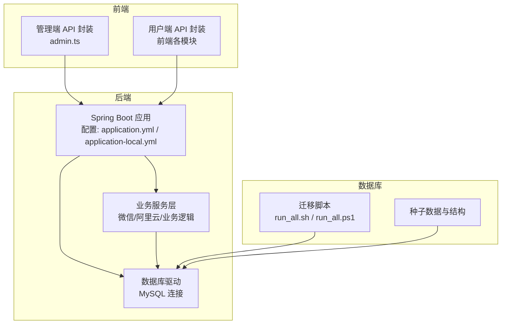
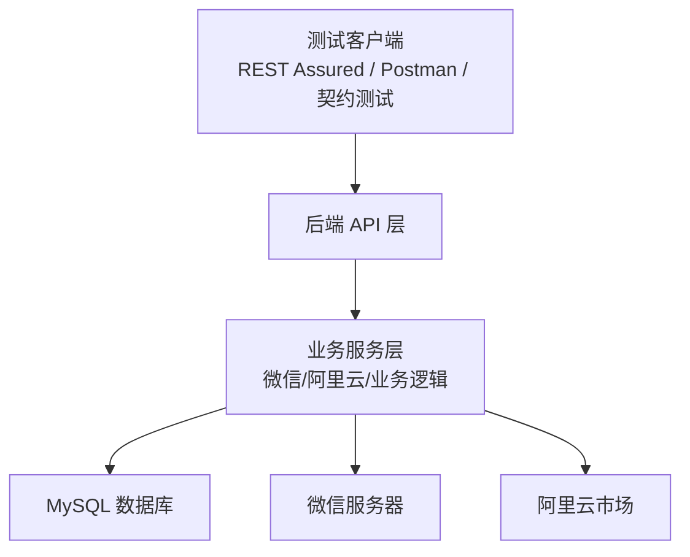
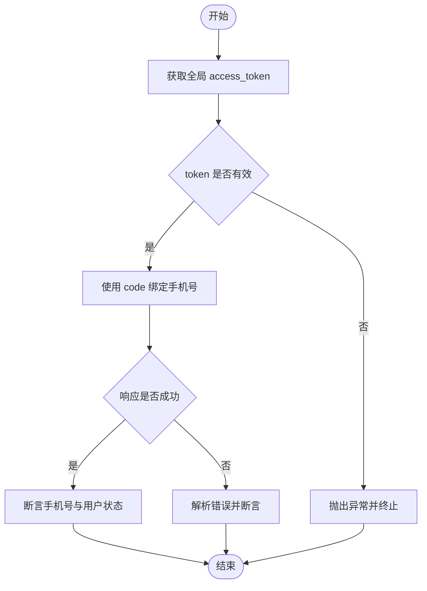
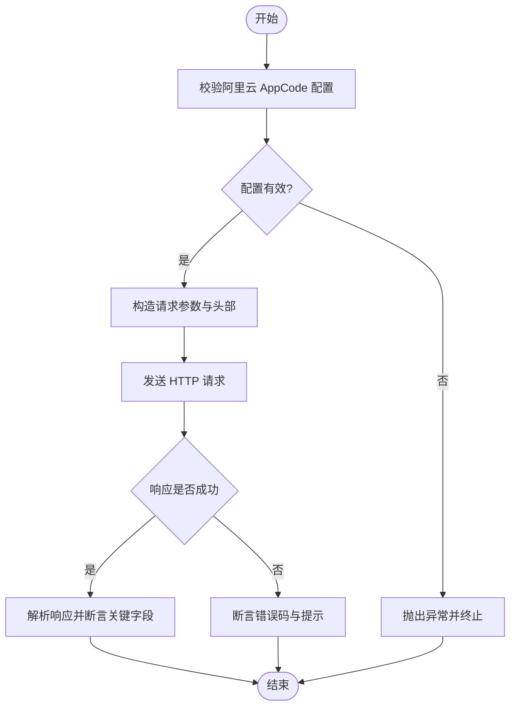
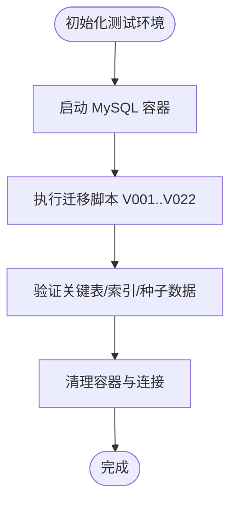
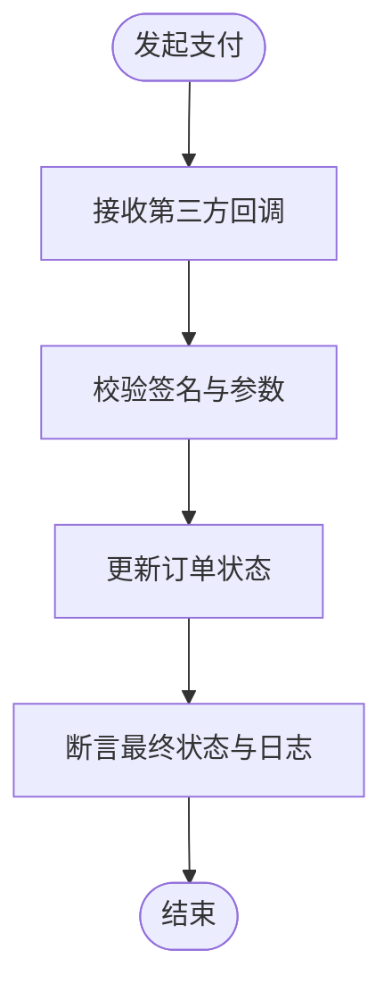
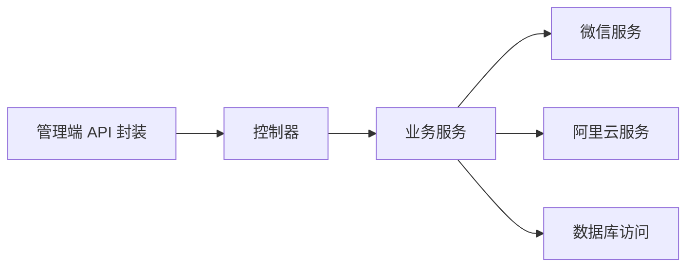

# 集成测试

<cite>
**本文引用的文件**
- [application.yml](file://backend/src/main/resources/application.yml)
- [application-local.yml](file://backend/src/main/resources/application-local.yml)
- [pom.xml](file://backend/pom.xml)
- [WechatAccessTokenService.java](file://backend/src/main/java/com/ypfr/loseweight/service/WechatAccessTokenService.java)
- [WechatAuthService.java](file://backend/src/main/java/com/ypfr/loseweight/service/WechatAuthService.java)
- [AliyunFoodCalorieClient.java](file://backend/src/main/java/com/ypfr/loseweight/service/AliyunFoodCalorieClient.java)
- [AliyunFoodProperties.java](file://backend/src/main/java/com/ypfr/loseweight/config/AliyunFoodProperties.java)
- [GlobalExceptionHandler.java](file://backend/src/main/java/com/ypfr/loseweight/common/GlobalExceptionHandler.java)
- [run_all.sh](file://database/migrations/run_all.sh)
- [run_all.ps1](file://database/migrations/run_all.ps1)
- [admin.ts](file://admin-frontend/src/api/admin.ts)
</cite>

## 目录
1. [引言](#引言)
2. [项目结构](#项目结构)
3. [核心组件](#核心组件)
4. [架构总览](#架构总览)
5. [详细组件分析](#详细组件分析)
6. [依赖分析](#依赖分析)
7. [性能考虑](#性能考虑)
8. [故障排查指南](#故障排查指南)
9. [结论](#结论)
10. [附录](#附录)

## 引言
本文件面向集成测试的系统化落地，围绕以下目标展开：  
- API 接口集成测试（REST Assured、Postman 集合、接口契约测试）  
- 数据库集成测试（Testcontainers、H2 内存数据库、数据迁移测试）  
- 外部服务集成测试（微信 API 测试、阿里云 API 测试、支付服务测试）  

内容涵盖测试环境配置、测试数据准备、Mock 服务搭建与测试流程设计，并提供实施策略与故障排查方法，帮助团队在本地与 CI 环境稳定运行高质量的集成测试。

## 项目结构
后端基于 Spring Boot 3，使用 MySQL 作为主存储，配置文件位于 resources 目录；前端包含管理端与用户端，分别提供 API 调用封装；数据库目录包含完整的迁移脚本与种子数据生成工具。整体结构如下：

图表来源
- [application.yml:1-54](file://backend/src/main/resources/application.yml#L1-L54)
- [application-local.yml:1-20](file://backend/src/main/resources/application-local.yml#L1-L20)
- [run_all.sh:1-26](file://database/migrations/run_all.sh#L1-L26)
- [run_all.ps1:1-34](file://database/migrations/run_all.ps1#L1-L34)
- [admin.ts:42-84](file://admin-frontend/src/api/admin.ts#L42-L84)

章节来源
- [application.yml:1-54](file://backend/src/main/resources/application.yml#L1-L54)
- [application-local.yml:1-20](file://backend/src/main/resources/application-local.yml#L1-L20)
- [run_all.sh:1-26](file://database/migrations/run_all.sh#L1-L26)
- [run_all.ps1:1-34](file://database/migrations/run_all.ps1#L1-L34)
- [admin.ts:42-84](file://admin-frontend/src/api/admin.ts#L42-L84)

## 核心组件
- 微信登录与手机号绑定：通过全局 access_token 获取与手机号接口调用，涉及网络请求与 JSON 解析。
- 阿里云食物热量查询：基于配置的 AppCode 与服务地址进行外部 HTTP 请求。
- 数据库连接与迁移：通过 application.yml 与 application-local.yml 配置数据源，迁移脚本按序执行。
- 前端管理端 API：提供管理员维度的增删改查接口封装，便于集成测试调用。

章节来源
- [WechatAccessTokenService.java:1-81](file://backend/src/main/java/com/ypfr/loseweight/service/WechatAccessTokenService.java#L1-L81)
- [WechatAuthService.java:155-186](file://backend/src/main/java/com/ypfr/loseweight/service/WechatAuthService.java#L155-L186)
- [AliyunFoodCalorieClient.java:1-35](file://backend/src/main/java/com/ypfr/loseweight/service/AliyunFoodCalorieClient.java#L1-L35)
- [AliyunFoodProperties.java:1-43](file://backend/src/main/java/com/ypfr/loseweight/config/AliyunFoodProperties.java#L1-L43)
- [application.yml:1-54](file://backend/src/main/resources/application.yml#L1-L54)
- [application-local.yml:1-20](file://backend/src/main/resources/application-local.yml#L1-L20)
- [admin.ts:42-84](file://admin-frontend/src/api/admin.ts#L42-L84)

## 架构总览
下图展示集成测试视角下的关键交互路径：测试客户端（REST Assured/Postman/契约测试）与后端 API、数据库、外部服务之间的协作关系。

图表来源
- [WechatAccessTokenService.java:1-81](file://backend/src/main/java/com/ypfr/loseweight/service/WechatAccessTokenService.java#L1-L81)
- [WechatAuthService.java:155-186](file://backend/src/main/java/com/ypfr/loseweight/service/WechatAuthService.java#L155-L186)
- [AliyunFoodCalorieClient.java:1-35](file://backend/src/main/java/com/ypfr/loseweight/service/AliyunFoodCalorieClient.java#L1-L35)
- [AliyunFoodProperties.java:1-43](file://backend/src/main/java/com/ypfr/loseweight/config/AliyunFoodProperties.java#L1-L43)
- [application.yml:1-54](file://backend/src/main/resources/application.yml#L1-L54)

## 详细组件分析

### 微信 API 集成测试
- 测试目标
  - 获取全局 access_token 并缓存校验
  - 使用 code 换取手机号并绑定用户
- 关键流程
  - access_token 获取：构造 GET 请求，解析 JSON，校验 errcode
  - 绑定手机号：携带 access_token 与 code，POST 请求，解析响应并断言
- Mock 方案
  - 使用 WireMock 或内置 MockWebServer 模拟微信服务器返回
  - 针对不同场景（成功、网络异常、参数错误）准备响应
- 测试数据
  - 准备有效/无效 code、access_token 过期时间点
- 流程图

图表来源
- [WechatAccessTokenService.java:38-80](file://backend/src/main/java/com/ypfr/loseweight/service/WechatAccessTokenService.java#L38-L80)
- [WechatAuthService.java:155-186](file://backend/src/main/java/com/ypfr/loseweight/service/WechatAuthService.java#L155-L186)

章节来源
- [WechatAccessTokenService.java:1-81](file://backend/src/main/java/com/ypfr/loseweight/service/WechatAccessTokenService.java#L1-L81)
- [WechatAuthService.java:155-186](file://backend/src/main/java/com/ypfr/loseweight/service/WechatAuthService.java#L155-L186)

### 阿里云 API 集成测试
- 测试目标
  - 校验 AppCode 配置有效性
  - 发送图片 Base64 或 URL 查询食物热量
- 关键流程
  - 参数校验：AppCode 是否存在且非占位符
  - 构造请求：设置 Host/Path/AppCode，传入 imageBase64 或 imageUrl
  - 断言：HTTP 状态码、响应体结构与关键字段
- Mock 方案
  - 使用 MockWebServer 或 Testcontainers 启动轻量 HTTP 代理，拦截外部请求
- 流程图

图表来源
- [AliyunFoodCalorieClient.java:27-35](file://backend/src/main/java/com/ypfr/loseweight/service/AliyunFoodCalorieClient.java#L27-L35)
- [AliyunFoodProperties.java:40-43](file://backend/src/main/java/com/ypfr/loseweight/config/AliyunFoodProperties.java#L40-L43)

章节来源
- [AliyunFoodCalorieClient.java:1-35](file://backend/src/main/java/com/ypfr/loseweight/service/AliyunFoodCalorieClient.java#L1-L35)
- [AliyunFoodProperties.java:1-43](file://backend/src/main/java/com/ypfr/loseweight/config/AliyunFoodProperties.java#L1-L43)

### 数据库集成测试
- 测试目标
  - 验证迁移脚本顺序与幂等性
  - 在隔离环境中执行完整迁移并验证关键表结构与种子数据
- 环境与工具
  - Testcontainers：启动 MySQL 容器，执行迁移脚本
  - H2 内存数据库：用于快速回归与离线测试（可选）
- 流程图

图表来源
- [run_all.sh:1-26](file://database/migrations/run_all.sh#L1-L26)
- [run_all.ps1:1-34](file://database/migrations/run_all.ps1#L1-L34)

章节来源
- [run_all.sh:1-26](file://database/migrations/run_all.sh#L1-L26)
- [run_all.ps1:1-34](file://database/migrations/run_all.ps1#L1-L34)

### 支付服务集成测试
- 测试目标
  - 验证支付流程关键节点（下单、回调、状态同步）
- Mock 方案
  - 使用 WireMock 模拟第三方支付网关回调
  - 通过 Testcontainers 提供本地支付网关镜像（如适用）
- 流程图

（本图为概念流程示意）

## 依赖分析
- 外部依赖
  - 微信：通过全局 access_token 与手机号接口交互
  - 阿里云：通过 AppCode 与服务地址进行 HTTP 请求
- 内部依赖
  - 业务服务依赖配置类与 RestTemplate
  - 控制器依赖服务层，服务层依赖数据库访问层
- 依赖图

图表来源
- [admin.ts:42-84](file://admin-frontend/src/api/admin.ts#L42-L84)
- [WechatAccessTokenService.java:1-81](file://backend/src/main/java/com/ypfr/loseweight/service/WechatAccessTokenService.java#L1-L81)
- [AliyunFoodCalorieClient.java:1-35](file://backend/src/main/java/com/ypfr/loseweight/service/AliyunFoodCalorieClient.java#L1-L35)

章节来源
- [admin.ts:42-84](file://admin-frontend/src/api/admin.ts#L42-L84)
- [WechatAccessTokenService.java:1-81](file://backend/src/main/java/com/ypfr/loseweight/service/WechatAccessTokenService.java#L1-L81)
- [AliyunFoodCalorieClient.java:1-35](file://backend/src/main/java/com/ypfr/loseweight/service/AliyunFoodCalorieClient.java#L1-L35)

## 性能考虑
- 并发与超时
  - 外部 HTTP 请求应设置合理超时与重试策略，避免阻塞测试线程
- 缓存与状态
  - 微信 access_token 建议在测试中注入固定值或 Mock，减少真实调用
- 数据隔离
  - 使用独立数据库实例或容器，避免测试间相互污染
- 日志与可观测性
  - 开启必要的调试日志，便于定位集成问题

## 故障排查指南
- 数据库结构不匹配
  - 现象：SQL 异常提示列缺失或表不存在
  - 处理：按迁移脚本顺序补齐缺失对象，参考全局异常处理器的友好提示
- 阿里云 AppCode 未配置
  - 现象：抛出配置非法异常
  - 处理：在本地配置文件中正确填写 AppCode
- 微信 access_token 获取失败
  - 现象：网络异常或解析失败
  - 处理：检查 Mock 服务可用性与参数构造，确认微信服务可达
- 控制器异常处理
  - 全局异常处理器提供结构化错误消息，便于测试断言与定位

章节来源
- [GlobalExceptionHandler.java:68-106](file://backend/src/main/java/com/ypfr/loseweight/common/GlobalExceptionHandler.java#L68-L106)
- [AliyunFoodCalorieClient.java:27-35](file://backend/src/main/java/com/ypfr/loseweight/service/AliyunFoodCalorieClient.java#L27-L35)
- [WechatAccessTokenService.java:38-80](file://backend/src/main/java/com/ypfr/loseweight/service/WechatAccessTokenService.java#L38-L80)

## 结论
通过明确的测试策略与 Mock/容器化方案，可在本地与 CI 环境稳定地执行 API、数据库与外部服务的集成测试。建议优先覆盖核心业务路径（微信登录/绑定、阿里云查询、管理员操作），并结合迁移脚本确保数据库一致性。

## 附录
- 测试环境配置要点
  - 后端配置：在本地配置文件中设置数据源与外部服务密钥
  - 前端 API：使用统一的 API 封装，便于测试客户端直接调用
- 测试数据准备
  - 使用迁移脚本初始化数据库，必要时补充最小化种子数据
- 测试流程设计
  - API 集成测试：REST Assured/Postman 集合 + 接口契约测试
  - 数据库测试：Testcontainers + 迁移脚本 + H2 内存数据库（可选）
  - 外部服务测试：WireMock/MockWebServer + Testcontainers（如需）