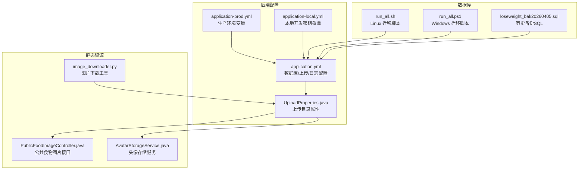
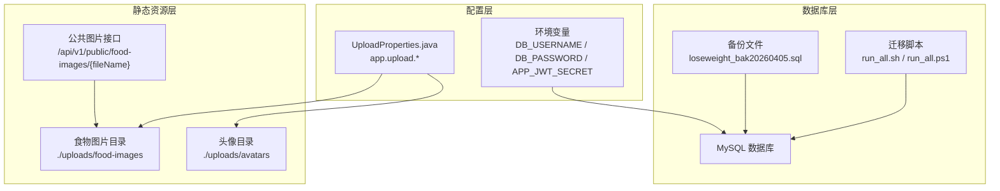
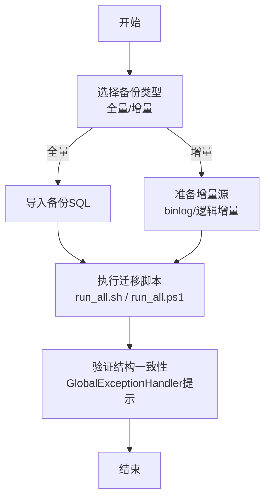
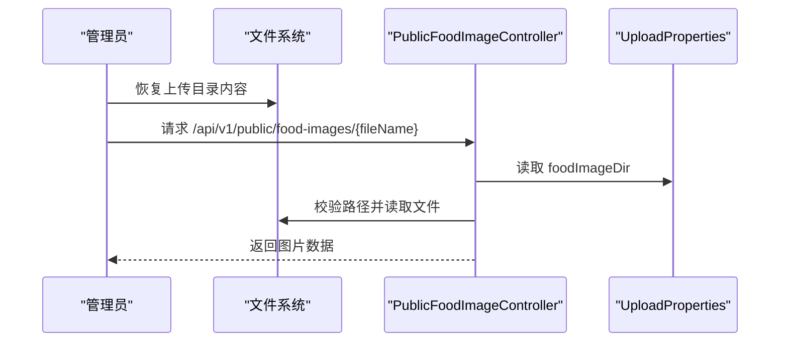
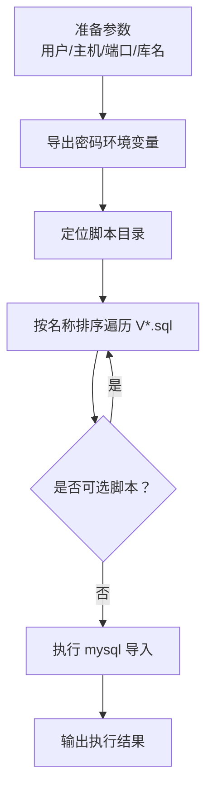
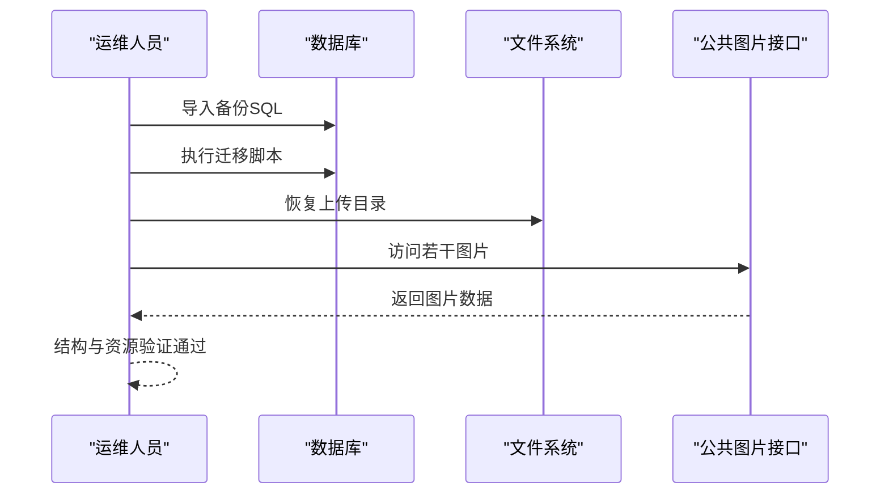
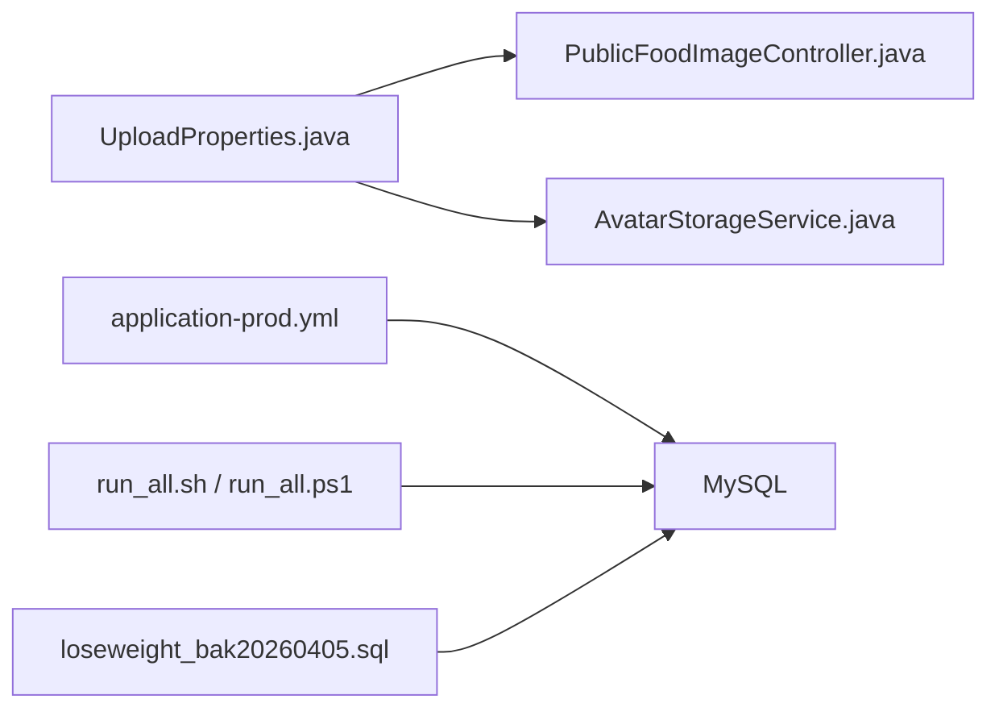

# 备份与恢复

<cite>
**本文引用的文件**
- [application.yml](file://backend/src/main/resources/application.yml)
- [application-prod.yml](file://backend/src/main/resources/application-prod.yml)
- [application-local.yml](file://backend/src/main/resources/application-local.yml)
- [UploadProperties.java](file://backend/src/main/java/com/ypfr/loseweight/config/UploadProperties.java)
- [PublicFoodImageController.java](file://backend/src/main/java/com/ypfr/loseweight/web/PublicFoodImageController.java)
- [AvatarStorageService.java](file://backend/src/main/java/com/ypfr/loseweight/service/AvatarStorageService.java)
- [image_downloader.py](file://tools/food_migration/image_downloader.py)
- [loseweight_bak20260405.sql](file://database/loseweight_bak20260405.sql)
- [run_all.sh](file://database/migrations/run_all.sh)
- [run_all.ps1](file://database/migrations/run_all.ps1)
- [GlobalExceptionHandler.java](file://backend/src/main/java/com/ypfr/loseweight/common/GlobalExceptionHandler.java)
</cite>

## 目录
1. [简介](#简介)
2. [项目结构](#项目结构)
3. [核心组件](#核心组件)
4. [架构总览](#架构总览)
5. [详细组件分析](#详细组件分析)
6. [依赖关系分析](#依赖关系分析)
7. [性能考虑](#性能考虑)
8. [故障排查指南](#故障排查指南)
9. [结论](#结论)
10. [附录](#附录)

## 简介
本指南面向备份与恢复系统，围绕数据库备份策略（全量与增量）、静态资源备份（头像与食物图片）、备份存储与归档、灾难恢复流程、数据恢复测试与验证、自动化备份脚本使用、监控与告警以及恢复演练最佳实践进行系统化说明。文档基于仓库现有配置与脚本，结合后端上传配置与前端静态资源访问路径，给出可操作的实施方案。

## 项目结构
- 后端配置与上传路径
  - 应用配置文件定义了数据库连接、JWT 密钥、上传目录等关键参数
  - 上传目录通过配置类注入，用于头像与食物图片的持久化
- 数据库迁移与备份
  - 提供按版本号顺序执行的迁移脚本，支持 Windows 与 Linux
  - 提供历史备份 SQL 文件，可用于快速恢复
- 静态资源
  - 食物图片通过公共接口访问，路径与上传目录关联
  - 头像存储服务负责本地持久化

**图表来源**
- [application.yml:1-54](file://backend/src/main/resources/application.yml#L1-L54)
- [application-prod.yml:1-19](file://backend/src/main/resources/application-prod.yml#L1-L19)
- [application-local.yml:1-20](file://backend/src/main/resources/application-local.yml#L1-L20)
- [UploadProperties.java:1-29](file://backend/src/main/java/com/ypfr/loseweight/config/UploadProperties.java#L1-L29)
- [PublicFoodImageController.java:1-42](file://backend/src/main/java/com/ypfr/loseweight/web/PublicFoodImageController.java#L1-L42)
- [AvatarStorageService.java:1-20](file://backend/src/main/java/com/ypfr/loseweight/service/AvatarStorageService.java#L1-L20)
- [image_downloader.py:84-111](file://tools/food_migration/image_downloader.py#L84-L111)
- [run_all.sh:1-26](file://database/migrations/run_all.sh#L1-L26)
- [run_all.ps1:1-34](file://database/migrations/run_all.ps1#L1-L34)
- [loseweight_bak20260405.sql:1-526](file://database/loseweight_bak20260405.sql#L1-L526)

**章节来源**
- [application.yml:1-54](file://backend/src/main/resources/application.yml#L1-L54)
- [application-prod.yml:1-19](file://backend/src/main/resources/application-prod.yml#L1-L19)
- [application-local.yml:1-20](file://backend/src/main/resources/application-local.yml#L1-L20)
- [UploadProperties.java:1-29](file://backend/src/main/java/com/ypfr/loseweight/config/UploadProperties.java#L1-L29)
- [PublicFoodImageController.java:1-42](file://backend/src/main/java/com/ypfr/loseweight/web/PublicFoodImageController.java#L1-L42)
- [AvatarStorageService.java:1-20](file://backend/src/main/java/com/ypfr/loseweight/service/AvatarStorageService.java#L1-L20)
- [image_downloader.py:84-111](file://tools/food_migration/image_downloader.py#L84-L111)
- [run_all.sh:1-26](file://database/migrations/run_all.sh#L1-L26)
- [run_all.ps1:1-34](file://database/migrations/run_all.ps1#L1-L34)
- [loseweight_bak20260405.sql:1-526](file://database/loseweight_bak20260405.sql#L1-L526)

## 核心组件
- 数据库备份与迁移
  - 全量备份：使用历史备份 SQL 文件进行恢复
  - 迁移脚本：按版本顺序执行，确保数据库结构一致性
- 静态资源备份
  - 头像与食物图片均位于上传目录，可通过文件级备份实现
  - 食物图片提供公共访问接口，便于校验恢复后的可用性
- 配置与路径
  - 上传目录通过配置类注入，确保前后端一致
  - 生产环境通过环境变量注入敏感信息

**章节来源**
- [loseweight_bak20260405.sql:1-526](file://database/loseweight_bak20260405.sql#L1-L526)
- [run_all.sh:1-26](file://database/migrations/run_all.sh#L1-L26)
- [run_all.ps1:1-34](file://database/migrations/run_all.ps1#L1-L34)
- [UploadProperties.java:1-29](file://backend/src/main/java/com/ypfr/loseweight/config/UploadProperties.java#L1-L29)
- [PublicFoodImageController.java:1-42](file://backend/src/main/java/com/ypfr/loseweight/web/PublicFoodImageController.java#L1-L42)

## 架构总览
备份与恢复涉及三层：数据库层、静态资源层与配置层。数据库层以 SQL 备份为主，配合迁移脚本保证结构演进；静态资源层以文件系统备份为主，结合公共接口进行可用性验证；配置层通过环境变量与配置文件控制上传路径与敏感信息。

**图表来源**
- [loseweight_bak20260405.sql:1-526](file://database/loseweight_bak20260405.sql#L1-L526)
- [run_all.sh:1-26](file://database/migrations/run_all.sh#L1-L26)
- [run_all.ps1:1-34](file://database/migrations/run_all.ps1#L1-L34)
- [UploadProperties.java:1-29](file://backend/src/main/java/com/ypfr/loseweight/config/UploadProperties.java#L1-L29)
- [PublicFoodImageController.java:1-42](file://backend/src/main/java/com/ypfr/loseweight/web/PublicFoodImageController.java#L1-L42)
- [application-prod.yml:1-19](file://backend/src/main/resources/application-prod.yml#L1-L19)

## 详细组件分析

### 数据库备份与恢复策略
- 全量备份
  - 使用历史备份 SQL 文件进行恢复，适合快速回滚到某个时间点
  - 恢复前需确认数据库版本与备份一致，必要时执行迁移脚本
- 增量备份
  - 当前仓库未提供数据库增量备份脚本，建议结合数据库二进制日志或逻辑备份工具制定增量策略
- 迁移与结构一致性
  - 使用迁移脚本按顺序执行，跳过可选脚本，确保结构演进一致
  - 若出现“数据库结构落后”提示，需对照迁移目录执行缺失脚本

**图表来源**
- [loseweight_bak20260405.sql:1-526](file://database/loseweight_bak20260405.sql#L1-L526)
- [run_all.sh:1-26](file://database/migrations/run_all.sh#L1-L26)
- [run_all.ps1:1-34](file://database/migrations/run_all.ps1#L1-L34)
- [GlobalExceptionHandler.java:87-106](file://backend/src/main/java/com/ypfr/loseweight/common/GlobalExceptionHandler.java#L87-L106)

**章节来源**
- [loseweight_bak20260405.sql:1-526](file://database/loseweight_bak20260405.sql#L1-L526)
- [run_all.sh:1-26](file://database/migrations/run_all.sh#L1-L26)
- [run_all.ps1:1-34](file://database/migrations/run_all.ps1#L1-L34)
- [GlobalExceptionHandler.java:87-106](file://backend/src/main/java/com/ypfr/loseweight/common/GlobalExceptionHandler.java#L87-L106)

### 静态资源备份与恢复
- 头像与食物图片
  - 上传目录通过配置类注入，分别对应头像与食物图片目录
  - 食物图片提供公共接口，便于恢复后验证
- 图片下载与存储
  - 工具脚本支持从外部渠道下载图片并写入上传目录
- 恢复流程
  - 文件系统层面直接恢复上传目录
  - 通过公共接口访问图片，验证恢复结果

**图表来源**
- [PublicFoodImageController.java:1-42](file://backend/src/main/java/com/ypfr/loseweight/web/PublicFoodImageController.java#L1-L42)
- [UploadProperties.java:1-29](file://backend/src/main/java/com/ypfr/loseweight/config/UploadProperties.java#L1-L29)
- [image_downloader.py:84-111](file://tools/food_migration/image_downloader.py#L84-L111)

**章节来源**
- [UploadProperties.java:1-29](file://backend/src/main/java/com/ypfr/loseweight/config/UploadProperties.java#L1-L29)
- [PublicFoodImageController.java:1-42](file://backend/src/main/java/com/ypfr/loseweight/web/PublicFoodImageController.java#L1-L42)
- [image_downloader.py:84-111](file://tools/food_migration/image_downloader.py#L84-L111)

### 自动化备份脚本使用
- 数据库迁移脚本
  - Linux：使用 Bash 脚本，按文件名排序执行，跳过可选脚本
  - Windows：使用 PowerShell 脚本，同样按名称排序执行
- 使用要点
  - 设置数据库连接参数（用户、主机、端口、库名）
  - 可通过环境变量设置密码，避免交互输入
  - 执行前确保 MySQL 客户端在 PATH 中

**图表来源**
- [run_all.sh:1-26](file://database/migrations/run_all.sh#L1-L26)
- [run_all.ps1:1-34](file://database/migrations/run_all.ps1#L1-L34)

**章节来源**
- [run_all.sh:1-26](file://database/migrations/run_all.sh#L1-L26)
- [run_all.ps1:1-34](file://database/migrations/run_all.ps1#L1-L34)

### 备份存储与归档方案
- 数据库备份
  - 建议将备份 SQL 文件纳入版本控制或私有归档，保留多个时间点快照
  - 对应迁移脚本一并归档，确保可重现
- 静态资源备份
  - 将上传目录整体归档，建议分卷压缩并加密
  - 归档介质可采用本地磁盘、NAS 或对象存储
- 归档命名规范
  - 建议包含日期、版本、用途（如“loseweight_db_20260405_full.sql”）

[本节为通用实践说明，无需列出具体文件来源]

### 灾难恢复流程
- 数据库恢复
  - 导入对应时间点的备份 SQL
  - 执行迁移脚本补齐结构变更
  - 启动后端，观察异常处理器提示，确保结构一致
- 静态资源恢复
  - 恢复上传目录内容
  - 通过公共接口访问代表性图片，验证可用性
- 验证与切换
  - 进行端到端功能验证
  - 切换流量并持续监控

**图表来源**
- [loseweight_bak20260405.sql:1-526](file://database/loseweight_bak20260405.sql#L1-L526)
- [run_all.sh:1-26](file://database/migrations/run_all.sh#L1-L26)
- [run_all.ps1:1-34](file://database/migrations/run_all.ps1#L1-L34)
- [PublicFoodImageController.java:1-42](file://backend/src/main/java/com/ypfr/loseweight/web/PublicFoodImageController.java#L1-L42)

**章节来源**
- [loseweight_bak20260405.sql:1-526](file://database/loseweight_bak20260405.sql#L1-L526)
- [run_all.sh:1-26](file://database/migrations/run_all.sh#L1-L26)
- [run_all.ps1:1-34](file://database/migrations/run_all.ps1#L1-L34)
- [PublicFoodImageController.java:1-42](file://backend/src/main/java/com/ypfr/loseweight/web/PublicFoodImageController.java#L1-L42)

### 数据恢复测试与验证
- 数据库
  - 导入后端异常处理器会提示“数据库结构落后”，需执行迁移脚本
  - 核对关键表与索引是否存在，确保业务接口可用
- 静态资源
  - 通过公共接口访问代表性图片，确认路径与权限正确
  - 检查上传目录权限与容量

**章节来源**
- [GlobalExceptionHandler.java:87-106](file://backend/src/main/java/com/ypfr/loseweight/common/GlobalExceptionHandler.java#L87-L106)
- [PublicFoodImageController.java:1-42](file://backend/src/main/java/com/ypfr/loseweight/web/PublicFoodImageController.java#L1-L42)

### 备份监控与告警
- 建议指标
  - 备份任务执行状态、耗时、失败次数
  - 数据库迁移脚本执行状态
  - 静态资源目录大小与增长趋势
- 告警阈值
  - 失败率超过阈值触发告警
  - 迁移脚本执行超时或返回非零退出码
- 观察点
  - 日志中“数据库结构落后”的提示
  - 图片接口返回 404/400 的异常

[本节为通用实践说明，无需列出具体文件来源]

### 恢复演练最佳实践
- 定期演练
  - 按月/季度进行恢复演练，覆盖数据库与静态资源
- 验收清单
  - 数据库：关键业务数据可查询、迁移脚本执行成功
  - 静态资源：代表性图片可访问、目录权限正确
- 注意事项
  - 演练前做好隔离环境，避免影响生产
  - 演练后清理临时数据，记录问题与改进项

[本节为通用实践说明，无需列出具体文件来源]

## 依赖关系分析
- 配置依赖
  - 上传目录配置被控制器与服务依赖
  - 生产环境通过环境变量注入数据库凭据与密钥
- 脚本依赖
  - 迁移脚本依赖 MySQL 客户端
  - 备份 SQL 文件依赖数据库版本与结构
- 接口依赖
  - 公共图片接口依赖上传目录配置与文件存在性校验

**图表来源**
- [UploadProperties.java:1-29](file://backend/src/main/java/com/ypfr/loseweight/config/UploadProperties.java#L1-L29)
- [PublicFoodImageController.java:1-42](file://backend/src/main/java/com/ypfr/loseweight/web/PublicFoodImageController.java#L1-L42)
- [AvatarStorageService.java:1-20](file://backend/src/main/java/com/ypfr/loseweight/service/AvatarStorageService.java#L1-L20)
- [application-prod.yml:1-19](file://backend/src/main/resources/application-prod.yml#L1-L19)
- [run_all.sh:1-26](file://database/migrations/run_all.sh#L1-L26)
- [run_all.ps1:1-34](file://database/migrations/run_all.ps1#L1-L34)
- [loseweight_bak20260405.sql:1-526](file://database/loseweight_bak20260405.sql#L1-L526)

**章节来源**
- [UploadProperties.java:1-29](file://backend/src/main/java/com/ypfr/loseweight/config/UploadProperties.java#L1-L29)
- [PublicFoodImageController.java:1-42](file://backend/src/main/java/com/ypfr/loseweight/web/PublicFoodImageController.java#L1-L42)
- [AvatarStorageService.java:1-20](file://backend/src/main/java/com/ypfr/loseweight/service/AvatarStorageService.java#L1-L20)
- [application-prod.yml:1-19](file://backend/src/main/resources/application-prod.yml#L1-L19)
- [run_all.sh:1-26](file://database/migrations/run_all.sh#L1-L26)
- [run_all.ps1:1-34](file://database/migrations/run_all.ps1#L1-L34)
- [loseweight_bak20260405.sql:1-526](file://database/loseweight_bak20260405.sql#L1-L526)

## 性能考虑
- 备份窗口
  - 数据库全量备份建议在低峰期执行
  - 静态资源备份可采用差异/增量策略减少带宽占用
- 并发与锁
  - 导入 SQL 期间避免写入高峰
  - 文件系统备份期间避免频繁读写
- 存储与压缩
  - 备份文件分卷压缩并校验完整性
  - 使用对象存储长期归档，降低本地压力

[本节为通用实践说明，无需列出具体文件来源]

## 故障排查指南
- 数据库结构不一致
  - 现象：后端抛出“数据库结构落后于后端代码”
  - 处理：执行迁移脚本补齐缺失变更
- 图片无法访问
  - 现象：公共接口返回 404/400
  - 处理：检查上传目录配置、文件存在性与路径规范化
- 迁移脚本失败
  - 现象：脚本执行返回非零退出码
  - 处理：检查 MySQL 客户端、连接参数与权限

**章节来源**
- [GlobalExceptionHandler.java:87-106](file://backend/src/main/java/com/ypfr/loseweight/common/GlobalExceptionHandler.java#L87-L106)
- [PublicFoodImageController.java:1-42](file://backend/src/main/java/com/ypfr/loseweight/web/PublicFoodImageController.java#L1-L42)
- [run_all.ps1:1-34](file://database/migrations/run_all.ps1#L1-L34)

## 结论
本指南基于仓库现有配置与脚本，给出了数据库与静态资源的备份与恢复实施方案。建议在现有基础上补充增量备份策略、完善监控与告警，并定期开展恢复演练，以提升系统的可靠性与可恢复性。

## 附录
- 关键配置位置
  - 上传目录：[UploadProperties.java:1-29](file://backend/src/main/java/com/ypfr/loseweight/config/UploadProperties.java#L1-L29)
  - 生产环境变量：[application-prod.yml:1-19](file://backend/src/main/resources/application-prod.yml#L1-L19)
- 关键脚本位置
  - 迁移脚本（Linux）：[run_all.sh:1-26](file://database/migrations/run_all.sh#L1-L26)
  - 迁移脚本（Windows）：[run_all.ps1:1-34](file://database/migrations/run_all.ps1#L1-L34)
- 关键接口位置
  - 公共图片接口：[PublicFoodImageController.java:1-42](file://backend/src/main/java/com/ypfr/loseweight/web/PublicFoodImageController.java#L1-L42)