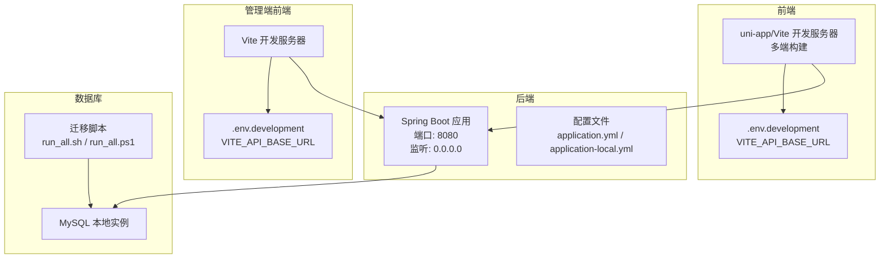
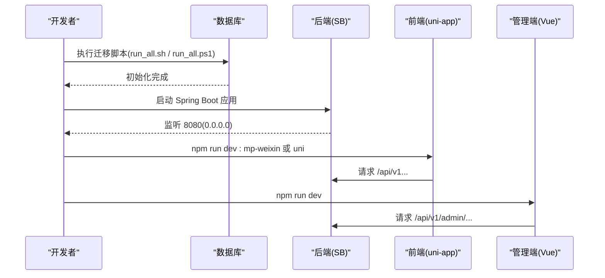
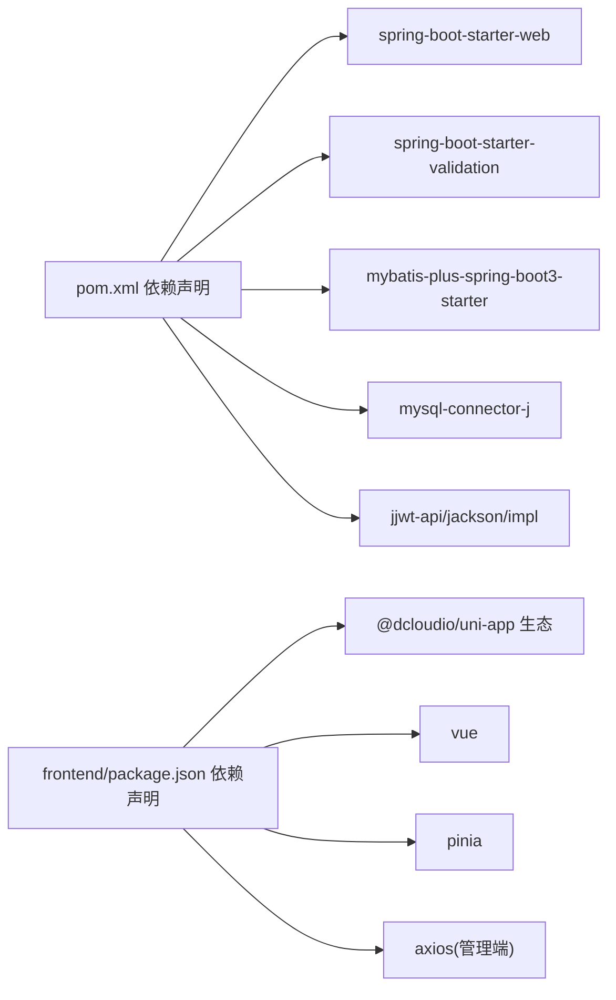

# 开发环境部署

<cite>
**本文引用的文件**
- [application.yml](file://backend/src/main/resources/application.yml)
- [application-local.yml](file://backend/src/main/resources/application-local.yml)
- [application-local.yml.example](file://backend/src/main/resources/application-local.yml.example)
- [pom.xml](file://backend/pom.xml)
- [package.json](file://frontend/package.json)
- [vite.config.ts](file://frontend/vite.config.ts)
- [.env.development](file://frontend/.env.development)
- [api.ts](file://frontend/src/config/api.ts)
- [vite.config.ts](file://admin-frontend/vite.config.ts)
- [.env.development](file://admin-frontend/.env.development)
- [http.ts](file://admin-frontend/src/api/http.ts)
- [run_all.sh](file://database/migrations/run_all.sh)
- [run_all.ps1](file://database/migrations/run_all.ps1)
- [init-project.js](file://scripts/init-project.js)
</cite>

## 目录
1. [简介](#简介)
2. [项目结构](#项目结构)
3. [核心组件](#核心组件)
4. [架构总览](#架构总览)
5. [详细组件分析](#详细组件分析)
6. [依赖分析](#依赖分析)
7. [性能考虑](#性能考虑)
8. [故障排查指南](#故障排查指南)
9. [结论](#结论)
10. [附录](#附录)

## 简介
本指南面向开发环境部署，涵盖本地后端 Spring Boot 应用的配置、前端 Vite 开发服务器的热重载与代理配置、数据库初始化与连接配置，以及完整的启动流程、环境变量与依赖安装步骤。同时提供常见问题排查建议，如端口冲突、依赖版本不兼容等。

## 项目结构
该项目采用前后端分离架构：
- 后端：Spring Boot 应用，使用 MyBatis-Plus，配置文件位于 resources 目录，支持多环境 profile 切换。
- 前端：基于 uni-app/Vite 的多端应用，包含 H5 与小程序目标平台，开发时通过 uni 命令启动。
- 管理端前端：独立的 Vue 3 + Vite 管理后台，通过 axios 发起请求并与后端约定的 API 前缀对接。
- 数据库：提供 SQL 迁移脚本，支持 Windows PowerShell 与 Linux/macOS Bash 两种运行方式。

图表来源
- [application.yml:13-16](file://backend/src/main/resources/application.yml#L13-L16)
- [application-local.yml:4-8](file://backend/src/main/resources/application-local.yml#L4-L8)
- [vite.config.ts:1-23](file://frontend/vite.config.ts#L1-L23)
- [.env.development:1-7](file://frontend/.env.development#L1-L7)
- [vite.config.ts:1-8](file://admin-frontend/vite.config.ts#L1-L8)
- [.env.development:1-2](file://admin-frontend/.env.development#L1-L2)
- [run_all.sh:1-26](file://database/migrations/run_all.sh#L1-L26)
- [run_all.ps1:1-34](file://database/migrations/run_all.ps1#L1-L34)

章节来源
- [application.yml:1-54](file://backend/src/main/resources/application.yml#L1-L54)
- [application-local.yml:1-20](file://backend/src/main/resources/application-local.yml#L1-L20)
- [pom.xml:1-86](file://backend/pom.xml#L1-L86)
- [package.json:1-78](file://frontend/package.json#L1-L78)
- [vite.config.ts:1-23](file://frontend/vite.config.ts#L1-L23)
- [.env.development:1-7](file://frontend/.env.development#L1-L7)
- [vite.config.ts:1-8](file://admin-frontend/vite.config.ts#L1-L8)
- [.env.development:1-2](file://admin-frontend/.env.development#L1-L2)
- [run_all.sh:1-26](file://database/migrations/run_all.sh#L1-L26)
- [run_all.ps1:1-34](file://database/migrations/run_all.ps1#L1-L34)

## 核心组件
- 后端 Spring Boot 应用
  - 端口与网络绑定：默认监听 8080，绑定到 0.0.0.0，便于真机访问。
  - 数据源：默认指向本地 MySQL，支持通过 application-local.yml 覆盖用户名/密码。
  - 配置文件：application.yml 激活 local profile，application-local.yml 用于本地敏感配置覆盖。
- 前端 uni-app/Vite
  - 开发命令：通过 package.json 提供 dev:h5、dev:mp-weixin 等脚本。
  - 环境变量：VITE_API_BASE_URL 控制后端基地址；开发模式下合并 .env.development。
  - API 前缀：默认 /api/v1，可通过环境变量调整。
- 管理端前端 Vue 3 + Vite
  - 开发命令：dev/build/preview。
  - 环境变量：VITE_API_BASE_URL 指向后端 API 前缀。
  - 请求拦截：axios 实例统一注入 Authorization 头。
- 数据库
  - 迁移脚本：run_all.sh / run_all.ps1 按序执行 V001～V013，跳过可选 V014。
  - 运行方式：Windows 使用 PowerShell，Linux/macOS 使用 Bash。

章节来源
- [application.yml:13-16](file://backend/src/main/resources/application.yml#L13-L16)
- [application-local.yml:4-8](file://backend/src/main/resources/application-local.yml#L4-L8)
- [application-local.yml.example:1-27](file://backend/src/main/resources/application-local.yml.example#L1-L27)
- [package.json:7-41](file://frontend/package.json#L7-L41)
- [vite.config.ts:1-23](file://frontend/vite.config.ts#L1-L23)
- [api.ts:1-42](file://frontend/src/config/api.ts#L1-L42)
- [vite.config.ts:1-8](file://admin-frontend/vite.config.ts#L1-L8)
- [.env.development:1-2](file://admin-frontend/.env.development#L1-L2)
- [http.ts:1-31](file://admin-frontend/src/api/http.ts#L1-L31)
- [run_all.sh:1-26](file://database/migrations/run_all.sh#L1-L26)
- [run_all.ps1:1-34](file://database/migrations/run_all.ps1#L1-L34)

## 架构总览
开发环境启动链路如下：
- 启动数据库：执行迁移脚本创建/更新 schema 并插入种子数据。
- 启动后端：Spring Boot 应用加载 application.yml 与 application-local.yml，绑定 8080 端口。
- 启动前端：根据 .env.development 设置 VITE_API_BASE_URL，访问后端 API。
- 启动管理端：设置 VITE_API_BASE_URL，通过 axios 注入认证头访问后端。

图表来源
- [run_all.sh:1-26](file://database/migrations/run_all.sh#L1-L26)
- [run_all.ps1:1-34](file://database/migrations/run_all.ps1#L1-L34)
- [application.yml:13-16](file://backend/src/main/resources/application.yml#L13-L16)
- [vite.config.ts:1-23](file://frontend/vite.config.ts#L1-L23)
- [.env.development:1-7](file://frontend/.env.development#L1-L7)
- [vite.config.ts:1-8](file://admin-frontend/vite.config.ts#L1-L8)
- [.env.development:1-2](file://admin-frontend/.env.development#L1-L2)

## 详细组件分析

### 后端 Spring Boot 配置
- 环境与端口
  - server.port: 8080
  - server.address: 0.0.0.0（允许局域网访问）
- 数据源
  - spring.datasource.url: 指向本地 MySQL
  - 用户名/密码：在 application-local.yml 中覆盖
- Profile
  - spring.profiles.active: local
- MyBatis-Plus
  - 开启驼峰命名映射与日志实现
- JWT 与上传
  - app.jwt.secret：在 application-local.yml 中覆盖为 ≥32 字符随机串
  - app.upload.avatar-dir / food-image-dir：本地上传目录

章节来源
- [application.yml:1-54](file://backend/src/main/resources/application.yml#L1-L54)
- [application-local.yml:1-20](file://backend/src/main/resources/application-local.yml#L1-L20)
- [application-local.yml.example:1-27](file://backend/src/main/resources/application-local.yml.example#L1-L27)
- [pom.xml:1-86](file://backend/pom.xml#L1-L86)

### 前端 uni-app/Vite 配置
- 开发命令
  - npm run dev:h5 / dev:mp-weixin 等
- 环境变量
  - VITE_API_BASE_URL：后端基地址，默认 http://127.0.0.1:8080
  - VITE_DEV_USER_ID：未登录联调时的默认用户 ID
- API 前缀
  - API_PATH_PREFIX 默认 /api/v1，可通过环境变量覆盖
- Vite 配置
  - 合并 development 与当前 mode 的环境变量，确保真机调试可用

章节来源
- [package.json:7-41](file://frontend/package.json#L7-L41)
- [.env.development:1-7](file://frontend/.env.development#L1-L7)
- [vite.config.ts:1-23](file://frontend/vite.config.ts#L1-L23)
- [api.ts:1-42](file://frontend/src/config/api.ts#L1-L42)

### 管理端前端 Vue 配置
- 开发命令
  - dev/build/preview
- 环境变量
  - VITE_API_BASE_URL：指向 /api/v1
- 请求拦截
  - axios 实例 baseURL 为 /api/v1
  - 自动注入 Authorization: Bearer token

章节来源
- [vite.config.ts:1-8](file://admin-frontend/vite.config.ts#L1-L8)
- [.env.development:1-2](file://admin-frontend/.env.development#L1-L2)
- [http.ts:1-31](file://admin-frontend/src/api/http.ts#L1-L31)

### 数据库初始化与连接
- 迁移脚本
  - run_all.sh：按文件名排序执行 V001～V013，跳过 V014
  - run_all.ps1：PowerShell 版本，参数化用户、主机、端口、库名
- 连接配置
  - application-local.yml 中 spring.datasource.* 覆盖用户名/密码
  - application.yml 中 datasource.* 为示例与默认值

章节来源
- [run_all.sh:1-26](file://database/migrations/run_all.sh#L1-L26)
- [run_all.ps1:1-34](file://database/migrations/run_all.ps1#L1-L34)
- [application-local.yml:4-8](file://backend/src/main/resources/application-local.yml#L4-L8)
- [application.yml:8-11](file://backend/src/main/resources/application.yml#L8-L11)

### 依赖安装与项目初始化
- 前端项目初始化脚本
  - init-project.js：自动克隆 uni-preset-vue 模板、安装依赖、清理样例页面与 H5 入口
- 依赖要求
  - Node 引擎版本要求：>= 20.12.2
  - 后端 Java 版本：17
  - Maven：Spring Boot 3.3.5 与 MyBatis-Plus 3.5.9

章节来源
- [init-project.js:1-122](file://scripts/init-project.js#L1-L122)
- [package.json:4-6](file://frontend/package.json#L4-L6)
- [pom.xml:20-23](file://backend/pom.xml#L20-L23)

## 依赖分析
- 后端依赖
  - Spring Boot Starter Web、Validation、Security Crypto
  - MyBatis-Plus Spring Boot 3 Starter
  - MySQL Connector/J
  - JWT 相关依赖
- 前端依赖
  - @dcloudio/uni-app 生态与 Vite 插件
  - Vue 3、Pinia、axios（管理端）

图表来源
- [pom.xml:25-75](file://backend/pom.xml#L25-L75)
- [package.json:42-76](file://frontend/package.json#L42-L76)

章节来源
- [pom.xml:25-75](file://backend/pom.xml#L25-L75)
- [package.json:42-76](file://frontend/package.json#L42-L76)

## 性能考虑
- 后端
  - 适当增大 Tomcat 表单大小限制以支持大文件上传。
  - 启用 MyBatis 日志便于开发调试，生产关闭。
- 前端
  - Vite 默认启用热重载与按需编译，保持开发体验。
  - 注意跨端构建体积与资源加载策略，避免在小程序端引入过大依赖。

## 故障排查指南
- 端口冲突
  - 后端：确认 8080 未被占用；如冲突可在 application.yml 中修改 server.port。
  - 前端：uni-app 开发端口由 Vite/uni-cli 管理，切换命令或配置文件中的端口。
- 依赖版本不兼容
  - Node 版本需满足 >= 20.12.2；升级 Node 后重新安装依赖。
  - 后端 Java 版本需 17；Maven 使用与 Spring Boot 3.3.5 兼容的依赖树。
- 数据库连接失败
  - 检查 application-local.yml 中的 spring.datasource.username/password 是否正确。
  - 确认 MySQL 服务已启动且网络可达；必要时调整 spring.datasource.url。
- 真机调试无法访问后端
  - 后端需监听 0.0.0.0；前端 VITE_API_BASE_URL 需指向本机局域网 IP。
  - 小程序开发者工具需勾选“不校验合法域名”，并清理缓存后重新编译。
- 管理端登录无 Token
  - 确认 axios 请求拦截器已注入 Authorization；检查登录接口返回与存储逻辑。

章节来源
- [application.yml:13-16](file://backend/src/main/resources/application.yml#L13-L16)
- [application-local.yml:4-8](file://backend/src/main/resources/application-local.yml#L4-L8)
- [.env.development:1-7](file://frontend/.env.development#L1-L7)
- [http.ts:12-18](file://admin-frontend/src/api/http.ts#L12-L18)

## 结论
通过以上配置与流程，可在本地快速搭建并运行后端、前端与管理端开发环境。关键在于正确设置数据库连接、后端监听地址与端口、前端 API 基地址与前缀，并按需覆盖敏感配置于 application-local.yml。遇到问题时，优先检查端口占用、依赖版本与网络连通性。

## 附录

### 启动流程清单
- 准备数据库
  - 执行 run_all.sh 或 run_all.ps1 完成迁移。
- 启动后端
  - 确认 application-local.yml 已创建并填写数据库凭据。
  - 运行 Spring Boot 应用，监听 8080。
- 启动前端
  - 在 frontend 目录执行 npm run dev:mp-weixin 或 uni。
  - 确保 .env.development 中 VITE_API_BASE_URL 指向后端地址。
- 启动管理端
  - 在 admin-frontend 目录执行 npm run dev。
  - 确保 .env.development 中 VITE_API_BASE_URL 指向 /api/v1。

章节来源
- [run_all.sh:1-26](file://database/migrations/run_all.sh#L1-L26)
- [run_all.ps1:1-34](file://database/migrations/run_all.ps1#L1-L34)
- [application-local.yml:1-20](file://backend/src/main/resources/application-local.yml#L1-L20)
- [application.yml:13-16](file://backend/src/main/resources/application.yml#L13-L16)
- [package.json:7-41](file://frontend/package.json#L7-L41)
- [.env.development:1-7](file://frontend/.env.development#L1-L7)
- [vite.config.ts:1-8](file://admin-frontend/vite.config.ts#L1-L8)
- [.env.development:1-2](file://admin-frontend/.env.development#L1-L2)