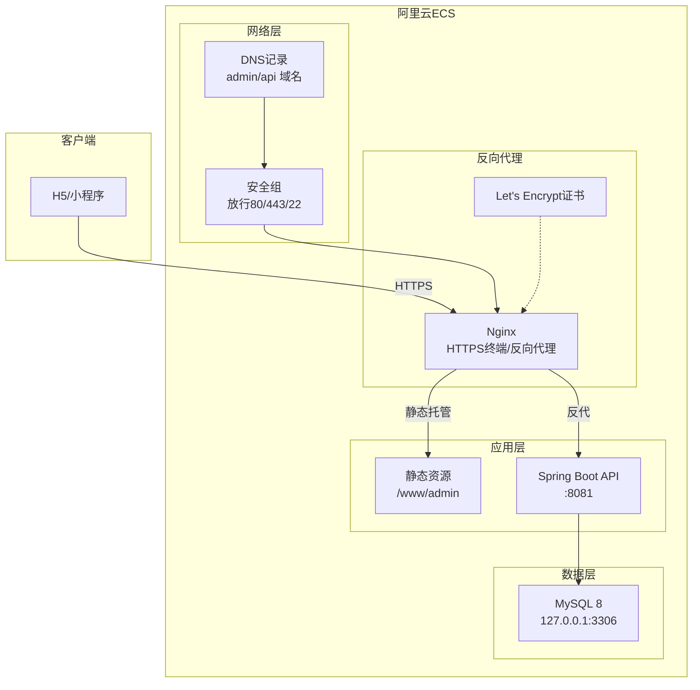
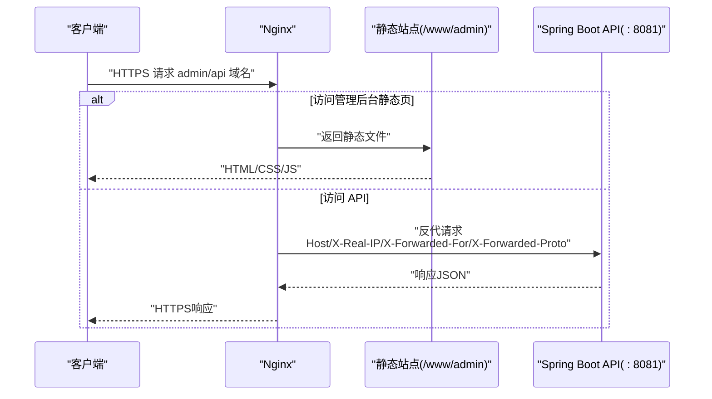
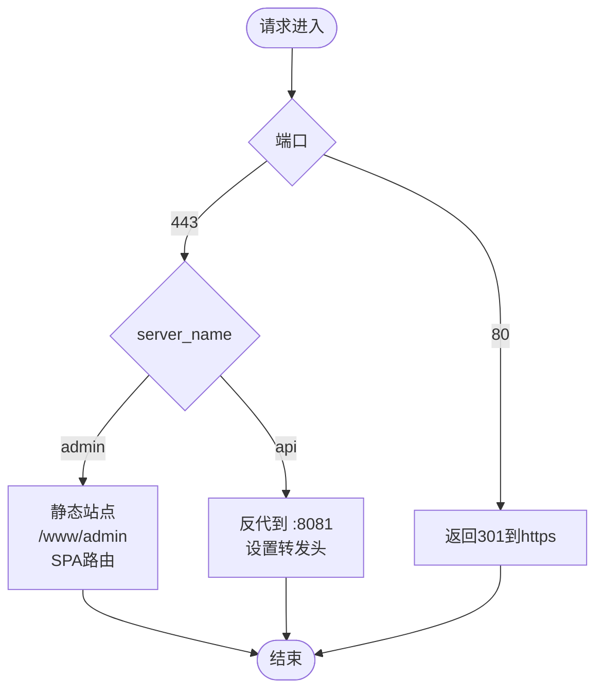
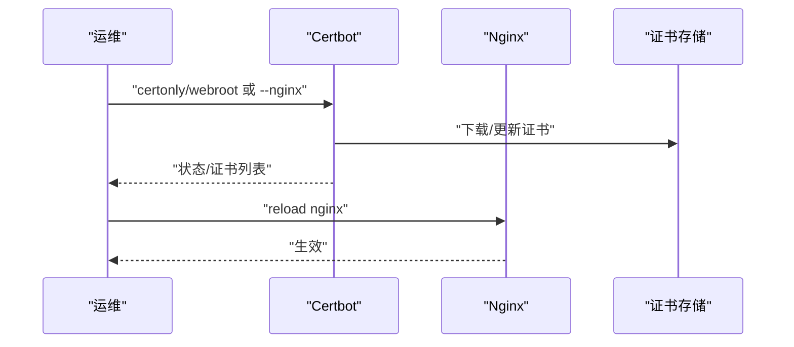
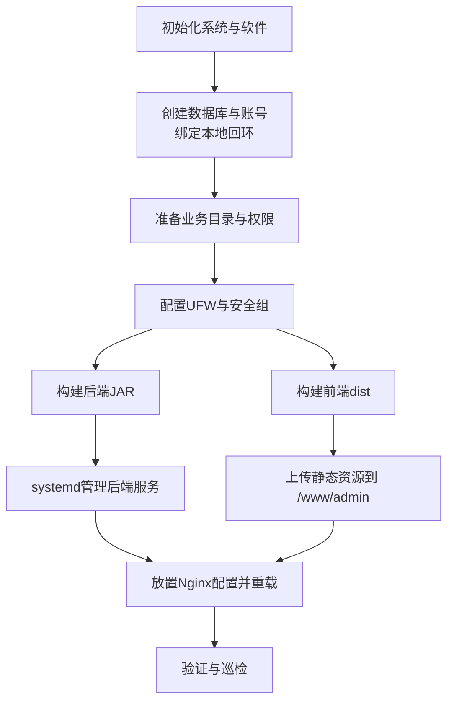
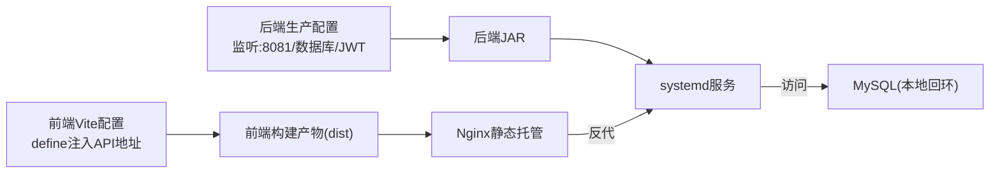

# 生产环境配置

<cite>
**本文引用的文件**
- [docs/admin-deploy-ecs.md](file://docs/admin-deploy-ecs.md)
- [docs/aliyun-ecs-letsencrypt-deploy.md](file://docs/aliyun-ecs-letsencrypt-deploy.md)
- [docs/nginx-admin.conf](file://docs/nginx-admin.conf)
- [backend/src/main/resources/application-prod.yml](file://backend/src/main/resources/application-prod.yml)
- [backend/src/main/resources/application.yml](file://backend/src/main/resources/application.yml)
- [backend/pom.xml](file://backend/pom.xml)
- [frontend/vite.config.ts](file://frontend/vite.config.ts)
- [frontend/package.json](file://frontend/package.json)
- [frontend/src/config/api.ts](file://frontend/src/config/api.ts)
- [scripts/init-project.js](file://scripts/init-project.js)
</cite>

## 目录
1. [简介](#简介)
2. [项目结构](#项目结构)
3. [核心组件](#核心组件)
4. [架构总览](#架构总览)
5. [详细组件分析](#详细组件分析)
6. [依赖关系分析](#依赖关系分析)
7. [性能考量](#性能考量)
8. [故障排查指南](#故障排查指南)
9. [结论](#结论)
10. [附录](#附录)

## 简介
本指南面向生产环境部署，围绕 Nginx 反向代理、SSL 证书（Let’s Encrypt 申请与续期）、阿里云 ECS 服务器部署流程展开，覆盖静态资源部署、API 服务部署、域名与防火墙配置、负载均衡与 CDN 集成、缓存策略以及自动化部署流程。文档中的步骤与配置均来自仓库内的部署文档与配置文件，确保可操作性与一致性。

## 项目结构
- 后端采用 Spring Boot（Java 17），打包为可执行 JAR，通过 systemd 管理。
- 前端为 uni-app（H5/小程序多端），构建产物上传至静态站点目录。
- Nginx 提供反向代理与 HTTPS 终端，分别服务静态后台与 API。
- 数据库为 MySQL 8，绑定本地回环，业务账号仅本地访问。
- 证书由 Certbot（Let’s Encrypt）签发与续期，支持自动续期定时任务。

图表来源
- [docs/aliyun-ecs-letsencrypt-deploy.md:106-193](file://docs/aliyun-ecs-letsencrypt-deploy.md#L106-L193)
- [backend/src/main/resources/application-prod.yml:1-19](file://backend/src/main/resources/application-prod.yml#L1-L19)
- [docs/admin-deploy-ecs.md:78-96](file://docs/admin-deploy-ecs.md#L78-L96)

章节来源
- [docs/admin-deploy-ecs.md:1-108](file://docs/admin-deploy-ecs.md#L1-L108)
- [docs/aliyun-ecs-letsencrypt-deploy.md:1-256](file://docs/aliyun-ecs-letsencrypt-deploy.md#L1-L256)

## 核心组件
- Nginx 反向代理与 HTTPS 终端
  - 管理后台静态站点与 API 反代在同一主机上，分别监听 443 并使用同一证书。
  - 管理后台静态站点启用 try_files，支持单页应用路由。
  - API 服务反代至本地 8081 端口，设置必要的转发头。
- Spring Boot API 服务
  - 生产配置监听 127.0.0.1:8081，数据库连接与 JWT 密钥通过环境变量注入。
  - systemd 服务定义了工作目录、启动参数与环境变量。
- 前端构建与运行时配置
  - 通过 Vite 的 define 注入 API 基础地址，生产构建后上传至静态目录。
- 数据库与安全
  - MySQL 仅绑定本地回环，业务账号限定 localhost，避免公网暴露。
  - 安全组仅放行 80/443/22，不暴露 3306 至公网。
- 证书与续期
  - 使用 Certbot 申请证书，支持 webroot 与 nginx 插件两种方式。
  - 自动续期通过 systemd timer 或 cron，提供 dry-run 演练。

章节来源
- [docs/aliyun-ecs-letsencrypt-deploy.md:106-193](file://docs/aliyun-ecs-letsencrypt-deploy.md#L106-L193)
- [backend/src/main/resources/application-prod.yml:1-19](file://backend/src/main/resources/application-prod.yml#L1-L19)
- [backend/src/main/resources/application.yml:1-54](file://backend/src/main/resources/application.yml#L1-L54)
- [frontend/vite.config.ts:1-23](file://frontend/vite.config.ts#L1-L23)
- [frontend/src/config/api.ts:1-42](file://frontend/src/config/api.ts#L1-L42)

## 架构总览
生产环境采用“Nginx + Spring Boot + MySQL”的经典三层架构。Nginx 作为入口，负责 TLS 终端、静态资源服务与 API 反代；Spring Boot 提供 REST API；MySQL 仅本地访问，业务账号隔离。

图表来源
- [docs/aliyun-ecs-letsencrypt-deploy.md:138-192](file://docs/aliyun-ecs-letsencrypt-deploy.md#L138-L192)
- [backend/src/main/resources/application-prod.yml:1-19](file://backend/src/main/resources/application-prod.yml#L1-L19)

## 详细组件分析

### Nginx 反向代理与 HTTPS 配置
- 管理后台静态站点
  - 监听 443 SSL，启用 HTTP/2，证书来自 Let’s Encrypt。
  - root 指向 /www/admin，启用 try_files 支持 SPA 路由。
  - 开启 HSTS 头部增强安全性。
- API 服务反代
  - 监听 443 SSL，使用相同证书。
  - 限制请求体大小，反代至 127.0.0.1:8081。
  - 设置标准转发头，确保后端可获取真实客户端信息与协议。
- HTTP → HTTPS 强制跳转
  - 80 端口 server 块返回 301 到 https。

图表来源
- [docs/aliyun-ecs-letsencrypt-deploy.md:122-192](file://docs/aliyun-ecs-letsencrypt-deploy.md#L122-L192)

章节来源
- [docs/aliyun-ecs-letsencrypt-deploy.md:106-193](file://docs/aliyun-ecs-letsencrypt-deploy.md#L106-L193)
- [docs/nginx-admin.conf:1-28](file://docs/nginx-admin.conf#L1-L28)

### SSL 证书配置（Let’s Encrypt）
- 证书签发
  - 支持 webroot 与 nginx 插件两种方式；首次建议先放置 Nginx 配置再使用 nginx 插件。
- 证书位置
  - 默认 live 目录路径与 options-ssl-nginx.conf include 说明已在配置中给出。
- DH 参数
  - 如提示缺少 ssl-dhparams.pem，可通过 openssl 生成并启用。
- 自动续期
  - 提供 systemd timer 查看与 dry-run 续期演练命令。

图表来源
- [docs/aliyun-ecs-letsencrypt-deploy.md:195-218](file://docs/aliyun-ecs-letsencrypt-deploy.md#L195-L218)

章节来源
- [docs/aliyun-ecs-letsencrypt-deploy.md:93-103](file://docs/aliyun-ecs-letsencrypt-deploy.md#L93-L103)
- [docs/aliyun-ecs-letsencrypt-deploy.md:106-193](file://docs/aliyun-ecs-letsencrypt-deploy.md#L106-L193)
- [docs/aliyun-ecs-letsencrypt-deploy.md:207-218](file://docs/aliyun-ecs-letsencrypt-deploy.md#L207-L218)

### 阿里云 ECS 服务器部署流程
- 初始化与软件安装
  - Ubuntu 22.04 LTS，安装 Nginx、OpenJDK 17、MySQL 8、UFW、Certbot。
- 数据库准备
  - 创建业务库与账号，绑定本地回环，避免公网暴露。
- 目录与权限
  - 准备 /www/admin、/www/backend、/var/www/certbot，设置 www-data 权限。
- 防火墙与安全组
  - 安全组放行 22/80/443；UFW 默认出站允许、入站仅允许 SSH/80/443。
- 业务部署
  - 后端：构建 JAR，systemd 启动，设置环境变量。
  - 前端：构建 dist，上传至 /www/admin。
  - Nginx：放置配置文件，校验并重载。

图表来源
- [docs/aliyun-ecs-letsencrypt-deploy.md:8-91](file://docs/aliyun-ecs-letsencrypt-deploy.md#L8-L91)
- [docs/admin-deploy-ecs.md:19-96](file://docs/admin-deploy-ecs.md#L19-L96)

章节来源
- [docs/aliyun-ecs-letsencrypt-deploy.md:1-256](file://docs/aliyun-ecs-letsencrypt-deploy.md#L1-L256)
- [docs/admin-deploy-ecs.md:1-108](file://docs/admin-deploy-ecs.md#L1-L108)

### 静态资源部署
- 构建与上传
  - 在本地执行前端构建，将 dist 目录上传至 /www/admin。
- Nginx 配置
  - root 指向 /www/admin，启用 try_files $uri $uri/ /index.html，支持 SPA 子路由刷新不 404。
- 日志
  - 分别记录静态与 API 的访问与错误日志，便于排障。

章节来源
- [docs/admin-deploy-ecs.md:64-77](file://docs/admin-deploy-ecs.md#L64-L77)
- [docs/aliyun-ecs-letsencrypt-deploy.md:138-162](file://docs/aliyun-ecs-letsencrypt-deploy.md#L138-L162)

### API 服务部署
- 构建与上传
  - 在本地构建后端 JAR，上传至 /www/backend/loseweight-api.jar。
- systemd 服务
  - 工作目录 /www/backend，以 prod 配置启动，设置 DB_USERNAME、DB_PASSWORD、APP_JWT_SECRET 等环境变量。
- 生产配置
  - 监听 127.0.0.1:8081，数据库连接与 JWT 密钥通过环境变量注入。
- 健康检查
  - 文档中提供健康检查接口参考路径，可用于探活。

章节来源
- [docs/admin-deploy-ecs.md:19-62](file://docs/admin-deploy-ecs.md#L19-L62)
- [backend/src/main/resources/application-prod.yml:1-19](file://backend/src/main/resources/application-prod.yml#L1-L19)
- [backend/pom.xml:1-86](file://backend/pom.xml#L1-L86)

### 域名与防火墙配置
- 域名
  - admin.baohukeji.com 与 api.baohukeji.com 的 A 记录指向 ECS 公网 IP。
- 安全组
  - 放行 80/443/22，不暴露 3306 至公网。
- 本机防火墙
  - UFW 默认拒绝入站，允许 SSH、80、443；Nginx 与 Java 同机时无需对外暴露 8081。

章节来源
- [docs/admin-deploy-ecs.md:91-96](file://docs/admin-deploy-ecs.md#L91-L96)
- [docs/aliyun-ecs-letsencrypt-deploy.md:79-91](file://docs/aliyun-ecs-letsencrypt-deploy.md#L79-L91)

### 负载均衡与 CDN 集成
- 负载均衡
  - 可在 Nginx 前增加硬件/软件负载均衡器，将流量分发至多台 ECS 实例。
  - 后端 API 可横向扩展多个实例，但需统一会话或无状态设计。
- CDN 集成
  - 静态资源可接入 CDN，结合缓存策略提升全球访问速度。
  - 注意保留 Nginx 的 X-Forwarded-For 等头部，以便后端识别真实来源。
- 缓存策略
  - 静态资源可设置长缓存与版本化命名；API 响应可按需设置 Cache-Control。
  - 对于敏感接口，避免浏览器缓存，必要时使用 no-store/no-cache。

（本节为概念性指导，不直接分析具体文件）

### 部署脚本与自动化
- 项目初始化脚本
  - 提供前端项目初始化、依赖安装、清理模板文件的自动化流程，便于团队快速拉起前端工程。
- 自动化部署建议
  - 结合 CI/CD 流水线：前端构建产物上传至对象存储或静态托管，后端构建 JAR 并通过 Ansible/Shell 部署至目标 ECS。
  - systemd 与 Nginx 配置变更纳入版本控制，配合回滚策略。

章节来源
- [scripts/init-project.js:1-122](file://scripts/init-project.js#L1-L122)

## 依赖关系分析
- 前端运行时配置
  - 通过 Vite define 注入 API 基础地址，确保生产构建后访问正确的 API 域名。
- 后端配置
  - application-prod.yml 指定监听地址与端口、数据库连接与 JWT 密钥。
  - application.yml 提供默认开发配置与通用参数，生产环境通过 profile 与环境变量覆盖。
- 依赖与运行时
  - 后端基于 Spring Boot 3.3.5 与 Java 17，使用 MySQL Connector/J 连接数据库。
  - 前端基于 uni-app 与 Vite，构建多端产物。

图表来源
- [frontend/vite.config.ts:1-23](file://frontend/vite.config.ts#L1-L23)
- [frontend/src/config/api.ts:1-42](file://frontend/src/config/api.ts#L1-L42)
- [backend/src/main/resources/application-prod.yml:1-19](file://backend/src/main/resources/application-prod.yml#L1-L19)
- [backend/pom.xml:1-86](file://backend/pom.xml#L1-L86)

章节来源
- [frontend/vite.config.ts:1-23](file://frontend/vite.config.ts#L1-L23)
- [frontend/src/config/api.ts:1-42](file://frontend/src/config/api.ts#L1-L42)
- [backend/src/main/resources/application-prod.yml:1-19](file://backend/src/main/resources/application-prod.yml#L1-L19)
- [backend/src/main/resources/application.yml:1-54](file://backend/src/main/resources/application.yml#L1-L54)
- [backend/pom.xml:1-86](file://backend/pom.xml#L1-L86)

## 性能考量
- Nginx 层面
  - 启用 HTTP/2、合理设置超时与请求体大小，开启 gzip/ssl 缓存优化。
- 应用层面
  - 合理配置 JVM 参数与线程池，避免阻塞 IO；数据库连接池参数与慢查询监控。
- 静态资源
  - 启用长期缓存与版本化；CDN 加速与边缘缓存。
- API 层面
  - 接口幂等与限流策略；对热点数据引入本地缓存（如 Redis）。

（本节为通用指导，不直接分析具体文件）

## 故障排查指南
- DNS 与安全组
  - 确认 A 记录正确解析，安全组放行 80/443/22，MySQL 仅本地回环。
- Nginx
  - 使用 nginx -t 校验语法，查看 access/error 日志定位问题。
- 证书
  - 浏览器确认锁图标正常，使用 certbot certificates 查看有效期；执行 renew --dry-run 演练。
- 后端
  - 查看 systemd 日志与后端 error 日志，关注 502/504 与连接超时。
- 跨域与真实 IP
  - 检查 X-Forwarded-For 是否正确传递，API 侧是否按此字段做限流与审计。

章节来源
- [docs/aliyun-ecs-letsencrypt-deploy.md:222-242](file://docs/aliyun-ecs-letsencrypt-deploy.md#L222-L242)
- [docs/admin-deploy-ecs.md:101-108](file://docs/admin-deploy-ecs.md#L101-L108)

## 结论
本指南基于仓库内的部署文档与配置文件，给出了生产环境的完整落地路径：Nginx 反向代理与 HTTPS、Let’s Encrypt 证书申请与续期、ECS 初始化与安全加固、静态与 API 服务部署、域名与防火墙配置，以及可扩展的负载均衡与 CDN 集成建议。结合 systemd 与前端构建配置，可形成可重复、可审计的自动化部署流程。

## 附录
- 前端构建命令与脚本
  - 前端 package.json 中提供多端构建脚本，生产构建后将 dist 上传至 /www/admin。
- 后端构建与运行
  - 后端 pom.xml 指定 Java 17 与 Spring Boot 版本；application-prod.yml 提供生产配置模板。
- 部署验证清单
  - 包含 DNS、安全组、本机 MySQL、Nginx、证书、HTTP→HTTPS、静态后台、API 存活、管理登录、跨域、回源与日志、JWT 密钥、前端环境等 14 项检查点。

章节来源
- [frontend/package.json:1-78](file://frontend/package.json#L1-L78)
- [backend/pom.xml:1-86](file://backend/pom.xml#L1-L86)
- [docs/aliyun-ecs-letsencrypt-deploy.md:222-242](file://docs/aliyun-ecs-letsencrypt-deploy.md#L222-L242)