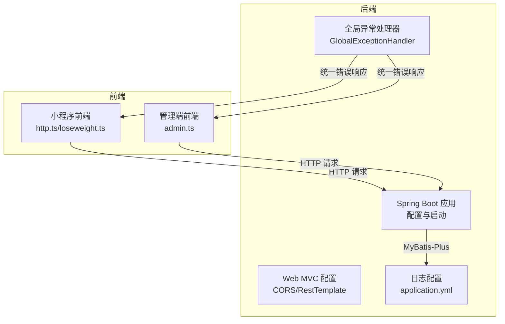
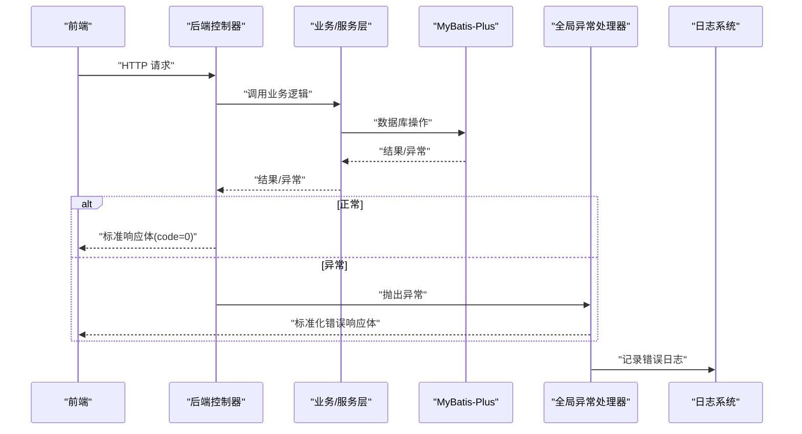
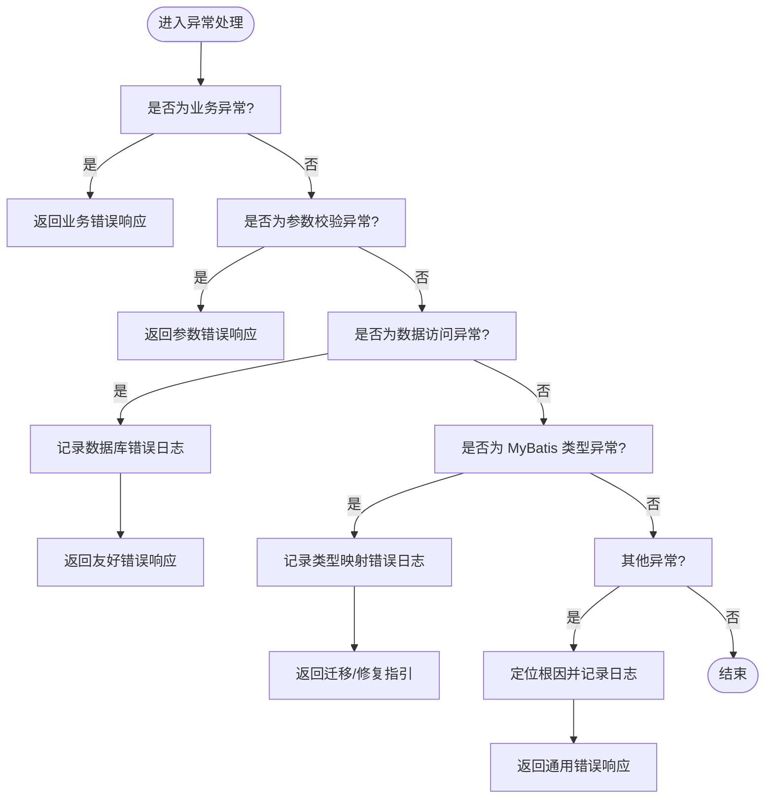
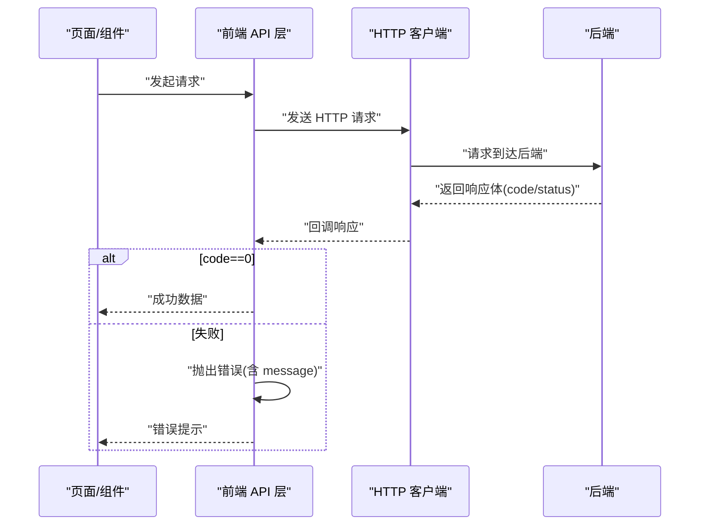
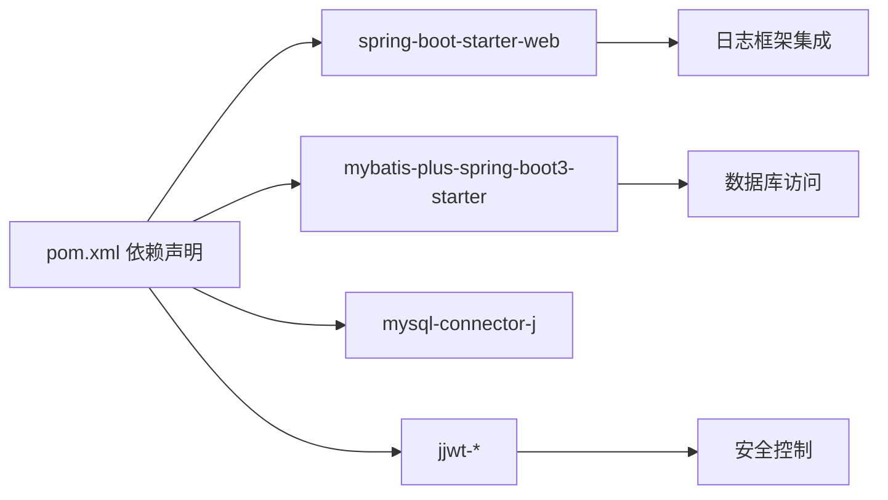

# 监控与日志

<cite>
**本文引用的文件**
- [application.yml](file://backend/src/main/resources/application.yml)
- [application-local.yml](file://backend/src/main/resources/application-local.yml)
- [GlobalExceptionHandler.java](file://backend/src/main/java/com/ypfr/loseweight/common/GlobalExceptionHandler.java)
- [ApiException.java](file://backend/src/main/java/com/ypfr/loseweight/common/ApiException.java)
- [ApiResponse.java](file://backend/src/main/java/com/ypfr/loseweight/common/ApiResponse.java)
- [WebConfig.java](file://backend/src/main/java/com/ypfr/loseweight/config/WebConfig.java)
- [JwtProperties.java](file://backend/src/main/java/com/ypfr/loseweight/config/JwtProperties.java)
- [AliyunFoodProperties.java](file://backend/src/main/java/com/ypfr/loseweight/config/AliyunFoodProperties.java)
- [DashboardController.java](file://backend/src/main/java/com/ypfr/loseweight/web/DashboardController.java)
- [http.ts](file://frontend/src/utils/http.ts)
- [loseweight.ts](file://frontend/src/api/loseweight.ts)
- [admin.ts](file://admin-frontend/src/api/admin.ts)
- [pom.xml](file://backend/pom.xml)
</cite>

## 目录
1. [简介](#简介)
2. [项目结构](#项目结构)
3. [核心组件](#核心组件)
4. [架构总览](#架构总览)
5. [详细组件分析](#详细组件分析)
6. [依赖分析](#依赖分析)
7. [性能考虑](#性能考虑)
8. [故障排查指南](#故障排查指南)
9. [结论](#结论)
10. [附录](#附录)

## 简介
本文件面向监控与日志系统的落地实施，结合后端 Spring Boot 应用与前后端交互现状，给出日志配置、错误处理机制、性能监控指标与告警策略的完整方案。内容涵盖：
- 日志级别与输出位置配置
- 全局异常处理与错误上报
- 关键指标监控（QPS、响应时间、错误率）
- 前端错误监控与 API 调用监控
- 数据库性能监控与优化建议
- 日志分析工具使用与常见问题排查

## 项目结构
后端采用 Spring Boot 3 + MyBatis-Plus 架构，前端分为小程序前端与管理端前端。日志与错误处理主要集中在后端，前端负责统一的 HTTP 请求封装与错误提示。

图表来源
- [application.yml:51-54](file://backend/src/main/resources/application.yml#L51-L54)
- [GlobalExceptionHandler.java:14-66](file://backend/src/main/java/com/ypfr/loseweight/common/GlobalExceptionHandler.java#L14-L66)
- [WebConfig.java:10-31](file://backend/src/main/java/com/ypfr/loseweight/config/WebConfig.java#L10-L31)
- [http.ts:1-126](file://frontend/src/utils/http.ts#L1-L126)
- [loseweight.ts:1-66](file://frontend/src/api/loseweight.ts#L1-L66)
- [admin.ts:1-85](file://admin-frontend/src/api/admin.ts#L1-L85)

章节来源
- [application.yml:1-54](file://backend/src/main/resources/application.yml#L1-L54)
- [pom.xml:1-86](file://backend/pom.xml#L1-L86)

## 核心组件
- 日志配置：通过 application.yml 设置日志级别，示例中对 Mapper 包设置了调试级别，便于 SQL 与参数追踪。
- 全局异常处理：统一捕获业务异常、参数校验异常、数据访问异常与未处理异常，返回标准化响应体。
- 前端 HTTP 封装：统一处理响应体 code 字段与状态码，失败时抛出错误，便于前端统一提示与埋点。
- Web 配置：跨域与 RestTemplate 超时配置，保障前端与第三方服务通信稳定。

章节来源
- [application.yml:51-54](file://backend/src/main/resources/application.yml#L51-L54)
- [GlobalExceptionHandler.java:14-107](file://backend/src/main/java/com/ypfr/loseweight/common/GlobalExceptionHandler.java#L14-L107)
- [http.ts:1-126](file://frontend/src/utils/http.ts#L1-L126)
- [WebConfig.java:10-31](file://backend/src/main/java/com/ypfr/loseweight/config/WebConfig.java#L10-L31)

## 架构总览
下图展示从浏览器/小程序到后端控制器、异常处理与日志记录的整体流程。

图表来源
- [DashboardController.java:14-39](file://backend/src/main/java/com/ypfr/loseweight/web/DashboardController.java#L14-L39)
- [GlobalExceptionHandler.java:14-107](file://backend/src/main/java/com/ypfr/loseweight/common/GlobalExceptionHandler.java#L14-L107)
- [ApiResponse.java:3-35](file://backend/src/main/java/com/ypfr/loseweight/common/ApiResponse.java#L3-L35)

## 详细组件分析

### 日志配置与采集
- 日志级别：通过 application.yml 的 logging.level 指定包级日志级别，便于在开发/测试阶段观察 SQL 与参数。
- MyBatis 日志：通过 mybatis-plus.configuration.log-impl 指定 SLF4J 实现，确保 SQL 与执行计划可被日志系统采集。
- 建议：生产环境建议将 Mapper 包日志级别调整为 INFO 或 WARN，并开启按天滚动的日志文件，配合集中式日志平台（如 ELK/EFK）进行采集与检索。

章节来源
- [application.yml:21-28](file://backend/src/main/resources/application.yml#L21-L28)
- [application.yml:51-54](file://backend/src/main/resources/application.yml#L51-L54)

### 错误处理机制
- 业务异常：ApiException 提供带 code 的运行时异常，全局处理器将其转换为标准响应体。
- 参数校验异常：MethodArgumentNotValidException 统一提取首个字段错误信息返回。
- 数据访问异常：DataAccessException 与 MyBatis 类型映射异常 TypeException 统一友好提示，并记录错误日志。
- 未处理异常：兜底记录根因并返回通用错误提示，同时保留原始异常链路以便定位。

图表来源
- [GlobalExceptionHandler.java:14-107](file://backend/src/main/java/com/ypfr/loseweight/common/GlobalExceptionHandler.java#L14-L107)
- [ApiException.java:3-16](file://backend/src/main/java/com/ypfr/loseweight/common/ApiException.java#L3-L16)
- [ApiResponse.java:3-35](file://backend/src/main/java/com/ypfr/loseweight/common/ApiResponse.java#L3-L35)

章节来源
- [GlobalExceptionHandler.java:14-107](file://backend/src/main/java/com/ypfr/loseweight/common/GlobalExceptionHandler.java#L14-L107)
- [ApiException.java:3-16](file://backend/src/main/java/com/ypfr/loseweight/common/ApiException.java#L3-L16)
- [ApiResponse.java:3-35](file://backend/src/main/java/com/ypfr/loseweight/common/ApiResponse.java#L3-L35)

### 前端错误监控与 API 调用监控
- 统一错误处理：前端 http.ts 对响应体 code 与状态码进行判断，失败时抛出错误，便于上层统一提示与埋点。
- 登录态与鉴权：loseweight.ts 在需要鉴权的接口前校验 Token 并注入 Authorization 头；admin.ts 对管理端接口进行统一封装。
- 建议：在 http.ts 中增加请求耗时统计与错误上报（如发送到后端埋点接口），并在失败时记录请求 URL、参数摘要与响应体摘要，便于后续分析。

图表来源
- [http.ts:9-26](file://frontend/src/utils/http.ts#L9-L26)
- [http.ts:28-61](file://frontend/src/utils/http.ts#L28-L61)
- [loseweight.ts:15-22](file://frontend/src/api/loseweight.ts#L15-L22)
- [admin.ts:14-20](file://admin-frontend/src/api/admin.ts#L14-L20)

章节来源
- [http.ts:1-126](file://frontend/src/utils/http.ts#L1-L126)
- [loseweight.ts:1-66](file://frontend/src/api/loseweight.ts#L1-L66)
- [admin.ts:1-85](file://admin-frontend/src/api/admin.ts#L1-L85)

### 数据库性能监控
- MyBatis 日志：通过 application.yml 指定 SLF4J 实现，SQL 与参数可被日志系统采集，便于慢查询与异常 SQL 的定位。
- 建议：结合数据库慢查询日志与连接池监控（如 HikariCP 指标），在生产环境启用 SQL 审计与执行时间阈值报警。

章节来源
- [application.yml:21-28](file://backend/src/main/resources/application.yml#L21-L28)

### 关键指标监控（QPS、响应时间、错误率）
- QPS：可通过 Nginx/网关或应用内埋点统计每分钟请求数，区分路径与方法。
- 响应时间：在前端 http.ts 中记录请求开始与结束时间，计算 P50/P95/P99；后端可在拦截器中统计控制器耗时。
- 错误率：统计响应体 code 非 0 的比例与各异常类型的占比。
- 建议：将上述指标接入监控平台（如 Prometheus+Grafana），并设置阈值告警。

[本节为通用指标说明，无需列出具体文件来源]

### 告警规则设置
- 错误率：连续 5 分钟错误率超过阈值触发告警。
- 响应时间：P95 超过阈值持续一段时间触发告警。
- QPS：异常波动或突增触发告警。
- 建议：结合业务 SLA 设定阈值，并区分生产/预发布环境。

[本节为通用规则说明，无需列出具体文件来源]

### 日志分析工具使用指南
- 结构化日志：确保日志包含时间戳、级别、线程名、类名、消息正文与上下文字段（如请求 ID、用户 ID、SQL）。
- 查询与聚合：按时间、级别、类名、异常类型、URL 路径等维度进行过滤与聚合。
- 常用命令：grep/awk/sed 过滤错误堆栈；正则匹配 SQL 与参数；按时间窗口统计错误数。
- 建议：在生产环境使用集中式日志平台（如 ELK/EFK），并建立日志保留与归档策略。

[本节为通用工具说明，无需列出具体文件来源]

## 依赖分析
后端依赖 Spring Web、MyBatis-Plus、MySQL Connector、JWT 等，这些依赖直接影响日志输出、数据库访问与安全控制。

图表来源
- [pom.xml:25-75](file://backend/pom.xml#L25-L75)

章节来源
- [pom.xml:1-86](file://backend/pom.xml#L1-L86)

## 性能考虑
- 日志级别：生产环境避免使用 DEBUG 级别，降低 IO 压力。
- SQL 优化：利用 MyBatis 日志定位慢 SQL，结合数据库 EXPLAIN 与索引优化。
- 超时与重试：WebConfig 中 RestTemplate 的超时设置需与上游/下游服务保持一致，避免长尾请求拖累整体性能。
- 连接池：合理配置数据库连接池大小与空闲回收策略，避免连接泄漏。

章节来源
- [WebConfig.java:23-29](file://backend/src/main/java/com/ypfr/loseweight/config/WebConfig.java#L23-L29)
- [application.yml:21-28](file://backend/src/main/resources/application.yml#L21-L28)

## 故障排查指南
- 数据库结构不匹配：全局异常处理器对常见缺失列/表场景给出明确修复指引，建议按提示执行迁移脚本并重启服务。
- MyBatis 类型映射异常：当涉及布尔与整型映射冲突时，按指引修正数据库结构后再重启。
- 未处理异常：查看根因异常并结合日志定位问题；确认异常是否已被全局处理器捕获并返回友好提示。
- 前端请求失败：检查响应体 code 与 message，确认是否为登录态失效或网络错误；必要时在前端埋点上报失败详情。

章节来源
- [GlobalExceptionHandler.java:42-97](file://backend/src/main/java/com/ypfr/loseweight/common/GlobalExceptionHandler.java#L42-L97)
- [http.ts:9-26](file://frontend/src/utils/http.ts#L9-L26)

## 结论
通过统一的日志配置、标准化的错误处理与前后端协同的监控埋点，可以有效提升系统的可观测性与稳定性。建议在现有基础上完善指标采集与告警体系，并逐步引入集中式日志与数据库性能监控，以实现更全面的运维保障。

[本节为总结性内容，无需列出具体文件来源]

## 附录
- 配置文件参考路径
  - [application.yml](file://backend/src/main/resources/application.yml)
  - [application-local.yml](file://backend/src/main/resources/application-local.yml)
- 核心类参考路径
  - [GlobalExceptionHandler.java](file://backend/src/main/java/com/ypfr/loseweight/common/GlobalExceptionHandler.java)
  - [ApiResponse.java](file://backend/src/main/java/com/ypfr/loseweight/common/ApiResponse.java)
  - [ApiException.java](file://backend/src/main/java/com/ypfr/loseweight/common/ApiException.java)
  - [WebConfig.java](file://backend/src/main/java/com/ypfr/loseweight/config/WebConfig.java)
  - [JwtProperties.java](file://backend/src/main/java/com/ypfr/loseweight/config/JwtProperties.java)
  - [AliyunFoodProperties.java](file://backend/src/main/java/com/ypfr/loseweight/config/AliyunFoodProperties.java)
  - [DashboardController.java](file://backend/src/main/java/com/ypfr/loseweight/web/DashboardController.java)
- 前端 API 参考路径
  - [http.ts](file://frontend/src/utils/http.ts)
  - [loseweight.ts](file://frontend/src/api/loseweight.ts)
  - [admin.ts](file://admin-frontend/src/api/admin.ts)
- 依赖清单参考路径
  - [pom.xml](file://backend/pom.xml)

[本节为附录性内容，无需列出具体文件来源]