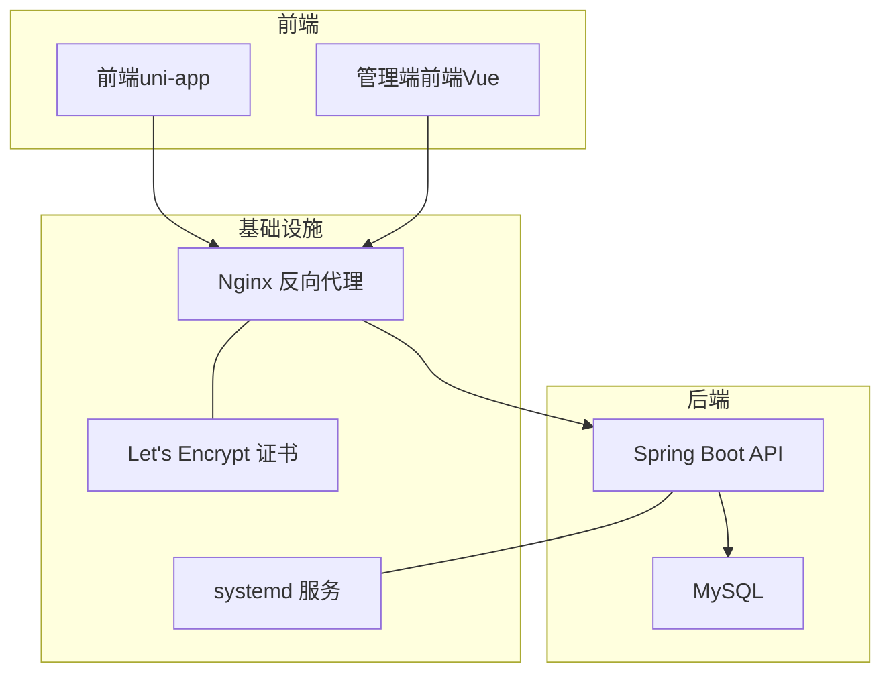
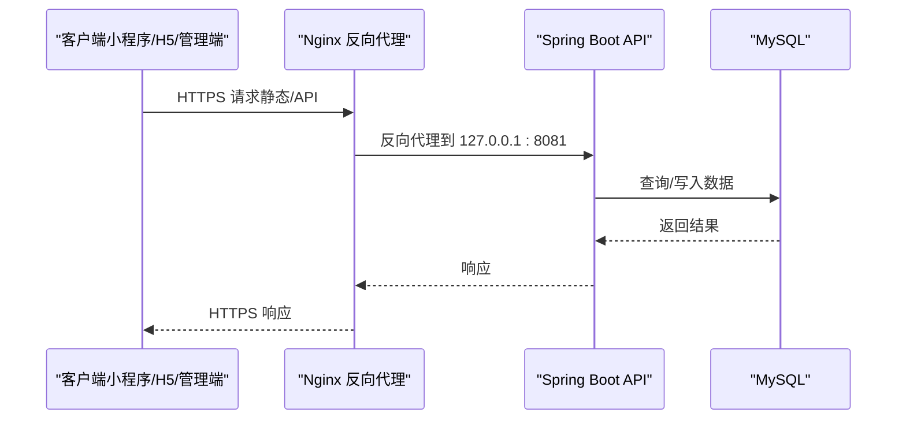
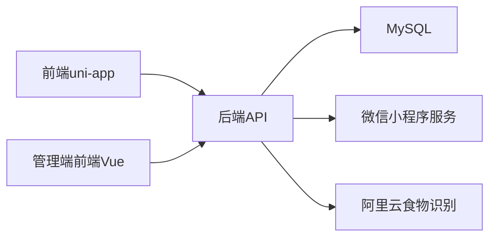

# 部署与运维

<cite>
**本文引用的文件**
- [application.yml](file://backend/src/main/resources/application.yml)
- [application-prod.yml](file://backend/src/main/resources/application-prod.yml)
- [application-local.yml](file://backend/src/main/resources/application-local.yml)
- [application-local.yml.example](file://backend/src/main/resources/application-local.yml.example)
- [pom.xml](file://backend/pom.xml)
- [vite.config.ts（前端）](file://frontend/vite.config.ts)
- [vite.config.ts（管理端前端）](file://admin-frontend/vite.config.ts)
- [package.json（前端）](file://frontend/package.json)
- [package.json（管理端前端）](file://admin-frontend/package.json)
- [admin-deploy-ecs.md](file://docs/admin-deploy-ecs.md)
- [aliyun-ecs-letsencrypt-deploy.md](file://docs/aliyun-ecs-letsencrypt-deploy.md)
- [nginx-admin.conf](file://docs/nginx-admin.conf)
- [项目-产品PRD（前端）](file://docs/final/project-current-baseline-prd.md)
- [后端-应用入口](file://backend/src/main/java/com/ypfr/loseweight/LoseweightApplication.java)
- [后端-健康检查控制器](file://backend/src/main/java/com/ypfr/loseweight/web/HealthController.java)
- [后端-管理员登录控制器](file://backend/src/main/java/com/ypfr/loseweight/web/AdminAuthController.java)
- [后端-MySQL连接配置](file://backend/src/main/resources/application.yml)
- [后端-生产环境配置](file://backend/src/main/resources/application-prod.yml)
- [后端-本地开发配置](file://backend/src/main/resources/application-local.yml)
- [后端-系统服务单元](file://docs/admin-deploy-ecs.md)
- [后端-Nginx反向代理配置](file://docs/nginx-admin.conf)
- [后端-阿里云ECS部署与HTTPS](file://docs/aliyun-ecs-letsencrypt-deploy.md)
- [后端-前端环境变量API基础地址](file://frontend/src/config/api.ts)
- [后端-前端环境声明](file://frontend/src/env.d.ts)
- [后端-前端构建产物（小程序）](file://frontend/dist/build/mp-weixin/config/api.js)
</cite>

## 目录
1. [简介](#简介)
2. [项目结构](#项目结构)
3. [核心组件](#核心组件)
4. [架构总览](#架构总览)
5. [详细组件分析](#详细组件分析)
6. [依赖关系分析](#依赖关系分析)
7. [性能考虑](#性能考虑)
8. [故障排除指南](#故障排除指南)
9. [结论](#结论)
10. [附录](#附录)

## 简介
本指南面向部署与运维工程师，提供从开发环境到生产环境的完整操作手册，涵盖本地开发服务器配置、热重载设置、生产环境部署（含Nginx反向代理、SSL证书、负载均衡）、服务监控、备份与恢复、阿里云ECS部署流程、Let's Encrypt证书申请与续期、Docker容器化部署思路、故障排除、性能调优与安全加固等。

## 项目结构
项目采用前后端分离架构：
- 后端：基于Spring Boot 3.3.5 + MyBatis-Plus，使用Maven构建，提供REST API。
- 前端：基于uni-app生态，使用Vite插件进行多端构建（含小程序）。
- 管理端前端：基于Vue 3 + Vite，独立构建与部署。
- 文档：提供阿里云ECS部署、HTTPS配置、Nginx反代等运维文档。

图表来源
- [后端-应用入口](file://backend/src/main/java/com/ypfr/loseweight/LoseweightApplication.java)
- [后端-MySQL连接配置](file://backend/src/main/resources/application.yml)
- [后端-Nginx反向代理配置](file://docs/nginx-admin.conf)
- [后端-阿里云ECS部署与HTTPS](file://docs/aliyun-ecs-letsencrypt-deploy.md)
- [后端-系统服务单元](file://docs/admin-deploy-ecs.md)

章节来源
- [后端-应用入口](file://backend/src/main/java/com/ypfr/loseweight/LoseweightApplication.java)
- [后端-MySQL连接配置](file://backend/src/main/resources/application.yml)
- [后端-Nginx反向代理配置](file://docs/nginx-admin.conf)
- [后端-阿里云ECS部署与HTTPS](file://docs/aliyun-ecs-letsencrypt-deploy.md)
- [后端-系统服务单元](file://docs/admin-deploy-ecs.md)

## 核心组件
- 后端服务
  - 运行端口与绑定：开发默认端口与地址见配置文件；生产环境端口与绑定地址见生产配置。
  - 数据源：MySQL连接参数、用户名、密码。
  - 安全：JWT密钥长度要求与过期时间。
  - 文件上传：头像与食物图片存储目录。
  - 日志：Mapper层调试日志级别。
- 前端与管理端前端
  - 构建工具：Vite + uni插件（前端）；Vite + Vue插件（管理端前端）。
  - 环境变量：API基础URL与路径前缀。
- 反向代理与证书
  - Nginx反向代理：静态资源与API代理规则。
  - Let's Encrypt：证书申请、续期与HTTPS配置。
- 系统服务
  - systemd：后端Java进程托管、自动重启、环境变量注入。

章节来源
- [application.yml](file://backend/src/main/resources/application.yml)
- [application-prod.yml](file://backend/src/main/resources/application-prod.yml)
- [application-local.yml](file://backend/src/main/resources/application-local.yml)
- [application-local.yml.example](file://backend/src/main/resources/application-local.yml.example)
- [vite.config.ts（前端）](file://frontend/vite.config.ts)
- [vite.config.ts（管理端前端）](file://admin-frontend/vite.config.ts)
- [package.json（前端）](file://frontend/package.json)
- [package.json（管理端前端）](file://admin-frontend/package.json)
- [nginx-admin.conf](file://docs/nginx-admin.conf)
- [aliyun-ecs-letsencrypt-deploy.md](file://docs/aliyun-ecs-letsencrypt-deploy.md)
- [admin-deploy-ecs.md](file://docs/admin-deploy-ecs.md)

## 架构总览
后端API通过Nginx反向代理对外提供服务，管理端前端静态资源直接由Nginx提供，小程序前端通过API域名访问后端接口。生产环境使用systemd托管后端服务，并通过Let's Encrypt提供HTTPS。

图表来源
- [后端-阿里云ECS部署与HTTPS](file://docs/aliyun-ecs-letsencrypt-deploy.md)
- [后端-Nginx反向代理配置](file://docs/nginx-admin.conf)
- [后端-MySQL连接配置](file://backend/src/main/resources/application.yml)

## 详细组件分析

### 开发环境部署（本地）
- 后端
  - 使用本地配置文件覆盖敏感信息，确保不提交至版本库。
  - 开发模式下监听所有网卡，便于移动端通过局域网IP访问。
  - 配置文件中定义了日志级别与MyBatis Plus驼峰映射。
- 前端
  - Vite配置支持合并开发与生产环境变量，确保小程序构建时API基础URL正确。
  - 通过脚本生成小程序构建产物，包含API基础URL与路径前缀。
- 管理端前端
  - Vite默认插件配置，支持开发与构建。

章节来源
- [application-local.yml](file://backend/src/main/resources/application-local.yml)
- [application-local.yml.example](file://backend/src/main/resources/application-local.yml.example)
- [application.yml](file://backend/src/main/resources/application.yml)
- [vite.config.ts（前端）](file://frontend/vite.config.ts)
- [vite.config.ts（管理端前端）](file://admin-frontend/vite.config.ts)
- [package.json（前端）](file://frontend/package.json)
- [package.json（管理端前端）](file://admin-frontend/package.json)
- [后端-前端构建产物（小程序）](file://frontend/dist/build/mp-weixin/config/api.js)

### 生产环境配置（Nginx反向代理、SSL证书、负载均衡）
- Nginx反向代理
  - 管理端静态站点与API域名分别配置，静态站点使用本地目录，API通过反代到后端端口。
  - HTTPS配置包含证书路径、HSTS头与访问/错误日志。
- SSL证书（Let's Encrypt）
  - 提供证书申请与续期命令，以及证书路径与DH参数配置建议。
- 负载均衡
  - 文档未提供具体LB实现细节，建议在Nginx前接入云厂商负载均衡或CDN，结合健康检查与自动扩缩容策略。

章节来源
- [nginx-admin.conf](file://docs/nginx-admin.conf)
- [aliyun-ecs-letsencrypt-deploy.md](file://docs/aliyun-ecs-letsencrypt-deploy.md)

### 服务监控（日志收集、性能监控、告警设置）
- 日志
  - 后端日志级别与Mapper调试日志；systemd服务可通过journalctl查看。
  - Nginx访问与错误日志路径已在HTTPS配置中明确。
- 性能监控
  - 建议结合系统指标（CPU/内存/磁盘IO）与应用指标（请求耗时/吞吐/错误率）进行监控。
- 告警
  - 建议基于日志与指标阈值设置告警，如连续异常、响应超时、磁盘空间不足等。

章节来源
- [application.yml](file://backend/src/main/resources/application.yml)
- [aliyun-ecs-letsencrypt-deploy.md](file://docs/aliyun-ecs-letsencrypt-deploy.md)

### 备份与恢复（数据库、文件、灾难恢复）
- 数据库备份
  - 建议定期执行逻辑备份与物理备份，结合binlog归档与增量备份策略。
- 文件备份
  - 上传目录（头像、食物图片）纳入统一备份策略。
- 灾难恢复
  - 建立恢复演练流程，验证备份可用性与恢复时间目标。

章节来源
- [application-prod.yml](file://backend/src/main/resources/application-prod.yml)

### 阿里云ECS部署流程
- 系统初始化：安装OpenJDK 17、Nginx、MySQL，配置时区与防火墙。
- 数据库准备：创建业务库与账号，绑定到本地访问。
- 后端部署：构建JAR包，配置systemd服务单元，注入环境变量。
- 前端部署：构建管理端前端，上传至静态目录。
- Nginx配置：参考文档中的HTTPS配置，启用证书与反代。
- 验证清单：包括DNS、安全组、证书、静态站点、API存活、跨域、日志等。

章节来源
- [aliyun-ecs-letsencrypt-deploy.md](file://docs/aliyun-ecs-letsencrypt-deploy.md)
- [admin-deploy-ecs.md](file://docs/admin-deploy-ecs.md)

### Docker容器化部署方案
- 建议
  - 使用多阶段构建减少镜像体积；将JAR包与静态资源分别放入镜像。
  - 通过环境变量注入数据库凭据与JWT密钥；挂载上传目录与日志目录。
  - 使用反向代理容器（如Nginx）承载HTTPS与静态资源，后端容器提供API。
  - 结合编排工具（如Compose/Swarm/Kubernetes）实现高可用与滚动更新。

章节来源
- [pom.xml](file://backend/pom.xml)
- [application-prod.yml](file://backend/src/main/resources/application-prod.yml)
- [nginx-admin.conf](file://docs/nginx-admin.conf)

### Let's Encrypt证书申请与续期
- 申请
  - 使用Certbot webroot或nginx插件申请证书，确保80端口可从公网访问。
- 续期
  - 检查systemd定时任务或crontab，执行dry-run验证。
- 配置
  - 证书路径与DH参数配置建议，确保安全套件与性能。

章节来源
- [aliyun-ecs-letsencrypt-deploy.md](file://docs/aliyun-ecs-letsencrypt-deploy.md)

### 前端环境变量与API基础地址
- 前端
  - 通过Vite定义全局环境变量，确保小程序构建时API基础URL与路径前缀正确。
- 管理端前端
  - 通过Vite插件构建，支持开发与生产模式。

章节来源
- [vite.config.ts（前端）](file://frontend/vite.config.ts)
- [vite.config.ts（管理端前端）](file://admin-frontend/vite.config.ts)
- [后端-前端环境变量API基础地址](file://frontend/src/config/api.ts)
- [后端-前端环境声明](file://frontend/src/env.d.ts)
- [项目-产品PRD（前端）](file://docs/final/project-current-baseline-prd.md)

## 依赖关系分析
后端服务依赖MySQL与外部服务（微信小程序、阿里云食物识别），前端与管理端前端通过API域名访问后端。

图表来源
- [后端-MySQL连接配置](file://backend/src/main/resources/application.yml)
- [application.yml](file://backend/src/main/resources/application.yml)

章节来源
- [后端-MySQL连接配置](file://backend/src/main/resources/application.yml)
- [application.yml](file://backend/src/main/resources/application.yml)

## 性能考虑
- 连接池与数据库
  - 合理设置连接数与超时，避免慢查询与锁等待。
- 缓存
  - 对热点数据与接口增加缓存层，降低数据库压力。
- 上传与存储
  - 图片压缩与CDN加速，控制上传大小与并发。
- 反向代理
  - 启用gzip/HTTP/2，合理设置超时与缓冲区大小。
- JVM与系统
  - 根据实例规格调整堆大小与GC策略，开启必要的JVM监控。

## 故障排除指南
- 后端无法启动
  - 检查systemd状态与日志，确认数据库连接参数与JWT密钥是否正确。
- API访问异常
  - 检查Nginx反代配置与证书状态，确认健康检查接口可用。
- 前端无法加载
  - 确认API基础URL与路径前缀在构建时已注入，静态站点路由配置正确。
- 证书问题
  - 使用certbot检查证书状态与续期计划，核对证书路径与权限。

章节来源
- [admin-deploy-ecs.md](file://docs/admin-deploy-ecs.md)
- [aliyun-ecs-letsencrypt-deploy.md](file://docs/aliyun-ecs-letsencrypt-deploy.md)
- [nginx-admin.conf](file://docs/nginx-admin.conf)
- [后端-健康检查控制器](file://backend/src/main/java/com/ypfr/loseweight/web/HealthController.java)

## 结论
本指南提供了从开发到生产的完整部署与运维实践，结合阿里云ECS与Let's Encrypt，给出可落地的实施步骤与最佳实践。建议在生产环境中持续完善监控、备份与安全加固，确保系统的稳定性与安全性。

## 附录
- 关键配置要点
  - 后端：端口、地址、数据库连接、JWT密钥、日志级别。
  - 前端：API基础URL与路径前缀、构建脚本。
  - Nginx：静态站点与API反代、HTTPS与证书、访问/错误日志。
  - systemd：Java进程托管、自动重启、环境变量注入。

章节来源
- [application-prod.yml](file://backend/src/main/resources/application-prod.yml)
- [vite.config.ts（前端）](file://frontend/vite.config.ts)
- [nginx-admin.conf](file://docs/nginx-admin.conf)
- [admin-deploy-ecs.md](file://docs/admin-deploy-ecs.md)