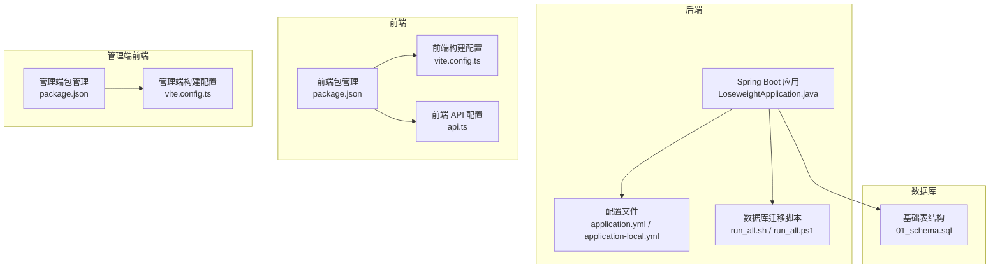
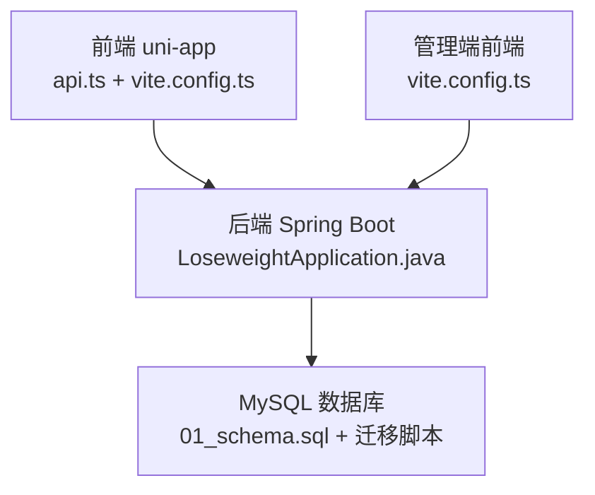
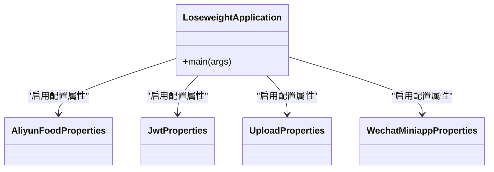
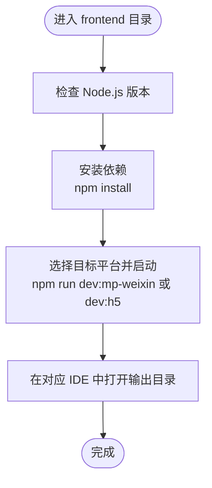
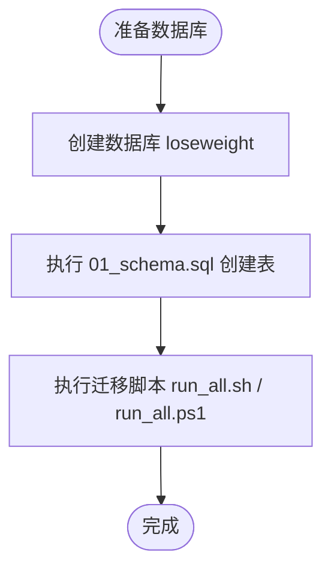
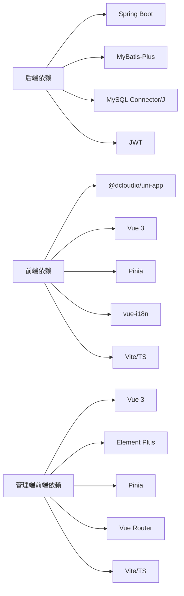

# 快速开始指南

<cite>
**本文引用的文件**
- [pom.xml](file://backend/pom.xml)
- [application.yml](file://backend/src/main/resources/application.yml)
- [application-local.yml.example](file://backend/src/main/resources/application-local.yml.example)
- [LoseweightApplication.java](file://backend/src/main/java/com/ypfr/loseweight/LoseweightApplication.java)
- [run_all.sh](file://database/migrations/run_all.sh)
- [run_all.ps1](file://database/migrations/run_all.ps1)
- [01_schema.sql](file://database/01_schema.sql)
- [package.json (前端)](file://frontend/package.json)
- [vite.config.ts (前端)](file://frontend/vite.config.ts)
- [api.ts (前端配置)](file://frontend/src/config/api.ts)
- [package.json (管理端前端)](file://admin-frontend/package.json)
- [vite.config.ts (管理端前端)](file://admin-frontend/vite.config.ts)
- [init-project.js](file://scripts/init-project.js)
</cite>

## 目录
1. [简介](#简介)
2. [项目结构](#项目结构)
3. [核心组件](#核心组件)
4. [架构总览](#架构总览)
5. [详细组件分析](#详细组件分析)
6. [依赖关系分析](#依赖关系分析)
7. [性能注意事项](#性能注意事项)
8. [故障排除指南](#故障排除指南)
9. [结论](#结论)
10. [附录](#附录)

## 简介
本指南面向希望从零开始搭建“减肥管理”项目的开发者，提供完整的环境准备、依赖安装、项目克隆、配置文件设置、数据库初始化、后端与前端启动流程，以及常见问题的解决方案。项目采用 Spring Boot（后端）、MySQL（数据库）、Vue 3 + Vite（前端）与管理端 Vue 3（管理端前端）的技术栈组合。

## 项目结构
项目分为四个主要部分：
- 后端 Spring Boot 应用：位于 backend 目录，使用 Maven 构建，配置文件位于 resources 下。
- 前端 uni-app 应用：位于 frontend 目录，使用 Vite + Vue 3，支持多端构建（微信小程序、H5 等）。
- 管理端前端：位于 admin-frontend 目录，基于 Vue 3 + Vite + Element Plus。
- 数据库脚本与迁移：位于 database 目录，包含基础表结构与版本化迁移脚本。

图表来源
- [LoseweightApplication.java:1-26](file://backend/src/main/java/com/ypfr/loseweight/LoseweightApplication.java#L1-L26)
- [application.yml:1-54](file://backend/src/main/resources/application.yml#L1-L54)
- [run_all.sh:1-26](file://database/migrations/run_all.sh#L1-L26)
- [01_schema.sql:1-159](file://database/01_schema.sql#L1-L159)
- [package.json (前端):1-78](file://frontend/package.json#L1-L78)
- [vite.config.ts (前端):1-23](file://frontend/vite.config.ts#L1-L23)
- [api.ts (前端配置):1-42](file://frontend/src/config/api.ts#L1-L42)
- [package.json (管理端前端):1-27](file://admin-frontend/package.json#L1-L27)
- [vite.config.ts (管理端前端):1-8](file://admin-frontend/vite.config.ts#L1-L8)

章节来源
- [pom.xml:1-86](file://backend/pom.xml#L1-L86)
- [application.yml:1-54](file://backend/src/main/resources/application.yml#L1-L54)
- [application-local.yml.example:1-27](file://backend/src/main/resources/application-local.yml.example#L1-L27)
- [run_all.sh:1-26](file://database/migrations/run_all.sh#L1-L26)
- [run_all.ps1:1-34](file://database/migrations/run_all.ps1#L1-L34)
- [01_schema.sql:1-159](file://database/01_schema.sql#L1-L159)
- [package.json (前端):1-78](file://frontend/package.json#L1-L78)
- [vite.config.ts (前端):1-23](file://frontend/vite.config.ts#L1-L23)
- [api.ts (前端配置):1-42](file://frontend/src/config/api.ts#L1-L42)
- [package.json (管理端前端):1-27](file://admin-frontend/package.json#L1-L27)
- [vite.config.ts (管理端前端):1-8](file://admin-frontend/vite.config.ts#L1-L8)

## 核心组件
- 后端 Spring Boot 应用：负责业务逻辑、数据访问与对外 API 提供。主入口类启用 MyBatis-Plus Mapper 扫描与配置属性类。
- 前端 uni-app：统一多端开发体验，支持微信小程序、H5 等，通过 Vite 构建，API 地址与路径前缀可通过环境变量配置。
- 管理端前端：基于 Vue 3 + Element Plus，用于后台管理功能。
- 数据库：提供基础表结构与版本化迁移脚本，支持 Linux/macOS 与 Windows 的执行脚本。

章节来源
- [LoseweightApplication.java:1-26](file://backend/src/main/java/com/ypfr/loseweight/LoseweightApplication.java#L1-L26)
- [application.yml:1-54](file://backend/src/main/resources/application.yml#L1-L54)
- [application-local.yml.example:1-27](file://backend/src/main/resources/application-local.yml.example#L1-L27)
- [package.json (前端):1-78](file://frontend/package.json#L1-L78)
- [vite.config.ts (前端):1-23](file://frontend/vite.config.ts#L1-L23)
- [api.ts (前端配置):1-42](file://frontend/src/config/api.ts#L1-L42)
- [package.json (管理端前端):1-27](file://admin-frontend/package.json#L1-L27)
- [vite.config.ts (管理端前端):1-8](file://admin-frontend/vite.config.ts#L1-L8)
- [01_schema.sql:1-159](file://database/01_schema.sql#L1-L159)
- [run_all.sh:1-26](file://database/migrations/run_all.sh#L1-L26)
- [run_all.ps1:1-34](file://database/migrations/run_all.ps1#L1-L34)

## 架构总览
后端通过 Spring Boot 提供 REST 接口，前端通过配置的 API 基础地址与路径前缀进行请求；数据库通过迁移脚本初始化表结构与种子数据；管理端前端独立运行，用于后台管理。

图表来源
- [LoseweightApplication.java:1-26](file://backend/src/main/java/com/ypfr/loseweight/LoseweightApplication.java#L1-L26)
- [api.ts (前端配置):1-42](file://frontend/src/config/api.ts#L1-L42)
- [vite.config.ts (前端):1-23](file://frontend/vite.config.ts#L1-L23)
- [vite.config.ts (管理端前端):1-8](file://admin-frontend/vite.config.ts#L1-L8)
- [01_schema.sql:1-159](file://database/01_schema.sql#L1-L159)

## 详细组件分析

### 后端 Spring Boot 应用
- 启动类：启用 @SpringBootApplication、Mapper 扫描与配置属性类注册。
- 配置文件：
  - application.yml：定义数据源、服务器端口、MyBatis-Plus、微信小程序与阿里云相关配置、JWT 密钥占位与上传目录等。
  - application-local.yml.example：示例本地覆盖文件，包含数据库连接、微信 AppSecret、阿里云 AppCode 与 JWT 密钥等敏感项占位。
- 依赖与构建：
  - Java 版本要求：17+
  - 使用 Spring Boot 3.x 与 MyBatis-Plus 3.x，集成 MySQL Connector/J 与 JWT 依赖。
  - Maven 插件：spring-boot-maven-plugin。

图表来源
- [LoseweightApplication.java:1-26](file://backend/src/main/java/com/ypfr/loseweight/LoseweightApplication.java#L1-L26)

章节来源
- [LoseweightApplication.java:1-26](file://backend/src/main/java/com/ypfr/loseweight/LoseweightApplication.java#L1-L26)
- [application.yml:1-54](file://backend/src/main/resources/application.yml#L1-L54)
- [application-local.yml.example:1-27](file://backend/src/main/resources/application-local.yml.example#L1-L27)
- [pom.xml:1-86](file://backend/pom.xml#L1-L86)

### 前端 uni-app
- 包管理：定义多端开发脚本（如 dev:mp-weixin、dev:h5 等），引擎要求 Node >= 20.12.2。
- 构建配置：vite.config.ts 支持通过环境变量注入 API 基础地址与路径前缀。
- API 配置：api.ts 提供 API 基础地址、路径前缀拼接方法与本地存储键名，支持微信小程序真机调试时替换为本机局域网 IP。

图表来源
- [package.json (前端):1-78](file://frontend/package.json#L1-L78)
- [vite.config.ts (前端):1-23](file://frontend/vite.config.ts#L1-L23)
- [api.ts (前端配置):1-42](file://frontend/src/config/api.ts#L1-L42)

章节来源
- [package.json (前端):1-78](file://frontend/package.json#L1-L78)
- [vite.config.ts (前端):1-23](file://frontend/vite.config.ts#L1-L23)
- [api.ts (前端配置):1-42](file://frontend/src/config/api.ts#L1-L42)

### 管理端前端
- 包管理：定义 dev/build/preview 脚本，依赖 Vue 3、Element Plus、Pinia、Vue Router。
- 构建配置：vite.config.ts 基于 @vitejs/plugin-vue。

章节来源
- [package.json (管理端前端):1-27](file://admin-frontend/package.json#L1-L27)
- [vite.config.ts (管理端前端):1-8](file://admin-frontend/vite.config.ts#L1-L8)

### 数据库初始化与迁移
- 基础表结构：01_schema.sql 创建数据库与核心表（用户、饮食、运动、体重、食物库、运动库、识别日志、日汇总、微信登录日志等）。
- 迁移脚本：
  - run_all.sh（Linux/macOS）：按文件名顺序执行 V001～V013，跳过 V014，支持通过环境变量或参数传入用户名、主机、端口与库名。
  - run_all.ps1（Windows）：同上，支持 PowerShell 参数传参，依赖系统 PATH 中的 mysql 客户端。

图表来源
- [01_schema.sql:1-159](file://database/01_schema.sql#L1-L159)
- [run_all.sh:1-26](file://database/migrations/run_all.sh#L1-L26)
- [run_all.ps1:1-34](file://database/migrations/run_all.ps1#L1-L34)

章节来源
- [01_schema.sql:1-159](file://database/01_schema.sql#L1-L159)
- [run_all.sh:1-26](file://database/migrations/run_all.sh#L1-L26)
- [run_all.ps1:1-34](file://database/migrations/run_all.ps1#L1-L34)

## 依赖关系分析
- 后端依赖：Spring Boot Web、Validation、Security Crypto、MyBatis-Plus、MySQL Connector/J、JWT。
- 前端依赖：@dcloudio/uni-app 生态、Vue 3、Pinia、vue-i18n、Vite、TypeScript。
- 管理端前端依赖：Vue 3、Element Plus、Pinia、Vue Router、Vite、TypeScript。

图表来源
- [pom.xml:1-86](file://backend/pom.xml#L1-L86)
- [package.json (前端):1-78](file://frontend/package.json#L1-L78)
- [package.json (管理端前端):1-27](file://admin-frontend/package.json#L1-L27)

章节来源
- [pom.xml:1-86](file://backend/pom.xml#L1-L86)
- [package.json (前端):1-78](file://frontend/package.json#L1-L78)
- [package.json (管理端前端):1-27](file://admin-frontend/package.json#L1-L27)

## 性能注意事项
- 后端服务器配置：最大表单大小与 Tomcat 最大吞吐尺寸已在配置中设定，建议根据实际图片上传与数据规模调整。
- 前端构建：多端构建时注意资源体积与网络请求次数，合理拆分模块与懒加载。
- 数据库：迁移脚本按顺序执行，避免并发写入；生产环境建议开启索引与分区策略以提升查询性能。

## 故障排除指南
- 后端无法连接数据库
  - 检查 application.yml 中的数据源 URL、用户名与密码是否正确。
  - 确认 MySQL 服务已启动且网络可达。
  - 如需本地覆盖，请复制 application-local.yml.example 并填写真实值。
- 前端无法访问后端接口
  - 确认后端已启动并监听 0.0.0.0，前端 api.ts 中的 API 基础地址指向后端实际地址。
  - 若为微信小程序真机调试，需将后端地址改为本机局域网 IP，并在开发工具中关闭“不校验合法域名”。
- 数据库迁移失败
  - Linux/macOS：确认 run_all.sh 可执行权限与 mysql 客户端可用；必要时设置 MYSQL_PWD 环境变量。
  - Windows：确认 PowerShell 参数传入正确；确保 mysql 客户端在 PATH 中。
- 前端依赖安装失败
  - 确保 Node.js 版本满足要求（>= 20.12.2）。
  - 清理缓存后重试：npm install --no-cache。
- 管理端前端启动异常
  - 确认依赖安装完成，使用 npm run dev 启动开发服务器。

章节来源
- [application.yml:1-54](file://backend/src/main/resources/application.yml#L1-L54)
- [application-local.yml.example:1-27](file://backend/src/main/resources/application-local.yml.example#L1-L27)
- [api.ts (前端配置):1-42](file://frontend/src/config/api.ts#L1-L42)
- [run_all.sh:1-26](file://database/migrations/run_all.sh#L1-L26)
- [run_all.ps1:1-34](file://database/migrations/run_all.ps1#L1-L34)
- [package.json (前端):1-78](file://frontend/package.json#L1-L78)
- [package.json (管理端前端):1-27](file://admin-frontend/package.json#L1-L27)

## 结论
按照本指南逐步完成环境准备、依赖安装、数据库初始化与前后端启动，您将能够在本地快速搭建起可运行的开发环境。遇到问题时，可依据故障排除指南定位并解决常见问题。

## 附录

### 环境要求清单
- 后端
  - Java：17+
  - Maven：用于构建 Spring Boot 应用
- 前端
  - Node.js：>= 20.12.2
  - npm：包管理器
- 数据库
  - MySQL：8.0+（迁移脚本与基础表结构均针对 MySQL 8.0+）

章节来源
- [pom.xml:1-86](file://backend/pom.xml#L1-L86)
- [package.json (前端):1-78](file://frontend/package.json#L1-L78)
- [01_schema.sql:1-159](file://database/01_schema.sql#L1-L159)

### 快速开始步骤
- 克隆仓库后，先初始化数据库：
  - 执行 01_schema.sql 创建数据库与表。
  - 执行 run_all.sh（Linux/macOS）或 run_all.ps1（Windows）完成迁移。
- 配置后端：
  - 复制 application-local.yml.example 为 application-local.yml，并填写数据库密码、微信 AppSecret、阿里云 AppCode 与 JWT 密钥。
- 启动后端：
  - 在 backend 目录使用 Maven 启动 Spring Boot 应用。
- 启动前端：
  - 在 frontend 目录安装依赖并选择目标平台启动（如 dev:mp-weixin 或 dev:h5）。
- 启动管理端前端：
  - 在 admin-frontend 目录安装依赖并运行开发服务器。

章节来源
- [01_schema.sql:1-159](file://database/01_schema.sql#L1-L159)
- [run_all.sh:1-26](file://database/migrations/run_all.sh#L1-L26)
- [run_all.ps1:1-34](file://database/migrations/run_all.ps1#L1-L34)
- [application-local.yml.example:1-27](file://backend/src/main/resources/application-local.yml.example#L1-L27)
- [package.json (前端):1-78](file://frontend/package.json#L1-L78)
- [package.json (管理端前端):1-27](file://admin-frontend/package.json#L1-L27)