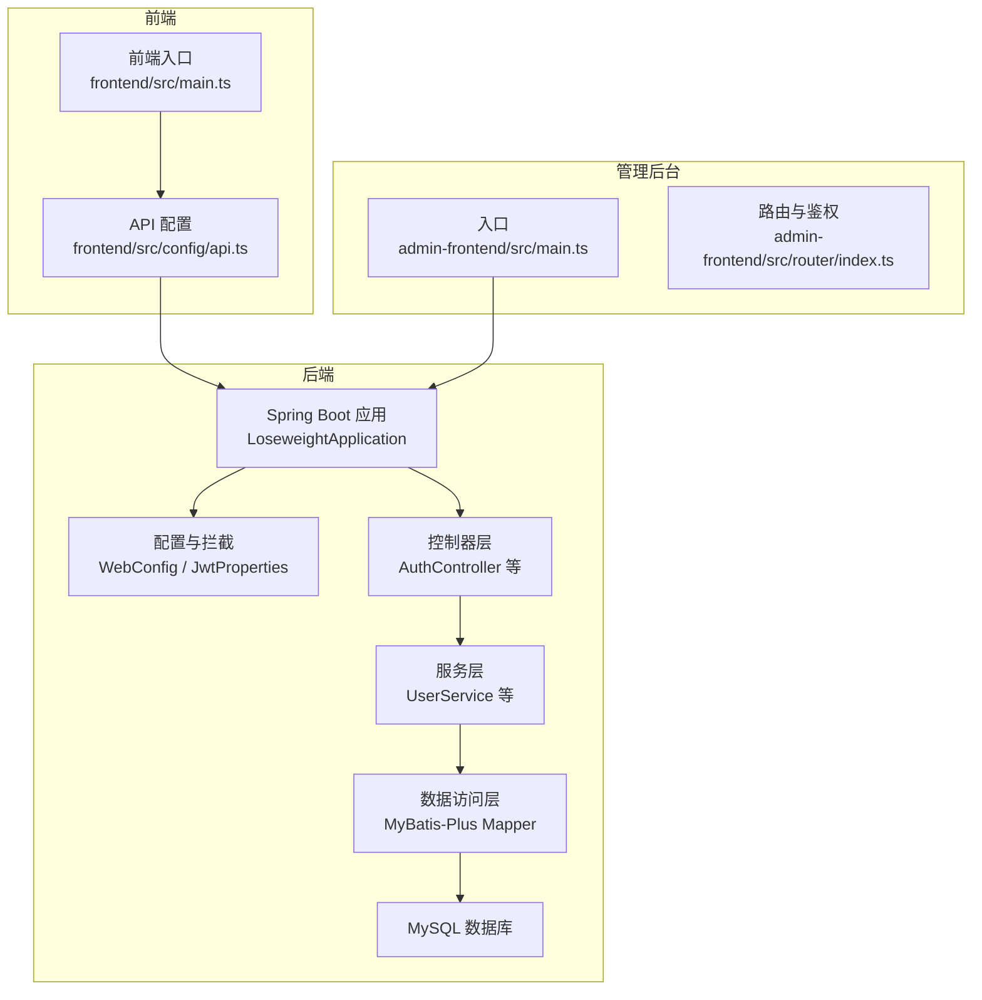
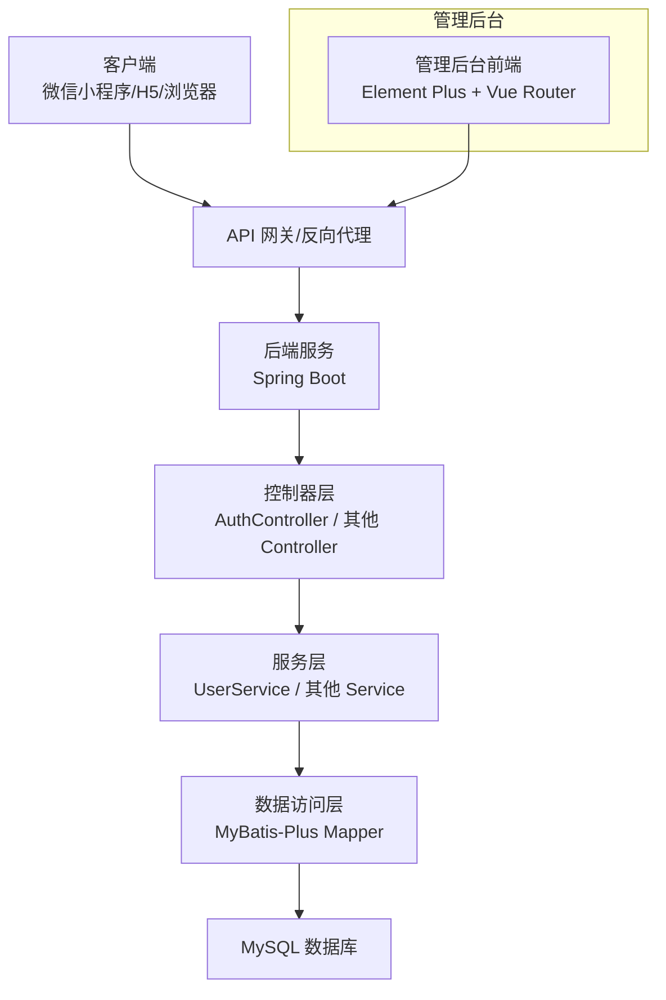
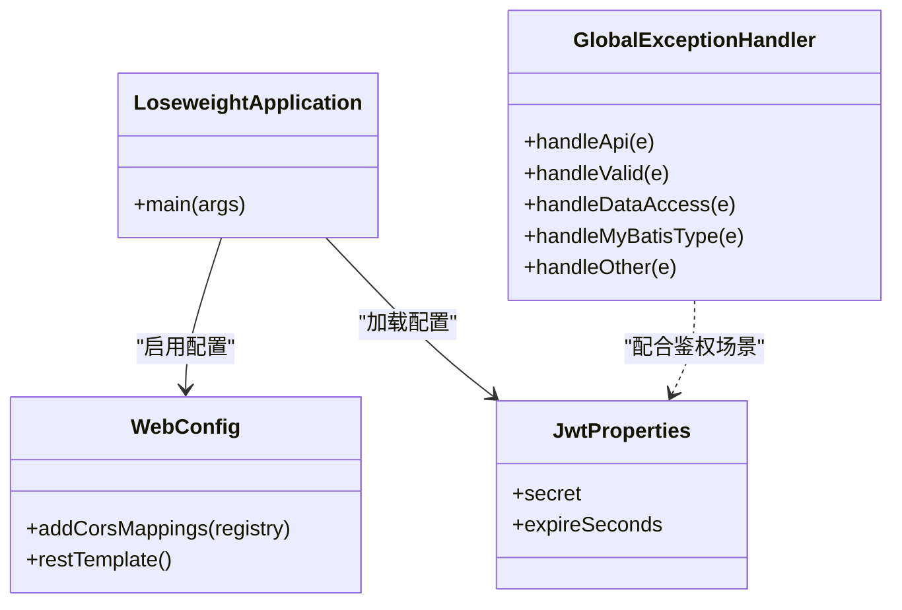
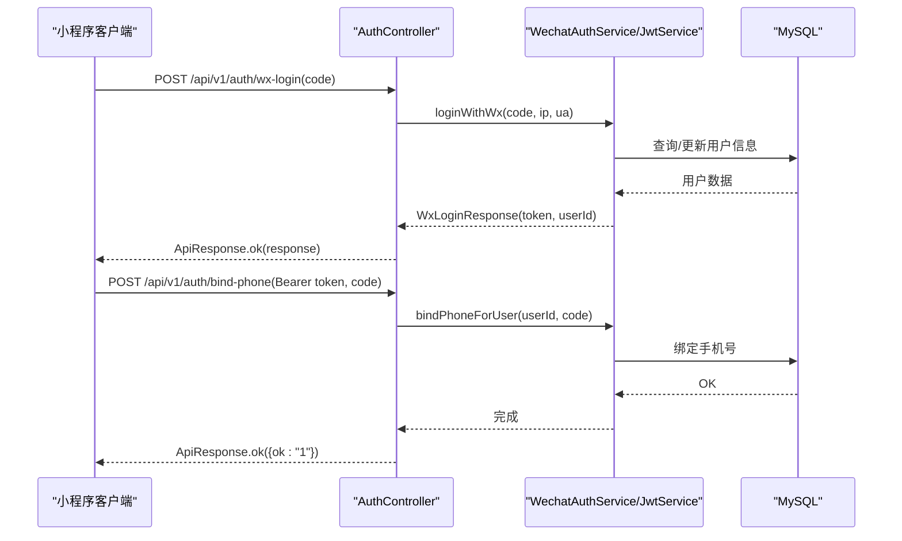
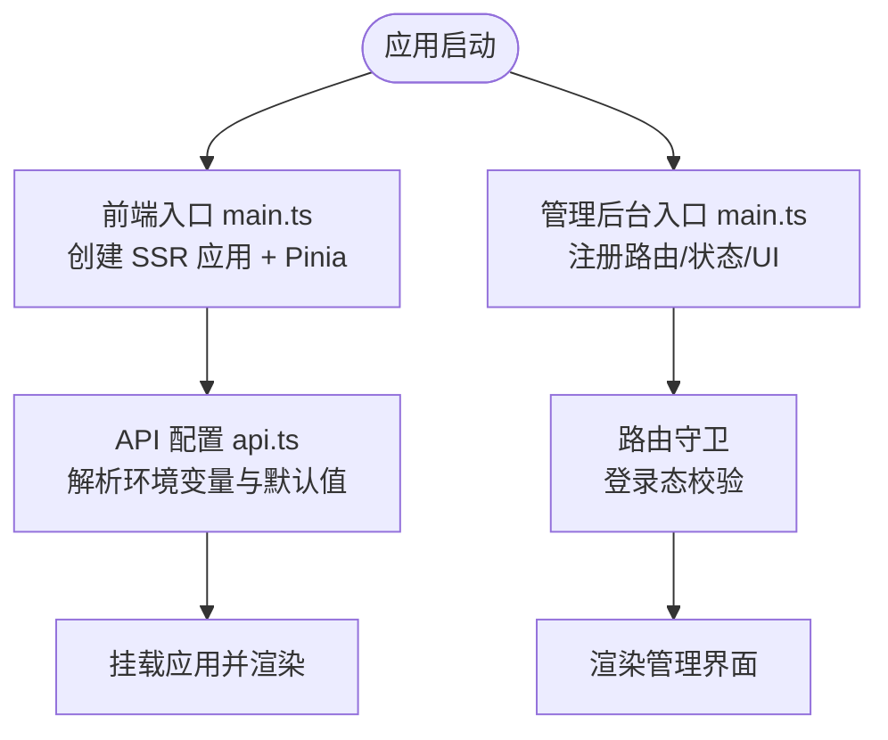
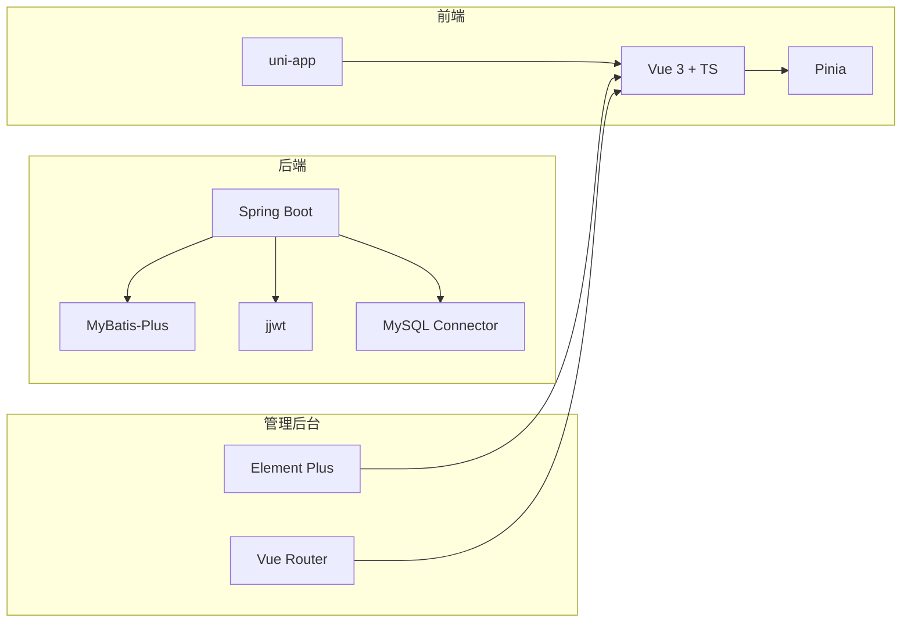

# 技术架构概览

<cite>
**本文档引用的文件**
- [LoseweightApplication.java](file://backend/src/main/java/com/ypfr/loseweight/LoseweightApplication.java)
- [pom.xml](file://backend/pom.xml)
- [application.yml](file://backend/src/main/resources/application.yml)
- [WebConfig.java](file://backend/src/main/java/com/ypfr/loseweight/config/WebConfig.java)
- [GlobalExceptionHandler.java](file://backend/src/main/java/com/ypfr/loseweight/common/GlobalExceptionHandler.java)
- [JwtProperties.java](file://backend/src/main/java/com/ypfr/loseweight/config/JwtProperties.java)
- [AuthController.java](file://backend/src/main/java/com/ypfr/loseweight/web/AuthController.java)
- [UserService.java](file://backend/src/main/java/com/ypfr/loseweight/service/UserService.java)
- [package.json（后端）](file://backend/package.json)
- [package.json（前端）](file://frontend/package.json)
- [package.json（管理后台）](file://admin-frontend/package.json)
- [main.ts（前端）](file://frontend/src/main.ts)
- [main.ts（管理后台）](file://admin-frontend/src/main.ts)
- [api.ts（前端配置）](file://frontend/src/config/api.ts)
- [index.ts（管理后台路由）](file://admin-frontend/src/router/index.ts)
- [01_schema.sql](file://database/01_schema.sql)
</cite>

## 目录
1. [简介](#简介)
2. [项目结构](#项目结构)
3. [核心组件](#核心组件)
4. [架构总览](#架构总览)
5. [详细组件分析](#详细组件分析)
6. [依赖分析](#依赖分析)
7. [性能考虑](#性能考虑)
8. [故障排除指南](#故障排除指南)
9. [结论](#结论)

## 简介
本项目是一个面向减肥管理的全栈应用，采用前后端分离架构，支持多平台部署（微信小程序、H5、管理后台），并提供统一的后端服务与数据库设计。后端基于 Spring Boot 3.3.5 + Java 17 + MyBatis-Plus，前端采用 Vue 3 + uni-app + TypeScript 的现代化技术栈，数据库使用 MySQL 8.0+ 的关系型设计。本文档旨在帮助开发者快速理解技术选型与架构决策，并提供系统架构图与组件关系图。

## 项目结构
项目采用多模块组织方式：
- backend：Spring Boot 后端工程，包含启动类、配置、领域模型、Mapper、Service、Controller 与资源文件
- frontend：基于 uni-app 的多端前端工程，支持 H5 与微信小程序等多平台构建
- admin-frontend：基于 Vue 3 + Element Plus 的管理后台前端
- database：数据库初始化与迁移脚本，包含建表、种子数据与版本化迁移
- docs、tools、scripts 等：辅助文档、工具与脚本

图表来源
- [LoseweightApplication.java:12-25](file://backend/src/main/java/com/ypfr/loseweight/LoseweightApplication.java#L12-L25)
- [WebConfig.java:11-30](file://backend/src/main/java/com/ypfr/loseweight/config/WebConfig.java#L11-L30)
- [AuthController.java:20-55](file://backend/src/main/java/com/ypfr/loseweight/web/AuthController.java#L20-L55)
- [UserService.java:25-54](file://backend/src/main/java/com/ypfr/loseweight/service/UserService.java#L25-L54)
- [main.ts（前端）:1-12](file://frontend/src/main.ts#L1-L12)
- [api.ts（前端配置）:1-42](file://frontend/src/config/api.ts#L1-L42)
- [main.ts（管理后台）:1-14](file://admin-frontend/src/main.ts#L1-L14)
- [index.ts（管理后台路由）:1-46](file://admin-frontend/src/router/index.ts#L1-L46)

章节来源
- [LoseweightApplication.java:12-25](file://backend/src/main/java/com/ypfr/loseweight/LoseweightApplication.java#L12-L25)
- [pom.xml:20-23](file://backend/pom.xml#L20-L23)
- [application.yml:1-54](file://backend/src/main/resources/application.yml#L1-L54)
- [WebConfig.java:11-30](file://backend/src/main/java/com/ypfr/loseweight/config/WebConfig.java#L11-L30)
- [main.ts（前端）:1-12](file://frontend/src/main.ts#L1-L12)
- [main.ts（管理后台）:1-14](file://admin-frontend/src/main.ts#L1-L14)

## 核心组件
- 后端框架与依赖
  - Spring Boot 3.3.5：提供自动配置、Web MVC、安全与测试支持
  - Java 17：长期支持版本，具备良好性能与安全性
  - MyBatis-Plus 3.5.9：简化数据库操作，提供通用 CRUD 与分页能力
  - MySQL Connector/J：连接 MySQL 8.0+
  - JWT（jjwt）：用于用户认证与令牌签发
- 前端框架与依赖
  - Vue 3 + TypeScript：现代化前端开发体验
  - uni-app：一套代码多端运行（H5、微信小程序等）
  - Pinia：状态管理
  - Element Plus（管理后台）：UI 组件库
- 数据库
  - MySQL 8.0+：关系型数据库，支持 utf8mb4 字符集与事务
  - 初始化脚本与迁移：包含用户、饮食、运动、体重、日汇总等核心表

章节来源
- [pom.xml:20-75](file://backend/pom.xml#L20-L75)
- [package.json（前端）:42-77](file://frontend/package.json#L42-L77)
- [package.json（管理后台）:11-26](file://admin-frontend/package.json#L11-L26)
- [01_schema.sql:1-159](file://database/01_schema.sql#L1-L159)

## 架构总览
系统采用典型的三层架构：表现层（前端与管理后台）、业务层（后端服务）、数据层（数据库）。后端通过 REST 接口对外提供能力，前端通过统一的 API 前缀与后端交互，管理后台通过独立路由与鉴权控制访问。

图表来源
- [AuthController.java:20-55](file://backend/src/main/java/com/ypfr/loseweight/web/AuthController.java#L20-L55)
- [UserService.java:25-54](file://backend/src/main/java/com/ypfr/loseweight/service/UserService.java#L25-L54)
- [01_schema.sql:10-159](file://database/01_schema.sql#L10-L159)

## 详细组件分析

### 后端启动与配置
- 启动类
  - 扫描 Mapper 包、启用配置属性类，作为 Spring Boot 应用入口
- Web 配置
  - CORS 放通 /api/**，允许跨域访问
  - 提供 RestTemplate Bean，设置连接与读取超时
- 全局异常处理
  - 统一处理业务异常、参数校验异常、数据库访问异常与 MyBatis 类型映射异常
  - 输出友好提示并记录日志，便于定位问题
- JWT 配置
  - 从 application.yml 读取密钥与过期时间，确保密钥长度符合要求
- 数据源与 MyBatis-Plus
  - 数据源指向本地 MySQL，MyBatis-Plus 开启下划线转驼峰与日志实现

图表来源
- [LoseweightApplication.java:12-19](file://backend/src/main/java/com/ypfr/loseweight/LoseweightApplication.java#L12-L19)
- [WebConfig.java:11-30](file://backend/src/main/java/com/ypfr/loseweight/config/WebConfig.java#L11-L30)
- [GlobalExceptionHandler.java:14-106](file://backend/src/main/java/com/ypfr/loseweight/common/GlobalExceptionHandler.java#L14-L106)
- [JwtProperties.java:5-28](file://backend/src/main/java/com/ypfr/loseweight/config/JwtProperties.java#L5-L28)

章节来源
- [LoseweightApplication.java:12-25](file://backend/src/main/java/com/ypfr/loseweight/LoseweightApplication.java#L12-L25)
- [WebConfig.java:11-30](file://backend/src/main/java/com/ypfr/loseweight/config/WebConfig.java#L11-L30)
- [GlobalExceptionHandler.java:14-106](file://backend/src/main/java/com/ypfr/loseweight/common/GlobalExceptionHandler.java#L14-L106)
- [JwtProperties.java:5-28](file://backend/src/main/java/com/ypfr/loseweight/config/JwtProperties.java#L5-L28)
- [application.yml:1-54](file://backend/src/main/resources/application.yml#L1-L54)

### 登录与认证流程
- 接口定义
  - /api/v1/auth/wx-login：接收微信登录 code，绑定 openid 并签发 JWT
  - /api/v1/auth/bind-phone：绑定手机号，依赖 Bearer Token
- 控制器职责
  - 校验请求参数，获取客户端 IP 与 UA，调用服务层完成登录与绑定
- 服务层要点
  - 解析 JWT 获取用户 ID，调用微信服务完成手机号绑定
  - 更新用户资料与预算配置，计算 BMI 与目标达成度

图表来源
- [AuthController.java:20-55](file://backend/src/main/java/com/ypfr/loseweight/web/AuthController.java#L20-L55)
- [UserService.java:75-164](file://backend/src/main/java/com/ypfr/loseweight/service/UserService.java#L75-L164)

章节来源
- [AuthController.java:20-55](file://backend/src/main/java/com/ypfr/loseweight/web/AuthController.java#L20-L55)
- [UserService.java:75-164](file://backend/src/main/java/com/ypfr/loseweight/service/UserService.java#L75-L164)

### 前端与管理后台集成
- 前端入口
  - 创建 SSR 应用实例，注册 Pinia，暴露 createApp 工厂函数
  - 通过 API 配置文件集中管理后端地址、路径前缀与存储键
- 管理后台入口
  - 注册 Pinia、路由与 Element Plus，实现登录态守卫与页面标题元信息
- 多端支持
  - 前端 package.json 提供多种平台构建脚本（H5、微信小程序、支付宝小程序等）

图表来源
- [main.ts（前端）:1-12](file://frontend/src/main.ts#L1-L12)
- [api.ts（前端配置）:1-42](file://frontend/src/config/api.ts#L1-L42)
- [main.ts（管理后台）:1-14](file://admin-frontend/src/main.ts#L1-L14)
- [index.ts（管理后台路由）:11-46](file://admin-frontend/src/router/index.ts#L11-L46)

章节来源
- [main.ts（前端）:1-12](file://frontend/src/main.ts#L1-L12)
- [api.ts（前端配置）:1-42](file://frontend/src/config/api.ts#L1-L42)
- [main.ts（管理后台）:1-14](file://admin-frontend/src/main.ts#L1-L14)
- [index.ts（管理后台路由）:11-46](file://admin-frontend/src/router/index.ts#L11-L46)

### 数据模型与关系
核心实体围绕用户、饮食、运动、体重与日汇总展开，采用外键约束与唯一索引保障一致性。

```mermaid
erDiagram
APP_USER {
bigint id PK
varchar openid UK
varchar union_id
varchar nickname
varchar avatar_url
varchar phone
tinyint profile_completed
tinyint gender
int age
decimal height_cm
decimal current_weight_kg
decimal target_weight_kg
date target_date
int bmr
int tdee
int daily_calorie_goal
tinyint activity_level
datetime created_at
datetime updated_at
}
MEAL_RECORD {
bigint id PK
bigint user_id FK
varchar meal_type
varchar food_name
int calories
decimal protein_g
decimal fat_g
decimal carbs_g
decimal amount_value
varchar amount_unit
datetime recorded_at
bigint food_library_id
datetime created_at
}
SPORT_RECORD {
bigint id PK
bigint user_id FK
varchar sport_name
int duration_min
int calories
varchar icon
datetime recorded_at
datetime created_at
}
WEIGHT_RECORD {
bigint id PK
bigint user_id FK
date record_date
decimal weight_kg
datetime created_at
}
DAILY_SUMMARY {
bigint id PK
bigint user_id FK
date summary_date
int total_intake_calories
int total_sport_calories
decimal protein_g
decimal fat_g
decimal carbs_g
decimal eating_window_hours
datetime updated_at
}
APP_USER ||--o{ MEAL_RECORD : "拥有"
APP_USER ||--o{ SPORT_RECORD : "拥有"
APP_USER ||--o{ WEIGHT_RECORD : "拥有"
APP_USER ||--o{ DAILY_SUMMARY : "拥有"
```

图表来源
- [01_schema.sql:10-159](file://database/01_schema.sql#L10-L159)

章节来源
- [01_schema.sql:10-159](file://database/01_schema.sql#L10-L159)

## 依赖分析
- 后端依赖
  - spring-boot-starter-web：提供 Web MVC 能力
  - spring-boot-starter-validation：参数校验支持
  - mybatis-plus-spring-boot3-starter：ORM 框架
  - mysql-connector-j：MySQL 驱动
  - jjwt-api/jjwt-impl/jjwt-jackson：JWT 实现
- 前端依赖
  - @dcloudio/uni-app：多端运行框架
  - vue + pinia：响应式与状态管理
  - element-plus（管理后台）：UI 组件库
- 管理后台依赖
  - vue-router：路由管理
  - axios：HTTP 客户端

图表来源
- [pom.xml:25-75](file://backend/pom.xml#L25-L75)
- [package.json（前端）:42-77](file://frontend/package.json#L42-L77)
- [package.json（管理后台）:11-26](file://admin-frontend/package.json#L11-L26)

章节来源
- [pom.xml:25-75](file://backend/pom.xml#L25-L75)
- [package.json（前端）:42-77](file://frontend/package.json#L42-L77)
- [package.json（管理后台）:11-26](file://admin-frontend/package.json#L11-L26)

## 性能考虑
- 数据库层面
  - 使用 UTF8MB4 字符集与合适索引（如 user_id+recorded_at），避免全表扫描
  - 合理拆分日汇总表，减少复杂聚合查询
- 后端层面
  - MyBatis-Plus 下划线转驼峰与日志实现，便于调试但需关注日志级别
  - RestTemplate 超时配置，避免长时间阻塞
- 前端层面
  - API 前缀与环境变量分离，便于在不同环境切换
  - 多端构建脚本统一，减少重复配置

## 故障排除指南
- 数据库结构不匹配
  - 若出现“列不存在”或“表不存在”，根据全局异常处理器提示执行相应迁移脚本后再重启后端
- MyBatis 类型映射错误
  - 特别是 TINYINT(1) 与 Boolean 映射冲突，按提示执行迁移脚本后重启
- 未登录或权限不足
  - 绑定手机号接口需要 Bearer Token，确认 Authorization 头是否正确传递
- CORS 跨域问题
  - 确认 /api/** 已放通，且前端 API 地址与路径前缀配置正确

章节来源
- [GlobalExceptionHandler.java:34-106](file://backend/src/main/java/com/ypfr/loseweight/common/GlobalExceptionHandler.java#L34-L106)
- [AuthController.java:42-53](file://backend/src/main/java/com/ypfr/loseweight/web/AuthController.java#L42-L53)
- [WebConfig.java:14-21](file://backend/src/main/java/com/ypfr/loseweight/config/WebConfig.java#L14-L21)
- [api.ts（前端配置）:1-42](file://frontend/src/config/api.ts#L1-L42)

## 结论
本项目通过 Spring Boot 3.3.5 + Java 17 + MyBatis-Plus 的后端技术栈，结合 Vue 3 + uni-app + TypeScript 的前端技术栈，实现了跨平台的减肥管理应用。数据库采用 MySQL 8.0+ 的关系型设计，并通过迁移脚本与全局异常处理机制保障系统的稳定性与可维护性。整体架构清晰、职责分明，适合团队协作与持续演进。