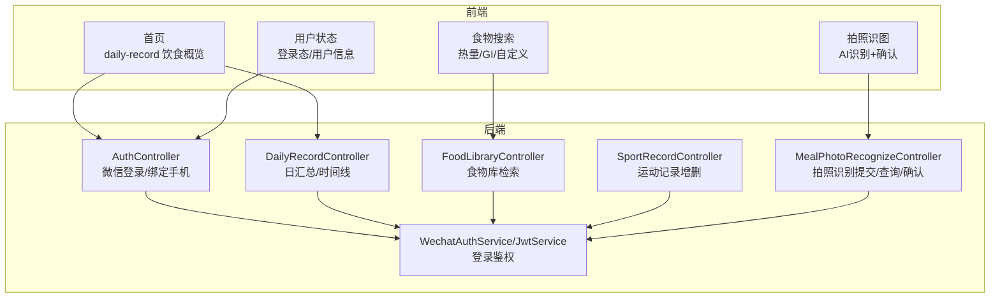
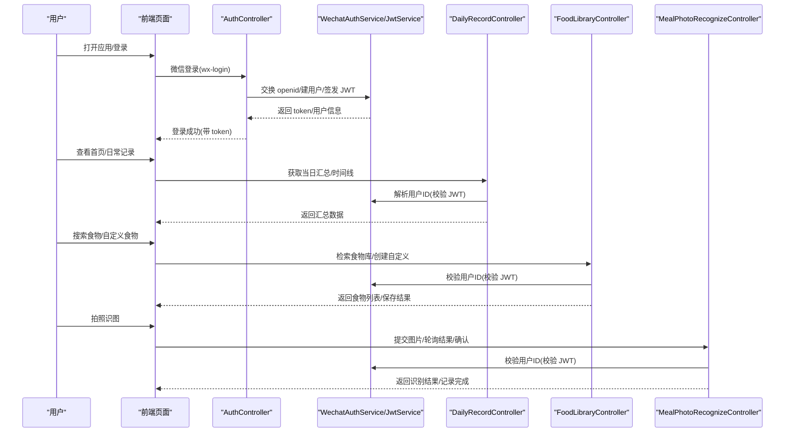
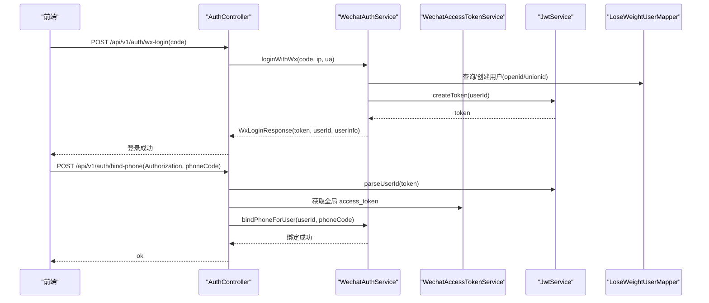
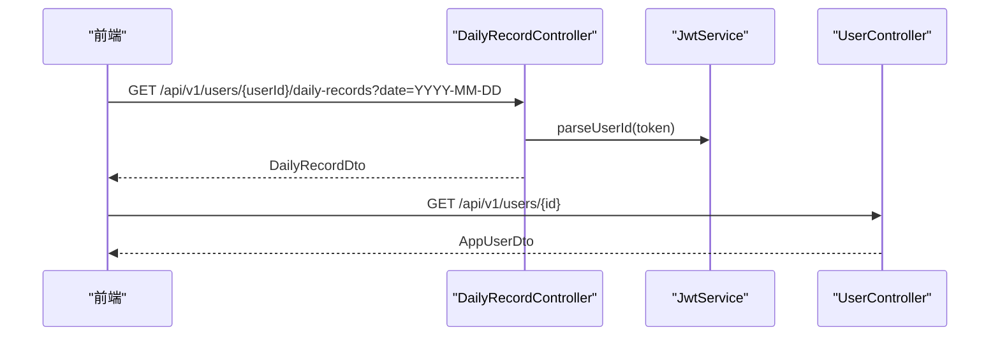
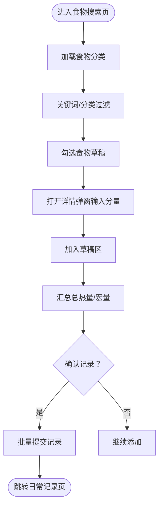
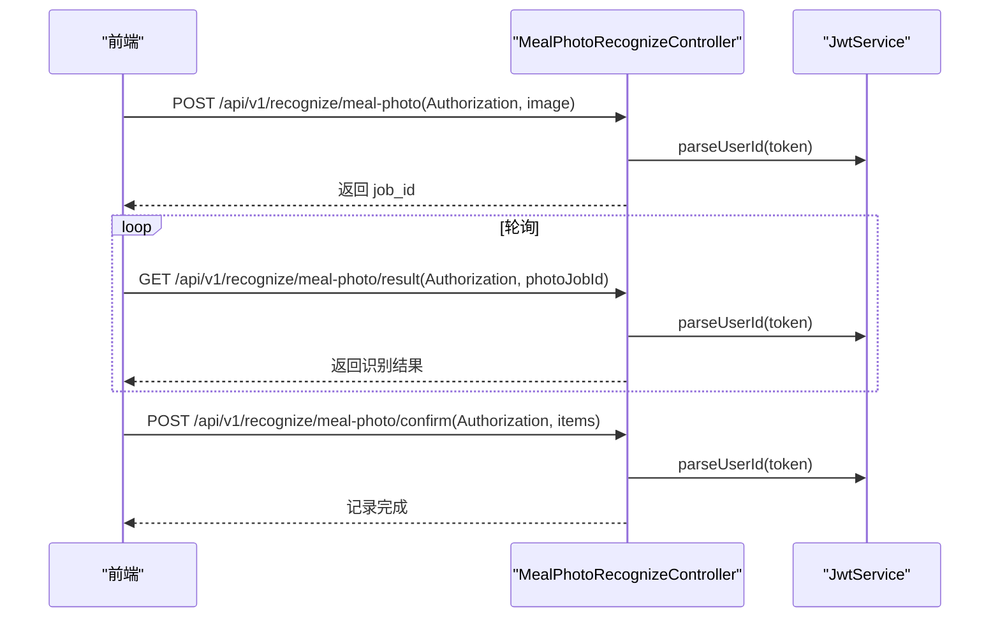
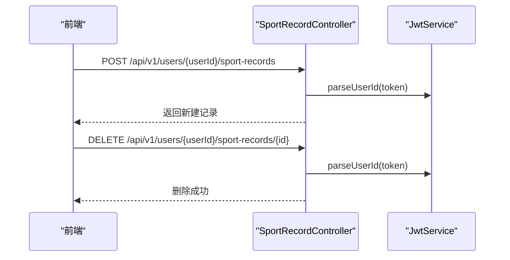
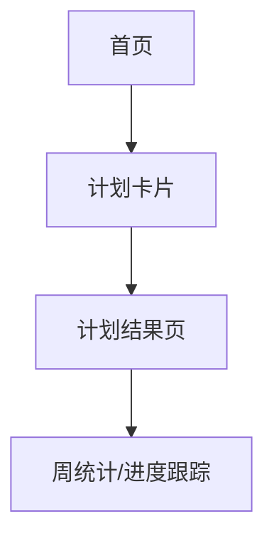
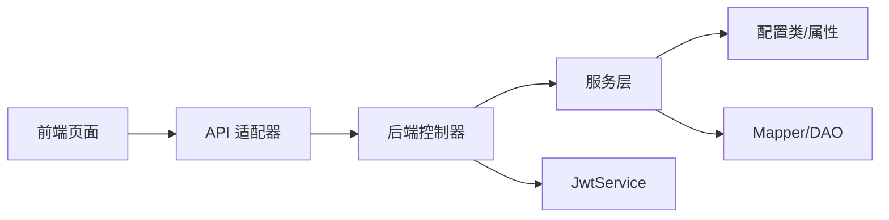

# 核心功能特性

<cite>
**本文档引用的文件**
- [LoseweightApplication.java](file://backend/src/main/java/com/ypfr/loseweight/LoseweightApplication.java)
- [AuthController.java](file://backend/src/main/java/com/ypfr/loseweight/web/AuthController.java)
- [WechatAuthService.java](file://backend/src/main/java/com/ypfr/loseweight/service/WechatAuthService.java)
- [JwtService.java](file://backend/src/main/java/com/ypfr/loseweight/service/JwtService.java)
- [LoseWeightUser.java](file://backend/src/main/java/com/ypfr/loseweight/domain/LoseWeightUser.java)
- [UserController.java](file://backend/src/main/java/com/ypfr/loseweight/web/UserController.java)
- [DailyRecordController.java](file://backend/src/main/java/com/ypfr/loseweight/web/DailyRecordController.java)
- [FoodLibraryController.java](file://backend/src/main/java/com/ypfr/loseweight/web/FoodLibraryController.java)
- [SportRecordController.java](file://backend/src/main/java/com/ypfr/loseweight/web/SportRecordController.java)
- [MealPhotoRecognizeController.java](file://backend/src/main/java/com/ypfr/loseweight/web/MealPhotoRecognizeController.java)
- [index.vue（首页）](file://frontend/src/pages/home/index.vue)
- [index.vue（日常记录）](file://frontend/src/pages/daily-record/index.vue)
- [index.vue（食物搜索）](file://frontend/src/pages/food-search/index.vue)
- [index.vue（拍照识图）](file://frontend/src/pages/photograph/index.vue)
- [user.ts（用户状态）](file://frontend/src/stores/user.ts)
</cite>

## 目录
1. [简介](#简介)
2. [项目结构](#项目结构)
3. [核心组件](#核心组件)
4. [架构总览](#架构总览)
5. [详细组件分析](#详细组件分析)
6. [依赖分析](#依赖分析)
7. [性能考虑](#性能考虑)
8. [故障排查指南](#故障排查指南)
9. [结论](#结论)

## 简介
本项目提供一套面向用户的减脂管理平台，涵盖用户认证（微信一键登录、JWT令牌管理）、健康档案与体重记录、饮食记录与热量计算、拍照识别（AI图像识别与营养分析）、运动追踪与消耗计算、以及个性化减脂计划与进度跟踪。本文档从功能价值、使用场景与实现原理三个维度，为用户提供功能全景图与关键流程说明。

## 项目结构
后端采用 Spring Boot 架构，通过控制器层暴露 REST 接口，服务层封装业务逻辑，持久层基于 MyBatis Mapper 访问数据库；前端采用 uni-app 技术栈，页面通过 API 适配器与后端交互，状态通过 Pinia Store 管理。

图表来源
- [AuthController.java:1-55](file://backend/src/main/java/com/ypfr/loseweight/web/AuthController.java#L1-55)
- [DailyRecordController.java:1-40](file://backend/src/main/java/com/ypfr/loseweight/web/DailyRecordController.java#L1-40)
- [FoodLibraryController.java:1-31](file://backend/src/main/java/com/ypfr/loseweight/web/FoodLibraryController.java#L1-31)
- [SportRecordController.java:1-36](file://backend/src/main/java/com/ypfr/loseweight/web/SportRecordController.java#L1-36)
- [MealPhotoRecognizeController.java:1-63](file://backend/src/main/java/com/ypfr/loseweight/web/MealPhotoRecognizeController.java#L1-63)
- [index.vue（首页）:1-534](file://frontend/src/pages/home/index.vue#L1-534)
- [index.vue（日常记录）:1-648](file://frontend/src/pages/daily-record/index.vue#L1-648)
- [index.vue（食物搜索）:1-758](file://frontend/src/pages/food-search/index.vue#L1-758)
- [index.vue（拍照识图）:1-522](file://frontend/src/pages/photograph/index.vue#L1-522)
- [user.ts（用户状态）:1-104](file://frontend/src/stores/user.ts#L1-104)

章节来源
- [LoseweightApplication.java:1-26](file://backend/src/main/java/com/ypfr/loseweight/LoseweightApplication.java#L1-26)

## 核心组件
- 用户认证系统：支持微信一键登录与手机号绑定，基于 JWT 实现会话令牌签发与校验。
- 健康档案与体重：提供用户档案查询与体重记录接口，支撑每日预算与宏量目标。
- 饮食记录系统：提供食物库检索、自定义食物、按餐型记录与批量提交、热量与宏量统计。
- 拍照识别：支持相册/相机上传，提交识别任务，轮询结果并进行确认与记录。
- 运动追踪：提供运动项目库与运动记录的新增与删除，支持消耗热量计算。
- 计划与进度：首页引导加入计划，结合周统计卡片与仪表盘，形成闭环。

章节来源
- [AuthController.java:1-55](file://backend/src/main/java/com/ypfr/loseweight/web/AuthController.java#L1-55)
- [WechatAuthService.java:1-233](file://backend/src/main/java/com/ypfr/loseweight/service/WechatAuthService.java#L1-233)
- [JwtService.java:1-58](file://backend/src/main/java/com/ypfr/loseweight/service/JwtService.java#L1-58)
- [UserController.java:1-41](file://backend/src/main/java/com/ypfr/loseweight/web/UserController.java#L1-41)
- [DailyRecordController.java:1-40](file://backend/src/main/java/com/ypfr/loseweight/web/DailyRecordController.java#L1-40)
- [FoodLibraryController.java:1-31](file://backend/src/main/java/com/ypfr/loseweight/web/FoodLibraryController.java#L1-31)
- [SportRecordController.java:1-36](file://backend/src/main/java/com/ypfr/loseweight/web/SportRecordController.java#L1-36)
- [MealPhotoRecognizeController.java:1-63](file://backend/src/main/java/com/ypfr/loseweight/web/MealPhotoRecognizeController.java#L1-63)
- [index.vue（首页）:1-534](file://frontend/src/pages/home/index.vue#L1-534)
- [index.vue（日常记录）:1-648](file://frontend/src/pages/daily-record/index.vue#L1-648)
- [index.vue（食物搜索）:1-758](file://frontend/src/pages/food-search/index.vue#L1-758)
- [index.vue（拍照识图）:1-522](file://frontend/src/pages/photograph/index.vue#L1-522)
- [user.ts（用户状态）:1-104](file://frontend/src/stores/user.ts#L1-104)

## 架构总览
下图展示从前端页面到后端控制器与服务层的关键交互路径，体现登录态传递、数据聚合与识别流程。

图表来源
- [AuthController.java:32-53](file://backend/src/main/java/com/ypfr/loseweight/web/AuthController.java#L32-53)
- [WechatAuthService.java:64-153](file://backend/src/main/java/com/ypfr/loseweight/service/WechatAuthService.java#L64-153)
- [JwtService.java:39-56](file://backend/src/main/java/com/ypfr/loseweight/service/JwtService.java#L39-56)
- [DailyRecordController.java:27-38](file://backend/src/main/java/com/ypfr/loseweight/web/DailyRecordController.java#L27-38)
- [FoodLibraryController.java:22-29](file://backend/src/main/java/com/ypfr/loseweight/web/FoodLibraryController.java#L22-29)
- [MealPhotoRecognizeController.java:33-61](file://backend/src/main/java/com/ypfr/loseweight/web/MealPhotoRecognizeController.java#L33-61)
- [index.vue（首页）:161-173](file://frontend/src/pages/home/index.vue#L161-173)
- [index.vue（日常记录）:334-382](file://frontend/src/pages/daily-record/index.vue#L334-382)
- [index.vue（食物搜索）:358-372](file://frontend/src/pages/food-search/index.vue#L358-372)
- [index.vue（拍照识图）:232-285](file://frontend/src/pages/photograph/index.vue#L232-285)
- [user.ts（用户状态）:54-57](file://frontend/src/stores/user.ts#L54-57)

## 详细组件分析

### 用户认证系统（微信登录、JWT 令牌管理）
- 核心价值
  - 降低用户注册门槛，一键登录并建立用户档案与预算配置。
  - 通过 JWT 实现无状态会话，保障接口访问安全。
- 使用场景
  - 新用户首次进入、老用户重新登录、绑定手机号。
- 实现原理
  - 前端调用后端 /api/v1/auth/wx-login，传入微信 code。
  - 后端通过微信接口换取 openid，创建或复用用户，生成 JWT 并返回。
  - 前端将 token 存储于本地存储并在后续请求头携带 Authorization: Bearer <token>。
  - 绑定手机号通过 /api/v1/auth/bind-phone，使用微信提供的手机号接口解密并落库。

图表来源
- [AuthController.java:32-53](file://backend/src/main/java/com/ypfr/loseweight/web/AuthController.java#L32-53)
- [WechatAuthService.java:64-204](file://backend/src/main/java/com/ypfr/loseweight/service/WechatAuthService.java#L64-204)
- [JwtService.java:29-56](file://backend/src/main/java/com/ypfr/loseweight/service/JwtService.java#L29-56)
- [LoseWeightUser.java:12-31](file://backend/src/main/java/com/ypfr/loseweight/domain/LoseWeightUser.java#L12-31)
- [index.vue（首页）:175-178](file://frontend/src/pages/home/index.vue#L175-178)
- [user.ts（用户状态）:54-57](file://frontend/src/stores/user.ts#L54-57)

章节来源
- [AuthController.java:1-55](file://backend/src/main/java/com/ypfr/loseweight/web/AuthController.java#L1-55)
- [WechatAuthService.java:1-233](file://backend/src/main/java/com/ypfr/loseweight/service/WechatAuthService.java#L1-233)
- [JwtService.java:1-58](file://backend/src/main/java/com/ypfr/loseweight/service/JwtService.java#L1-58)
- [LoseWeightUser.java:1-168](file://backend/src/main/java/com/ypfr/loseweight/domain/LoseWeightUser.java#L1-168)
- [user.ts（用户状态）:1-104](file://frontend/src/stores/user.ts#L1-104)

### 健康档案与体重记录
- 核心价值
  - 提供用户基础档案与体重趋势，作为每日预算与目标设定依据。
- 使用场景
  - 首页概览、体重趋势查看、周统计卡片。
- 实现原理
  - 前端在首页与日常记录页分别调用后端接口获取当日汇总与时间线。
  - 控制器解析 Authorization 中的 JWT，校验用户身份后返回数据。

图表来源
- [DailyRecordController.java:27-38](file://backend/src/main/java/com/ypfr/loseweight/web/DailyRecordController.java#L27-38)
- [UserController.java:28-39](file://backend/src/main/java/com/ypfr/loseweight/web/UserController.java#L28-39)
- [JwtService.java:39-56](file://backend/src/main/java/com/ypfr/loseweight/service/JwtService.java#L39-56)
- [index.vue（首页）:161-173](file://frontend/src/pages/home/index.vue#L161-173)
- [index.vue（日常记录）:334-382](file://frontend/src/pages/daily-record/index.vue#L334-382)

章节来源
- [DailyRecordController.java:1-40](file://backend/src/main/java/com/ypfr/loseweight/web/DailyRecordController.java#L1-40)
- [UserController.java:1-41](file://backend/src/main/java/com/ypfr/loseweight/web/UserController.java#L1-41)
- [index.vue（首页）:161-173](file://frontend/src/pages/home/index.vue#L161-173)
- [index.vue（日常记录）:334-382](file://frontend/src/pages/daily-record/index.vue#L334-382)

### 饮食记录系统（食物搜索、自定义食物、热量计算）
- 核心价值
  - 快速检索海量食物库，支持按餐型与 GI 标签筛选，支持自定义食物与批量记录。
- 使用场景
  - 三餐/加餐记录、快速估算热量与宏量。
- 实现原理
  - 前端在食物搜索页加载分类与食物列表，支持关键词与分类过滤。
  - 通过草稿区累计选择项，计算总热量与宏量，最终批量提交至后端。
  - 热量计算根据“每 100g”或“一份”单位进行换算。

图表来源
- [index.vue（食物搜索）:338-372](file://frontend/src/pages/food-search/index.vue#L338-372)
- [index.vue（食物搜索）:374-448](file://frontend/src/pages/food-search/index.vue#L374-448)
- [index.vue（食物搜索）:474-509](file://frontend/src/pages/food-search/index.vue#L474-509)
- [FoodLibraryController.java:22-29](file://backend/src/main/java/com/ypfr/loseweight/web/FoodLibraryController.java#L22-29)

章节来源
- [index.vue（食物搜索）:1-758](file://frontend/src/pages/food-search/index.vue#L1-758)
- [FoodLibraryController.java:1-31](file://backend/src/main/java/com/ypfr/loseweight/web/FoodLibraryController.java#L1-31)

### 拍照识别功能（AI 图像识别、食物分类、营养分析）
- 核心价值
  - 通过拍照或相册上传，自动识别食物并给出热量与 GI 标签，辅助快速记录。
- 使用场景
  - 快速记录未在库中的食物，或补充遗漏记录。
- 实现原理
  - 前端在拍照页支持相册/相机入口，上传图片后提交识别任务。
  - 后端提供提交、轮询结果与确认接口，前端根据状态机推进 UI 流程。

图表来源
- [MealPhotoRecognizeController.java:33-61](file://backend/src/main/java/com/ypfr/loseweight/web/MealPhotoRecognizeController.java#L33-61)
- [JwtService.java:39-56](file://backend/src/main/java/com/ypfr/loseweight/service/JwtService.java#L39-56)
- [index.vue（拍照识图）:232-285](file://frontend/src/pages/photograph/index.vue#L232-285)

章节来源
- [MealPhotoRecognizeController.java:1-63](file://backend/src/main/java/com/ypfr/loseweight/web/MealPhotoRecognizeController.java#L1-63)
- [index.vue（拍照识图）:1-522](file://frontend/src/pages/photograph/index.vue#L1-522)

### 运动追踪系统（运动项目库、运动记录、消耗热量计算）
- 核心价值
  - 记录运动类型、时长与强度，自动换算消耗热量，纳入当日总消耗。
- 使用场景
  - 健身房训练、户外跑步、骑行等有氧/力量运动记录。
- 实现原理
  - 前端提供运动搜索与记录弹窗，提交后端创建运动记录，支持删除。

图表来源
- [SportRecordController.java:24-34](file://backend/src/main/java/com/ypfr/loseweight/web/SportRecordController.java#L24-34)
- [JwtService.java:39-56](file://backend/src/main/java/com/ypfr/loseweight/service/JwtService.java#L39-56)
- [index.vue（日常记录）:424-434](file://frontend/src/pages/daily-record/index.vue#L424-434)

章节来源
- [SportRecordController.java:1-36](file://backend/src/main/java/com/ypfr/loseweight/web/SportRecordController.java#L1-36)
- [index.vue（日常记录）:424-434](file://frontend/src/pages/daily-record/index.vue#L424-434)

### 计划制定系统（个性化减脂方案、目标设定、进度跟踪）
- 核心价值
  - 为用户生成个性化减脂方案，设定目标并可视化进度，提升坚持度。
- 使用场景
  - 首页引导加入计划、查看计划卡片与进度条。
- 实现原理
  - 首页提供计划入口，跳转至计划结果页，结合周统计与仪表盘进行进度跟踪。

图表来源
- [index.vue（首页）:110-128](file://frontend/src/pages/home/index.vue#L110-128)
- [index.vue（首页）:215-219](file://frontend/src/pages/home/index.vue#L215-219)

章节来源
- [index.vue（首页）:1-534](file://frontend/src/pages/home/index.vue#L1-534)

## 依赖分析
- 前端依赖
  - 页面组件通过 API 适配器与后端交互，Pinia Store 统一管理登录态与用户信息。
  - 页面间通过路由参数传递日期与餐型，保证上下文一致性。
- 后端依赖
  - 控制器依赖服务层进行业务处理，服务层依赖配置类与 Mapper 进行外部接口调用与数据持久化。
  - JWT 服务负责令牌签发与校验，确保接口安全。

图表来源
- [AuthController.java:1-55](file://backend/src/main/java/com/ypfr/loseweight/web/AuthController.java#L1-55)
- [WechatAuthService.java:1-233](file://backend/src/main/java/com/ypfr/loseweight/service/WechatAuthService.java#L1-233)
- [JwtService.java:1-58](file://backend/src/main/java/com/ypfr/loseweight/service/JwtService.java#L1-58)
- [user.ts（用户状态）:1-104](file://frontend/src/stores/user.ts#L1-104)

章节来源
- [AuthController.java:1-55](file://backend/src/main/java/com/ypfr/loseweight/web/AuthController.java#L1-55)
- [WechatAuthService.java:1-233](file://backend/src/main/java/com/ypfr/loseweight/service/WechatAuthService.java#L1-233)
- [JwtService.java:1-58](file://backend/src/main/java/com/ypfr/loseweight/service/JwtService.java#L1-58)
- [user.ts（用户状态）:1-104](file://frontend/src/stores/user.ts#L1-104)

## 性能考虑
- 前端
  - 首页与日常记录页采用懒加载与缓存策略，减少重复请求。
  - 拍照识别流程中增加轮询与状态机，避免频繁刷新。
- 后端
  - 控制器层统一解析用户 ID，避免重复校验。
  - 食物库检索支持分页与过滤，降低一次性数据传输压力。

## 故障排查指南
- 登录失败
  - 检查微信 app-id/app-secret 是否正确配置，确认网络可达性。
  - 若微信返回错误码，查看后端日志与登录日志表。
- 识别失败
  - 确认图片清晰、主体占画面比例合理；检查上传与轮询流程是否正常。
- 权限问题
  - 确认 Authorization 头是否携带且格式正确；检查 JWT 是否过期。
- 前端存储
  - 登录态丢失时，检查本地存储键值是否存在与格式正确。

章节来源
- [WechatAuthService.java:82-106](file://backend/src/main/java/com/ypfr/loseweight/service/WechatAuthService.java#L82-106)
- [JwtService.java:40-56](file://backend/src/main/java/com/ypfr/loseweight/service/JwtService.java#L40-56)
- [user.ts（用户状态）:87-101](file://frontend/src/stores/user.ts#L87-101)

## 结论
本项目围绕“减脂管理”的核心诉求，构建了从认证、健康档案、饮食记录、拍照识别、运动追踪到计划与进度的完整闭环。前后端通过清晰的接口契约与状态管理协同工作，既满足用户高频操作的易用性，也兼顾了业务扩展与安全性。