# 项目介绍与定位

<cite>
**本文引用的文件**
- [项目当前基线 PRD（可执行）](file://docs/final/project-current-baseline-prd.md)
- [后端应用入口](file://backend/src/main/java/com/ypfr/loseweight/LoseweightApplication.java)
- [后端配置文件](file://backend/src/main/resources/application.yml)
- [前端应用入口](file://frontend/src/App.vue)
- [前端主应用初始化](file://frontend/src/main.ts)
- [前端首页页面](file://frontend/src/pages/home/index.vue)
- [前端拍照页面](file://frontend/src/pages/photograph/index.vue)
- [前端我的页面](file://frontend/src/pages/user/index.vue)
- [前端 API 配置](file://frontend/src/config/api.ts)
- [后端鉴权解析器](file://backend/src/main/java/com/ypfr/loseweight/web/AuthUserResolver.java)
- [后端管理员鉴权解析器](file://backend/src/main/java/com/ypfr/loseweight/web/AdminAuthResolver.java)
- [后端用户资料控制器](file://backend/src/main/java/com/ypfr/loseweight/web/UserProfileController.java)
- [后端管理员登录服务](file://backend/src/main/java/com/ypfr/loseweight/service/AdminAuthService.java)
- [数据库迁移脚本 V001-V022](file://database/migrations/)
- [数据库模式脚本](file://database/01_schema.sql)
- [管理员前端 README](file://admin-frontend/README.md)
</cite>

## 目录
1. [引言](#引言)
2. [项目结构](#项目结构)
3. [核心组件](#核心组件)
4. [架构概览](#架构概览)
5. [详细组件分析](#详细组件分析)
6. [依赖分析](#依赖分析)
7. [性能考虑](#性能考虑)
8. [故障排除指南](#故障排除指南)
9. [结论](#结论)
10. [附录](#附录)

## 引言

本项目是一个基于微信小程序的智能化健康管理平台，专注于帮助用户科学减脂和维持健康体重。该项目旨在通过技术手段降低健康管理门槛，让用户能够轻松追踪饮食、运动和体重变化，实现可持续的健康生活方式。

### 核心价值主张

**科学减脂，简单易用**
- 提供专业的热量计算和营养分析功能
- 通过AI图像识别技术自动识别食物成分
- 个性化减脂计划制定和跟踪
- 实时体重趋势分析和健康指标监控

**智能化健康管理**
- 基于微信小程序的轻量化使用体验
- 支持多种食物记录方式（手动输入、搜索、拍照识别）
- 智能化的营养建议和饮食指导
- 社区化的健康分享和激励机制

### 市场定位

**目标用户群体**
- 关注健康的上班族和学生群体
- 需要科学减脂的专业人士
- 希望改善生活习惯的普通用户
- 追求生活品质的中产阶级

**核心痛点解决**
- 传统减脂方法缺乏科学指导和技术支撑
- 饮食记录繁琐，难以长期坚持
- 缺乏个性化的营养建议和计划制定
- 体重管理过程缺乏有效的监督和激励

**提供的核心价值**
- 科学的热量计算和营养分析
- 智能化的食物识别和记录
- 个性化的减脂计划和进度跟踪
- 实时的健康数据分析和趋势预测

## 项目结构

项目采用前后端分离的架构设计，基于微信小程序平台构建完整的健康管理生态系统。

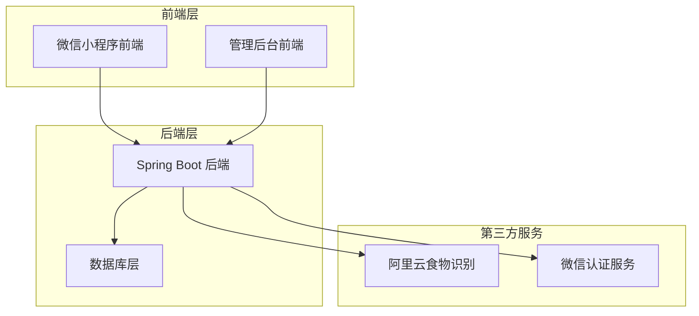

**图表来源**
- [后端应用入口:12-25](file://backend/src/main/java/com/ypfr/loseweight/LoseweightApplication.java#L12-L25)
- [后端配置文件:1-54](file://backend/src/main/resources/application.yml#L1-L54)

### 技术架构

**前端技术栈**
- uni-app + Vue 3 + TypeScript
- 微信小程序为目标平台
- 响应式设计，适配多终端设备

**后端技术栈**
- Spring Boot 3 + MyBatis-Plus
- JDK 17+
- MySQL 8 数据库
- JWT 令牌认证

**核心模块划分**
- 用户管理模块：用户注册、登录、资料管理
- 饮食记录模块：食物搜索、记录管理、营养分析
- 运动管理模块：运动记录、消耗计算
- 体重管理模块：体重记录、趋势分析
- AI识别模块：食物拍照识别、智能分析

**章节来源**
- [项目当前基线 PRD（可执行）:15-23](file://docs/final/project-current-baseline-prd.md#L15-L23)
- [后端应用入口:1-26](file://backend/src/main/java/com/ypfr/loseweight/LoseweightApplication.java#L1-L26)

## 核心组件

### 用户管理系统

用户管理系统是整个平台的基础，负责用户身份认证、资料管理和权限控制。

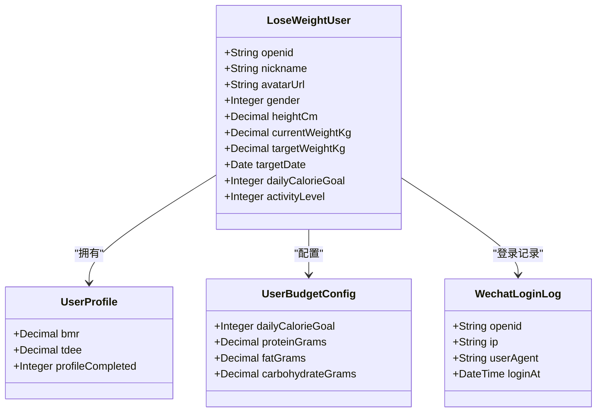

**图表来源**
- [后端用户领域模型](file://backend/src/main/java/com/ypfr/loseweight/domain/LoseWeightUser.java)
- [后端用户资料模型](file://backend/src/main/java/com/ypfr/loseweight/domain/UserProfile.java)
- [后端预算配置模型](file://backend/src/main/java/com/ypfr/loseweight/domain/UserBudgetConfig.java)

### 饮食记录系统

饮食记录系统提供多种食物记录方式，包括手动输入、搜索选择和AI拍照识别。

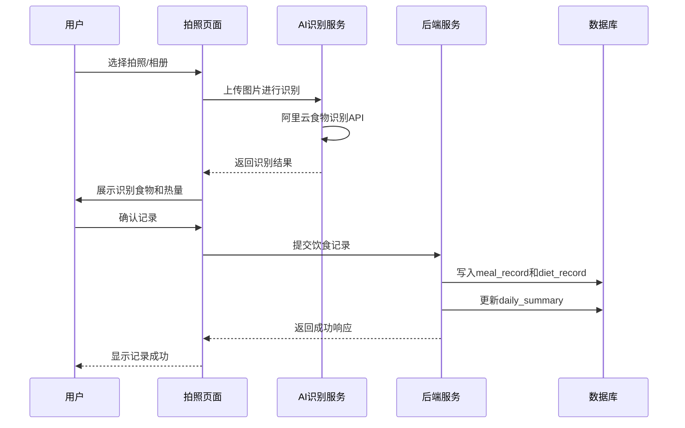

**图表来源**
- [前端拍照页面:159-189](file://frontend/src/pages/photograph/index.vue#L159-L189)
- [后端识别控制器](file://backend/src/main/java/com/ypfr/loseweight/web/MealPhotoRecognizeController.java)
- [后端识别服务](file://backend/src/main/java/com/ypfr/loseweight/service/photograph/MealPhotoRecognizeService.java)

### 运动管理系统

运动管理系统记录用户的运动活动，计算消耗的热量并纳入整体健康分析。

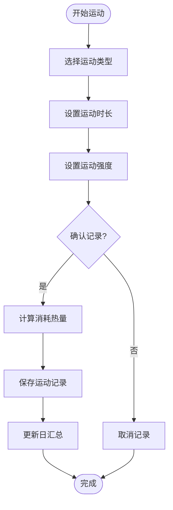

**图表来源**
- [前端运动记录页面](file://frontend/src/pages/sport-search/index.vue)
- [后端运动记录控制器](file://backend/src/main/java/com/ypfr/loseweight/web/SportRecordController.java)

**章节来源**
- [项目当前基线 PRD（可执行）:46-77](file://docs/final/project-current-baseline-prd.md#L46-L77)

## 架构概览

项目采用现代化的微服务架构，前后端分离设计，确保系统的可扩展性和可维护性。

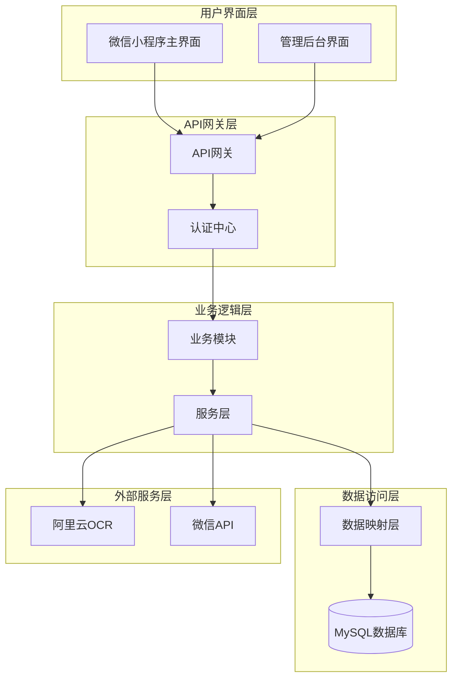

**图表来源**
- [后端应用入口:12-25](file://backend/src/main/java/com/ypfr/loseweight/LoseweightApplication.java#L12-L25)
- [后端配置文件:31-46](file://backend/src/main/resources/application.yml#L31-L46)

### 数据流架构

系统通过清晰的数据流向确保各组件间的协调工作：

1. **用户交互层**：通过微信小程序界面收集用户输入
2. **API网关层**：统一处理请求路由和参数验证
3. **业务逻辑层**：执行具体的业务规则和算法
4. **数据持久层**：安全存储和管理业务数据
5. **外部集成层**：调用第三方服务提供增强功能

**章节来源**
- [前端 API 配置:1-42](file://frontend/src/config/api.ts#L1-L42)
- [后端鉴权解析器:17-30](file://backend/src/main/java/com/ypfr/loseweight/web/AuthUserResolver.java#L17-L30)

## 详细组件分析

### 首页仪表板组件

首页是用户日常使用的主界面，集成了多个核心功能模块。

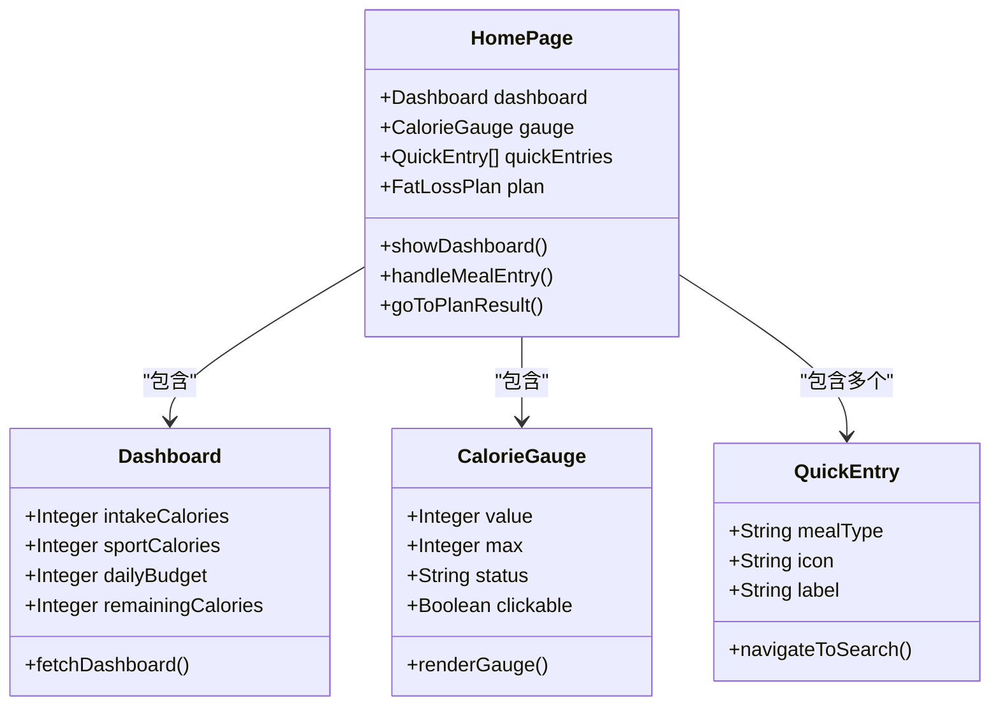

**图表来源**
- [前端首页页面:1-534](file://frontend/src/pages/home/index.vue#L1-L534)

首页设计体现了"简单直观"的理念：

- **顶部品牌区域**：清晰的品牌标识和搜索功能
- **核心仪表板**：实时显示当日热量摄入、消耗和预算
- **快捷入口**：四种餐次的快速添加按钮
- **减脂计划**：个性化计划推荐和用户案例展示

### 拍照识别组件

拍照识别是项目最具创新性的功能，通过AI技术简化食物记录过程。

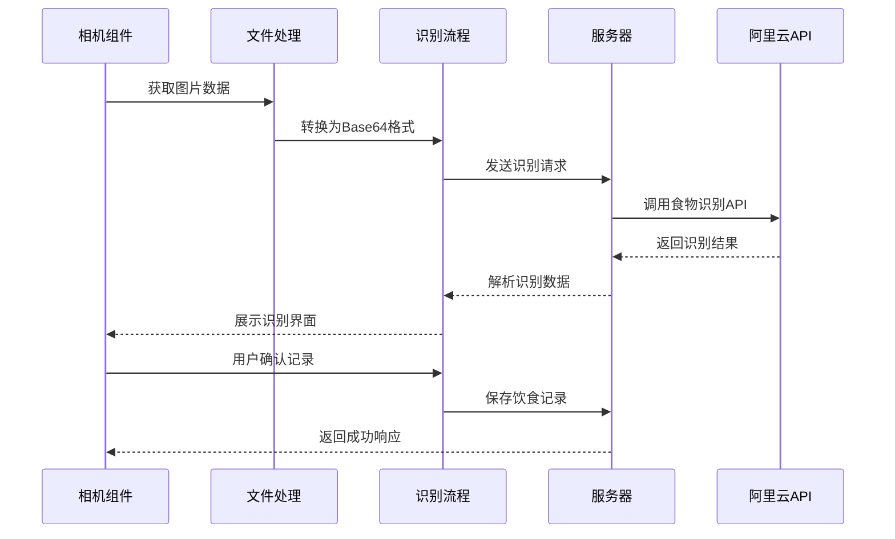

**图表来源**
- [前端拍照页面:159-189](file://frontend/src/pages/photograph/index.vue#L159-L189)
- [后端配置文件:36-40](file://backend/src/main/resources/application.yml#L36-L40)

拍照识别功能的关键特性：

- **多源图片支持**：支持相机拍摄和相册选择
- **实时预览**：拍摄过程中的实时预览效果
- **智能识别**：AI自动识别食物种类和分量
- **灵活调整**：支持用户对识别结果进行修正
- **快速记录**：一键确认完成饮食记录

### 用户个人中心

个人中心提供用户资料管理和健康数据分析功能。

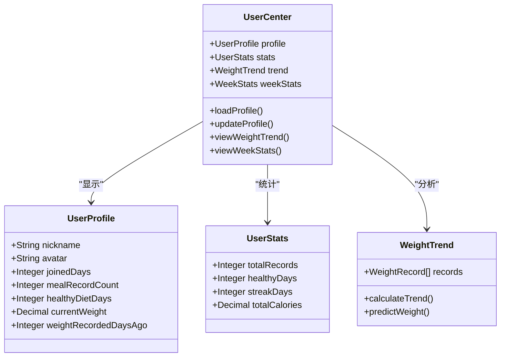

**图表来源**
- [前端我的页面:1-377](file://frontend/src/pages/user/index.vue#L1-L377)

个人中心的设计理念：

- **数据可视化**：通过图表直观展示健康数据
- **成就激励**：展示用户的健康成就和持续记录
- **趋势分析**：提供体重变化趋势和预测
- **便捷管理**：个人信息修改和设置管理

**章节来源**
- [前端首页页面:110-128](file://frontend/src/pages/home/index.vue#L110-L128)
- [前端拍照页面:1-522](file://frontend/src/pages/photograph/index.vue#L1-L522)
- [前端我的页面:1-377](file://frontend/src/pages/user/index.vue#L1-L377)

## 依赖分析

项目依赖关系体现了清晰的层次化架构设计。

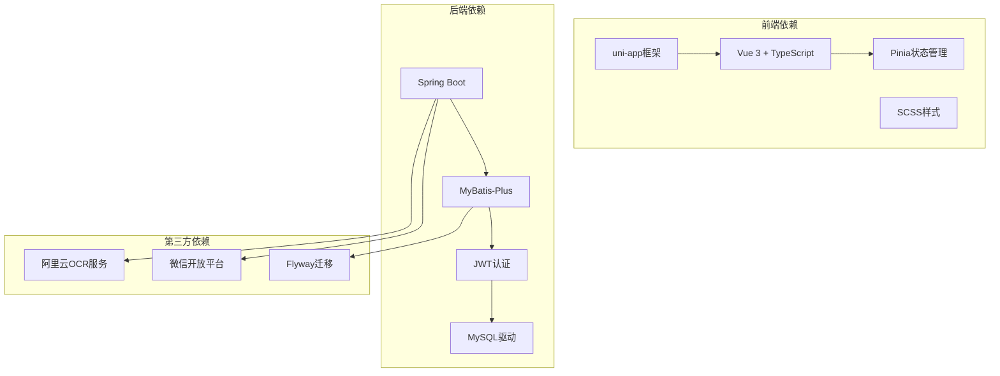

**图表来源**
- [后端应用入口:14-19](file://backend/src/main/java/com/ypfr/loseweight/LoseweightApplication.java#L14-L19)
- [后端配置文件:36-46](file://backend/src/main/resources/application.yml#L36-L46)

### 核心依赖关系

**前端技术栈依赖**
- uni-app 作为跨平台开发框架
- Vue 3 提供响应式数据绑定
- Pinia 管理全局状态
- TypeScript 确保代码质量

**后端技术栈依赖**
- Spring Boot 快速搭建应用
- MyBatis-Plus 简化数据访问
- JWT 实现安全认证
- Flyway 管理数据库迁移

**外部服务依赖**
- 阿里云OCR提供食物识别能力
- 微信平台提供用户认证和消息推送
- MySQL 提供数据持久化存储

**章节来源**
- [项目当前基线 PRD（可执行）:15-23](file://docs/final/project-current-baseline-prd.md#L15-L23)

## 性能考虑

### 前端性能优化

**小程序优化策略**
- 使用分包加载减少首屏体积
- 图片资源压缩和懒加载
- 组件按需引入避免冗余代码
- 本地存储优化用户体验

**网络请求优化**
- 请求缓存机制减少重复请求
- 批量数据处理提升效率
- 错误重试机制保证稳定性
- 网络状态监听适应弱网环境

### 后端性能优化

**数据库优化**
- 合理的索引设计提升查询性能
- 连接池配置优化数据库连接
- SQL语句优化避免全表扫描
- 分库分表支持海量数据

**服务层优化**
- 缓存策略减少数据库压力
- 异步处理提升响应速度
- 负载均衡分散请求压力
- 监控告警及时发现性能问题

## 故障排除指南

### 常见问题诊断

**登录认证问题**
- 检查微信授权配置是否正确
- 验证JWT密钥设置和过期时间
- 确认用户状态和权限验证

**数据同步问题**
- 查看数据库连接状态和配置
- 检查迁移脚本执行情况
- 验证数据模型映射关系

**接口调用问题**
- 检查API路径和参数格式
- 验证请求头和认证信息
- 确认响应数据结构一致性

### 排障流程

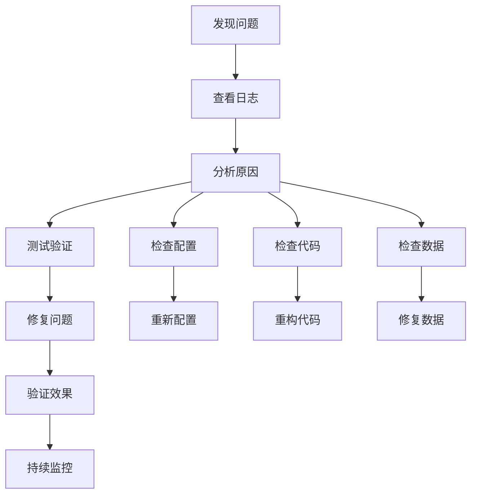

**章节来源**
- [后端鉴权解析器:17-30](file://backend/src/main/java/com/ypfr/loseweight/web/AuthUserResolver.java#L17-L30)
- [后端管理员鉴权解析器:17-26](file://backend/src/main/java/com/ypfr/loseweight/web/AdminAuthResolver.java#L17-L26)

## 结论

本项目通过技术创新和产品设计，为用户提供了一个专业、便捷、智能的健康管理解决方案。项目采用先进的技术架构，确保了系统的稳定性、可扩展性和安全性。

### 项目优势

**技术创新性**
- AI图像识别技术的应用
- 微信小程序生态的深度整合
- 数据驱动的个性化服务

**用户体验优化**
- 简洁直观的操作界面
- 智能化的功能设计
- 个性化的服务体验

**技术架构先进**
- 现代化的技术栈选择
- 清晰的分层架构设计
- 完善的开发规范和流程

### 发展前景

项目具备良好的发展基础和广阔的市场前景。随着用户规模的增长和功能的不断完善，项目将成为健康管理领域的标杆产品。未来的发展重点包括：

- 持续优化AI识别准确率
- 扩展更多健康管理功能
- 加强社区互动和激励机制
- 探索更多商业模式和服务形态

## 附录

### 业务流程图

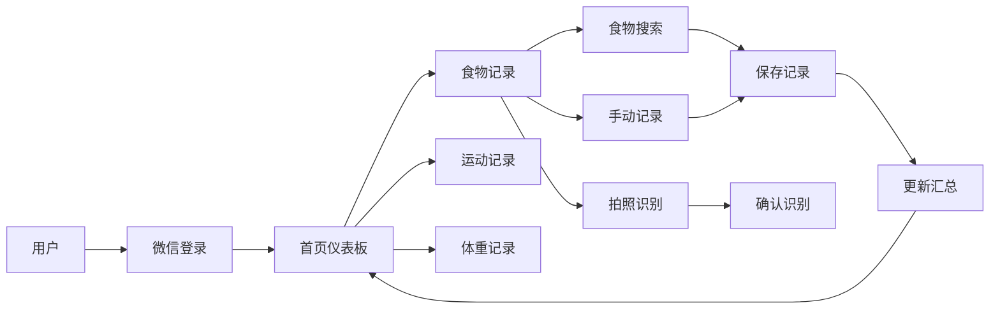

### 数据模型关系

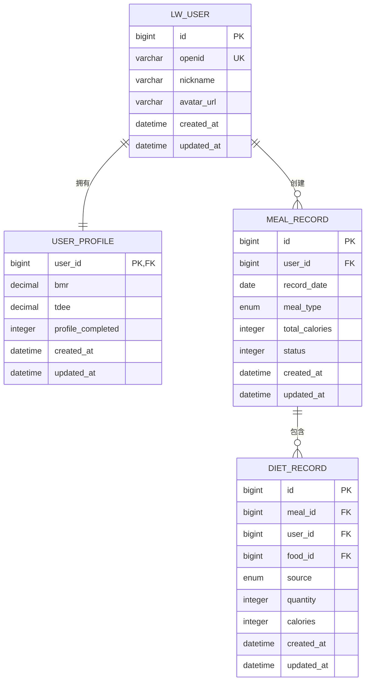

**图表来源**
- [数据库迁移脚本 V001-V022](file://database/migrations/V001__rename_meal_record_to_legacy.sql)
- [数据库模式脚本:10-32](file://database/01_schema.sql#L10-L32)