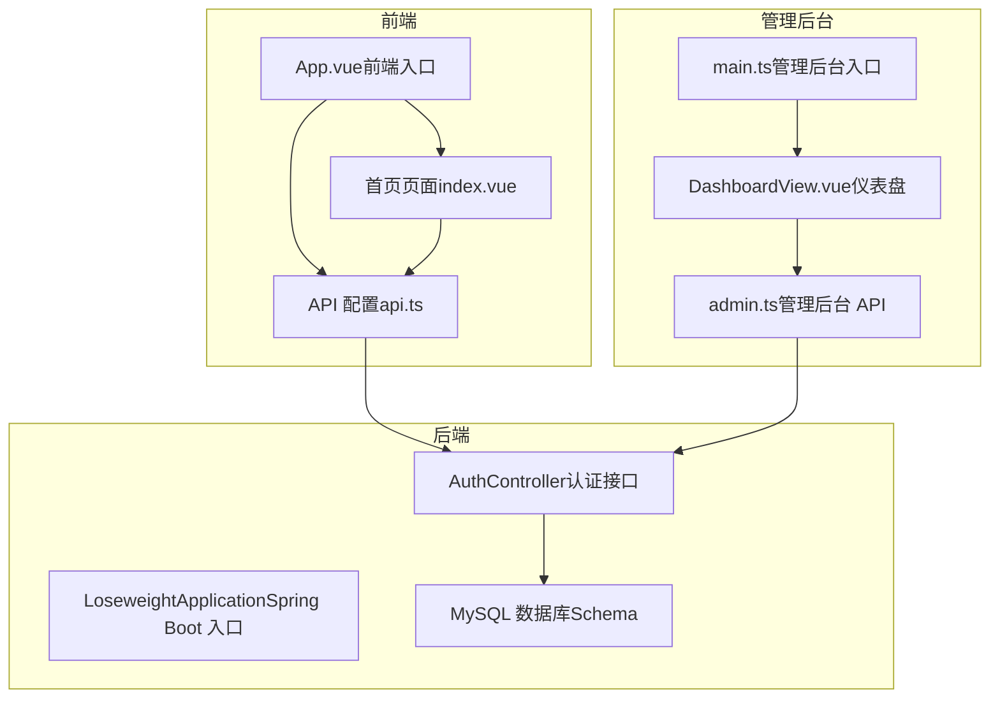
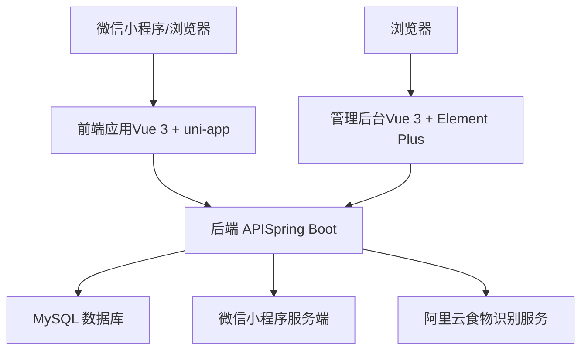
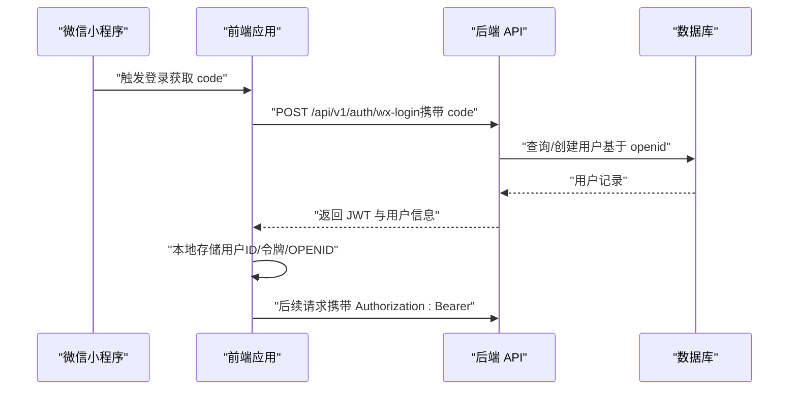
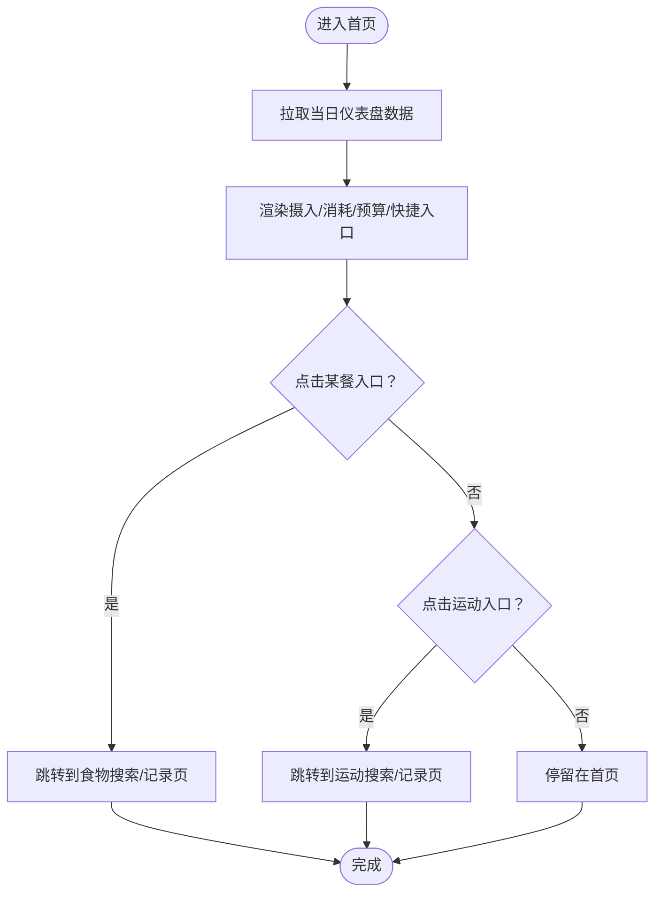
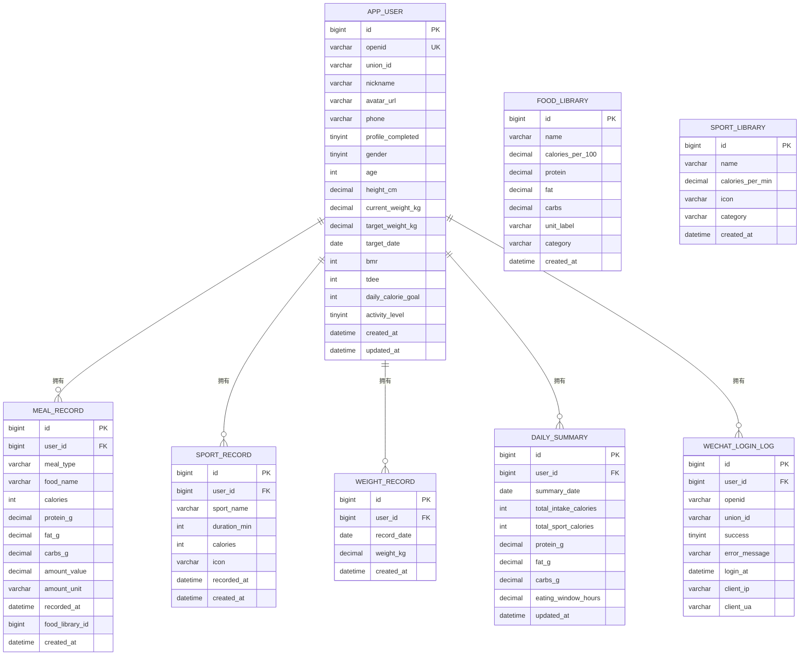
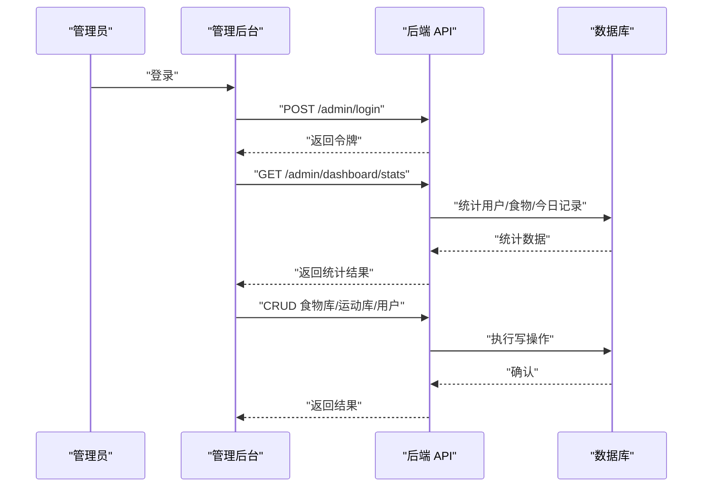
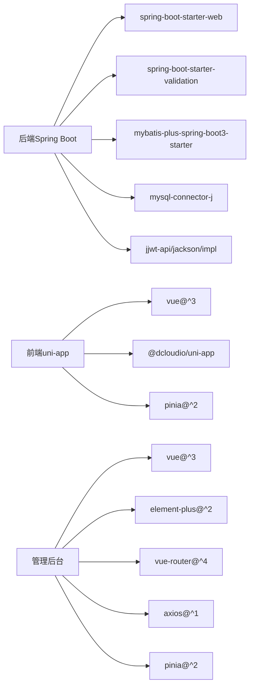

# 项目概述

<cite>
**本文引用的文件**
- [LoseweightApplication.java](file://backend/src/main/java/com/ypfr/loseweight/LoseweightApplication.java)
- [application.yml](file://backend/src/main/resources/application.yml)
- [pom.xml](file://backend/pom.xml)
- [AuthController.java](file://backend/src/main/java/com/ypfr/loseweight/web/AuthController.java)
- [01_schema.sql](file://database/01_schema.sql)
- [main.ts（前端）](file://frontend/src/main.ts)
- [package.json（前端）](file://frontend/package.json)
- [App.vue（前端）](file://frontend/src/App.vue)
- [api.ts（前端配置）](file://frontend/src/config/api.ts)
- [index.vue（首页）](file://frontend/src/pages/home/index.vue)
- [main.ts（管理后台）](file://admin-frontend/src/main.ts)
- [package.json（管理后台）](file://admin-frontend/package.json)
- [DashboardView.vue（管理后台仪表盘）](file://admin-frontend/src/views/DashboardView.vue)
- [admin.ts（管理后台 API）](file://admin-frontend/src/api/admin.ts)
</cite>

## 目录
1. [引言](#引言)
2. [项目结构](#项目结构)
3. [核心组件](#核心组件)
4. [架构总览](#架构总览)
5. [详细组件分析](#详细组件分析)
6. [依赖分析](#依赖分析)
7. [性能考虑](#性能考虑)
8. [故障排除指南](#故障排除指南)
9. [结论](#结论)
10. [附录](#附录)

## 引言
本项目是一个基于微信小程序的健康管理平台，专注于“减脂管理”。系统围绕用户健康档案、饮食记录、拍照识别、运动追踪、计划制定等核心功能构建，采用前后端分离架构：后端使用 Spring Boot 提供 REST API，前端使用 Vue 3 + uni-app 支持多端（含微信小程序），管理后台使用 Vue 3 + Element Plus。系统通过微信小程序登录与 JWT 实现用户认证，结合阿里云“食物热量查询”能力实现拍照识别与营养分析，并以数据库表结构支撑日汇总、体重趋势与运营数据统计。

## 项目结构
项目采用多模块组织方式：
- backend：Spring Boot 后端，提供认证、用户、饮食、运动、识别、统计等接口
- frontend：Vue 3 + uni-app 前端，适配多端（含微信小程序），提供用户侧交互
- admin-frontend：Vue 3 + Element Plus 管理后台，提供运营与内容管理
- database：数据库脚本与迁移，定义核心业务表结构
- docs、designs、tools 等：文档、设计与工具脚本

图表来源
- [App.vue（前端）:1-77](file://frontend/src/App.vue#L1-L77)
- [index.vue（首页）:1-534](file://frontend/src/pages/home/index.vue#L1-L534)
- [api.ts（前端配置）:1-42](file://frontend/src/config/api.ts#L1-L42)
- [main.ts（管理后台）:1-14](file://admin-frontend/src/main.ts#L1-L14)
- [DashboardView.vue（管理后台仪表盘）:1-175](file://admin-frontend/src/views/DashboardView.vue#L1-L175)
- [admin.ts（管理后台 API）:1-85](file://admin-frontend/src/api/admin.ts#L1-L85)
- [LoseweightApplication.java:1-26](file://backend/src/main/java/com/ypfr/loseweight/LoseweightApplication.java#L1-L26)
- [AuthController.java:1-55](file://backend/src/main/java/com/ypfr/loseweight/web/AuthController.java#L1-L55)
- [01_schema.sql:1-159](file://database/01_schema.sql#L1-L159)

章节来源
- [LoseweightApplication.java:1-26](file://backend/src/main/java/com/ypfr/loseweight/LoseweightApplication.java#L1-L26)
- [application.yml:1-54](file://backend/src/main/resources/application.yml#L1-L54)
- [pom.xml:1-86](file://backend/pom.xml#L1-L86)
- [main.ts（前端）:1-12](file://frontend/src/main.ts#L1-L12)
- [package.json（前端）:1-78](file://frontend/package.json#L1-L78)
- [App.vue（前端）:1-77](file://frontend/src/App.vue#L1-L77)
- [api.ts（前端配置）:1-42](file://frontend/src/config/api.ts#L1-L42)
- [index.vue（首页）:1-534](file://frontend/src/pages/home/index.vue#L1-L534)
- [main.ts（管理后台）:1-14](file://admin-frontend/src/main.ts#L1-L14)
- [package.json（管理后台）:1-27](file://admin-frontend/package.json#L1-L27)
- [DashboardView.vue（管理后台仪表盘）:1-175](file://admin-frontend/src/views/DashboardView.vue#L1-L175)
- [admin.ts（管理后台 API）:1-85](file://admin-frontend/src/api/admin.ts#L1-L85)
- [01_schema.sql:1-159](file://database/01_schema.sql#L1-L159)

## 核心组件
- 用户认证与登录
  - 微信小程序登录流程：后端提供 /api/v1/auth/wx-login，返回 JWT；支持绑定手机号
  - 前端通过存储用户标识与令牌，后续接口携带 Authorization: Bearer
- 健康档案与目标
  - 用户资料（性别、年龄、身高、当前/目标体重、目标达成日期、BMR/TDEE、每日摄入目标等）
  - 前端首页展示当日摄入、运动消耗、剩余热量预算与快速入口
- 饮食记录与拍照识别
  - 饮食记录按餐别（早餐/午餐/晚餐/加餐）与时间线存储
  - 集成阿里云“食物热量查询”，支持拍照识别与结果确认
- 运动追踪
  - 运动记录按名称、时长、消耗存储，支持搜索与记录
- 计划制定与会员权益
  - 基于用户资料生成个性化减脂计划，提供阶段性里程碑与建议
  - 会员权益包含拍照识别次数、专属计划、食谱推荐等
- 管理后台
  - 管理员登录、修改密码、仪表盘统计（用户总数、食物库规模、今日记录数）
  - 食物库与运动库的增删改查，用户列表与筛选

章节来源
- [AuthController.java:1-55](file://backend/src/main/java/com/ypfr/loseweight/web/AuthController.java#L1-L55)
- [api.ts（前端配置）:1-42](file://frontend/src/config/api.ts#L1-L42)
- [index.vue（首页）:1-534](file://frontend/src/pages/home/index.vue#L1-L534)
- [01_schema.sql:10-159](file://database/01_schema.sql#L10-L159)
- [DashboardView.vue（管理后台仪表盘）:1-175](file://admin-frontend/src/views/DashboardView.vue#L1-L175)
- [admin.ts（管理后台 API）:1-85](file://admin-frontend/src/api/admin.ts#L1-L85)

## 架构总览
系统采用前后端分离架构：
- 后端（Spring Boot）
  - 使用 MyBatis-Plus 访问 MySQL，配置文件集中管理数据库、微信小程序、JWT、上传目录等
  - 控制器按领域划分（认证、用户、饮食、运动、识别、统计等）
- 前端（Vue 3 + uni-app）
  - 通过统一 API 配置拼接后端路径，支持多端编译（含微信小程序）
  - 页面组件化，首页聚合当日数据与快捷入口
- 管理后台（Vue 3 + Element Plus）
  - 提供管理员登录与数据概览，封装各类管理接口

图表来源
- [application.yml:1-54](file://backend/src/main/resources/application.yml#L1-L54)
- [pom.xml:1-86](file://backend/pom.xml#L1-L86)
- [main.ts（前端）:1-12](file://frontend/src/main.ts#L1-L12)
- [package.json（前端）:1-78](file://frontend/package.json#L1-L78)
- [main.ts（管理后台）:1-14](file://admin-frontend/src/main.ts#L1-L14)
- [package.json（管理后台）:1-27](file://admin-frontend/package.json#L1-L27)

## 详细组件分析

### 用户认证与登录流程
- 登录入口：/api/v1/auth/wx-login，接收小程序 code，换取 openid 并签发 JWT
- 绑定手机号：需要 Authorization 头，使用后端提供的绑定接口
- 前端策略：登录成功后持久化用户 ID、令牌与 openid，后续请求自动携带

图表来源
- [AuthController.java:32-53](file://backend/src/main/java/com/ypfr/loseweight/web/AuthController.java#L32-L53)
- [api.ts（前端配置）:23-28](file://frontend/src/config/api.ts#L23-L28)

章节来源
- [AuthController.java:1-55](file://backend/src/main/java/com/ypfr/loseweight/web/AuthController.java#L1-L55)
- [api.ts（前端配置）:1-42](file://frontend/src/config/api.ts#L1-L42)

### 健康档案与首页概览
- 前端首页展示当日摄入、运动消耗、剩余热量预算与快速入口（早餐/午餐/晚餐/加餐/运动）
- 通过统一 API 获取仪表盘数据，按需跳转到对应页面

图表来源
- [index.vue（首页）:161-231](file://frontend/src/pages/home/index.vue#L161-L231)
- [api.ts（前端配置）:1-42](file://frontend/src/config/api.ts#L1-L42)

章节来源
- [index.vue（首页）:1-534](file://frontend/src/pages/home/index.vue#L1-L534)
- [api.ts（前端配置）:1-42](file://frontend/src/config/api.ts#L1-L42)

### 数据模型与表结构
核心业务表包括：用户、饮食记录、运动记录、体重记录、食物库、运动库、日汇总、识别日志、微信登录日志等。这些表支撑了用户画像、行为轨迹、营养分析与运营统计。

图表来源
- [01_schema.sql:10-159](file://database/01_schema.sql#L10-L159)

章节来源
- [01_schema.sql:1-159](file://database/01_schema.sql#L1-L159)

### 管理后台与运营数据
- 管理员登录、修改密码、仪表盘统计（用户总数、食物数量、今日记录数）
- 食物库与运动库的增删改查，用户列表与筛选

图表来源
- [DashboardView.vue（管理后台仪表盘）:19-30](file://admin-frontend/src/views/DashboardView.vue#L19-L30)
- [admin.ts（管理后台 API）:22-32](file://admin-frontend/src/api/admin.ts#L22-L32)
- [main.ts（管理后台）:1-14](file://admin-frontend/src/main.ts#L1-L14)

章节来源
- [DashboardView.vue（管理后台仪表盘）:1-175](file://admin-frontend/src/views/DashboardView.vue#L1-L175)
- [admin.ts（管理后台 API）:1-85](file://admin-frontend/src/api/admin.ts#L1-L85)
- [main.ts（管理后台）:1-14](file://admin-frontend/src/main.ts#L1-L14)

## 依赖分析
- 后端依赖
  - Spring Boot Web、Validation、MyBatis-Plus、MySQL Connector、JWT 等
  - 配置文件集中管理数据库连接、微信小程序参数、JWT 秘钥与上传目录
- 前端依赖
  - Vue 3、uni-app、Pinia、路由与多端编译脚本
- 管理后台依赖
  - Vue 3、Element Plus、Vue Router、Axios、Pinia

图表来源
- [pom.xml:25-74](file://backend/pom.xml#L25-L74)
- [application.yml:1-54](file://backend/src/main/resources/application.yml#L1-L54)
- [package.json（前端）:42-77](file://frontend/package.json#L42-L77)
- [package.json（管理后台）:11-25](file://admin-frontend/package.json#L11-L25)

章节来源
- [pom.xml:1-86](file://backend/pom.xml#L1-L86)
- [application.yml:1-54](file://backend/src/main/resources/application.yml#L1-L54)
- [package.json（前端）:1-78](file://frontend/package.json#L1-L78)
- [package.json（管理后台）:1-27](file://admin-frontend/package.json#L1-L27)

## 性能考虑
- 接口与表设计
  - 关键查询建立索引（如用户+时间、唯一约束），降低查询成本
- 缓存与离线
  - 前端可利用本地存储缓存常用状态（如当前餐类型高亮），减少重复请求
- 图片与上传
  - 合理设置上传大小限制与存储目录，避免过大资源影响性能
- 分页与批量
  - 管理后台与列表页采用分页策略，避免一次性加载过多数据

## 故障排除指南
- 登录失败
  - 检查后端配置中的微信小程序 AppId/Secret 是否正确
  - 确认前端环境变量是否指向正确的后端地址
- JWT 无效
  - 确认前端是否正确存储并携带 Authorization: Bearer 令牌
  - 检查后端 JWT 秘钥长度与配置文件覆盖
- 数据库连接异常
  - 核对 application.yml 中的数据库连接字符串、账号与密码
- 管理后台无法访问
  - 确认管理后台依赖安装与构建命令执行成功
  - 检查后端 CORS 与跨域配置（如需要）

章节来源
- [application.yml:31-49](file://backend/src/main/resources/application.yml#L31-L49)
- [api.ts（前端配置）:1-42](file://frontend/src/config/api.ts#L1-L42)
- [AuthController.java:46-53](file://backend/src/main/java/com/ypfr/loseweight/web/AuthController.java#L46-L53)
- [package.json（管理后台）:6-10](file://admin-frontend/package.json#L6-L10)

## 结论
本项目以“减脂管理”为核心目标，围绕用户认证、健康档案、饮食记录、拍照识别、运动追踪与计划制定构建完整闭环。后端采用 Spring Boot + MyBatis-Plus，前端基于 Vue 3 + uni-app，管理后台采用 Element Plus，形成清晰的前后端分离架构。通过数据库表结构与接口设计，系统能够稳定支撑日常运营与用户使用场景。

## 附录

### 快速开始指南
- 环境要求
  - 后端：JDK 17、Maven、MySQL 8.0+
  - 前端：Node.js（版本参考前端 package.json）
  - 管理后台：Node.js（版本参考管理后台 package.json）
- 安装步骤
  - 后端
    - 配置 application-local.yml 覆盖敏感参数（微信小程序、JWT、阿里云 AppCode 等）
    - 初始化数据库：执行数据库脚本（schema 与 seed）
    - 启动后端：mvn spring-boot:run
  - 前端
    - 安装依赖：npm install
    - 开发运行：根据目标平台选择脚本（如 npm run dev:mp-weixin）
  - 管理后台
    - 安装依赖：npm install
    - 开发运行：npm run dev
- 基本使用示例
  - 微信小程序登录：调用 /api/v1/auth/wx-login，获取 JWT
  - 查看首页数据：拉取仪表盘接口，展示当日摄入/消耗/预算
  - 管理后台登录：使用管理员账户登录，查看数据概览与进行内容管理

章节来源
- [application.yml:1-54](file://backend/src/main/resources/application.yml#L1-L54)
- [pom.xml:1-86](file://backend/pom.xml#L1-L86)
- [package.json（前端）:7-40](file://frontend/package.json#L7-L40)
- [package.json（管理后台）:6-10](file://admin-frontend/package.json#L6-L10)
- [AuthController.java:32-39](file://backend/src/main/java/com/ypfr/loseweight/web/AuthController.java#L32-L39)
- [index.vue（首页）:161-173](file://frontend/src/pages/home/index.vue#L161-L173)
- [DashboardView.vue（管理后台仪表盘）:19-30](file://admin-frontend/src/views/DashboardView.vue#L19-L30)