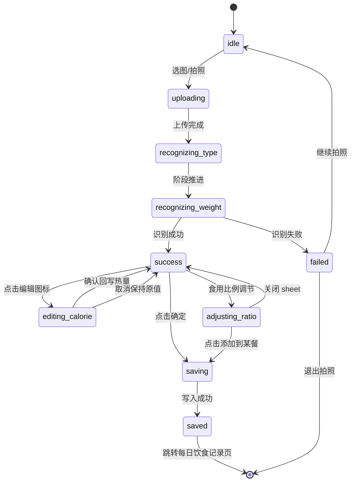

# 餐前拍一拍识图场景补充 PRD

> **文档性质说明**  
> 本文档是对项目主需求文档 **`docs/prd.md`（下称「主 PRD」）** 的 **补充说明**，**不替代、不重写** 主 PRD。  
> 主 PRD 中已定义的页面目标、数据表骨架、接口路径（如 `POST /api/recognize/meal-photo` 等）、阿里云识图接入原则等，仍以主 PRD 为准；本文档仅将 **「餐前拍一拍」闭环** 中主 PRD 未写细的 **页面状态、交互、流转、接口入参出参扩展、库表增量字段、写入餐次逻辑** 补全，供产品、设计与研发对齐实现。

**关联主 PRD章节（索引）**

| 主题 | 主 PRD 位置 |
| --- | --- |
| 餐前拍一拍页（粗粒度） | §6.12 |
| 识别结果确认 / 结果态（粗粒度） | §6.13 |
| 阿里云识图能力 | §十 |
| 接口：上传识别 / 查结果 / 确认 | §十一 · I（接口 35～37） |
| 表：`meal_record` / `diet_record` / `meal_photo_recognition` | §8.7 / §8.8 / §8.13 |

---

## A. 背景与补充目标

### A.1 背景

主 PRD 已明确：通过拍照或相册识别食物、后端调用阿里云、结果供用户确认后写入餐次；并定义了 `meal_photo_recognition`、`meal_record`、`diet_record` 的基本职责。实际落地时，**同一页面内**存在多段异步过程（上传、识别）、多种结果呈现（成功编辑热量、失败重试、食用比例调节底部承接等），需要统一的 **前端状态机**、**接口契约** 与 **落库边界**，避免与「每日饮食记录」等业务页脱节。

### A.2 补充目标

1. 定义餐前拍一拍相关 **页面状态** 及与 UI 的对应关系。  
2. 明确 **页面跳转**（含跳转「每日饮食记录」二级页）与 **弹层/底部承接** 的交互边界。  
3. 补充 **接口入参/出参** 与主 PRD 接口 35～37 的衔接说明。  
4. 补充 **数据库字段**（在不大改主表语义的前提下增量）。  
5. 写清 **成功写入 `meal_record` / `diet_record`** 与 **失败仅写识图记录** 的规则。

---

## B. 适用页面

| 页面/容器 | 说明 |
| --- | --- |
| 餐前拍一拍（相机/相册入口） | 对应主 PRD §6.12；本补充细化其内部状态与结果态 UI。 |
| 识别成功态（同页或同路由内子状态） | 展示缩略图、食物信息卡、热量汇总条、底部「食用比例调节」「确定」等。 |
| 热量编辑轻量弹层 | 叠在成功态之上，独立交互层，非与结果卡混为一张卡。 |
| 食用比例调节底部承接 | 底部 sheet：小图 +「添加到某餐」按钮同行、进度与已摄入/预算文案、大卡片区（大图、GI、名称、热量、滑杆、选中态）。 |
| 餐别下拉浮层 | 顶部餐别切换时的轻量下拉，与标题区对齐。 |
| 识图失败态 | 含「退出拍照」「继续拍照」。 |
| 每日饮食记录页 | 主 PRD §6.6；本补充规定识图流程 **确认写入后** 的跳转目标。 |

---

## C. 页面状态定义

以下状态为 **客户端状态机** 命名（可与后端 `recognize_status` 映射，见 §I、§J）。同一用户会话内，以「当前一次识图任务」`photo_job_id`（或等价：主 PRD 表 `meal_photo_recognition.id`）为主线。

| 状态 key | 名称 | 说明 |
| --- | --- | --- |
| `idle` | 初始态 | 未选图或已结束一轮流程，展示拍照/相册入口与引导。 |
| `uploading` | 上传中 | 已选图，正在将图片提交至服务端/OSS；UI 展示「识图处理中」进度组件，阶段文案：**正在上传图片**。 |
| `recognizing_type` | 识别中（种类） | 服务端已收到图片，正在调用或等待第三方识别食物种类；阶段文案：**正在识别食物种类**。 |
| `recognizing_weight` | 识别中（重量/份量） | 解析多食物重量/热量估算中；阶段文案：**正在识别每种食物重量**。 |
| `success` | 识别成功 | 已展示识别结果：预览图、**紧凑居中**食物信息卡（GI、名称、**编辑图标**、热量）、左下热量圆圈（**颜色表达食用/推荐比例**）与同一水平线的总热量提示条、底部主操作。 |
| `editing_calorie` | 编辑热量 | 点击编辑图标后，弹出轻量弹层：**修改热量**、数值输入、单位「千卡」、**取消** / **确认**；不改变 `success` 底层页面卸载。 |
| `adjusting_ratio` | 调节食用比例 | 用户点击「食用比例调节」等入口后，底部 sheet 展开：**上方** 小缩略图与「添加到当前推荐餐别」按钮 **同一行**；**同时** 展示进度条与「已摄入/预算」类千卡文案；**下方** 大卡含大图、GI、名称、热量、滑杆与选中态。 |
| `failed` | 识别失败 | 仅展示失败提示与 **退出拍照**、**继续拍照**；**不写** `meal_record` / `diet_record`。 |
| `saving` | 保存中 | 用户触发「确定」或「添加到××餐」后，请求写入餐次过程中；按钮防重复提交。 |
| `saved` | 已保存 | 写入成功后的短暂态或立即路由跳转；**跳转每日饮食记录页** 时可无独立 UI，直接进入目标页并刷新当日数据。 |

**与主 PRD 粗粒度状态对照**

* 主 PRD §6.12「已选图上传中 / 识别成功 / 识别失败」分别对应本补充的 `uploading`～`recognizing_*` 聚合、`success`（及子态）、`failed`。  
* `editing_calorie`、`adjusting_ratio`、`saving`、`saved` 为 **产品级细分**，主 PRD 未单列，由本补充定义。

**页面流转图**：状态之间跳转关系见 **文末附录 Mermaid 状态图**（与 §H 文字规则一致）。

---

## D. 页面交互详细说明

### D.1 动态进度（识图中）

在 `uploading`、`recognizing_type`、`recognizing_weight` 下，于 **图片预览区域下方** 展示统一 **进度条组件**：

* **轨道**：浅绿色底条（全宽）。  
* **前景**：深绿色，长度随阶段递增（具体比例可由前端按阶段定档，需与视觉稿一致）。  
* **文案**：三阶段分别显示上述三句 copy，与状态一一对应。

> 若后端仅返回单一 `recognizing`，前端仍可按 **本地时序** 切换三段子文案与进度（在超时前）；或与后端约定 `recognize_phase`（见 §J）精确同步。

### D.2 成功态布局要点

1. **食物信息卡片**：相对预览区 **更小、更靠视觉中心**；轻量描边/阴影；必须包含 **编辑图标**（可点击）；若主视觉含删除/更多操作，保留 **可点击占位**。  
2. **热量圆圈 + 总热量条**：与主视觉一致——**同一水平线**，与后方长条组成 **一体模块**；圆圈内用 **颜色区分已摄入（或当前菜占比）与剩余/推荐**（如双色扇区或左右分色），具体实现遵循 UI。  
3. **总热量条**：文案示例「总热量 xx 千卡，推荐吃 100%」；高度、圆角、左右边距以设计稿为准。

### D.3 热量编辑弹层（`editing_calorie`）

* **触发**：成功态点击食物卡上的 **编辑图标**。  
* **内容**：标题「修改热量」；热量输入框；单位「千卡」；**取消**、**确认**。  
* **关闭方式**：点击遮罩（若采用轻量半透明）、**取消**、系统返回键（小程序/H5 按平台规范）均应能关闭；**确认** 后关闭并回写展示热量。  
* **风格**：轻量浮层，**非全屏大弹窗**；与结果卡 **分层独立**。  
* **取消编辑热量**：点击「取消」→ **仅关闭弹层**，成功态热量 **保持修改前数值**（未提交服务端则仅前端；若已实现服务端草稿同步，见 §I 可选接口）。

### D.4 餐别切换

* 点击顶部当前餐别（早餐/午餐/晚餐/加餐）→ 展开 **轻量下拉浮层**（窄、矮、与标题 **水平居中对齐**）。  
* 选中项高亮区域 **减少上下 padding**，整体像 **浮层** 而非大块对话框。  
* 选中后更新 **当前写入目标餐别** `meal_type`，后续「确定」「添加到××餐」均使用该餐别（除非用户在 `adjusting_ratio` 内再次明确按钮文案中的餐别）。

### D.5 食用比例调节（`adjusting_ratio`）

1. **上方承接区**（同一 sheet 内顶部）：  
   * **左**：小缩略图占位（与下方大卡 **不是同一张图的简单重复**：小图表示「已选中的当前条目/套餐入口」，大图表示「当前调节对象」——产品上与 UI **双层结构** 一致即可）。  
   * **右**：主按钮，文案随当前餐别变化，如 **「添加到晚餐」**（与顶部所选餐别一致）。  
   * **同行**：小图与按钮 **同一行**，垂直居中。  
2. **同区或紧邻下方**：展示 **进度条**（浅底深前景）及 **「72/638 千卡」** 类文案（分子为已摄入、分母为当日饮食预算或还可吃相关口径，与主 PRD 预算定义一致，数值由接口下发）。  
3. **下方大卡**：大图、GI 标签、食物名称、热量、**食用比例滑杆**、选中态样式。  
4. **写入**：点击「添加到晚餐」等 → 与「确定」类似，走 **确认写入**（§I、成功写库逻辑），成功后 **跳转每日饮食记录页**。

### D.6 失败态（`failed`）

* 展示失败原因提示（位置、尺寸参考设计稿）。  
* **退出拍照**：返回 **上级页**（进入拍一拍之前的页面，如首页/饮食页）。  
* **继续拍照**：回到 **`idle`**（或重新拉起相机/相册，等价于新一轮 `idle` → 选图）。

### D.7 确认与写入按钮

* **确定**（成功态主按钮）：提交当前识别结果、热量（含用户编辑）、食用比例等到服务端 → `saving` → 成功后 **`saved` 并跳转每日饮食记录页**。  
* **添加到××餐**（`adjusting_ratio` 内）：逻辑与确认写入一致，仅入口与 UI 承载不同；成功后同样 **跳转每日饮食记录页**。

### D.8 写入成功后的刷新

与主 PRD §12.3 一致：写入饮食记录后应触发 **当日 `daily_summary` / 还可吃** 等刷新（实现可由前端跳转后拉取 + 后端在写接口内更新汇总）。

---

## E. 默认餐别推荐规则

1. **时间规则（默认）**  
   * 建议：按用户本地日期与当前时间映射 `breakfast` / `lunch` / `dinner` / `snack`（各时段边界可在配置或主 PRD 后续统一，本补充要求 **服务端与前端使用同一套配置**）。  
2. **用户可覆盖**  
   * 用户通过顶部下拉切换后，以 **用户选择** 为准，直至离开本页或完成一次保存。  
3. **与写入关系**  
   * `meal_record.meal_type`、`diet_record.meal_type` 均使用 **最终选定餐别**。  
   * `meal_photo_recognition.meal_type` 记录 **发起识别时** 或 **最后一次用户确认餐别**（推荐存「确认写入时」餐别，便于审计；若与主实现冲突，以数据库注释为准）。

---

## F. 热量编辑规则

1. **输入范围**：正数，上限可参考系统配置（如单条 9999 千卡）或主 PRD 后续统一；非法输入 **禁止提交**，toast 提示。  
2. **确认**：更新前端展示；提交「确定」或「添加到××餐」时 **一并提交**最终千卡数。  
3. **取消**：关闭弹层，**不修改** 当前前端缓存中的热量值（与进入编辑前一致）。  
4. **精度**：展示整数或一位小数规则与饮食记录其他入口一致。  
5. **多食物**：若一图多菜，编辑图标对应 **当前卡片所代表的一条 diet 逻辑行**；本补充默认 **单卡单条**（多食物为多卡或多行时，每条独立编辑）。

---

## G. 食用比例调节规则

1. **语义**：滑杆表示 **实际食用占识别份量的比例**（如 0%～100%，或 0～200% 由产品定，默认 0～100%）。  
2. **热量计算**：展示热量 = 识别基准热量 × 比例（四舍五入规则与主系统一致）。  
3. **与写入**：最终写入 `diet_record.calories_total`（及宏量若有）以 **调节后** 数值为准；`weight_g` / `amount` 若有联动，由服务端统一换算规则。  
4. **进度条文案**：「72/638 千卡」中，**72** 为当前日已累计摄入（或已记录热量），**638** 为当日饮食热量预算（或主 PRD「还可吃+已摄入」推导，需与首页/饮食页同源数据）。

---

## H. 页面跳转规则

| 操作 | 目标 |
| --- | --- |
| 成功态点击 **确定**（写入成功） | 跳转 **每日饮食记录** 二级页面（路由名与主工程一致，如 `/pages/diet/daily` 等，以实际为准），并刷新当日列表/汇总。 |
| `adjusting_ratio` 点击 **添加到晚餐**（或当前餐别对应文案，写入成功） | 同上，**每日饮食记录页**。 |
| 失败态 **退出拍照** | **返回上级页**（`navigateBack` 或路由栈弹出）。 |
| 失败态 **继续拍照** | 回到 **拍照初始态** `idle`，可重新选图。 |
| 点击顶部餐别 | **展开/收起** 下拉浮层，不离开当前页。 |
| 点击编辑图标 | 打开 **热量编辑弹层**（`editing_calorie`），不离开当前页。 |
| 热量编辑 **确认** | 关闭弹层，**回写成功态展示热量**；不自动跳转饮食页，除非用户再点「确定」写入。 |
| 热量编辑 **取消** | **关闭弹层**，热量 **保持原值**。 |

---

## I. 接口补充说明

以下在主 PRD **§十一 · I** 已列路径，此处补充 **契约级** 建议；若与已实现代码不一致，以本补充驱动 **迭代对齐**。

### I.1 `POST /api/recognize/meal-photo`（主 PRD 接口 35）— 上传图片并识别

**建议入参（multipart 或 JSON+预签名 URL 二选一，与主实现一致即可）**

| 字段 | 类型 | 必填 | 说明 |
| --- | --- | --- | --- |
| `image` | file / url | 是 | 图片文件或已上传地址 |
| `source` | string | 是 | `camera` / `album` |
| `meal_type` | string | 否 | 用户当前所选餐别，默认服务端按 §E 推荐 |
| `record_date` | date | 否 | 默认当日（用户时区） |

**建议出参**

| 字段 | 类型 | 说明 |
| --- | --- | --- |
| `photo_job_id` | long/string | 对应 `meal_photo_recognition.id` |
| `recognize_status` | string | 与库表一致：`uploading` / `recognizing` / `success` / `fail` |
| `recognize_phase` | string | **补充**：`uploading` / `recognizing_type` / `recognizing_weight`（可选，便于前端精确阶段；无则前端本地模拟） |
| `preview_url` | string | 可选，缩略图 |
| `foods` | array | 成功时食物列表，见下 |
| `error_code` / `message` | string | 失败时 |

**`foods[]` 元素建议**

| 字段 | 说明 |
| --- | --- |
| `food_id` | 映射系统食物 ID，未映射可为空 |
| `food_name` | 展示名 |
| `gi_level` | 低/中/高或枚举 |
| `calories` | 基准热量（千卡） |
| `weight_g` | 可选 |
| `image_region` | 可选，框选区域用于高级 UI |

异步场景：若接口 **同步仅返回 job_id**，则前端轮询或 SSE/WebSocket 由 **`GET .../result`** 返回同上结构。

### I.2 `GET /api/recognize/meal-photo/result`（接口 36）

**建议入参**

| 字段 | 必填 | 说明 |
| --- | --- | --- |
| `photo_job_id` | 是 | 任务 ID |

**建议出参**：与 I.1 成功结构一致，并包含最新 `recognize_phase`、`recognize_status`。

### I.3 `POST /api/recognize/meal-photo/confirm`（接口 37）— 确认并写入餐次

**建议入参**

| 字段 | 类型 | 必填 | 说明 |
| --- | --- | --- | --- |
| `photo_job_id` | long/string | 是 | 识图任务 ID |
| `meal_type` | string | 是 | 写入餐别 |
| `record_date` | date | 否 | 默认当日 |
| `items` | array | 是 | 待写入条目 |
| `items[].food_id` | long | 否 | 有则绑定食物库 |
| `items[].food_name` | string | 是 | 快照名 |
| `items[].calories_total` | decimal | 是 | **含用户编辑与食用比例后** 最终千卡 |
| `items[].consumption_ratio` | decimal | 否 | 0～1 或 0～100，与 §G 一致 |
| `items[].gi_level_snapshot` | string | 否 | |
| `items[].weight_g` | decimal | 否 | |
| `items[].image_snapshot` | string | 否 | 识图原图或裁剪 URL |

**建议出参**

| 字段 | 说明 |
| --- | --- |
| `meal_id` | 新建或合并后的 `meal_record.id` |
| `diet_record_ids` | 写入的明细 ID 列表 |
| `daily_summary_refresh` | 可选，返回最新当日汇总摘要便于前端直接刷新 |

### I.4 （可选）`PATCH /api/recognize/meal-photo/{id}/calorie-draft`

用于编辑热量 **实时同步服务端草稿**（若不做，则热量仅在前端持有直至 confirm）。

---

## J. 数据库补充说明

主 PRD **§8.13 `meal_photo_recognition`**、**§8.7 / §8.8** 已定义核心字段。以下为 **建议增量**，便于支撑本补充状态机与审计；迁移时评估默认值与历史数据。

### J.1 表 `meal_photo_recognition` 建议补充字段

| 字段 | 类型 | 说明 |
| --- | --- | --- |
| `recognize_phase` | varchar | `uploading` / `recognizing_type` / `recognizing_weight` / `null`；与前端细粒度同步 |
| `failure_stage` | varchar | 可选，`upload` / `vendor` / `parse` |
| `confirmed_at` | datetime | 用户确认写入时间 |
| `linked_meal_id` | bigint | 确认后关联 `meal_record.id` |
| `client_locale` | varchar | 可选，时区/语言 |

**`recognize_status` 取值与主 PRD保持一致**：`uploading` / `recognizing` / `success` / `fail`；细粒度用 `recognize_phase` 扩展，避免破坏已有枚举。

### J.2 表 `diet_record` 建议补充字段（可选）

| 字段 | 类型 | 说明 |
| --- | --- | --- |
| `photo_job_id` | bigint | 来源识图任务，便于追溯 |
| `consumption_ratio` | decimal | 食用比例（写入时快照） |
| `calories_base` | decimal | 识别原始基准热量（写入前，可选） |

主 PRD 已有 `source` 含 `photo`，无需修改枚举即可表达来源。

### J.3 表 `meal_record`

若无「单餐多张识图」合并需求，可 **不增字段**，通过关联的 `diet_record` 反查 `photo_job_id`；若需按餐聚合识图，可增加 `primary_photo_job_id`（可选）。

---

## K. 测试用例建议

### K.1 状态与进度

| 编号 | 前置 | 步骤 | 期望 |
| --- | --- | --- | --- |
| T1 | `idle` | 相册选图 | 进入 `uploading`，进度条+「正在上传图片」 |
| T2 | 上传完成 | 等待识别 | 依次或合并出现 `recognizing_type`、`recognizing_weight` 文案与进度变化 |
| T3 | 识别成功 | — | 进入 `success`，卡片含编辑图标，热量圆+总热量条同一水平线 |

### K.2 热量编辑

| 编号 | 步骤 | 期望 |
| --- | --- | --- |
| T4 | 点编辑，改热量，点确认 | 弹层关闭，卡片热量更新 |
| T5 | 点编辑，点取消 | 弹层关闭，热量与编辑前一致 |

### K.3 餐别与下拉

| 编号 | 步骤 | 期望 |
| --- | --- | --- |
| T6 | 点开餐别下拉 | 浮层窄、与标题居中，选中项 padding 紧凑 |
| T7 | 切换为午餐后点确定写入 | `meal_record.meal_type` = `lunch` |

### K.4 食用比例与底部承接

| 编号 | 步骤 | 期望 |
| --- | --- | --- |
| T8 | 进入调节 sheet | 顶部 **小图+按钮同行**，可见进度条与 `a/b 千卡` |
| T9 | 拖动滑杆 | 展示热量随比例变化，写入后与 `diet_record.calories_total` 一致 |

### K.5 跳转与写库

| 编号 | 步骤 | 期望 |
| --- | --- | --- |
| T10 | 成功态点确定写入成功 | 跳转 **每日饮食记录页**，列表可见新记录 |
| T11 | 调节页点「添加到晚餐」写入成功 | 同上 |
| T12 | 识别失败 | 仅 `meal_photo_recognition` 为 fail，**无** 新增 `meal_record`/`diet_record` |

### K.6 失败与返回

| 编号 | 步骤 | 期望 |
| --- | --- | --- |
| T13 | 失败点「退出拍照」 | 回上级页 |
| T14 | 失败点「继续拍照」 | 回到 `idle`，可重新选图 |

---

## 附录：页面流转图（Mermaid）

---

**文档版本**：v1.0  
**最后更新**：2026-04-04  
**维护说明**：若主 PRD 修订 §6.12 / §6.13 / §8.13 / §十一·I，请同步审阅本补充文档对应章节，避免双源冲突。
